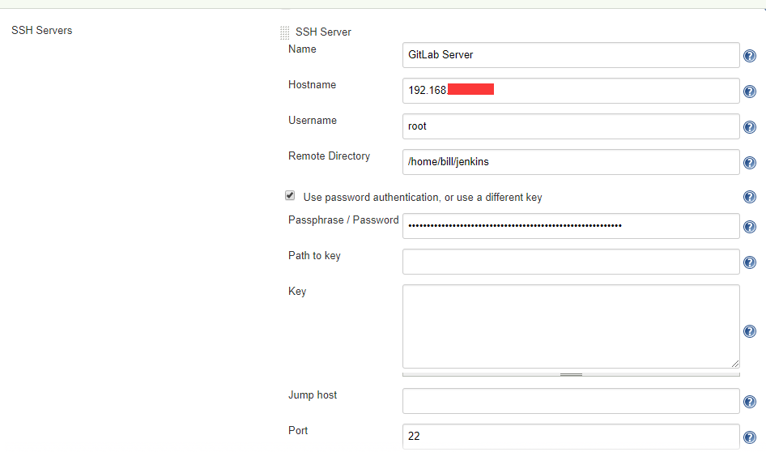

## 全局工具配置、插件、配置

jenkins在真正持续集成时，依赖很多工具，插件和配置

1. Jenkins->全局工具配置

    * 全局工具配置表
        配置项|服务器安装路径
        --|--
        JDK|/usr/java/jdk1.8.0_152
        Git|/usr/bin/git
        Gradle|/usr/local/src/gradle-3.2.1
        Ant|/usr/local/src/apache-ant-1.9.7
        Maven|/usr/local/src/apache-maven-3.5.4
        Docker|/etc/docker

    * 根据配置表，在Jenkins页面配置
        1. JDK
        

        2. Git
        

        3. Gradle
        

        4. Ant
        

        5. Maven
        

        6. Docker（可能不对）
        

2. Jenkins->插件管理

   在可选插件tab页，勾选如下插件
   插件|插件说明
   --|--
   SSH Slaves plugin|
   Publish Over SSH|将项目部署到远程机器上
   Gradle Plugin|
   GitLab Plugin|   
   Gitlab Merge Request Builder|
   GitLab Logo Plugin|

3. Jenkins->配置
   * SSH Servers
   
   