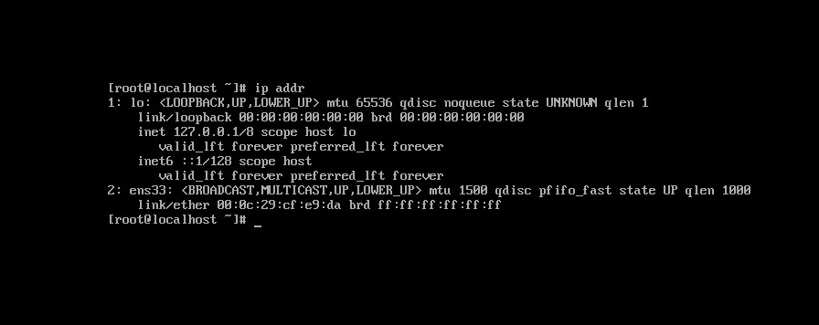
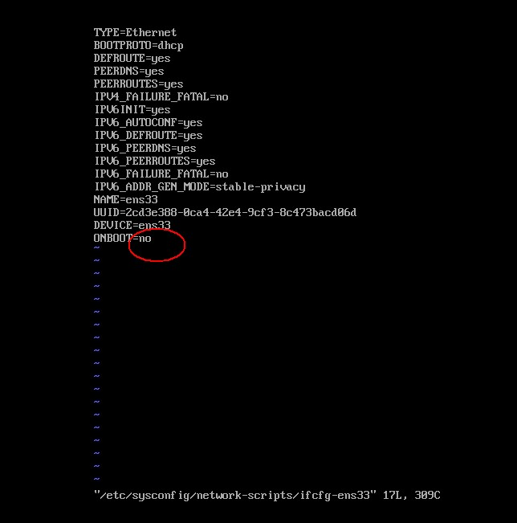
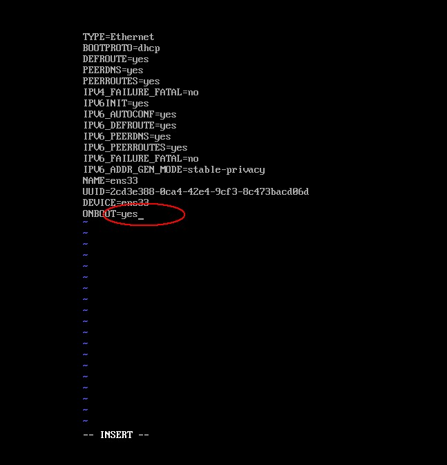
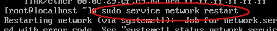
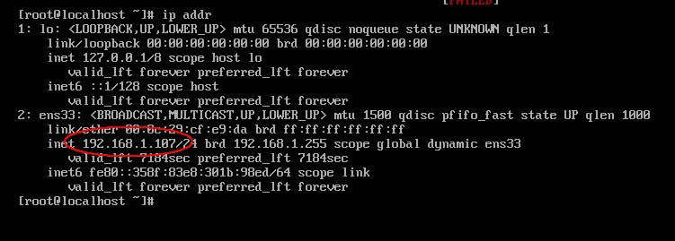

## centos7.0查看IP
 

输入ip查询命名 ip addr  也可以输入 ifconfig（centOs7没有ifconfig命令）查看ip，但此命令会出现3个条目，centos的ip地址是ens33条目中的inet值。

发现 ens33 没有 inet 这个属性，那么就没法通过IP地址连接虚拟机。

接着来查看ens33网卡的配置： vi /etc/sysconfig/network-scripts/ifcfg-ens33   注意vi后面加空格

vi是Linux内置的文本编辑器命令 打开文件的意思

从配置清单中可以发现 CentOS 7 默认是不启动网卡的（ONBOOT=no）。

把这一项改为YES（ONBOOT=yes），

然后按 Esc 退出  再出入命令 :wq  再按Enter即可  （备注 :wq 是保存然后退出的意思 后面会专门讲下vi）

然后重启网络服务： sudo service network restart 

然后我们再输入  ip addr 命令

参考：https://www.cnblogs.com/technology-huangyan/p/9146699.html