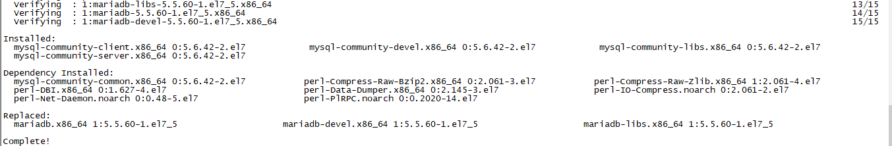

### **mysql 安装**

1. 通过yum来进行mysql的安装
    ```bash
    [root@localhost java]# yum install -y mysql-server mysql mysql-devel
    ```
    在centos7，会出现提示
    ```
    No package mysql-server available
    ```
    因此需要执行
    
    ```bash
    cd /usr/local/src #习惯下载文件在这个目录
    wget http://repo.mysql.com/mysql-community-release-el7-5.noarch.rpm
    rpm -ivh mysql-community-release-el7-5.noarch.rpm
    yum install -y mysql-server mysql mysql-devel #重新执行
    ```
    
    出现如下提示就表明安装成功了！ 
    
2. 查看版本
    ```bash
    [root@localhost java]# rpm -qi mysql-community-server #安装了社区版
    ```

3. 启动mysql
    ```bash
    [root@localhost java]# service mysqld start
    ```

4. 配置mysql

    为root用户设置密码：
    ```bash
    [root@localhost java]# mysqladmin -u root password '123456' //设置密码为123456
    ```
    设置mysql开机启动
    ```bash
    [root@localhost java]# chkconfig mysqld on
    #centos7版本以下（不包括）
    [root@localhost java]# chkconfig --list | grep mysql 
    mysqld   0:off  1:off   2:on    3:on    4:on    5:on    6:off
    #centos7版本以上（包括）
    [root@localhost java]# systemctl is-enabled mysqld.service 
    enabled
    ```
5. 登录mysql数据库并查看数据库
    ```bash
    [root@localhost java]# mysql -uroot -p123456
    mysql># show databases
    mysql># quit 
    ```
