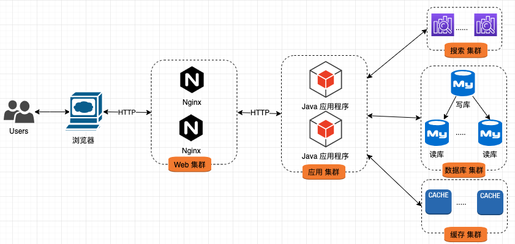

##互联网架构演化

对于一个大型网站，主要有以下几个特征：

* 支撑海量数据
* 非常高的访问量

我们常见的大型网站，如百度、淘宝、京东等，都是一个分布式系统。这么复杂的系统也不是一天建成的，每个系统都经历了漫长的演变过程。

**架构演变**
在大型网站中，其最核心的功能就是**计算**和**存储**。因此系统演变过程也主要围绕这两点进行。

1. 单机系统

    在网站刚刚起步时，数据量、访问量都非常小，通常情况下，只需一台应用服务器就可以了。

    1. 单机部署方案

        起步时，我们把所有资源全部打包到部署文件中(如XXX.war)，其中包括
        1. class文件、依赖jar等；
        2. js、css、图片等静态资源；
        3. 对于用户上传文件的场景，直接在服务器上新建一个目录，将上传的文件放置在目录即可。

        然后，将打好的发布包放到Web容器中，比如Tomcat，最后启动容器，让其直接对外提供服务。

        

        该部署策略有以下几个特征：

        1. 用户通过浏览器直接与Java应用程序进行交互（通常是Tomcat）；
        2. Java应用程序通过JDBC与本机的数据库进行交互（如MySQL）；
        3. 如果存在文件读写的需求，Java应用程序通过文件接口直接对文件进行操作。

        这时，有人会问，Java应用程序直接对外，会不会存在一些安全或性能方面的问题呢？

        是的，Tomcat这种Web容器对链接的保持能力比较弱，当存在大量链接时，性能下降很快。同时，Tomcat并不擅长静态资源的处理，对此，我们可以引入Nginx，以缓解Tomcat的压力。

    2. 单机部署方案进阶

        我们在单机部署基础上，添加Nginx，也就有了进阶方案。

        

        该方案存在以下特征：

        1. 用户不再直接与Java应用程序进行交互，而是与Nginx进行交互；
        2. Tomcat挂在Nginx后，对动态请求进行处理；
        3. 对于静态资源的访问，通过Nginx直接访问文件系统；
        4. 当有文件写需求时，通过Java应用程序直接写入磁盘。

        此时，架构显得清晰很多，但我们发现一个问题，就是系统对静态资源和动态资源的处理是完全不同的。

        对于静态资源的处理，相对简单，只是简单的文件读写。而动态请求（也就是我们的业务承载者）会随着业务的发展越来越复杂。

2. 动静分离部署方案

    由于静态请求与动态请求采用不同的处理策略，我们可以将其进行分离。

    

    该部署方案存在以下特性：

    1. 通过不同的域名对**动态请求**和**静态请求**进行分离；
    2. 新增静态资源服务器，专门处理静态请求，并在服务器上部署Java应用程序，处理文件写需求；**Nginx**只负责文件的读操作；
    3. 对**动态请求**进行独立部署，应用程序将文件的写请求转发到静态服务器进行处理；

    静态资源服务器功能单一，部署繁琐，有没有一种更好的策略呢？

    答案就是**云服务**，比如阿里云的OSS提供静态资源存储服务。CDN提供访问加速服务，两者结合使用，就得到了一个海量容量并且性能超强的静态资源服务器（集群）。

    结合OSS和CDN，静态请求不会成为系统的瓶颈，因此，接下来只对动态请求进行讨论。

    随着系统访问量的增加，动态请求出现了明显的瓶颈。

3. 应用集群化部署

    由于所有的动态请求全部由一台应用服务器进行处理，当访问量上升时，这台服务就成了系统的瓶颈。此时，我们需要将系统中的多个组件部署到不同的服务器上。

    

    新部署有以下特征：

    1. 对Nginx进行独立部署，形成**Web集群**；
    2. 对Java应用程序进行独立部署，形成**应用集群**；
    3. 对**数据库**进行独立部署；
    4. **Web集群**与**应用集群**间通过HTTP协议进行交互；
    5. **应用集群**与**数据库**间通过JDBC协议进行交互。

    应用集群化，会面临很多挑战，主要的焦点是如何有效的分配用户请求。

    1. DNS轮询

        首先要解决的问题便是，用户如何将请求发送到不同的Nginx中，最常见的方式便是DNS轮询。

        大多域名注册商都支持多条A记录的解析，其实这就是DNS轮询，DNS服务器将解析请求按照A记录的顺序，逐一分配到不同的IP上，这样就完成了简单的负载均衡。

    2. 负载均衡器

        这里的负载均衡器主要指的是Nginx的反向代理功能。当用户请求发送到Nginx后，Nginx需要决定将请求转发到哪台应用服务器上。

        反向代理（ReverseProxy）是指以代理服务器来接受internet上的连接请求，然后将请求转发给内部网络上的服务器，并将从服务器上得到的结果返回给internet上请求连接的客户端，此时代理服务器对外就表现为一个反向代理服务器。

        Nginx对于后台服务器配置比较灵活，可以同时配置多台服务器，并根据负载策略将请求分发给后台服务器。

    3. 会话问题

        在单机时代，我们的请求只会发送到同一台机器上，不存在会话问题。当将应用集群部署时，用户的多次请求会发送到不同的应用服务器上。此时，如何对会话进行同步便是棘手问题。

        1. SessionSticky

            这种方案主要由Nginx处理，让同样session请求每次都发送到同一台服务器进行处理。

            

            Nginx会将相同用户的请求发送到同一台应用服务器中。

            这是最简单的策略，但存在一定的问题：

            1. Web服务器重启Session丢失；
            2. 负载均衡需要进行应用层解析（第7层），性能损耗较大；
            3. 负载均衡器变为一个有状态的点，不易容灾；

        2. SessionReplication

            会话问题的根源在于Session由多个应用维护，我们可以使用某种机制，在多台Web服务间进行Session的数据同步。

            

            由Session同步器在各个Java应用程序间完成Session的同步，最终使每个服务器中都存在所有用户的Session数据。

            这个方案的问题：

            1. 造成网络开销；
            2. 每台Web服务器都保存所有的Session，内存开销大；

        3. 集中式Session

            我们可以将Session从Web服务中抽取出来，并对其进行集中存储。

            

            将Session信息保存到Session存储集群中，Java应用程序不在负责Session的存储。

            这个方案的问题：

            1. 读取Session引入了网络开销；
            2. 存储设施问题影响应用；

        4. CookieBasedSession

            还可以将session数据放在cookie中，然后在Web服务器上从cookie中生成对应的Session数据。

            

            将Session数据编码到Cookie中，每次Java应用程序使用Session时，都从Cookie中重建Session。

            该方案的问题：

            1. 受到Cookie大小的限制；
            2. 存在安全性问题；
            3. 每次都携带巨大的Cookie，带宽消耗严重；
            4. 每次都进行Session数据恢复，加大应用服务器的负担；

        随着系统访问量的持续增加，面对大量的数据读取请求，数据库有些不堪重负。

        此时，我们需要对数据库进行优化。

4. 数据库读写分离

    通常情况下，数据库的读会率先成为系统的瓶颈。对此，我们可以使用数据库主从机制，通过添加多个从库来减缓读压力。

    

    与之前部署相比，该架构只是为数据库增加了若干个从库：

    1. 对数据库实施**主从**部署策略；
    2. 对于数据的写请求，只能在**主库**上进行；
    3. 对于数据的读请求，可以在任意的**从库**上进行；
    4. 主库与从库间，通过**数据库同步策略**进行数据同步。

    由于主库与从库间的数据同步需要时间，会出现数据不一致的情况，这块是业务上需要慎重考虑的一点。

    随着业务越来越复杂，对功能和性能的要求也越来越高，最常见的便是数据库like语句性能已经无法满足需求；对于某些热点数据的访问，其性能也下降很快。

    此时，我们需要引入其他组件来有针对性的解决问题。

5. 引入搜索和缓存

    针对数据库的like语句，通常情况下，是通过引入搜索引擎来解决；而热点数据的访问加速，是通过引入缓存服务来解决。

    

    该架构的特征如下：

    1. 添加**搜索集群**，用以提升数据检索性能；
    2. 添加**缓存集群**，用以提升热点数据访问性能。

    在对数据查询进行优化后，慢慢的系统的写性能成为了瓶颈。

    此时，需要对数据的写性能进行扩展。

6. 数据库分库分表

    随着数据量的增长，写请求量的增加，数据库的写入逐渐成为了瓶颈。常规的写性能优化便是对数据库进行分库分表。

    

    1. 垂直拆分

        将不同的**业务数据**放到不同的数据库实例中。

    2. 水平切分

        把**同一个表中的数据**拆分到多的数据库中。

    随着研发团队的规模越来越多，大家同时在一个项目中进行开发，导致频繁的冲突和相互影响。

    此时，会将整个应用程序根据功能模块进行拆分，从而形成多个子网站或子频道。

7. 应用垂直拆分

    面对一个巨无霸式的应用，就像面对一团毛线团，总有一种无法下手的感觉。对此，可以将其进行拆分，将其拆分为多个应用，每个应用独立开发、独立部署、独立维护。

    

    该部署方案更加灵活，大大降低维护成本。

    1. 通过不同的域名或URL将整个系统分解为多个子系统；
    2. 用户通过浏览器将各子系统拼接成一个完整的系统；
    3. 各系统间存在少量交互，甚至没有交互；

    问题慢慢展现出来，系统间公共部分没有统一维护点，同样的功能、同样的代码分布在各个系统中。

    当然，我们可以通过发布jar包的方式，共享功能代码；但当jar升级时，就需要所有的子系统同步升级，运维开销巨大。此时，我们需要引入服务化架构。

8. 服务化架构

    我们可以将通用功能封装成一个服务，独立开发、独立部署、独立维护。

    

    在该方案中，我们将业务逻辑进行了进一步拆分：

    1. 整理各个系统间通用业务功能，将其封装为服务，以承载核心业务逻辑，构建成服务集群；
    2. 原来的子系统或子频道，变成薄薄的一层，不承载核心业务，只是根据业务流程对业务服务进行编排；
    3. 应用服务与业务服务间通过HTTP或其他协议进行通信，常见的包括Dubbo、Thrift等。

    服务化解决了系统之间的直接调用问题，也就是常说的RPC，整个系统的协调点全部由应用服务完成。这种架构适用于多种场景，但在一些需要异步处理的极端场景就显得有心无力了。

    此时，我们需要引入消息中间件。

9. 引入消息队列

    服务化解决了直接调用问题，对于异步调用，最常见的便是消息中间件。

    

    相比之前的架构，变化很小，只是在各个业务服务间添加了另外的一种调用方式。

10. 小结

    冰冻三尺非一日之寒，一个大型系统的构建也不是一朝一夕的事情。我们需要根据业务情况、数据量情况、请求量情况对系统进行合理规划。

    切记，架构不是越复杂越好，而是“**适合自己的便是最好的**”。

原文：https://www.cnblogs.com/franson-2016/p/11489804.html