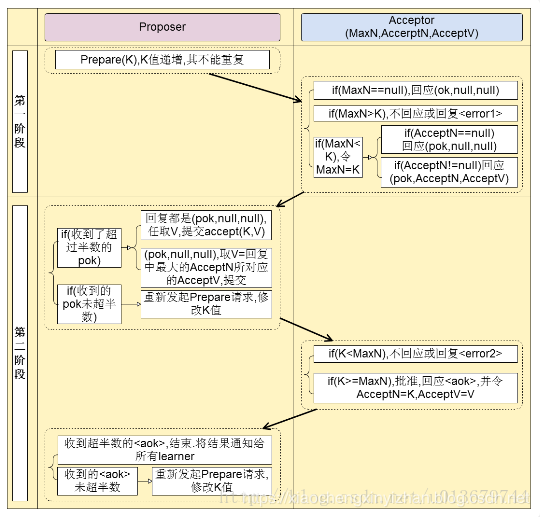

## 一致性paxos算法

### Paxos算法的推导

Paxos算法的必须要能满足的条件：
1. P1：一个Acceptor必须接受它收到的第一个议案。（accept阶段）
2. P2：如果一个值为v的议案被选定了，那么被选定的更大编号的议案，它的值必须也是v。
    1. P2a：如果一个值为v的议案被选定了，那么Acceptor接受的更大编号的议案，它的值必须也是v。
    2. P2b：如果一个值为v的议案被选定了，那么Proposer提出的更大编号的议案，它的值必须也是v。（P2b是p2a的充分条件）

Proposal提出议案的正确姿势：（prepare阶段）
P2c：在所有Acceptor中，任意选取半数以上的Acceptor集合，我们称这个集合为S。Proposal新提出的议案（简称Pnew）必须符合下面两个条件之一：

1. 如果S中所有Acceptor都没有接受过议案的话，那么Pnew的编号保证唯一性和递增即可，Pnew的值可以是任意值。
2. 如果S中有一个或多个Acceptor曾经接受过议案的话，要先找出其中编号最大的那个议案，假设它的编号为N，值为V。那么Pnew的编号必须大于N，Pnew的值必须等于V。

### Paxos算法的过程（算法描述）

Paxos算法类似于两阶段提提交，其算法执行过程分为两个阶段。具体如下：

1. 阶段一（prepare阶段）：
    1. Proposer选择一个提案编号N，然后向半数以上的Acceptor发送编号为N的Prepare请求。Pareper（N）
    2. 如果一个Acceptor收到一个编号为N的Prepare请求，如果小于它已经响应过的请求，则拒绝，不回应或回复error。若N大于该Acceptor已经响应过的所有Prepare请求的编号（maxN），那么它就会将它已经接受过（已经经过第二阶段accept的提案）的编号最大的提案（如果有的话，如果还没有的accept提案的话返回{pok，null，null}）作为响应反馈给Proposer，同时该Acceptor承诺不再接受任何编号小于N的提案。

2. 阶段二（accept阶段）：
    1. 如果一个Proposer收到半数以上Acceptor对其发出的编号为N的Prepare请求的响应，那么它就会发送一个针对[N,V]提案的Accept请求给半数以上的Acceptor。注意：V就是收到的响应中编号最大的提案的value（某个acceptor响应的它已经通过的{acceptN，acceptV}），如果响应中不包含任何提案，那么V就由Proposer自己决定。
    2. 如果Acceptor收到一个针对编号为N的提案的Accept请求，只要该Acceptor没有对编号大于N的Prepare请求做出过响应，它就接受该提案。如果N小于Acceptor以及响应的prepare请求，则拒绝，不回应或回复error（当proposer没有收到过半的回应，那么他会重新进入第一阶段，递增提案号，重新提出prepare请求）。

在上面的运行过程中，每一个Proposer都有可能会产生多个提案。但只要每个Proposer都遵循如上述算法运行，就一定能保证算法执行的正确性。

原文：https://zhuanlan.zhihu.com/p/69817030
https://blog.csdn.net/wolf_love666/article/details/92832811
