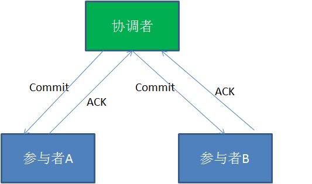
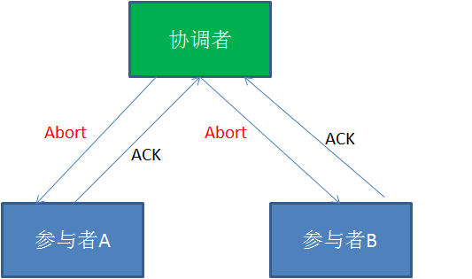
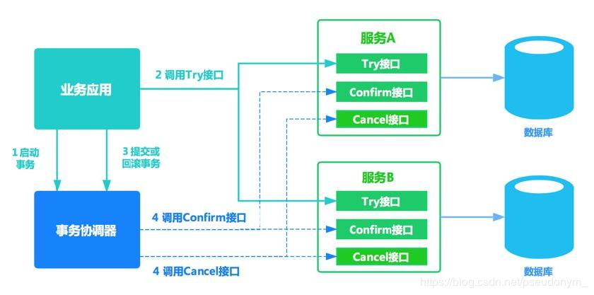
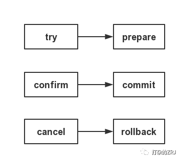
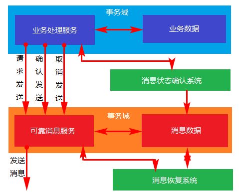
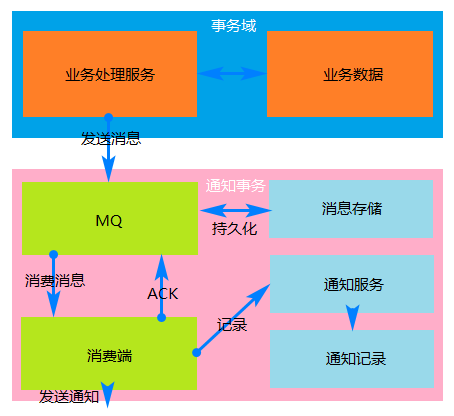

## 分布式事务

1. 前言

    当下互联网发展如火如荼，绝大部分公司都进行了数据库拆分和服务化(SOA)。在这种情况下，完成某一个业务功能可能需要横跨多个服务，操作多个数据库。这就涉及到到了分布式事务，用需要操作的资源位于多个资源服务器上，而应用需要保证对于多个资源服务器的数据的操作，要么全部成功，要么全部失败。本质上来说，分布式事务就是为了保证不同资源服务器的数据一致性。

2. 分布式事务概念

    1. 事务

        事务(Transaction)是访问并可能更新数据库中各种数据项的一个程序执行单元(unit)。在关系数据库中，一个事务由一组SQL语句组成。事务应该具有4个属性：原子性、一致性、隔离性、持久性。这四个属性通常称为ACID特性。

        * **原子性(atomicity)**：个事务是一个不可分割的工作单位，事务中包括的诸操作要么都做，要么都不做。
        * **一致性(consistency)**：事务必须是使数据库从一个一致性状态变到另一个一致性状态，事务的中间状态不能被观察到的。
        * **隔离性(isolation)**：一个事务的执行不能被其他事务干扰。即一个事务内部的操作及使用的数据对并发的其他事务是隔离的，并发执行的各个事务之间不能互相干扰。

            隔离性又分为四个级别：
            * 读未提交(read uncommitted)
            * 读已提交(read committed，解决脏读)
            * 可重复读(repeatable read，解决虚读)
            * 串行化(serializable，解决幻读)。

        * **持久性(durability)**：持久性也称永久性（permanence），指一个事务一旦提交，它对数据库中数据的改变就应该是永久性的。接下来的其他操作或故障不应该对其有任何影响。

        任何事务机制在实现时，都应该考虑事务的ACID特性，包括：本地事务、分布式事务，及时不能都很好的满足，也要考虑支持到什么程度。

    2. 本地事务和全局事务

        * 本地事务：当事务由资源管理器本地管理时被称作本地事务。
            * 优点：支持严格的ACID特性，高效，可靠，状态可以只在资源管理器中维护，而且应用编程模型简单。
            * 缺点：不具备分布式事务的处理能力，隔离的最小单位受限于资源管理器。
        * 全局事务：当事务由全局事务管理器进行全局管理时成为全局事务，事务管理器负责管理全局的事务状态和参与的资源，协同资源的一致提交回滚。

    3. AP、RM、TM

        * AP：应用程序，可以理解为使用DTP（Data Tools Platform）的程序。
        * TM：事务管理器，负责协调和管理事务，提供给AP编程接口以及管理资源管理器。
        * RM：资源管理器，这里可以是一个DBMS或者消息服务器管理系统

    4. 协议

        * TX协议：应用或者应用服务器与事务管理器的接口。
        * XA协议：全局事务管理器与资源管理器的接口。XA是由X/Open组织提出的分布式事务规范。

    5. 理论与定理

        * CAP定理

            对于共享数据系统，最多只能同时拥有CAP其中的两个，任意两个都有其适应的场景，真正的业务系统中通常是ACID与CAP的混合体。分布式系统中最重要的是满足业务需求，而不是追求高度抽象，绝对的系统特性。

            * C表示一致性，也就是所有用户看到的数据是一样的。
            * A表示可用性，是指总能找到一个可用的数据副本。
            * P表示分区容错性，能够容忍网络中断等故障。

        * BASE理论

            * BA表示基本可用性，支持分区失败
            * S表示柔性状态，也就是允许短时间内不同步
            * E表示最终一致性，数据最终是一致的，但是实时是不一致的。

            原子性和持久性必须从根本上保障，为了可用性、性能和服务降级的需要，只有降低一致性和隔离性的要求。

3. 分布式事务

    1. 刚性事务和柔性事务
        * 刚性事务：遵循ACID原则，强一致性。
        * 柔性事务：遵循BASE理论，最终一致性；与刚性事务不同，柔性事务允许一定时间内，不同节点的数据不一致，但要求最终一致。柔性事务有两个特性：**基本可用和柔性状态**
            * 基本可用是指分布式系统出现故障的时候允许损失一部分的可用性。
            * 柔性状态是指允许系统存在中间状态，这个中间状态不会影响系统整体的可用性，比如数据库读写分离的主从同步延迟等。

    2. 柔性事务方案
        1. 两阶段型
        2. 补偿型
        3. 异步确保型
        4. 最大努力通知型

4. 两阶段型

    在XA协议中包含着两个角色：**事务协调者和事务参与者**。

    1. 交互流程

        1. 正向

            **第一阶段**：

            

            在XA分布式事务的第一阶段，作为事务协调者的节点会首先向所有的参与者节点发送Prepare请求。

            在接到Prepare请求之后，每一个参与者节点会各自执行与事务有关的数据更新，写入Undo Log和Redo Log。如果参与者执行成功，暂时不提交事务，而是向事务协调节点返回“完成”消息。

            当事务协调者接到了所有参与者的返回消息，整个分布式事务将会进入第二阶段。

            **第二阶段**：

            

            在XA分布式事务的第二阶段，如果事务协调节点在之前所收到都是正向返回，那么它将会向所有事务参与者发出Commit请求。

            接到Commit请求之后，事务参与者节点会各自进行本地的事务提交，并释放锁资源。当本地事务完成提交后，将会向事务协调者返回“完成”消息。

            当事务协调者接收到所有事务参与者的“完成”反馈，整个分布式事务完成。

        2. 失败

            **第一阶段**：

            

            **第二阶段**：

            

            在XA的第一阶段，如果某个事务参与者反馈失败消息，说明该节点的本地事务执行不成功，必须回滚。

            于是在第二阶段，事务协调节点向所有的事务参与者发送Abort请求。接收到Abort请求之后，各个事务参与者节点需要在本地进行事务的回滚操作，回滚操作依照Undo Log来进行。

            以上就是XA两阶段提交协议的详细过程。

    2. 不足

        XA两阶段提交究竟有哪些不足呢？

        1. 性能问题

            XA协议遵循强一致性。在事务执行过程中，各个节点占用着数据库资源，只有当所有节点准备完毕，事务协调者才会通知提交，参与者提交后释放资源。这样的过程有着非常明显的性能问题。

        2. 协调者单点故障问题

            事务协调者是整个XA模型的核心，一旦事务协调者节点挂掉，参与者收不到提交或是回滚通知，参与者会一直处于中间状态无法完成事务。

        3. 丢失消息导致的不一致问题。

5. 补偿型

    TCC（Try/Confirm/Cancel）型事务。

    

    1. 操作解析
        * Try:尝试执行业务
            * 完成所有业务检查(一致性)
            * 预留必须业务资源(准隔离性)
        * Confirm:确认执行业务
            * 真正执行业务
            * 不作任何业务检查
            * 只使用Try阶段预留的业务资源
            * Confirm操作满足幂等性
        * Cancel:取消执行业务
            * 释放Try阶段预留的业务资源
            * Cancel操作满足幂等性

    2. 与2PC协议比较

        TCC和2PC操作类比

        

        * 位于业务服务层而非资源层
        * 没有单独的准备(Prepare)阶段, Try操作兼备资源操作与准备能力
        * Try操作可以灵活选择业务资源的锁定粒度
        * 较高开发成本

    3. 优缺点

        1. 优点
            * 让应用自己定义数据库操作的粒度，使得降低锁冲突、提高吞吐量成为可能。

            点评：是个比较大的缺陷，因为就算重新选举一个协调者也无法解决因为上一个协调者故障而导致的参与者处于阻塞状态的问题。

        2. 缺点
            * 对应用的侵入性强。业务逻辑的每个分支都需要实现try、confirm、cancel三个操作，应用侵入性较强，改造成本高。

            * 实现难度较大。需要按照网络状态、系统故障等不同的失败原因实现不同的回滚策略。为了满足一致性的要求，confirm和cancel接口必须实现幂等性。

            * 因为confirm和cancel操作有可能失败，而TCC属于应用层的一种补偿方式，所以需要程序员在实现的时候多写很多补偿的代码，在一些场景中，一些业务流程可能用TCC不太好定义及处理。

    4. 幂等性

        因为confirm和cancel接口必须实现幂等性，有些同学可能不是很明白这个，这边稍稍做一下普及。

        幂等性的定义是：一次和多次请求某一个资源对于资源本身应该具有同样的结果（网络超时等问题除外）。也就是说，其任意多次执行对资源本身所产生的影响均与一次执行的影响相同。

        这里需要关注几个重点：

        1. 幂等不仅仅只是一次（或多次）请求对资源没有副作用
        （比如查询数据库操作，没有增删改，因此没有对数据库有任何影响）。

        2. 幂等还包括第一次请求的时候对资源产生了副作用，但是以后的多次请求都不会再对资源产生副作用。

        3. 幂等关注的是以后的多次请求是否对资源产生的副作用，而不关注结果。

        4. 网络超时等问题，不是幂等的讨论范围。

        幂等性是系统服务对外一种承诺（而不是实现），承诺只要调用接口成功，外部多次调用对系统的影响是一致的。声明为幂等的服务会认为外部调用失败是常态，并且失败之后必然会有重试。

    5. 适用场景
        * 严格一致性
        * 执行时间短
        * 实时性要求高

        例如: 红包，收付款业务

6. 异步确保型

    

    * 实现
        * 请求发送：业务处理服务在业务事务提交之前，向实时消息服务请求发送消息，实时消息服务只记录消息数据，而不是真正的发送。
        * 确认发送：业务处理服务在业务事务提交之后，向实时消息服务确认发送。只有在得到确认发送指令后，实时消息服务才会真正发送。
        * 取消发送：业务处理服务在业务事务回滚后，向实时消息服务取消发送。消息发送状态确认系统定期找到未确认发送或者回滚发送的消息，向业务处理服务询问消息状态，业务处理服务根据消息ID或者消息内容确认该消息是否有效。被动方的处理结果不会影响主动方的处理结果，被动方的消息处理操作是幂等操作。
    * 成本：可靠的消息系统建设成本，一次消息发送需要两次请求，业务处理服务需要实现消息状态回查接口。
    * 优点：消息数据独立存储，独立伸缩，降低业务系统和消息系统之间的耦合。对最终一致性时间敏感度较高，降低业务被动方的实现成本。兼容所有实现JMS标准的MQ中间件，确保业务数据可靠的前提下，实现业务的最终一致性，理想状态下是准实时的一致性。
    * 适用场景
        * 执行周期较长
        * 实时性要求不高

        例如:
        * 跨行转账/汇款业务(两个服务分别在不同的银行中)
        * 退货/退款业务
        * 财务, 账单统计业务(先发送到消息中间件, 然后进行批量记账)

7. 最大努力通知型

    

    * 实现：业务活动的主动方在完成处理之后向业务活动的被动方发送消息，允许消息丢失。业务活动的被动方根据定时策略，向业务活动的主动方查询，恢复丢失的业务消息。
    * 约束：被动方的处理结果不影响主动方的处理结果。
    * 成本：业务查询与校对系统的建设成本。
    * 特点：业务活动的主动方在完成业务处理之后，向业务活动的被动方发送通知消息。主动方可以设置时间阶梯通知规则，在通知失败后按规则重复通知，知道通知N次后不再通知。主动方提供校对查询接口给被动方按需校对查询，用户恢复丢失的业务消息。
    * 适用范围：
        * 最终一致性的时间敏感度低

        例如: 
        * 银行通知
        * 商户通知

原文：https://www.cnblogs.com/bluemiaomiao/p/11216380.html

参考：https://blog.csdn.net/bjweimengshu/article/details/79607522
http://www.imooc.com/article/38925
https://blog.csdn.net/pseudonym_/article/details/88061286