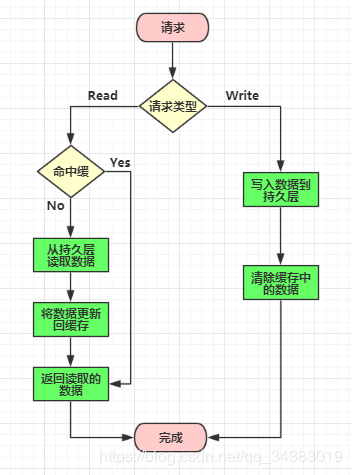
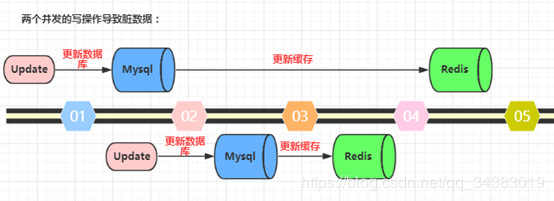
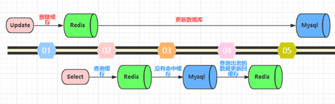
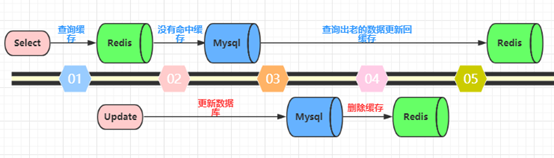
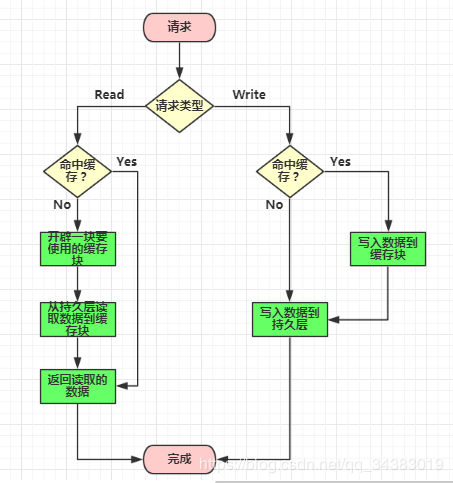

## 分布式缓存

1. 前言

    着互联网的发展，用户规模和数据规模越来越大，对系统的性能提出了更高的要求，缓存就是其中一个非常关键的组件，从简单的商品秒杀，到全民投入的双十一，我们都能见到它的身影。

    分布式缓存首先也是缓存，一种性能很好但是相对稀缺的资源，和我们在课本上学习的CPU缓存原理基本相同，CPU是用性能更好的静态RAM来为性能一般的DRAM加速，分布式缓存则是通过内存或者其他高速存储来加速，但是由于用到了分布式环境中，涉及到并发和网络的问题，所以会更加复杂一些，但是有很多方面的共性，比如缓存淘汰策略。

2. 缓存共性讨论

    缓存共性讨论分以下四个部分：

    * 缓存更新模式
    * 缓存失效策略
    * 缓存淘汰策略
    * 常见问题及解决方案

    1. 缓存更新模式

        一般来说，缓存有以下以下三种模式
        * Cache Aside：同时更新缓存和数据库
        * Read/Write Through：先更新缓存，缓存负责同步更新数据库
        * Write Behind Caching：先更新缓存，缓存时异步更新数据库

        1. Cache Aside

            最常用的缓存模式，具体流程是：
            * 失效：应用程序从cagche取数据，没有得到，则从数据库中取数据，成功后，放到缓存中
            * 命中：应用程序从cache中取数据，取到后返回
            * 更新：先把数据存到数据库中，成功后，再让缓存失效。

            更新模式流程图

            

            上面说的都是 先更新数据库，然后再让缓存失效，那么为什么不直接更新缓存呢？

            1. 避坑指南一

                先更新数据库，再更新缓存。这种做法最大的问题就是**两个并发的写操作导致脏数据**。如下图(以Redis和Mysql为例)，两个并发更新操作，数据库先更新的反而后更新缓存，数据库后更新的反而先更新缓存，这样就会造成数据库和缓存中的数据不一致，应用程序中读取的都是脏数据

                

            2. 避坑指南二

                先删除缓存，再更新数据库。这个逻辑是错误的，因为**两个并发的读和写操作导致导致脏数据**。如下图(Redis和Mysql为例)。假设更新操作先删除了缓存，此时正好有一个并发的读操作，没有命中缓存后从数据库中取出老数据并且更新回缓存，这个时候更新操作也完成了数据库的更新，此时数据控和缓存中的数据不一致，应用程序中读取的都是原来的数据(脏数据)

                

            3. 避坑指南三

                先更新数据库，再清除缓存。这种做法其实不能算作是坑，在实际系统中也推荐使用这种方式。但是这种方式理论上还是可能存在问题。如下图(Redis和Mysql为例)，查询操作没有命中缓存，然后查询出数据库的老数据，此时有一个并发的更新操作，更新操作在读操作之后更新了数据库中的数据并且删除了缓存中的数据。然后读操作将数据库中读取出来的老数据更新回了缓存。这样子就会造成数据库和缓存中数据不一致，应用程序中读取的就是原来的数据

                

            但是，仔细想一想，这种并发的概率极低。因为这个条件需要发生在读缓存时缓存失效，而且有一个并发的写操作，实际上数据库的写操作会比读操作慢的多，而且还要加锁，而读操作必须在写操作前进入数据库操作，又要晚于写操作更新缓存，所有这些条件都具备的概率并不大。但是为了避免这种极端情况造成脏数据脏数据所产生的影响，我们还是要为缓存设置过期时间。

        2. Read/Write Through

            在上面的Cache Aside 更新模式中，应用代码需要维护两个数据库，一个是缓存(Cache)，一个是数据库，而Read/Write Through 更新模式中，应用只需要维护缓存，数据库的维护工作由缓存代理了。

            

            * Read Through 模式就是查询操作中更新缓存，也就是说，当缓存失效的时候，Cache Aside 模式是由调用负责把数据加载入缓存，而Read Through 则由缓存服务自己来加载

            * Write Through 模式和Read Through相仿，不过是在更新数据库时发生，当有数据更新的时候，如果没有命中缓存，直接更新数据库，然后返回。如果命中了缓存，则更新缓存，然后由缓存自己更新数据库(这是一个同步操作)

        3. Write Behind Caching

            Write Behind Caching 更新模式就是**在更新数据的时候，只更新缓存，不更新数据库，而我们的缓存会异步地批量更新到数据库**，这个设计的好处就是直接操作内存速度快，因为异步，Write Behind Caching 更新模式还可以合并对同一个数据的多次操作到数据库，所以性能的提高是相当。

            **但是带来的问题，就是数据不是强一致性的**，而且可能会丢失，另外，Write Behind Caching 更新模式实现逻辑比较复杂，因为它需要确认有哪些数据是被更新了的，哪些数据是需要刷到持久层上，只有在缓存需要失效的时候，才会把它真正的持久起来.

            

        三种缓存模式的优缺点：
        * Cache Aside：实现起来比较简单，但是需要维护两个数据存储，一个是缓存，一个是数据库
        * Read/Write Through：只需要维护一个数据存储(缓存)，但是实现起来要复杂一些
        * Write Behind Caching：和Read/Write Through更新模式类似，区别在于Write Behind Caching 更新模式的数据持久化操作是异步的，但是Read/Write Through 更新模式的数据持久化操作是同步的。优点是直接操作内存速度快，多次操作可以合并持久化到数据库，缺点是数据可能丢失，例如系统断电等。

        使用缓存注意点：
        1. 缓存时通过牺牲强一致性来提高性能的，所以使用缓存提升性能，就是会有数据更新的延迟。
        2. 缓存一定要设置过期时间，这个时间太短太长都不好，太短的话请求可能会比较多的落在数据库上，这也意味着失去了缓存的优势，太长的话缓存中的脏数据会使系统长时间处于一个延迟的状态
        3. 系统中长时间没有人访问的数据一直存在内存中不过期，浪费内存

    2. 缓存失效策略

        一般而言，缓存系统中都会对缓存的对象设置一个超时时间，避免浪费相对比较稀缺的缓存资源。对于缓存时间的处理有两种，分别是主动失效和被动失效。

        1. 主动失效

            主动失效是指系统有一个主动检查缓存是否失效的机制，比如通过定时任务或者单独的线程不断的去检查缓存队列中的对象是否失效，如果失效就把他们清除掉，避免浪费。主动失效的好处是能够避免内存的浪费，但是会占用额外的CPU时间。

        2. 被动失效

            被动失效是通过访问缓存对象的时候才去检查缓存对象是否失效，这样的好处是系统占用的CPU时间更少，但是风险是长期不被访问的缓存对象不会被系统清除。

    3. 缓存淘汰策略

        缓存淘汰，又称为缓存逐出(cache replacement algorithms或者cache replacement policies)，是指在存储空间不足的情况下，缓存系统主动释放一些缓存对象获取更多的存储空间。

        对于大部分内存型的分布式缓存(非持久化)，淘汰策略优先于失效策略，一旦空间不足，缓存对象即使没有过期也会被释放。这里只是简单介绍一下，相关的资料都很多，一般LRU用的比较多，可以重点了解一下。

        1. FIFO

            先进先出(First In First Out)是一种简单的淘汰策略，缓存对象以队列的形式存在，如果空间不足，就释放队列头部的(先缓存)对象。一般用链表实现。

        2. LRU

            最近最久未使用(Least Recently Used)，这种策略是根据访问的时间先后来进行淘汰的，如果空间不足，会释放最久没有访问的对象(上次访问时间最早的对象)。比较常见的是通过优先队列来实现。

        3. LFU

            最近最少使用(Least Frequently Used)，这种策略根据最近访问的频率来进行淘汰，如果空间不足，会释放最近访问频率最低的对象。这个算法也是用优先队列实现的比较常见。

    4. 常见问题及解决方案

        1. 缓存穿透

            * 问题描述：DB中不存在数据，每次都穿过缓存查DB，造成DB的压力。一般是网络攻击
            * 解决方案：放入一个特殊对象（比如特定的无效对象，当然比较好的方式是使用包装对象）

        2. 缓存击穿

            * 问题描述：在缓存失效的瞬间大量请求，造成DB的压力瞬间增大
            * 解决方案：更新缓存时使用分布式锁锁住服务，防止请求穿透直达DB

        3. 缓存雪崩

            * 问题描述大量缓存设置了相同的失效时间，同一时间失效，造成服务瞬间性能急剧下降
            * 解决方案：缓存时间使用基本时间加上随机时间

3. 分布式缓存

原文：https://blog.csdn.net/qq_34383019/article/details/88383115

参考：http://www.pianshen.com/article/5218155708/