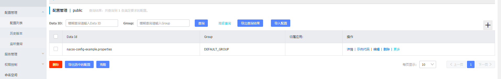

1. Nacos简介

    Nacos 致力于帮助您发现、配置和管理微服务。Nacos 提供了一组简单易用的特性集，帮助您快速实现动态服务发现、服务配置、服务元数据及流量管理。

    Nacos 帮助您更敏捷和容易地构建、交付和管理微服务平台。 Nacos 是构建以“服务”为中心的现代应用架构 (例如微服务范式、云原生范式) 的服务基础设施。

    1. Nacos 支持几乎所有主流类型的“服务”的发现、配置和管理：

        * Kubernetes Service
        * gRPC & Dubbo RPC Service
        * Spring Cloud RESTful Service

    2. 关键特性

        * 服务发现和服务健康监测

            Nacos 支持基于 DNS 和基于 RPC 的服务发现。

        * 动态配置服务

            动态配置服务可以让您以中心化、外部化和动态化的方式管理所有环境的应用配置和服务配置。

        * 动态 DNS 服务

            动态 DNS 服务支持权重路由，让您更容易地实现中间层负载均衡、更灵活的路由策略、流量控制以及数据中心内网的简单DNS解析服务。

        * 服务及其元数据管理

            Nacos 能让您从微服务平台建设的视角管理数据中心的所有服务及元数据，包括管理服务的描述、生命周期、服务的静态依赖分析、服务的健康状态、服务的流量管理、路由及安全策略、服务的 SLA 以及最首要的 metrics 统计数据。

    3. Nacos地图

        

        * 特性大图：要从功能特性，非功能特性，全面介绍我们要解的问题域的特性诉求
        * 架构大图：通过清晰架构，让您快速进入 Nacos 世界
        * 业务大图：利用当前特性可以支持的业务场景，及其最佳实践
        * 生态大图：系统梳理 Nacos 和主流技术生态的关系
        * 优势大图：展示 Nacos 核心竞争力
        * 战略大图：要从战略到战术层面讲 Nacos 的宏观优势

    4. Nacos 生态图

        

        如 Nacos 全景图所示，Nacos 无缝支持一些主流的开源生态，例如

        * Spring Cloud
        * Apache Dubbo and Dubbo Mesh
        * Kubernetes and CNCF

2. 快速开始

    ```bash
    ## 下载解压
    wget https://github.com/alibaba/nacos/releases/download/1.4.0/nacos-server-1.4.0.tar.gz
    tar -xvf nacos-server-1.4.0.tar.gz
    cd nacos/bin

    ##启动
    sh startup.sh -m standalone

    ##服务注册
    curl -X POST 'http://127.0.0.1:8848/nacos/v1/ns/instance?serviceName=nacos.naming.serviceName&ip=http://127.0.0.1/&port=8080'

    ##服务发现
    curl -X GET 'http://127.0.0.1:8848/nacos/v1/ns/instance/list?serviceName=nacos.naming.serviceName'

    ##发布配置
    curl -X POST "http://127.0.0.1:8848/nacos/v1/cs/configs?dataId=nacos.cfg.dataId&group=test&content=HelloWorld"

    ##获取配置
    curl -X GET "http://127.0.0.1:8848/nacos/v1/cs/configs?dataId=nacos.cfg.dataId&group=test"

    ##关闭服务
    sh shutdown.sh
    ```

3. 结合springboot

    1. nacos数据准备

        1. 启动nacos并发布配置

            ```bash
            cd nacos/bin

            ##启动
            sh startup.sh -m standalone
            curl -X POST "http://127.0.0.1:8848/nacos/v1/cs/configs?dataId=nacos.properties&group=DEFAULT_GROUP&content=user.id=1%0Auser.name=james%0Auser.age=17"
            ```

            发布配置包含三个参数
            * dataId : nacos.properties
            * group : DEFAULT_GROUP
            * content : user.id=1&user.name&james&user.age=17，要注意&符号的编码！！

        2. nacos控制台访问

            1. 访问连接：http://127.0.0.1:8848/nacos/index.html，默认账号：nacos/nacos

            2. 查看配置信息

                

    2. 搭建springboot项目

        1. pom.xml添加依赖

            ```xml
            <!-- 在父工程里管理子项目需要使用的依赖,方便统一控制版本 -->
            <dependencyManagement>
                <dependencies>
                    <dependency>
                        <groupId>org.springframework.boot</groupId>
                        <artifactId>spring-boot-dependencies</artifactId>
                        <version>1.5.22.RELEASE</version>
                        <type>pom</type>
                        <scope>import</scope>
                    </dependency>
                    <dependency>
                        <groupId>org.springframework.cloud</groupId>
                        <artifactId>spring-cloud-dependencies</artifactId>
                        <version>Brixton.RELEASE</version>
                        <type>pom</type>
                        <scope>import</scope>
                    </dependency>
                    <dependency>
                        <groupId>org.springframework.cloud</groupId>
                        <artifactId>spring-cloud-alibaba-dependencies</artifactId>
                        <version>0.2.0.RELEASE</version>
                        <type>pom</type>
                        <scope>import</scope>
                    </dependency>
                </dependencies>

            </dependencyManagement>

            <dependencies>

                <dependency>
                    <groupId>org.springframework.boot</groupId>
                    <artifactId>spring-boot-starter-freemarker</artifactId>
                </dependency>

                <dependency>
                    <groupId>org.springframework.boot</groupId>
                    <artifactId>spring-boot-starter-web</artifactId>
                </dependency>
                <dependency>
                    <groupId>org.springframework.boot</groupId>
                    <artifactId>spring-boot-starter-tomcat</artifactId>
                </dependency>

                <dependency>
                    <groupId>org.springframework.cloud</groupId>
                    <artifactId>spring-cloud-starter-alibaba-nacos-config</artifactId>
                </dependency>
            </dependencies>
            ```

        2. resources添加配置

            * application.properties

                ```properties
                server.port=8080
                ```

                * server.port：此应用端口为8080

            * bootstrap.properties

                ```properties
                spring.application.name=nacos
                spring.cloud.nacos.config.server-addr=127.0.0.1:8848
                ```

                * spring.application.name：和上面发布配置的dataId对应，这里spring.application.name配置为**nacos**，那么对应的配置dataId=**nacos.properties**

                * spring.cloud.nacos.config.server-addr：配置了nacos服务器的地址

        3. java

            * Application.java

                ```java
                import org.springframework.boot.SpringApplication;
                import org.springframework.boot.autoconfigure.SpringBootApplication;

                @SpringBootApplication
                public class Application {

                    public static void main(String[] args) {
                        SpringApplication.run(Application.class, args);
                    }
                }
                ```

            * UserController.java

                ```java
                import org.springframework.beans.factory.annotation.Value;
                import org.springframework.cloud.context.config.annotation.RefreshScope;
                import org.springframework.web.bind.annotation.RequestMapping;
                import org.springframework.web.bind.annotation.RestController;

                @RefreshScope
                @RestController
                class UserController {

                    @Value("${user.name}")
                    private String userName;

                    @Value("${user.age}")
                    private int age;

                    @RequestMapping("/user")
                    public String getUser() {
                        return userName+" "+age;
                    }
                }
                ```

        4. 运行Application，并访问http://127.0.0.1:8080/user，可以看到结果

            ```html
            james 17
            ```

    3. 流程说明

        1. 先启动了nacos，并且发布配置
        2. 启动springboot，从bootstrap.properties获取nacos服务器，扫描@RefreshScope的类，从nacos获取配置信息

参考：https://nacos.io/zh-cn/docs/what-is-nacos.html