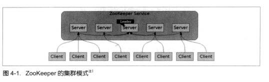

## Zookeeper

1. ZooKeeper介绍

    ZooKeeper是一个开放源代码的分布式协调服务，由知名互联网公司雅虎创建，是Google Chubby的开源实现。ZooKeeper的设计目标是将那些复杂且容易出错的分布式一致性服务封装起来，构成一个高效可靠地原语集，并以一系列简单易用的接口提供给用户使用。

    **Zookeeper是什么**

    Zookeeper是一个额典型的分布式数据一致性的解决方案，分布是应用程序可以基于它实现诸如数据发布/订阅、负载均衡、命名服务、分布式协调/通知、集群管理、Master选举、分布式锁和分布式队列等功能。Zookeeper可以保证如下分布式一致性特性。

    * 顺序一致性

        从同一个客户端发起的事务请求，最终会严格地按照其发起顺序被应用到Zookeeper中去。

    * 原子性

        所有事物请求的处理结果在整个急群众所有机器上的应用情况是一致的，也就是说，要么整个集群所有机器都成功能哦应用了某一个事务，要么都没有应用，一定不会出现集群中部分机器应用了该事务，而另一部分没有应用的情况

    * 单一视图(Single System Image)

        无论客户端连接的是哪个Zookeeper服务器，其看到的服务端数据模型都是一致的。
    
    * 可靠性

        一旦服务端成功的应用了一个事务，并完成了对客户端的响应，那么该事物所引起的服务端状态变更将会被一直保留下来，除非有另一个事务又对其进行了变更。

    * 实时性

        通常人们看到实时性的第一反应是，一旦一个事务被成功应用，那么客户端能够立即从服务端上读取到这个事务变更后的最新数据状态。这里需要注意的是ZooKeeper仅仅保证在一定的时间段内，客户端最终一定能够从服务端上读取到最新的数据状态。

2. ZooKeeper的设计目标
    　
    * 简单的数据模型

        ZooKeeper使得分布式程序能够通过一个共享的、树形结构的命名空间来进行相互协调。
    
    * 可以构建集群

        一个ZooKeeper群集通常有一组机器组成，一般3~5台机器就可以组成一个可用的ZooKeeper集群了，如图

        

    * 顺序访问
    
        对于来自客户端的每个更新请求，ZooKeeper都会分配一个全局唯一的递增编号，这个编号反映了所有事物操作的先后顺序。

    * 高性能
    
        由于ZooKeeper将全量数据存储在内存中，并直接服务于客户端的所有非事务请求，因此它尤其适用于以读操作为主的应用场景。

3. ZooKeeper的基本概念

    * 集群角色

        * Leader
            
            集群中的所有机器通过Leader选举过程选定出来的，为客户端提供读和写服务

        * Follower和Observer

            都提供读服务，区别在于Observer不参与Leader选举过程，也不参与写操作的“过半成功”策略，因此Observer可以在不影响写性能的情况下提升集群的读性能。
        
    * 会话(Session)

        Session是指客户端会话，ZooKeeper对外的服务端口默认是2181，客户端启动的时候，首先会与服务器建立一个TCP连接，从第一次连接建立开始，客户端会话的生命周期也开始了，通过这个连接，客户端能够通过心跳检测与服务器保持有效的会话，也能够向ZooKeeper服务器发送请求并接受响应，同时还能够通过该连接接收来自服务器的watch时间通知。

    * 数据节点(Znode)

        ZooKeeper将所有数据存储在内存中，数据模型是一棵树(Znode Tree)，由斜杠(/)进行分割的路径，就是一个Znode，每个Znode都会保存自己的数据内容，同时还会保存一系列属性信息。

        * 持久节点

            持久节点是指一旦这个Znode被创建了，除非主动进行Znode的移除操作，否则Znode将一直保存在ZooKeeper上。

        * 临时节点

            临时节点，它的生命周期和客户端会话绑定，一旦客户端会话失效，那么这个客户端创建的所有临时节点都会被移除。

    * 版本

        ZooKeeper的每个Znode上都会存储数据，对应于每个ZNode，ZooKeeper都会为其维护一个叫做Stat的数据结构，Stat中记录了这个ZNode的三个数据版本，分别是version，cversion和aversion。

    * Watcher

        ZooKeeper允许用户在指定节点上注册一些Watcher，并且在一些特定事件触发的时候，ZooKeeper服务端会将时间通知到感兴趣的客户端上去，该机制是ZooKeeper实现分布式协调服务的重要特性。

    * ACL

        ZooKeeper采用ACL策略进行权限控制，定义了5中权限

        * CREATE:创建子节点的权限
        * READ:获取节点数据和子节点列表的权限
        * WRITE:更新节点数据的权限
        * DELETE:删除子节点的权限
        * ADMIN：设置节点ACL的权限

原文：从Paxos到Zookeeper++分布式一致性原理与实践.pdf