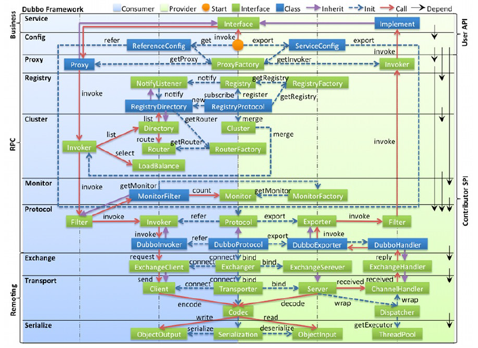
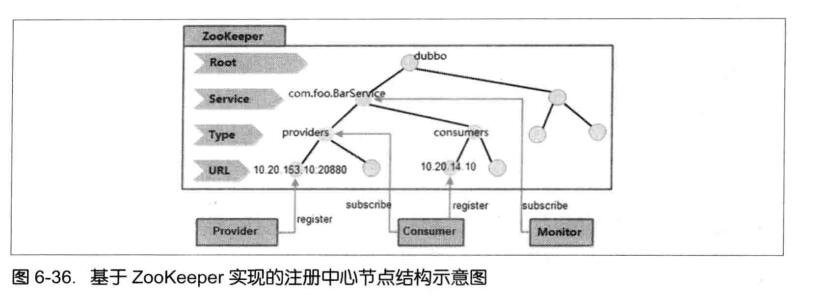

## Zookeeper在阿里巴巴的实践

本文将以dubbo为例谈谈Zookeeper在阿里巴巴的实践

Dubbo是阿里巴巴与2011年10月正式开源的一个有Java语言编写的分布式服务框架，致力于提供高性能和透明化的远程服务调用方案和基于服务框架展开的完整SOA服务智力方案。目前项目主页地址为
https：//github.com/alibaba/dubbo。

Dubbo的核心部分包含以下三块。
* **远程通信**：提供对多种基于长连接的NIO框架抽象封装，包括多种线程模型、序列化，以及“请求-响应”模式的信息交换方式。
* **集群容错**：提供基于接口方法的远程过程透明调用，包括对多协议的支持，以及对软负载均衡、失败容错、地址路由和动态路由等集群特性的支持。
* **自动发现**：提供基于注册中的目录服务，是服务消费方能动态的查找服务提供方，使地址透明，是服务提供方可以平滑的增加或减少机器。

此外，Dubbo框架还包括负责服务对象序列化的Serialize组件、网络传输组件Transport、协议层Protocol以及服务注册中心Registry等，其整体模块组成和协作方式如图

注册中心是RPC框架最核心的模块之一，用于服务的注册和订阅。在Dubbo的实现中，对注册中心模块进行抽象封装，因此可以基于其提供的外部接口来实现各种不同类型的注册中心，例如数据库、ZooKeeper和Redis等。Zookeeper是一个树形结构的目录服务，支持变更推送，因此非常适合作为Dubbo服务的注册中心，下面着重来看基于Zookeeper实现的Dubbo注册中心。

在Dubbo注册中的整体架构设计中，Zookeeper上服务的节点设计如图

* /dubbo：这是Dubbo在Zookeeper上创建的根节点。
* /dubbo/com.foo.BarService：这是服务节点，代表了Dubbo的一个服务。
* /dubbo/com.foo.BarService/providers:这是服务提供者的根节点，其子节点代表了每一个服务的真正提供者。
* /dubbo/com.foo.BarService/consumers:这是服务消费者的根节点，其子节点代表了每一个服务的真正消费者。

结合上图，以“com.foo.BarService”这个服务为例，来说明Dubbo基于Zookeeper实现的注册中心的工作流程。

1. 服务提供者

    服务提供者在初始化启动的时候，会首先在Zookeeper的/dubbo/com/foo.BarService/providers节点下创建一个子节点，并写入自己的URL地址，这就代表了“com.foo.BarService”这个服务的一个提供者。

2. 服务消费者

    服务消费者会在启动的时候，读取并订阅Zookeeper上/dubbo/com.foo.BarService/providers节点下的所有子节点，并解析出所有提供者的URL地址来作为改服务地址列表，然后开始发起正常调用。

    同事，服务消费者还会在Zookeeper的/dubbo/com.foo.BarService/consumers节点下创建一个临时节点，并写入自己的URl地址，这就代表了“com.foo.BarService”这个服务的一个消费者。

3. 监控中心

    监控中心是Dubbo服务治理体系的重要一部分，其需要知道一个服务的所有提供者和订阅者，及其变化情况。因此，监控中心在启动的时候，会通过Zookeeper的/dubbo/com.foo.BarService节点来获取所有提供者和消费者的URL地址，并注册Watcher来监听其子节点变化。

另外需要注意的是，所有提供者在Zookeeper上创建的节点都是临时节点，利用的是临时节点的生命周期和客户端会话相关的特性，因此一旦提供者所在的机器出现故障导致该提供者无法对外提供服务时，该临时节点机会自动从Zookeeper上删除，这样服务的消费者和监控中心都能感知服务提供者的变化。

