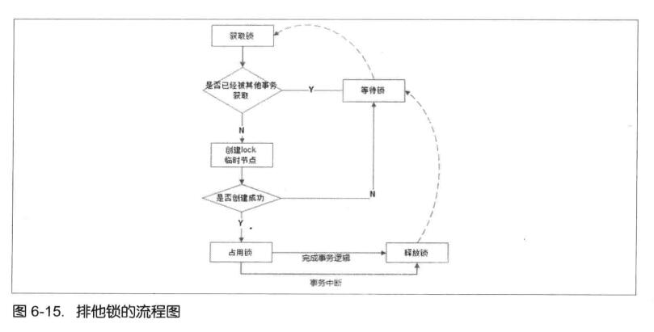
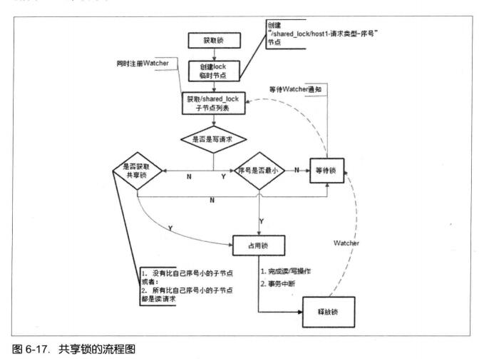
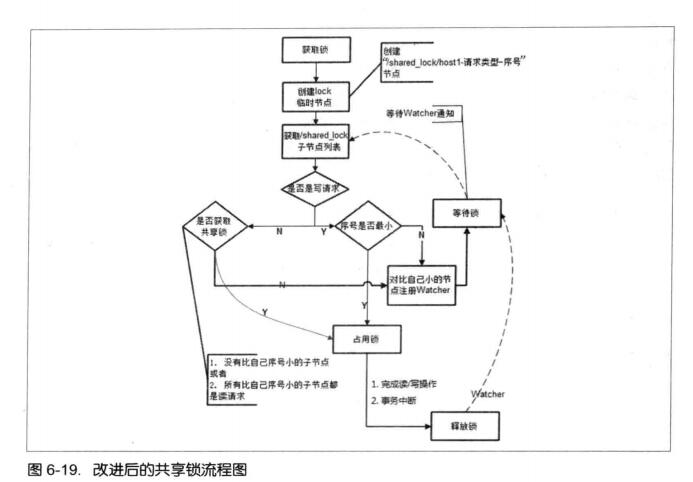
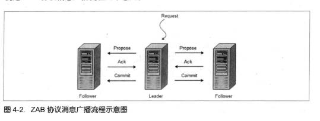

## zookeeper技术内幕

1. 分布式锁解决方案

    分布式锁式控制分布式系统之间同步访问共享资源的一种方式。如果不同的系统或是同一个系统的不同主机之间共享了一个或一组资源，那么访问这些资源的时候，往往需要通过一些互斥手段来防止彼此之间的干扰，以保证一致性，在这种情况下，就需要使用分布式锁了。

    1. 排他锁

        排他锁(Exclusive Locks，简称X锁)，有称为写锁或独占锁，是一种基本的锁类型。如果事务T1对数据对象O1加上了排他锁，那么整个加锁期间，只允许事务T1对O1进行读取和更新操作，其他任何事务都不能再对这个数据对象进行任何类型的操作-直到T1释放了排他锁。

        * 获取锁

            在需要获取排他锁时，所有的客户端都会试图通过调用create()接口，在/exclusive_lock节点下创建临时子节点/exclusive_lock/lock。Zookeeper会保证在所有的客户端中，最终只有一个客户端能够创建成功，那么就可以认为该客户端获取了锁。同时，所有没有获取到锁的客户端就需要到/exclusive_lck节点上注册一个子节点变更的Watcher监听，以便实时监听到lock节点的变更情况。

        * 释放锁

            在以下两种情况下，都有可能释放锁。

            * 当前获取锁的客户端机器发生单机，那么Zookeeper上的这个临时节点就会被移除。
            * 正常执行完业务逻辑后，客户端就会主动将自己创建的临时节点删除。

        整个排他锁的获取和释放流程，如图

        

    2. 共享锁

        共享锁(Shared Locks，简称S锁)，又称为读锁，是一种基本的锁类型。如果事务T1对数据对象O1加上了共享锁，那么当事务T1对O1进行读取操作，其他也只能对这个数据对象加共享锁-直到该数据对象上的所有共享锁都被释放。

        * 获取锁

            在需要获取共享锁时，所有的客户端都会到/shared_lock这个节点下面创建一个临时顺序节点，如果当前是读请求，那么就创建例如/shared_lock/192.168.0.1-R-0000000001的节点；如果是写请求，那么就创建例如/shared_lock/192.168.0.1-W-0000000001的节点。

        * 判断读写顺序

            根据共享锁的的定义，不同的事务都可以同时对同一个数据对象进行读取操作，而更新操作必须在当前没有任何事务进行读写操作的情况下进行。

            1. 创建完节点后，获取/shared_lock节点下的所有子节点，并对该节点注册子节点变更的Watcher监听。

            2. 确定自己的节点序号在所有子节点中的顺序。

            3. 两种请求的不同处理

                * 对于读请求
                    * 如果没有比自己序号小的子节点，或是所有比自己序号小的子节点都是读请求，那么表名自己已经成功获取到共享锁，同时开始执行读取逻辑。
                    * 如果比自己序号小的子节点中有写请求，那么就需要进入等待。
                * 对于写请求
                    * 如果自己不是序号最小的子节点，那么就需要进入等待。
                
            4. 接收到Watcher通知后，重复步骤1。

        * 释放锁

            释放锁的逻辑和排他锁是一致的，不再赘述。

        整个共享锁的获取和释放流程，如图

        

        上图中会出现羊群效应，回顾上卖弄的分布式锁竞争过程，它的核心逻辑在于：判断自己是否是所有子节点中序号最小的。于是，很容易可以联想到，每个节点对应的客户端只需要关注比自己序号小的那些相关节点的变更情况就可以了-而不需要关注全局的子列表变更情况。

        改进后的共享锁实现，如图

        

2. Watcher核心机制

3. Zab协议

    Zookeeper使用了一种Zookeeper Atomic Broadcast(ZAB，Zookeeper原子消息广播协议)的协议作为其数据一致性的核心算法。

    1. Zab协议的核心

        所有事物请求必须有一个全局唯一的服务器来协调处理，这样的服务器被称为Leader服务器，而雨下的其他服务器则成为Follower服务器。Leader服务器负责将一个客户端事物请求转换成一个事物Proposal(提议)，并将该Proposal分发给集群中所有的Follower服务器。之后Leader服务器需要等待所有Follower服务器的反馈，一旦超过半数的Follower服务器进行正确的反馈后，那么Leader机会再次向所有的Follower服务器分发Commit消息，要求器将前一个Proposal进行提交。

    2. 消息广播

        ZAB协议的消息广播过程使用的是一个原子广播协议，类似于一个二阶段提交过程。对客户端的事务请求，Leader服务器为其生成对应的事务Proposal，并将其发送给群中其余所有的机器，然后再分别收集各自的选票，最后进行事务提交，如图

        

        在整个消息广播过程中，Leader服务器会为每个事务请求生成对应的Proposal来进行广播，并且在广播事务Proposal之前，Leader服务器会首先为这个事务Proposal分配一个全局单调递增的唯一ID，我们称之为事务ID(即ZXID)。由于ZAB协议需要保证每一个消息严格的因果关系，因此必须将每一个事务Proposal按照其ZXID的先后顺序来进行排序与处理。

    3. 崩溃恢复过程

        在正常情况下运行非常良好，但是一旦Leader服务器出现崩溃，或者说由于网络原因导致Leader服务器失去了与过半Follower的联系，那么就会进入崩溃恢复模式。

        1. 选举出来的Leader服务器拥有集群中所有机器最高编号(即ZXID最大)的事务Proposal，那么可以保证这个新选举出来的Leader一定具有所有已经提交的提案。

        2. 完成Leader选举之后，在正式开始工作(即接收客户端的事务请求，然后提出新的提案)之前，Leader服务器会首先确认事务日志中的所有Proposal是否都已经被群集中过半的机器提交了，即是否完成数据同步。 *Leader服务器会为每一个Follower服务器都准备一个队列，并将那些没有被各Follower服务器同步的事务以Proposal消息的形式逐个发送给Follower服务器，并且在每一个Proposal消息后面紧接着在发送一个Commit消息，以表示该事务已经被提交*

        3. ZXID设计，ZXID是一个64位的数字，新增事务Proposal时，低32位加1。高32为代表Leader周期epoch的编号，每产生新Leader服务器，低32置0，Leader服务器从本地日志中取出最大事务Proposal的ZXID，解析出对应的epoch值，然后加1，最为最新的epoch。这个策略能有效地避免不同的Leader服务器错误地使用相同的ZXID编号提出不一样的事务Proposal的异常情况。

原文：从Paxos到Zookeeper++分布式一致性原理与实践.pdf