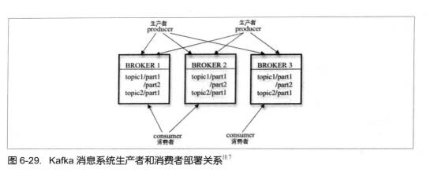

## Zookeeper在大项分布式系统应用

本文将以kafka为例谈谈Zookeeper在大项分布式系统应用

1. kafka简介

    kafka是知名社交网络公司LinkedIn于2010年12月份开元你的分布式消息系统，主要由Scala语言开发，于2012年成为了Apache的顶级项目。

    kafka主要用于实现低延迟的发送和收集大量的事件和日志数据-这些数据通常都是活跃的数据。

    kafka是一个吞吐量极高的分布式消息系统，其整体设计是典型的发布与订阅模式系统。

2. 整体架构

    在kafka集群中，没有“中心主节点”的概念，集群中的服务器都是对等的，因此可以在不做任何配置更改的情况下实现服务器的添加与删除，同样，消息的生产者和消费者也能够给做到随意重启和机器的上下线。kafka服务器及消息生产者和消费者之间的部署关系如图

    

3. 术语介绍

    * 消费生产者，即Producer，是消息产生的源头，负责生成消息并发送到Kafka服务器上。
    * 消息消费者，即Consumer，是消息的使用方，负责消费zookeeper服务器上的消息。
    * 主题，即Topic，由用户定义并配置在Kafka服务器，用于建立生产者和消费者之间的订阅关系：生产者发送消息到指定Topic下，消费者从这个Topic下消费消息。
    * 消息分区，及Partition，一个Topi下面会分为多个分区。
    * Broker，即Kafka的服务器，用于存储消息，在消息中间件中通常被称为Broker。
    * 消费者分组，即Group，用于归组同类消费者，在Kafka中，多个消费者可以共同消费一个Topic下的消息。
    * Offset，消息存储在Kafka的broker上，消费者拉去消息数据的过程中需要知道消息在文件中的偏移量，这个偏移量就是所谓的Offset。

4. 注册及负载均衡

    1. Brokern注册
        在zookeeper上会有一个专门用来进行Broker服务器列表记录的节点，简称“Broken节点”，其节点路径为 */brokens/ids*

        新Broken注册时，路径为 */brokens/ids/[0...N]*

    2. Topic注册

        在kafka中，会将同一个Topic的消息分成多个分区并将其分布到多个Broker上，而这些分区信息以及与Broken的对应关系也都是由Zookeeper维护的，由专门的节点来记录，简称“Topic节点”，其节点路径为 */brokers/topics*。

        新Topic注册时，路径为 */brokens/topics/[topic]*，例如，/brokers/topics/logins/3 ->2 这个节点表明Broker Id为3的一个Broker服务器，对于"login"这个Topic的消息，提供了2个分区进行消息存储。

    3. 生产者负载均衡

        在kafka中，客户端使用了基于Zookeeper的负载均衡策略来解决生产者的负载均衡问题。

        每当一个Broker启动时，会首先完成Broker注册过程，并注册一些诸如“有哪些可订阅的Topic”的元数据信息。生产者就能够通过这个节点的变化来动态的感知到Broker的新增和减少。在实现上，Kafka的生产者会对Zookeeper上的“Broker的新增与减少”、“Topic的新增与减少”和“Broker与Topic关联关系的变化”等事件注册Watcher监听，这样就可以实现一种动态的负载均衡机制了。
    
    4. 消费者负载均衡

        与生产者类似，kafka中的消费者同样需要进行负载均衡来实现多个消费者合理的从对应的Broker服务器上接收消息。

    5. 消费者注册

        1. 注册到消费者分组

            创建一个属于自己的消费者节点，例如 */consumers/[group_id]/ids/[consumer_id]*。这是一个临时节点。

        2. 对消费者分组中消费者的变化注册监听

            每个消费者都需要关注所属消费者分组中的消费者服务器的变化情况，即对 */consumers/[group_id]/ids/* 节点注册子节点变化的watcher监听。一旦发小消费者新增或减少，就会触发消费者的负载均衡。

        3. 对Broker服务器的变化注册监听

            消费者需要对 */brokens/ids/[0...N]* 中的节点进行监听的注册，如果发现Broker服务器列表发生变化，那么就根据具体情况来决定是否需要进行消费者的负载均衡。

        4. 进行消费者负载均衡

            所谓消费者负载均衡，是指为了更能够让同一个Topic下不同分区的消息尽量均衡的被多个消费者消费而进行的一个消费者与消费分区分配的过程。通常，对于一个消费者分组，如果组内的消费者服务器发生变更或Broker服务器发生变更，会触发消费者负载均衡。

原文：从Paxos到Zookeeper++分布式一致性原理与实践.pdf