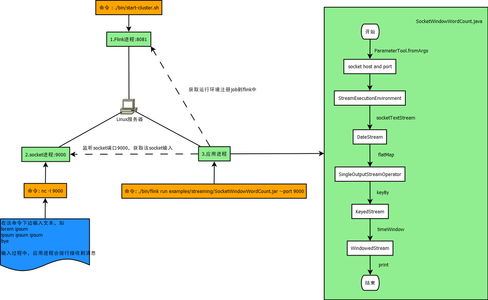
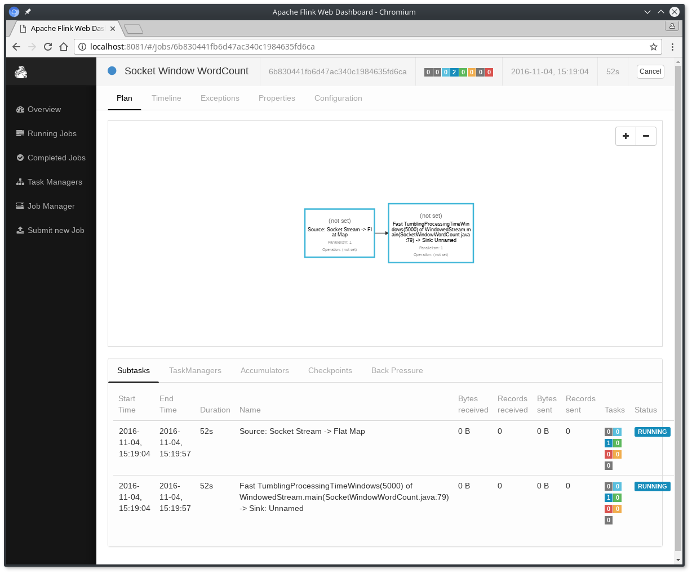

## Flink安装

环境说明

虚拟机：CentOS7 64bit

先给出一个总体设计图



1. 下载并启动Flink

    1. 安装环境

        Flink可以安装在Linux，Mac OS X和Windows
        
        为了能够启动Flink，主要安装Java 8.x以上版本的jdk，可以通过命令查看jdk版本。
        
        ```bash
        java -version
        ```
        
        如果已经安装了Java 8，则输出可能如下

        ```bash
        java version "1.8.0_111"
        Java(TM) SE Runtime Environment (build 1.8.0_111-b14)
        Java HotSpot(TM) 64-Bit Server VM (build 25.111-b14, mixed mode)
        ```

    2. 安装

        安装方式有两种：一种从github上下载并编译，花费时间较长，但是可以更新git源码，重新编译；另一种直接下载bin包
        
        * github下载并编译

            ```bash
            git clone https://github.com/apache/flink.git
            $ cd flink
            $ mvn clean package -DskipTests # 这个执行将要花费10min，其实远不止这个时间，要看网速以及机器性能，编译过程maven要下载好多jar包，共需要编译出152个目标jar
            $ cd build-target               # Flink所安装的位置
            ```

        * 下载bin包并解压

            访问地址：https://archive.apache.org/dist/flink/，
            看到不同版本的flink,找到flink-*-bin-hadoop*-scala_*.tgz这种文件，并下载。

            ```bash
            wget https://archive.apache.org/dist/flink/flink-1.7.2/flink-1.7.2-bin-hadoop24-scala_2.11.tgz #下载文件

            tar xzf flink-1.7.2-bin-hadoop24-scala_2.11.tgz #解压文件

            cd flink-1.7.2
            ```
    3. 启动一个本地的Flink Cluster

        ```bash
        $ ./bin/start-cluster.sh  # 启动Flink
        ```

        访问地址：http://localhost:8081/，正常的话可以看到界面，如图

        

        通过查看log目录下的日志验证系统正在运行

        ```
        $ tail log/flink-*-standalonesession-*.log
        INFO ... - Rest endpoint listening at localhost:8081
        INFO ... - http://localhost:8081 was granted leadership ...
        INFO ... - Web frontend listening at http://localhost:8081.
        INFO ... - Starting RPC endpoint for StandaloneResourceManager at akka://flink/user/resourcemanager .
        INFO ... - Starting RPC endpoint for StandaloneDispatcher at akka://flink/user/dispatcher .
        INFO ... - ResourceManager akka.tcp://flink@localhost:6123/user/resourcemanager was granted leadership ...
        INFO ... - Starting the SlotManager.
        INFO ... - Dispatcher akka.tcp://flink@localhost:6123/user/dispatcher was granted leadership ...
        INFO ... - Recovering all persisted jobs.
        INFO ... - Registering TaskManager ... under ... at the SlotManager.
        ```

2. 应用程序

    Flink支持Scala和Java。以Java为例构建一个Maven项目。

    1. 用IDE，比如eclipse新建一个maven项目

    2. 添加flink的依赖配置，打开pom.xml，添加依赖

        ```xml
        <properties>
            <flink.version>1.7.2</flink.version>
        </properties>

        <dependencies>
            <dependency>
                <groupId>org.apache.flink</groupId>
                <artifactId>flink-java</artifactId>
                <version>${flink.version}</version>
            </dependency>
            <dependency>
                <groupId>org.apache.flink</groupId>
                <artifactId>flink-streaming-java_2.11</artifactId>
                <version>${flink.version}</version>
            </dependency>
            <dependency>
                <groupId>org.apache.flink</groupId>
                <artifactId>flink-clients_2.11</artifactId>
                <version>${flink.version}</version>
            </dependency>
            <dependency>
                <groupId>org.apache.flink</groupId>
                <artifactId>flink-connector-wikiedits_2.11</artifactId>
                <version>${flink.version}</version>
            </dependency>
        </dependencies>
        ```

    3. 新建SocketWindowWordCount类

        ```java   
        import org.apache.flink.api.common.functions.FlatMapFunction;
        import org.apache.flink.api.common.functions.ReduceFunction;
        import org.apache.flink.api.java.utils.ParameterTool;
        import org.apache.flink.streaming.api.datastream.DataStream;
        import org.apache.flink.streaming.api.environment.StreamExecutionEnvironment;
        import org.apache.flink.streaming.api.windowing.time.Time;
        import org.apache.flink.util.Collector;

        public class SocketWindowWordCount {

            public static void main(String[] args) throws Exception {
                final int port;
                final String hostname;
                try {
                    ParameterTool params = ParameterTool.fromArgs(args);
                    hostname = params.has("hostname") ? params.get("hostname") : "localhost";
                    port = params.getInt("port");
                } catch (Exception e) {
                    System.err.println("No port specified. Please run 'SocketWindowWordCount --hostname <hostname> --port <port>', where hostname (localhost by default) and port is the address of the text server");
                    System.err.println("To start a simple text server, run 'netcat -l <port>' and type the input text into the command line");
                    return;
                }
                
                // get the execution environment
                final StreamExecutionEnvironment env = StreamExecutionEnvironment.getExecutionEnvironment();

                // get input data by connecting to the socket
                DataStream<String> text = env.socketTextStream(hostname, port, "\n");

                // parse the data, group it, window it, and aggregate the counts
                DataStream<WordWithCount> windowCounts = text.flatMap(new FlatMapFunction<String, WordWithCount>() {
                    @Override
                    public void flatMap(String value, Collector<WordWithCount> out) throws Exception {
                        for (String word : value.split("\\s")) {
                            out.collect(new WordWithCount(word, 1L));
                        }
                    }
                }).keyBy("word").timeWindow(Time.seconds(5), Time.seconds(1)).reduce(new ReduceFunction<WordWithCount>() {
                    @Override
                    public WordWithCount reduce(WordWithCount a, WordWithCount b) {
                        return new WordWithCount(a.word, a.count + b.count);
                    }
                });

                // print the results with a single thread, rather than in parallel
                windowCounts.print().setParallelism(1);

                env.execute("Socket Window WordCount");
            }

            // Data type for words with count
            public static class WordWithCount {

                public String word;
                public long count;

                public WordWithCount() {
                }

                public WordWithCount(String word, long count) {
                    this.word = word;
                    this.count = count;
                }

                @Override
                public String toString() {
                    return word + " : " + count;
                }
            }
        }
        ```
    

3. 运行例子

    这个Flink应用程序。它将从套接字中读取文本，并每5秒打印前5秒内每个不同单词出现的次数，即处理时间的滚动窗口，只要单词是浮动的。
    
    1. 使用netcat启动一个本地服务

        ```bash
        $ nc -l 9000
        ```
        
    2. 提交Flink程序

        ```bash
        cd /usr/local/src/flink-1.7.2       #flink所在目录
        
        ./bin/flink run examples/streaming/SocketWindowWordCount.jar --port 9000        #启动9000端口
        ```

        这个程序连接到socket并等待输入，可以查看web页面来验证job运行如图

        

        

        * 单词以5秒的时间窗口(处理时间、翻转窗口)计算，并打印到stdout。监控TaskManager的输出文件，用nc写一些文本(输入按下后逐行发送到Flink):

            ```
            lorem ipsum
            ipsum ipsum ipsum
            bye
            ```

        * .out文件将在每个时间窗口的末尾打印计数，只要单词是浮动的，例如:

            ```
            $ tail -f log/flink-*-taskexecutor-*.out
            lorem : 1
            bye : 1
            ipsum : 4
            ```
        
        * 如果要停止Flink，执行命令

            ```bash
            $ ./bin/stop-cluster.sh

            ```

    

原文：https://ci.apache.org/projects/flink/flink-docs-master/tutorials/local_setup.html
https://ci.apache.org/projects/flink/flink-docs-release-1.3/quickstart/setup_quickstart.html#setup-download-and-start-flink
