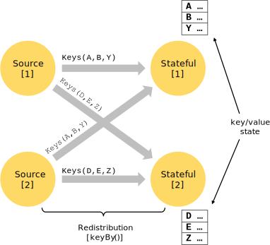

## Flink概念

Apache Flink是一个用于分布式流和批处理数据的开源平台。Flink的核心是一个流数据流引擎，它为数据流上的分布式计算提供数据分发、通信和容错功能。Flink在流引擎之上构建批处理，覆盖本地迭代支持、托管内存和程序优化。

1. 数据流编程模型

    1. 抽象层次

        Flink提供了不同级别的抽象层来开发流/批处理应用程序

        

        * 最低层级的抽象简单的提供了有状态流，通过执行函数嵌入到数据流API中。允许用户自由的处理一个或多个流事件，并使用一致的容错状态。

        * 实际中，大多应用程序不需要使用上面所描述的低级抽象，而是针对核心API进行编程，比如DataStream API(有界/无界流)和DataSet API(有界数据集)。

        * 表API是一个以表为中心的声明性DSL，表可以(在表示流时)动态地更改表。表API遵循(扩展的)关系模型:表有一个附加的模式(类似于关系数据库中的表)，而API提供了类似的操作，如select、project、join、group-by、aggregate等

        * 有Flink提供的最高级别抽象是SQL，这种抽象在语义和表达性上都类似于表API，但将程序表示为SQL查询表达式

    2. 编程和数据流

        Flink编程的基础构造模块是流和转换。概念上，流是数据记录的(可能永远不会结束)流，而转换是一种由一个或多个输入并产生一个或多个输出作为结果的操作。

        

    3. 并行数据流

        Flink中的程序本质上是并行和分布式的，执行期间，一个流有一个或多个流部分，而每一个操作有一个或多个操作子任务。操作子任务独立于彼此，可能在不同机器或容器中的不同线程中执行。

        

        Streams可以在两个操作符之间以一对一(或转发)模式传输数据，也可以采用重新分发模式。

        * **一对一模式**，比如map()[1]交给keyBy[1]
        * **重新分发模式**，比如map()[1]交给keyBy[2]

    4. 窗口

        聚合事件(例如计数、和)在流上的工作方式与在批处理中不同。例如，不可能计算流中的所有元素，因为流通常是无限的(无界的)。相反，流上的聚合(计数、和等)由窗口限定范围，例如“过去5分钟内的计数”或“最后100个元素的总和”。

        

    5. 时间线

        在流媒体程序中引用时间(例如定义windows)时，可以引用不同的时间概念。
        * **事件时间**是指事件创建时的时间。
        * **诱导时间**是指事件在源操作符处进入Flink数据流的时间。
        * **处理时间**是每个执行基于时间的操作的操作符的本地时间。

        

    6. 有状态的操作

        虽然数据流中的许多操作一次只查看一个单独的事件(例如事件解析器)，但是有些操作可以跨多个事件(例如窗口操作符)记住信息。这些操作称为**有状态的**。

        

    7. 容错检查点

        Flink使用流重播和检查点的组合来实现容错。检查点与每个输入流中的特定点以及每个操作符的对应状态相关。流数据流可以从检查点恢复，同时通过恢复操作符的状态并从检查点重播事件来保持一致性(精确地说，一次处理语义)。

    8. 流批处理

        Flink作为流程序的一种特殊情况执行批处理程序，其中流是有界的(有限数量的元素)。数据集在内部被视为数据流。因此，上述概念同样适用于批处理程序，也适用于流媒体程序，只有少数例外:
        * 批处理程序的容错不使用检查点
        * DataSet API中的有状态操作使用简化的内存/内核外数据结构，而不是键/值索引。
        * DataSet API引入了特殊的同步(基于超步)迭代，这只可能在有界流上实现。

2. 分布式运行时环境

    1. 任务及操作符链

        对于分布式执行，将操作符子任务一起链接到任务中。每个任务由一个线程执行。将操作符链接到任务中是一种有用的优化:它减少了线程到线程切换和缓冲的开销，增加了总体吞吐量，同时降低了延迟。

        下图中的示例数据流使用5个子任务执行，因此使用5个并行线程。
        * 浓缩视图(上面部分)：总共一个task
        * 并行视图(下面部分)：共有五个subtask(看箭头所指)

        

    2. 作业管理器，任务管理器，客户

        Flink运行时由两类进程构成：

        * 作业管理器(也称为masters) 协调分布式执行。他们安排任务，协调检查点，协调故障恢复，等等。
            >至少有一个JobManager。一个高可用性的设置将有多个作业管理器，其中一个总是领导者，其他的都是备用的。
        * 任务管理器(也称为workers) 执行数据流的任务(或者更具体地说，子任务)，并缓冲和交换数据流。
            >必须始终至少有一个TaskManager。

        JobManager和TaskManager可以以多种方式启动:直接在机器上作为独立集群启动，或者在容器中启动，或者由诸如YARN或Mesos之类的资源框架管理。任务管理器连接到作业管理器，宣布自己可用，并分配工作。

        客户不是运行时及程序执行的一部分，但用来准备和发送数据流到JobManager。

        
        
    3. 任务槽和资源

        每个worker (TaskManager)都是一个JVM进程，可以在单独的线程中执行一个或多个子任务。为了控制worker接受多少任务，worker具有所谓的任务插槽(至少一个)。

        **每个任务槽表示TaskManager资源的一个固定子集。** 例如，一个有三个插槽的任务管理器会将其1/3的托管内存分配给每个插槽。对资源进行插槽意味着子任务不会与来自其他作业的子任务争夺托管内存，而是拥有一定数量的预留托管内存。*注意，这里没有发生CPU隔离;当前插槽只分隔任务的托管内存*。

        **过调整任务槽的数量，用户可以定义子任务如何彼此隔离。** 
        * 每个TaskManager有一个插槽意味着每个任务组运行在单独的JVM中(例如，可以在单独的容器中启动JVM)。
        * 拥有多个插槽意味着更多的子任务共享同一个JVM。相同JVM中的任务共享TCP连接(通过多路复用)和心跳消息。它们还可以共享数据集和数据结构，从而减少每个任务的开销。

        

        **默认情况下，Flink允许子任务共享插槽，即使它们是不同任务的子任务，只要它们来自相同的作业。** 结果是一个槽可以容纳作业的整个管道。允许这个插槽共享有两个主要好处:

        * Flink集群需要的任务插槽与作业中使用的最高并行度一样多。不需要计算一个程序总共包含多少任务(具有不同的并行度)。
        * 更容易得到更好的资源利用。如果没有插槽共享，非密集型source/map()子任务将阻塞与资源密集型窗口子任务一样多的资源。使用插槽共享，将我们示例中的基本并行度从2提高到6，可以充分利用插槽资源，同时确保繁重的子任务在任务管理器中得到公平分配。

        
        
        这些api还包括一个资源组机制，可用于防止不需要的插槽共享。

        **根据经验，一个好的默认任务槽数应该是CPU内核的数量。 使用超线程，每个槽将接受2个或更多的硬件线程上下文。**

    4. 后端状态

        **存储键/值索引的确切数据结构取决于所选的状态后端。** 一个状态后端将数据存储在内存中的散列映射中，另一个状态后端使用RocksDB作为键/值存储。除了定义保存*状态的数据结构*外，状态后端还实现了获取键/值状态的*时间点快照*的逻辑，并将该快照存储为检查点的一部分。

        
    
    5. 保存点

        在数据流API中编写的程序可以从保存点恢复执行。保存点允许在不丢失任何状态的情况下更新程序和Flink集群。

        **保存点是手动触发的检查点** ，它获取程序的快照并将其写入状态后端。

        **保存点类似于这些定期检查点，但它们是由用户触发的，并且在更新的检查点完成时不会自动过期。**

原文：https://ci.apache.org/projects/flink/flink-docs-master/concepts/programming-model.html#collapse-2
https://ci.apache.org/projects/flink/flink-docs-master/concepts/runtime.html
https://flink.sojb.cn/dev/api_concepts.html
