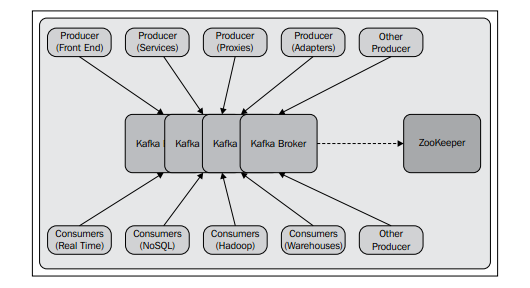

## Kafka

在当今世界，实时信息不断地由应用程序(业务、社交或任何其他类型)生成，而这些信息需要简单的方法来可靠且快速地路由到多种类型的接收者。

大数据下的两大挑战：收集数据和分析数据。

1. Kafka介绍

    Apache Kafka是一个开源，分布式，基于发布订阅的消息系统，主要设计了一下特性
    1. **消息持久**：Apache Kafka使用O(1)磁盘结构设计，即使存储了大量消息(按TB的顺序)，也可以提供稳定的时间性能
    
    2. **高吞吐量** :Kafka将大数据牢记于心，其设计初衷是在商用硬件上工作，并支持每秒数百万条消息

    3. **分布式** :Apache Kafka显式地支持在Kafka服务器上进行消息分区，并在消费机群上分布消费，同时维护每个分区的排序语义

    4. **支持多个客户端** : Apache Kafka系统容易集成来自不同平台的客户端，比如Java，.NET，PHP，Ruby和Python

    5. **实时**: 由生产者线程产生的信息应该对消费者线程立即可见。该特性对于基于事件的系统(如复杂事件处理(CEP)系统)非常重要。

    Apache Kafka消息系统的总体设计图
    

    从生产者上看，有不同类型的生产者，比如
    * 前端web应用程序生成应用程序日志
    * 生产者代理生成web分析日志
    * 生产者适配器生成转换日志
    * 生产者服务生成调用追踪日志

    从消费者上看，有不同类型的消费者，比如
    * 线下消费者消费信息并存储到Hadoop或传统数据仓库进行线下分析
    * 实时消费者消息信息并存储到任何NoSQL，比如HBase或Cassandra进行试试分析
    * 实时使用者过滤内存数据库中的消息并为相关组触发警报事件。

2. Kafka必要性

    根据互联网应用的新趋势，活跃数据已经成为了生产的一部分，被用来实时分析，这些分析可能为
    * 搜索相关性
    * 基于流行度、共现性或情感分析的推荐
    * 向群众投放广告
    * 从垃圾邮件或未经授权的数据抓取的互联网应用安全

    Apache Kafka旨在统一离线和在线处理，它提供了Hadoop系统中并行加载的机制，以及在一组机器上划分实时消耗的能力。

    Kafka可以与Scribe或Flume进行比较，因为它对处理活动流数据很有用;

    但是从架构的角度来看，它更接近于传统的消息传递系统，比如ActiveMQ或RabitMQ。

3. Kafka平台应用
   
    列举一些Kafka的平台应用

    1. LinkedIn (www.linkedin.com): LinkedIn使用Apache Kafka作为活动数据和操作指标的流。
    2. DataSift (www.datasift.com):在DataSift, Kafka被用作监视事件的收集器，并实时跟踪用户对数据流的使用情况
    3. Twitter ( www.twitter.com): Twitter使用Kafka作为它的Storm(一种流处理基础设施)的一部分
    4. Foursquare (www.foursquare.com): Kafka在Foursquare上支持在线到在线和在线到离线的消息传递
    5. Square (www.squareup.com): Square使用Kafka作为总线，通过Square的各个数据中心移动所有系统事件。

原文：Apache Kafka.pdf