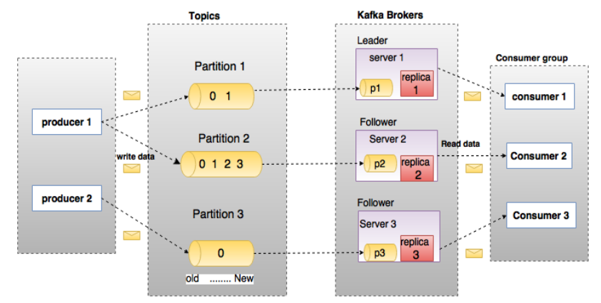

## Kafka概念

Apache Kafka是一个分布式的发布-订阅消息系统，能够支撑海量数据的数据传递。在离线和实时的消息处理业务系统中，Kafka都有广泛的应用。Kafka将消息持久化到磁盘中，并对消息创建了备份保证了数据的安全。Kafka在保证了较高的处理速度的同时，又能保证数据处理的低延迟和数据的零丢失。

Kafka的优势在于：

* 可靠性：Kafka是一个具有分区机制、副本机制和容错机制的分布式消息系统
* 可扩展性：Kafka消息系统支持集群规模的热扩展
* 高性能：Kafka在数据发布和订阅过程中都能保证数据的高吞吐量。即便在TB级数据存储的情况下，仍然能保证稳定的性能。

1. **Kafka术语**

    在深入理解Kafka之前，先介绍一下Kafka中的术语。下图展示了Kafka的相关术语以及之间的关系：

    

    上图中一个topic配置了3个partition。Partition1有两个offset：0和1。Partition2有4个offset。Partition3有1个offset。副本的id和副本所在的机器的id恰好相同。

    如果一个topic的副本数为3，那么Kafka将在集群中为每个partition创建3个相同的副本。集群中的每个broker存储一个或多个partition。多个producer和consumer可同时生产和消费数据。

    各个术语的详细介绍如下：

    * **Topic**：在Kafka中，使用一个类别属性来划分数据的所属类，划分数据的这个类称为topic。如果把Kafka看做为一个数据库，topic可以理解为数据库中的一张表，topic的名字即为表名。

    * **Partition**：topic中的数据分割为一个或多个partition。每个topic至少有一个partition。每个partition中的数据使用多个segment文件存储。partition中的数据是有序的，partition间的数据丢失了数据的顺序。如果topic有多个partition，消费数据时就不能保证数据的顺序。在需要严格保证消息的消费顺序的场景下，需要将partition数目设为1。（个人认为像队列，并形成日志文件）

    * **Partition offset**：每条消息都有一个当前Partition下唯一的64字节的offset，它指明了这条消息的起始位置。

    * **Replicas of partition**：副本是一个分区的备份。副本不会被消费者消费，副本只用于防止数据丢失，即消费者不从为follower的partition中消费数据，而是从为leader的partition中读取数据。

    * **Broker**：
        * Kafka 集群包含一个或多个服务器，服务器节点称为broker。
        * broker存储topic的数据。如果某topic有N个partition，集群有N个broker，那么每个broker存储该topic的一个partition。
        * 如果某topic有N个partition，集群有(N+M)个broker，那么其中有N个broker存储该topic的一个partition，剩下的M个broker不存储该topic的partition数据。
        * 如果某topic有N个partition，集群中broker数目少于N个，那么一个broker存储该topic的一个或多个partition。在实际生产环境中，尽量避免这种情况的发生，这种情况容易导致Kafka集群数据不均衡。

    * **Producer**：生产者即数据的发布者，该角色将消息发布到Kafka的topic中。broker接收到生产者发送的消息后，broker将该消息追加到当前用于追加数据的segment文件中。生产者发送的消息，存储到一个partition中，生产者也可以指定数据存储的partition。

    * **Consumer**：消费者可以从broker中读取数据。消费者可以消费多个topic中的数据。

    * **Leader**：每个partition有多个副本，其中有且仅有一个作为Leader，Leader是当前负责数据的读写的partition。

    * **Follower**：Follower跟随Leader，所有写请求都通过Leader路由，数据变更会广播给所有Follower，Follower与Leader保持数据同步。如果Leader失效，则从Follower中选举出一个新的Leader。当Follower与Leader挂掉、卡住或者同步太慢，leader会把这个follower从“in sync replicas”（ISR）列表中删除，重新创建一个Follower。

2. **Kafka架构**

    Kafka的架构示意图如下：

    

    * **Broker**：Kafka的broker是无状态的，broker使用Zookeeper维护集群的状态。Leader的选举也由Zookeeper负责。

    * **Zookeeper**：Zookeeper负责维护和协调broker。当Kafka系统中新增了broker或者某个broker发生故障失效时，由ZooKeeper通知生产者和消费者。生产者和消费者依据Zookeeper的broker状态信息与broker协调数据的发布和订阅任务。

    * **Producer**：生产者将数据推送到broker上，当集群中出现新的broker时，所有的生产者将会搜寻到这个新的broker，并自动将数据发送到这个broker上。

    * **Consumer**：因为Kafka的broker是无状态的，所以consumer必须使用partition offset来记录消费了多少数据。如果一个consumer指定了一个topic的offset，意味着该consumer已经消费了该offset之前的所有数据。consumer可以通过指定offset，从topic的指定位置开始消费数据。consumer的offset存储在Zookeeper中。

原文：https://www.cnblogs.com/BYRans/p/6054930.html