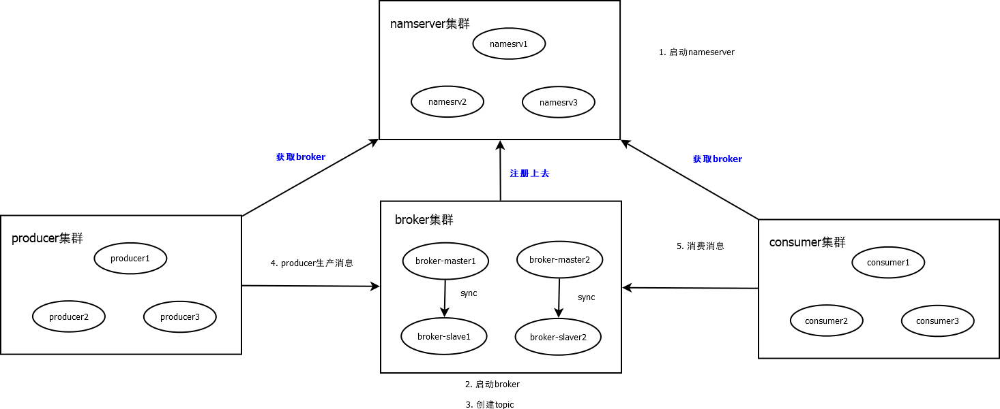

## 要点

1. 优点
    1. 解耦：不需要直接调用，降低耦合度
    2. 流量削峰：在某个时段有流量峰值
    3. 数据分发：A生产消息，B、C、D可按需订阅

2. 缺点
    1. 可用性降低
    2. 复杂度增高
    3. 一致性问题

3. 产品比较
    1. activeMQ，成熟
    2. RabbitMQ，erlang语言，时效性最高
    3. rocketMQ，java语言，分布式
    4. kafka，scala语言，分布式大数据

4. 入门

    1. 目录结构
        * benchmark:demo
        * bin:脚本
        * conf:配置
        * lib:依赖库

    2. 启动并测试

        1. 启动nameserver

            ```bash
            nohup sh bin/mqnamsrv.sh &
            ```

        2. 启动broker

            ```bash
            nohup sh bin/mqbroker.sh -n localhost:9876 &
            ```

            注意：如果broker启动失败，可能是内存配置过高，修改两个文件：runbroker.sh,runserver.sh

        3. 设置环境变量

            vi /ect/profile，谁家

            ```xml
            export NAMESRV_ADDRESS=localhost:9876
            ```

        4. 生产者发送

            ```bash
            bin/tools.sh org.apache.rocketmq.sample.quickstartProducer
            ```

        5. 停止

            ```bash
            bin/mqshutdown namesrv
            bin/mqshutdown broker
            ```

5. 集群搭建

    1. 集群模式

        * 单master
        * 多master
        * 多master，多slave同步：producer发送数据到master后，master同步到slave，再返回消息，高一致性
        * 多master，多slave异步：producer发送数据到master后，先返回消息，后master同步到slave，实时性强

    2. broker集群

        相同broker name即为同一个群，其中broker id=0为master

    3. 集群工作流程图

        

    4. 服务器信息整理：nameserver和broker部署在哪台服务器，端口多少
    5. 编辑host：ip+端口映射nameserver名称
    6. 关闭防火墙，生产环境建议放开特定端口
    7. 设置环境变量
    8. 存储路径修改
    9. broker配置相关项目
        * brokerName
        * namesrvAddr
        * listen port
        * brokerRole
        * flushDiskType

    10. 启动

        1. nameserver: bin/mqnamesrv.sh &
        2. broker: bin/mqbroker.sh -c a.properties &

        可以用jps查看进程状态

6. mqadmin管理工具

    进入到bin目录，可以看到脚本mqadmin，执行命令格式：mqadmin {command} {args}，一共分为几类
    1. topic：updateTopic
    2. 集群
    3. broker
    4. 消费者相关
    5. 消费、生产者
    6. 连接相关
    7. nameserver相关

7. 集群监控平台

    1. rocketmq-console下载安装

        ```bash
        ##下载
        git clone http://github.com/apache/rocketmq-externals.git
        cd rocketmq-externals/rocket-console
        vi src/resources/application.properties
        ## 修改nameserverAddr配置
        ## 修改完成后，打包
        mvn clean package -Dmaven.test.skip=true
        cd target
        ## 启动
        java -jar rocketmq-console.jar
        ```

    2. 启动rocketmq-console后，访问：http://localhost:8080，可以看到管理界面