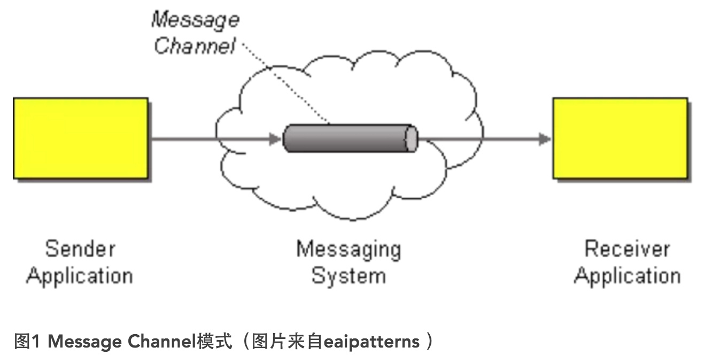

## 分布式服务框架之远程通讯技术及原理分析

在分布式服务框架中，一个最基础的问题就是远程服务是怎么通讯的，在Java领域中有很多可实现远程通讯的技术，例如：RMI、MINA、ESB、Burlap、Hessian、SOAP、EJB和JMS等，这些名词之间到底是些什么关系呢，它们背后到底是基于什么原理实现的呢，了解这些是实现分布式服务框架的基础知识，而如果在性能上有高的要求的话，那深入了解这些技术背后的机制就是必须的了。

1. 基本原理

    要实现网络机器间的通讯，首先得来看看计算机系统网络通信的基本原理，在底层层面去看，网络通信需要做的就是将流从一台计算机传输到另外一台计算机，基于传输协议和网络IO来实现，其中传输协议比较出名的有tcp、udp等等，tcp、udp都是在基于Socket概念上为某类应用场景而扩展出的传输协议，网络IO，主要有bio、nio、aio三种方式，所有的分布式应用通讯都基于这个原理而实现，只是为了应用的易用，各种语言通常都会提供一些更为贴近应用易用的应用层协议。

2. 消息模式

    归根结底，企业应用系统就是对数据的处理，而对于一个拥有多个子系统的企业应用系统而言，它的基础支撑无疑就是对消息的处理。**与对象不同，消息本质上是一种数据结构（当然，对象也可以看做是一种特殊的消息），它包含消费者与服务双方都能识别的数据，这些数据需要在不同的进程（机器）之间进行传递，并可能会被多个完全不同的客户端消费**。消息传递相较文件传递与远程过程调用（RPC）而言，似乎更胜一筹，因为它具有更好的平台无关性，并能够很好地支持并发与异步调用。

    **对于Web Service与RESTful而言，则可以看做是消息传递技术的一种衍生或封装。**

    1. **消息通道（Message Channel）模式**

        我们常常运用的消息模式是Message Channel（消息通道）模式，如图所示。

        

        消息通道作为在客户端（消费者，Consumer）与服务（生产者，Producer）之间引入的间接层，可以有效地解除二者之间的耦合。只要实现规定双方需要通信的消息格式，以及处理消息的机制与时机，就可以做到消费者对生产者的“无知”。**事实上，该模式可以支持多个生产者与消费者**。例如，我们可以让多个生产者向消息通道发送消息，因为消费者对生产者的无知性，它不必考虑究竟是哪个生产者发来的消息。

        虽然消息通道解除了生产者与消费者之间的耦合，使得我们可以任意地对生产者与消费者进行扩展，但它又同时引入了各自对消息通道的依赖，因为它们必须知道通道资源的位置。要解除这种对通道的依赖，可以考虑引入Lookup服务来查找该通道资源。例如，在JMS中就可以通过JNDI来获取消息通道Queue。若要做到充分的灵活性，可以将与通道相关的信息存储到配置文件中，Lookup服务首先通过读取配置文件来获得通道。

        消息通道通常以队列的形式存在，这种先进先出的数据结构无疑最为适合这种处理消息的场景。微软的MSMQ、IBM MQ、JBoss MQ以及开源的RabbitMQ、Apache ActiveMQ都通过队列实现了Message Channel模式。因此，在选择运用Message Channel模式时，更多地是要从质量属性的层面对各种实现了该模式的产品进行全方位的分析与权衡。例如，消息通道对并发的支持以及在性能上的表现；消息通道是否充分地考虑了错误处理；对消息安全的支持；以及关于消息持久化、灾备（fail over）与集群等方面的支持。

        因为通道传递的消息往往是一些重要的业务数据，一旦通道成为故障点或安全性的突破点，对系统就会造成灾难性的影响。

        此处也顺带的提下jndi的机制，由于JNDI取决于具体的实现，在这里只能是讲解下jboss的jndi的实现了：

        ```
        在将对象实例绑定到jboss jnp server后，当远程端采用context.lookup()方式获取远程对象实例并开始调用时，jboss jndi的实现方法是从jnp server上获取对象实例，将其序列化回本地，然后在本地进行反序列化，之后在本地进行类调用。

        通过这个机制，就可以知道了，本地其实是必须有绑定到jboss上的对象实例的class的，否则反序列化的时候肯定就失败了，而远程通讯需要做到的是在远程执行某动作，并获取到相应的结果，可见纯粹基于JNDI是无法实现远程通讯的。

        但JNDI也是实现分布式服务框架一个很关键的技术点，因为可以通过它来实现透明化的远端和本地调用，就像ejb，另外它也是个很好的隐藏实际部署机制(就像datasource)等的方案。
        ```

    2. **发布者-订阅者（Publisher-Subscriber）模式**

        一旦消息通道需要支持多个消费者时，就可能面临两种模型的选择：**拉模型与推模型**。

        **拉模型**是由消息的消费者发起的，主动权把握在消费者手中，它会根据自己的情况对生产者发起调用。如图所示：

        

        拉模型的另一种体现则由生产者在状态发生变更时，通知消费者其状态发生了改变。但得到通知的消费者却会以回调方式，通过调用传递过来的消费者对象获取更多细节消息。

        在基于消息的分布式系统中，拉模型的消费者通常以Batch Job的形式，根据事先设定的时间间隔，定期侦听通道的情况。一旦发现有消息传递进来，就会转而将消息传递给真正的处理器（也可以看做是消费者）处理消息，执行相关的业务。

        **推模型**的主动权常常掌握在生产者手中，消费者被动地等待生产者发出的通知，这就要求生产者必须了解消费者的相关信息。如图所示：

        


        对于推模型而言，消费者无需了解生产者。在生产者通知消费者时，传递的往往是消息（或事件），而非生产者自身。同时，生产者还可以根据不同的情况，注册不同的消费者，又或者在封装的通知逻辑中，根据不同的状态变化，通知不同的消费者。

        两种模型各有优势。拉模型的好处在于可以进一步解除消费者对通道的依赖，通过后台任务去定期访问消息通道。坏处是需要引入一个单独的服务进程，以Schedule形式执行。而对于推模型而言，消息通道事实上会作为消费者观察的主体，一旦发现消息进入，就会通知消费者执行对消息的处理。无论推模型，拉模型，对于消息对象而言，都可能采用类似Observer模式的机制，实现消费者对生产者的订阅，因此这种机制通常又被称为Publisher-Subscriber模式，如图所示：

        

        通常情况下，发布者和订阅者都会被注册到用于传播变更的基础设施（即消息通道）上。发布者会主动地了解消息通道，使其能够将消息发送到通道中；消息通道一旦接收到消息，会主动地调用注册在通道中的订阅者，进而完成对消息内容的消费。

        对于订阅者而言，有两种处理消息的方式。**一种方式是广播机制，这时消息通道中的消息在出列的同时，还需要复制消息对象，将消息传递给多个订阅者**。例如，有多个子系统都需要获取从CRM系统传来的客户信息，并根据传递过来的客户信息，进行相应的处理。此时的消息通道又被称为**Propagation通道**。**另一种方式则属于抢占机制，它遵循同步方式，在同一时间只能有一个订阅者能够处理该消息**。实现Publisher-Subscriber模式的消息通道会选择当前空闲的唯一订阅者，并将消息出列，并传递给订阅者的消息处理方法。

        目前，有许多消息中间件都能够很好地支持Publisher-Subscriber模式，例如JMS接口规约中对于Topic对象提供的MessagePublisher与MessageSubscriber接口。**RabbitMQ也提供了自己对该模式的实现**。微软的MSMQ虽然引入了事件机制，可以在队列收到消息时触发事件，通知订阅者。但它并非严格意义上的Publisher-Subscriber模式实现。由微软MVP Udi Dahan作为主要贡献者的NServiceBus，则对MSMQ以及WCF做了进一层包装，并能够很好地实现这一模式。

    3. **消息路由（Message Router）模式**

        无论是Message Channel模式，还是Publisher-Subscriber模式，队列在其中都扮演了举足轻重的角色。然而，在企业应用系统中，当系统变得越来越复杂时，对性能的要求也会越来越高，此时对于系统而言，可能就需要支持同时部署多个队列，并可能要求分布式部署不同的队列。这些队列可以根据定义接收不同的消息，例如订单处理的消息，日志信息，查询任务消息等。这时，对于消息的生产者和消费者而言，并不适宜承担决定消息传递路径的职责。事实上，根据S单一职责原则，这种职责分配也是不合理的，它既不利于业务逻辑的重用，也会造成生产者、消费者与消息队列之间的耦合，从而影响系统的扩展。

        **既然这三种对象（组件）都不宜承担这样的职责，就有必要引入一个新的对象专门负责传递路径选择的功能，这就是所谓的Message Router模式**，如图所示：

        

        通过消息路由，我们可以配置路由规则指定消息传递的路径，以及指定具体的消费者消费对应的生产者。例如指定路由的关键字，并由它来绑定具体的队列与指定的生产者（或消费者）。路由的支持提供了消息传递与处理的灵活性，也有利于提高整个系统的消息处理能力。同时，路由对象有效地封装了寻找与匹配消息路径的逻辑，就好似一个调停者（Meditator），负责协调消息、队列与路径寻址之间关系。

3. 应用级协议

    远程服务通讯，需要达到的目标是**在一台计算机发起请求，另外一台机器在接收到请求后进行相应的处理并将结果返回给请求端**，这其中又会有诸如one way request、同步请求、异步请求等等请求方式，**按照网络通信原理，需要实现这个需要做的就是将请求转换成流，通过传输协议传输至远端，远端计算机在接收到请求的流后进行处理，处理完毕后将结果转化为流，并通过传输协议返回给调用端**。

    原理是这样的，但为了应用的方便，业界推出了很多基于此原理之上的应用级的协议，使得大家可以不用去直接操作这么底层的东西，通常应用级的远程通信协议会提供：

    1. 为了避免直接做流操作这么麻烦，提供一种更加易用或贴合语言的标准传输格式；
    2. 网络通信机制的实现，就是替你完成了将传输格式转化为流，通过某种传输协议传输至远端计算机，远端计算机在接收到流后转化为传输格式，并进行存储或以某种方式通知远端计算机。

    所以在学习应用级的远程通信协议时，我们可以带着这几个问题进行学习：

    1. 传输的标准格式是什么？
    2. 怎么样将请求转化为传输的流？
    3. 怎么接收和处理流？
    4. 传输协议是？

    不过应用级的远程通信协议并不会在传输协议上做什么多大的改进，主要是在流操作方面，让应用层生成流和处理流的这个过程更加的贴合所使用的语言或标准，至于传输协议则通常都是可选的，在java领域中知名的有：**RMI、XML-RPC、Binary-RPC、SOAP、CORBA、JMS、HTTP**，来具体的看看这些远程通信的应用级协议。

    1. **RMI（远程方法调用）**

        RMI是个典型的为java定制的远程通信协议，我们都知道，在single vm中，我们可以通过直接调用java object instance来实现通信，那么在远程通信时，如果也能按照这种方式当然是最好了，这种远程通信的机制成为RPC（Remote Procedure Call），RMI正是朝着这个目标而诞生的。

        **RMI 采用stubs 和 skeletons 来进行远程对象(remote object)的通讯。stub 充当远程对象的客户端代理，有着和远程对象相同的远程接口，远程对象的调用实际是通过调用该对象的客户端代理对象stub来完成的，通过该机制RMI就好比它是本地工作，采用tcp/ip协议，客户端直接调用服务端上的一些方法。**

        * 优点是强类型，编译期可检查错误
        * 缺点是只能基于JAVA语言，客户机与服务器紧耦合。

        来看下基于RMI的一次完整的远程通信过程的原理：

        1. 客户端发起请求，请求转交至RMI客户端的stub类；
        2. stub类将请求的接口、方法、参数等信息进行序列化；
        3. 基于socket将序列化后的流传输至服务器端；
        4. 服务器端接收到流后转发至相应的skelton类；
        5. skelton类将请求的信息反序列化后调用实际的处理类；
        6. 理类处理完毕后将结果返回给skelton类；
        7. Skelton类将结果序列化，通过socket将流传送给客户端的stub；
        8. stub在接收到流后反序列化，将反序列化后的Java Object返回给调用者。

        根据原理来回答下之前学习应用级协议带着的几个问题：

        1. **传输的标准格式是什么？** 是Java ObjectStream。
        2. **怎么样将请求转化为传输的流？** 基于Java串行化机制将请求的java object信息转化为流。
        3. **怎么接收和处理流？** 根据采用的协议启动相应的监听端口，当有流进入后基于Java串行化机制将流进行反序列化，并根据RMI协议获取到相应的处理对象信息，进行调用并处理，处理完毕后的结果同样基于java串行化机制进行返回。
        4. **传输协议是？** Socket。

    2. **XML-RPC**

        **RPC使用C/S方式，采用http协议，发送请求到服务器，等待服务器返回结果。这个请求包括一个参数集和一个文本集，通常形成“classname.methodname”形式。**

        * 优点是跨语言跨平台，C端、S端有更大的独立性
        * 缺点是不支持对象，无法在编译器检查错误，只能在运行期检查。

        XML-RPC也是一种和RMI类似的远程调用的协议，它和RMI的不同之处在于它以标准的xml格式来定义请求的信息(请求的对象、方法、参数等)，这样的好处是什么呢，就是在跨语言通讯的时候也可以使用。

        来看下XML-RPC协议的一次远程通信过程：

        1. 客户端发起请求，按照XML-RPC协议将请求信息进行填充；
        2. 填充完毕后将xml转化为流，通过传输协议进行传输；
        3. 接收到在接收到流后转换为xml，按照XML-RPC协议获取请求的信息并进行处理；
        4. 处理完毕后将结果按照XML-RPC协议写入xml中并返回。

        同样来回答问题：

        1. **传输的标准格式是？** 标准格式的XML。
        2. **怎么样将请求转化为传输的流？** 将XML转化为流。
        3. **怎么接收和处理流？** 通过监听的端口获取到请求的流，转化为XML，并根据协议获取请求的信息，进行处理并将结果写入XML中返回。
        4. **传输协议是？** Http。

    3. **Binary-RPC**

        Binary-RPC看名字就知道和XML-RPC是差不多的了，不同之处仅在于传输的标准格式由XML转为了二进制的格式。

        同样来回答问题：

        1. **传输的标准格式是？** 标准格式的二进制文件。
        2. **怎么样将请求转化为传输的流？** 将二进制格式文件转化为流。
        3. **怎么接收和处理流？** 通过监听的端口获取到请求的流，转化为二进制文件，根据协议获取请求的信息，进行处理并将结果写入XML中返回。
        4. **传输协议是？** Http。

    4. **SOAP**

        SOAP原意为Simple Object Access Protocol，是一个用于分布式环境的、轻量级的、基于XML进行信息交换的通信协议，**可以认为SOAP是XML RPC的高级版**，两者的原理完全相同，都是http+XML，不同的仅在于两者定义的XML规范不同，SOAP也是Webservice采用的服务调用协议标准，因此在此就不多加阐述了。

        Web Service提供的服务是基于web容器的，底层使用http协议，类似一个远程的服务提供者，比如天气预报服务，对各地客户端提供天气预报，是一种请求应答的机制，是跨系统跨平台的。就是通过一个servlet，提供服务出去。

        **首先客户端从服务器获得WebService的WSDL，同时在客户端生成一个代理类(Proxy Class)，这个代理类负责与WebService服务器进行Request和Response。当一个数据（XML格式的）被封装成SOAP格式的数据流发送到服务器端的时候，就会生成一个进程对象并且把接收到这个Request的SOAP包进行解析，然后对事物进行处理，处理结束以后再对这个计算结果进行SOAP包装，然后把这个包作为一个Response发送给客户端的代理类(Proxy Class)，同样地，这个代理类也对这个SOAP包进行解析处理，继而进行后续操作。这就是WebService的一个运行过程。**

        Web Service大体上分为5个层次:

        1. Http传输信道；
        2. XML的数据格式；
        3. SOAP封装格式；
        4. WSDL的描述方式；
        5. UDDI UDDI是一种目录服务，企业可以使用它对Webservices进行注册和搜索；

    5. JMS

        JMS是实现java领域远程通信的一种手段和方法，基于JMS实现远程通信时和RPC是不同的，虽然可以做到RPC的效果，但因为不是从协议级别定义的，**因此我们不认为JMS是个RPC协议**，但它确实是个远程通信协议，在其他的语言体系中也存在着类似JMS的东西，可以统一的将这类机制称为消息机制，而消息机制呢，通常是高并发、分布式领域推荐的一种通信机制，这里的主要一个问题是容错。

        JMS是Java的消息服务，JMS的客户端之间可以通过JMS服务进行异步的消息传输。JMS支持两种消息模型：**Point-to-Point（P2P）和Publish/Subscribe（Pub/Sub），即点对点和发布订阅模型**。

        来看JMS中的一次远程通信的过程：

        1. 客户端将请求转化为符合JMS规定的Message；
        2. 通过JMS API将Message放入JMS Queue或Topic中；
        3. 如为JMS Queue，则发送到相应的目标Queue中；如为Topic，则发送给订阅了此Topic的JMS Queue。
        4. 处理端则通过轮询JMS Queue，来获取消息，接收到消息后根据JMS协议来解析Message并处理。

        同样来回答问题：

        1. **传输的标准格式是？** JMS规定的Message。
        2. **怎么样将请求转化为传输的流？** 将参数信息放入Message中即可。
        3. **怎么接收和处理流？** 轮训JMS Queue来接收Message，接收到后进行处理，处理完毕后仍然是以Message的方式放入Queue中发送或Multicast。
        4. **传输协议是？** 不限。

        **基于JMS也是常用的实现远程异步调用的方法之一。**

4. 之间的区别

    1. **RPC与RMI**

        1. RPC跨语言，而RMI只支持Java。

        2. RMI调用远程对象方法，允许方法返回Java对象以及基本数据类型，而RPC不支持对象的概念，传送到RPC服务的消息由外部数据表示 (External Data Representation, XDR) 语言表示，这种语言抽象了字节序类和数据类型结构之间的差异。只有由 XDR 定义的数据类型才能被传递，可以说 RMI 是面向对象方式的Java RPC。

        3. 在方法调用上，RMI中，远程接口使每个远程方法都具有方法签名。如果一个方法在服务器上执行，但是没有相匹配的签名被添加到这个远程接口上，那么这个新方法就不能被RMI客户方所调用。在RPC中，当一个请求到达RPC服务器时，这个请求就包含了一个参数集和一个文本值，通常形成“classname.methodname”的形式。这就向RPC服务器表明，被请求的方法在为 “classname”的类中，名叫“methodname”。然后RPC服务器就去搜索与之相匹配的类和方法，并把它作为那种方法参数类型的输入。这里的参数类型是与RPC请求中的类型是匹配的。一旦匹配成功，这个方法就被调用了，其结果被编码后返回客户方。

        4. RPC本身没有规范,但基本的工作机制是一样的，即：serialization/deserialization+stub+skeleton，宽泛的讲，只要能实现远程调用，都是RPC，如:rmi .net-remoting ws/soap/rest hessian xmlrpc thrift potocolbuffer。

        5. 在Java里提供了完整的sockets通讯接口，但sockets要求客户端和服务端必须进行应用级协议的编码交换数据，采用sockets是非常麻烦的。一个代替Sockets的协议是RPC(Remote Procedure Call), 它抽象出了通讯接口用于过程调用，使得编程者调用一个远程过程和调用本地过程同样方便。RPC 系统采用XDR来编码远程调用的参数和返回值。但RPC并不支持对象，所以，面向对象的远程调用RMI(Remote Method Invocation)成为必然选择。采用RMI，调用远程对象和调用本地对象同样方便。RMI 采用JRMP(Java Remote Method Protocol)通讯协议，是构建在TCP/IP协议上的一种远程调用方法。

    2. **JMS与RMI**

        1. 采用JMS服务，对象是在物理上被异步从网络的某个JVM 上直接移动到另一个JVM 上（是消息通知机制），而RMI对象是绑定在本地JVM 中，只有函数参数和返回值是通过网络传送的（是请求应答机制）。

        2. RMI一般都是同步的，也就是说，当client调用Server的一个方法的时候，需要等到对方的返回，才能继续执行client端，这个过程调用本地方法感觉上是一样的，这也是RMI的一个特点。JMS 一般只是一个点发出一个Message到Message Server,发出之后一般不会关心谁用了这个message。所以，一般RMI的应用是紧耦合，JMS的应用相对来说是松散耦合应用。

    3. **Webservice与RMI**

        RMI是在tcp协议上传递可序列化的java对象，只能用在java虚拟机上，绑定语言，客户端和服务端都必须是java。webservice没有这个限制，webservice是在http协议上传递xml文本文件，与语言和平台无关。

    4. **Webservice与JMS**

        Webservice专注于远程服务调用，jms专注于信息交换。

        大多数情况下Webservice是两系统间的直接交互（Consumer Producer），而大多数情况下jms是三方系统交互（Consumer Producer）。当然，JMS也可以实现request-response模式的通信，只要Consumer或Producer其中一方兼任broker即可。

        JMS可以做到异步调用完全隔离了客户端和服务提供者，能够抵御流量洪峰；WebService服务通常为同步调用，需要有复杂的对象转换，相比SOAP，现在JSON，rest都是很好的http架构方案；

        JMS是java平台上的消息规范。一般jms消息不是一个xml，而是一个java对象，很明显，jms没考虑异构系统，说白了，JMS就没考虑非java的东西。但是好在现在大多数的jms provider（就是JMS的各种实现产品）都解决了异构问题。相比WebService的跨平台各有千秋吧。

5. 可选实现技术

    目前java领域可用于实现远程通讯的框架或library，知名的有：**JBoss-Remoting、Spring-Remoting、Hessian、Burlap、XFire(Axis)、ActiveMQ、Mina、Mule、EJB3**等等，来对每种做个简单的介绍和评价，其实呢，要做分布式服务框架，这些东西都是要有非常深刻的了解的，因为分布式服务框架其实是包含了解决分布式领域以及应用层面领域两方面问题的。

    当然，你也可以自己根据远程网络通信原理(transport protocol+Net IO)去实现自己的通讯框架或library。

    那么在了解这些远程通讯的框架或library时，会带着什么问题去学习呢？

    1. 是基于什么协议实现的？
    2. 怎么发起请求？
    3. 怎么将请求转化为符合协议的格式的？
    4. 使用什么传输协议传输？
    5. 响应端基于什么机制来接收请求？
    6. 怎么将流还原为传输格式的？
    7. 处理完毕后怎么回应？

    列举以下实现远程通讯的框架或library：
    **Spring-Remoting、Hessian、Burlap、XFire(Axis)、ActiveMQ、Mina、Mule、EJB3**

    1. **Spring-Remoting**

        Spring-remoting是Spring提供java领域的远程通讯框架，基于此框架，同样也可以很简单的将普通的spring bean以某种远程协议的方式来发布，同样也可以配置spring bean为远程调用的bean。

        1. **是基于什么协议实现的？** 作为一个远程通讯的框架，Spring通过集成多种远程通讯的library，从而实现了对多种协议的支持，例如rmi、http+io、xml-rpc、binary-rpc等。

        2. **怎么发起请求？** 在Spring中，由于其对于远程调用的bean采用的是proxy实现，发起请求完全是通过服务接口调用的方式。

        3. **怎么将请求转化为符合协议的格式的？** Spring按照协议方式将请求的对象信息转化为流，例如Spring Http Invoker是基于Spring自己定义的一个协议来实现的，传输协议上采用的为http，请求信息是基于java串行化机制转化为流进行传输。

        4. **使用什么传输协议传输？** 支持多种传输协议，例如rmi、http等等。

        5. **响应端基于什么机制来接收请求？** 响应端遵循协议方式来接收请求，对于使用者而言，则只需通过spring的配置方式将普通的spring bean配置为响应端或者说提供服务端。

        6. **怎么将流还原为传输格式的？** 按照协议方式来进行还原。

        7. **处理完毕后怎么回应？** 处理完毕后直接返回即可，spring-remoting将根据协议方式来做相应的序列化。

    2. **Hessian**

        **Hessian是由caucho提供的一个基于binary-RPC实现的远程通讯library。**

        1. **是基于什么协议实现的？** 基于Binary-RPC协议实现。

        2. **怎么发起请求？** 需通过Hessian本身提供的API来发起请求。

        3. **怎么将请求转化为符合协议的格式的？** Hessian通过其自定义的串行化机制将请求信息进行序列化，产生二进制流。

        4. **使用什么传输协议传输？** Hessian基于Http协议进行传输。

        5. 响应端基于什么机制来接收请求？** 响应端根据Hessian提供的API来接收请求。

        6. **怎么将流还原为传输格式的？** Hessian根据其私有的串行化机制来将请求信息进行反序列化，传递给使用者时已是相应的请求信息对象了。

        7. **处理完毕后怎么回应？** 处理完毕后直接返回，hessian将结果对象进行序列化，传输至调用端。

    3. **Burlap**

        **Burlap也是有caucho提供，它和hessian的不同在于，它是基于XML-RPC协议的。**

        1. **是基于什么协议实现的？** 基于XML-RPC协议实现。

        2. **怎么发起请求？** 根据Burlap提供的API。

        3. **怎么将请求转化为符合协议的格式的？** 将请求信息转化为符合协议的XML格式，转化为流进行传输。

        4. **使用什么传输协议传输？** Http协议。

        5. **响应端基于什么机制来接收请求？** 监听Http请求。

        6. **怎么将流还原为传输格式的？** 根据XML-RPC协议进行还原。

        7. **处理完毕后怎么回应？** 返回结果写入XML中，由Burlap返回至调用端。

    4. **XFire、Axis**

        XFire、Axis是Webservice的实现框架，WebService可算是一个完整的SOA架构实现标准了，因此采用XFire、Axis这些也就意味着是采用webservice方式了。

        1. **是基于什么协议实现的？** 基于SOAP协议。

        2. **怎么发起请求？** 获取到远端service的proxy后直接调用。

        3. **怎么将请求转化为符合协议的格式的？** 将请求信息转化为遵循SOAP协议的XML格式，由框架转化为流进行传输。

        4. **使用什么传输协议传输？** Http协议。

        5. **响应端基于什么机制来接收请求？** 监听Http请求。

        6. **怎么将流还原为传输格式的？** 根据SOAP协议进行还原。

        7. **处理完毕后怎么回应？** 返回结果写入XML中，由框架返回至调用端。

    5. **ActiveMQ**

        **ActiveMQ是JMS的实现**，基于JMS这类消息机制实现远程通讯是一种不错的选择，毕竟消息机制本身的功能使得基于它可以很容易的去实现同步/异步/单向调用等，而且消息机制从容错角度上来说也是个不错的选择，这是Erlang能够做到容错的重要基础。

        1. **是基于什么协议实现的？** 返基于JMS协议。

        2. **怎么发起请求？** 返遵循JMS API发起请求。

        3. **怎么将请求转化为符合协议的格式的？** 返不太清楚，猜想应该是二进制流。

        4. **使用什么传输协议传输？** 返支持多种传输协议，例如socket、http等等。

        5. **响应端基于什么机制来接收请求？** 返监听符合协议的端口。

        6. **怎么将流还原为传输格式的？** 返同问题3。

        7. **处理完毕后怎么回应？** 返遵循JMS API生成消息，并写入JMS Queue中。

    6. **Mina**

        Mina是Apache提供的通讯框架，在之前一直没有提到网络IO这块，**之前提及的框架或library基本都是基于BIO的，而Mina是采用NIO的**，NIO在并发量增长时对比BIO而言会有明显的性能提升，而java性能的提升，与其NIO这块与OS的紧密结合是有不小的关系的。

        1. **是基于什么协议实现的？** 基于纯粹的Socket+NIO。

        2. **怎么发起请求？** 通过Mina提供的Client API。

        3. **怎么将请求转化为符合协议的格式的？** Mina遵循java串行化机制对请求对象进行序列化。

        4. **使用什么传输协议传输？** 支持多种传输协议，例如socket、http等等。

        5. **响应端基于什么机制来接收请求？** 以NIO的方式监听协议端口。

        6. **怎么将流还原为传输格式的？** 遵循java串行化机制对请求对象进行反序列化。

        7. **处理完毕后怎么回应？** 遵循Mina API进行返回。

        **MINA是NIO方式的，因此支持异步调用是毫无悬念的。**

6. RPC框架的发展与现状

    **RPC（Remote Procedure Call）是一种远程调用协议，简单地说就是能使应用像调用本地方法一样的调用远程的过程或服务，可以应用在分布式服务、分布式计算、远程服务调用等许多场景。** 说起 RPC 大家并不陌生，业界有很多开源的优秀 RPC 框架，例如**Dubbo、Thrift、gRPC、Hprose** 等等。下面先简单介绍一下 RPC 与常用远程调用方式的特点，以及一些优秀的开源 RPC 框架。

    **RPC 与其它远程调用方式比较，RPC 与 HTTP、RMI、Web Service 都能完成远程调用，但是实现方式和侧重点各有不同。**

    1. **RPC与HTTP**

        HTTP（HyperText Transfer Protocol）是应用层通信协议，使用标准语义访问指定资源（图片、接口等），网络中的中转服务器能识别协议内容。HTTP 协议是一种资源访问协议，通过 HTTP 协议可以完成远程请求并返回请求结果。

        HTTP 的优点是简单、易用、可理解性强且语言无关，在远程服务调用中包括微博有着广泛应用。HTTP 的缺点是协议头较重，一般请求到具体服务器的链路较长，可能会有 DNS 解析、Nginx 代理等。

        RPC 是一种协议规范，可以把 HTTP 看作是一种 RPC 的实现，也可以把 HTTP 作为 RPC 的传输协议来应用。RPC 服务的自动化程度比较高，能够实现强大的服务治理功能，和语言结合更友好，性能也十分优秀。与 HTTP 相比，RPC 的缺点就是相对复杂，学习成本稍高。

    2. **RPC与RMI**

        RMI（Remote Method Invocation）是指 Java 语言中的远程方法调用，RMI 中的每个方法都具有方法签名，RMI 客户端和服务器端通过方法签名进行远程方法调用。RMI 只能在 Java 语言中使用，可以把 RMI 看作面向对象的 Java RPC。

    3. RPC与Web Service

        Web Service 是一种基于 Web 进行服务发布、查询、调用的架构方式，重点在于服务的管理与使用。Web Service 一般通过 WSDL 描述服务，使用 SOAP通过 HTTP 调用服务。

        RPC 是一种远程访问协议，而 Web Service 是一种体系结构，Web Service 也可以通过 RPC 来进行服务调用，因此 Web Service 更适合同一个 RPC 框架进行比较。当 RPC 框架提供了服务的发现与管理，并使用 HTTP 作为传输协议时，其实就是 Web Service。

        相对 Web Service，RPC 框架可以对服务进行更细粒度的治理，包括流量控制、SLA 管理等，在微服务化、分布式计算方面有更大的优势。

        RPC 可基于 HTTP 或 TCP 协议，Web Service 就是基于 HTTP 协议的 RPC，它具有良好的跨平台性，但其性能却不如基于 TCP 协议的 RPC。会两方面会直接影响 RPC 的性能，一是传输方式，二是序列化。

        众所周知，TCP 是传输层协议，HTTP 是应用层协议，而传输层较应用层更加底层，在数据传输方面，越底层越快，因此，在一般情况下，TCP 一定比 HTTP 快。

7. 总结

    在远程通讯领域中，涉及的知识点还是相当的多的，例如有：
    * 通信协议(Socket/tcp/http/udp/rmi/xml-rpc etc.)
    * 消息机制
    * 网络IO（BIO/NIO/AIO）、
    * MultiThread
    * 本地调用与远程调用的透明化方案（涉及Java Classloader、Dynamic Proxy、Unit Test etc.）
    * 异步与同步调用
    * 网络通信处理机制（自动重连、广播、异常、池处理等等）
    * Java Serialization (各种协议的私有序列化机制等)
    * 各种框架的实现原理（传输格式、如何将传输格式转化为流的、如何将请求信息转化为传输格式的、如何接收流的、如何将流还原为传输格式的等等）

    要精通其中的哪些东西，得根据实际需求来决定了，只有在了解了原理的情况下才能很容易的做出选择，甚至可以根据需求做私有的远程通讯协议，对于从事分布式服务平台或开发较大型的分布式应用的人而言，我觉得至少上面提及的知识点是需要比较了解的。


原文：https://www.cnblogs.com/lfs2640666960/p/9495281.html