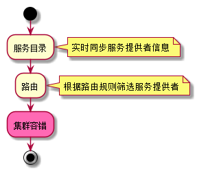
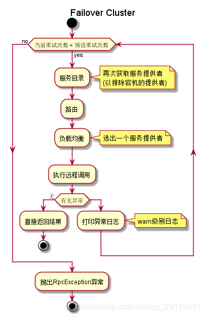
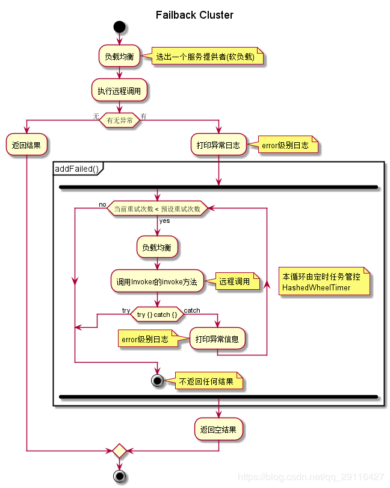
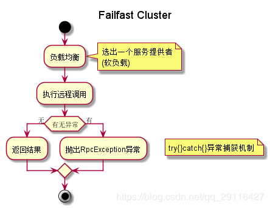
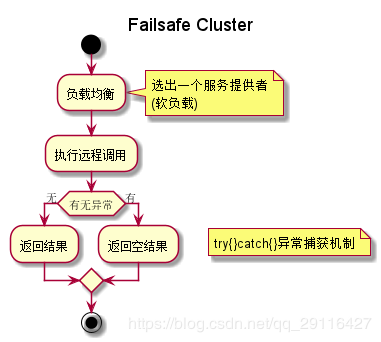
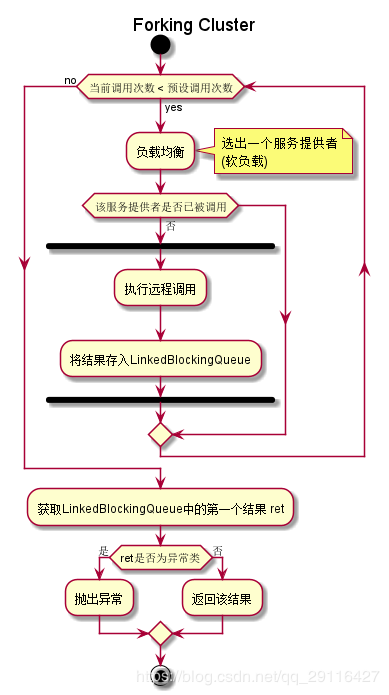
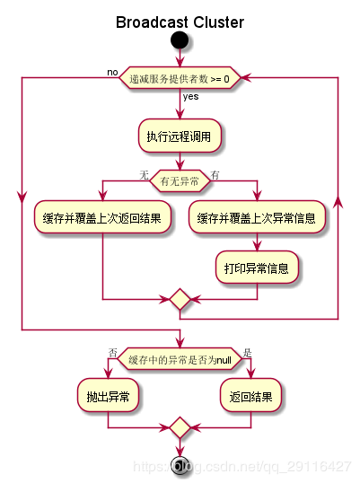

## 容错机制原理

为了避免单点故障，现在的应用通常至少会部署在两台服务器上。对于一些负载比较高的服务，会部署更多的服务器。这样，在同一环境下的服务提供者数量会大于1。对于服务消费者来说，同一环境下出现了多个服务提供者。

这时会出现一个问题，服务消费者需要决定选择哪个服务提供者进行调用。另外服务调用失败时的处理措施也是需要考虑的，是重试呢，还是抛出异常，亦或是只打印异常等。为了处理这些问题，Dubbo 定义了集群接口 Cluster 以及 Cluster Invoker。集群 Cluster 用途是将多个服务提供者合并为一个 Cluster Invoker，并将这个 Invoker 暴露给服务消费者。这样一来，服务消费者只需通过这个 Invoker 进行远程调用即可，至于具体调用哪个服务提供者，以及调用失败后如何处理等问题，现在都交给集群模块去处理。

集群模块是服务提供者和服务消费者的中间层，为服务消费者屏蔽了服务提供者的情况，这样服务消费者就可以专心处理远程调用相关事宜。比如发请求，接受服务提供者返回的数据等。这就是集群的作用。

### 一、选择集群容错方式

集群容错机制是交由 org.apache.dubbo.rpc.cluster.Cluster 接口的子类处理，为了清楚该接口有哪些扩展类，不妨打开该类的 Dubbo SPI 配置文件(扩展点的全限定名)一观：

```
mock=org.apache.dubbo.rpc.cluster.support.wrapper.MockClusterWrapper
failover=org.apache.dubbo.rpc.cluster.support.FailoverCluster
failfast=org.apache.dubbo.rpc.cluster.support.FailfastCluster
failsafe=org.apache.dubbo.rpc.cluster.support.FailsafeCluster
failback=org.apache.dubbo.rpc.cluster.support.FailbackCluster
forking=org.apache.dubbo.rpc.cluster.support.ForkingCluster
available=org.apache.dubbo.rpc.cluster.support.AvailableCluster
mergeable=org.apache.dubbo.rpc.cluster.support.MergeableCluster
broadcast=org.apache.dubbo.rpc.cluster.support.BroadcastCluster
registryaware=org.apache.dubbo.rpc.cluster.support.RegistryAwareCluster
```

理论上来说，Dubbo 的集群容错机制就有以上 10 种，且还可从 Cluster 接口上的 @SPI 可知，其默认的扩展类为 FailoverCluster。

```java
@SPI(FailoverCluster.NAME)
public interface Cluster {

    @Adaptive
    <T> Invoker<T> join(Directory<T> directory) throws RpcException;
}
```

那么在真正调用时，可通过设置 <dubbo:service> 标签中 cluster 属性，其值分别对应Cluster 扩展点配置文件中的 key，以匹配对应的容错机制。

### 二、前置动作

集群容错真正发生在消费端。当消费端发起调用时，会先从服务目录查询满足需求的服务提供者信息，在此基础上进行路由，路由后的结果才会真正进行容错处理。所以，就会有如下的活动图：



### 三、容错机制原理

1. Failover Cluster

    失败自动切换机制是由 FailoverClusterInvoker 类控制。在调用失败时，会自动切换服务提供者信息进行重试。通常用于读操作，但重试会带来更长延迟。默认配置下，Dubbo 会使用这种机制作为缺省集群容错机制。下图展示了 Failover Cluster 机制的工作原理。

    

    如上，首先是获取重试次数，然后根据重试次数进行循环调用，失败后进行重试。在循环内，首先是通过负载均衡组件选择一个 Invoker，然后再通过这个 Invoker 的 invoke 方法进行远程调用。如果失败了，记录下异常，并进行重试。

    在源码中是通过如下代码获取重试次数：

    ```java
    int len=getUrl().getMethodParameter(methodName, Constants.RETRIES_KEY,Constants.DEFAULT_RETRIES)+1;
    ```

    其中，常量 Constants.RETRIES_KEY 的值为 “retries”，Constants.DEFAULT_RETRIES 的值为 2。表示：从 url 中获取该方法中 retries 属性的值，值为空时取默认值 2。但是在最后还有一个 +1 的动作，表示获取的最终值为 重试次数 + 1，即执行远程调用的最大次数为重试次数 + 1次。

2. Failback Cluster

    失败自动恢复会在调用失败后，返回一个空结果给服务消费者。并通过定时任务对失败的调用进行重试，适合执行消息通知等操作。下面来看一下它的实现逻辑。

    

3. Failfast Cluster

    快速失败只会进行一次调用，失败后立即抛出异常。适用于幂等操作，比如新增记录。实现逻辑如下：

    

4. Failsafe Cluster

    失败安全是指，当调用过程中出现异常时，仅会打印异常，而不会抛出异常。适用于写入审计日志等操作。

    

5. Forking Cluster

    并行调用多个服务提供者会在运行时通过线程池创建多个线程，并发调用多个服务提供者。只要有一个服务提供者成功返回了结果，doInvoke 方法就会立即结束运行。ForkingClusterInvoker 的应用场景是在一些对实时性要求比较高读操作（注意是读操作，并行写操作可能不安全）下使用，但这将会耗费更多的资源。下面来看该类的实现原理。

    

6. Broadcast Cluster

    BroadcastClusterInvoker 会逐个调用每个服务提供者，如果其中一台报错，再循环调用结束后，BroadcastClusterInvoker 会抛出异常。该类通常用于通知所有提供者更新缓存或日志等本地资源信息。

    

7. TODO

    其他的容错机制原理待补充。

原文：https://blog.csdn.net/qq_29116427/article/details/89812535