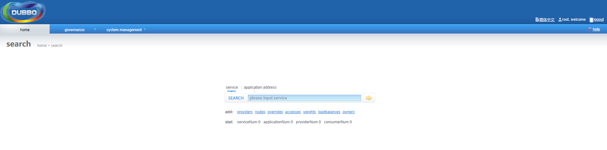
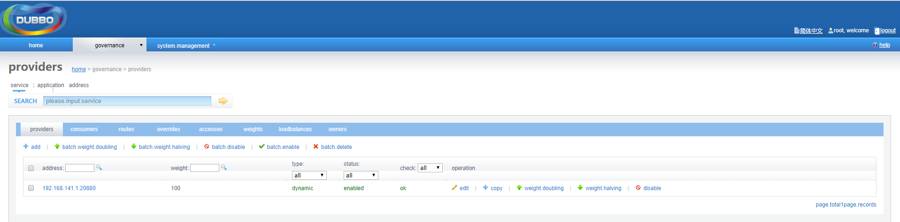
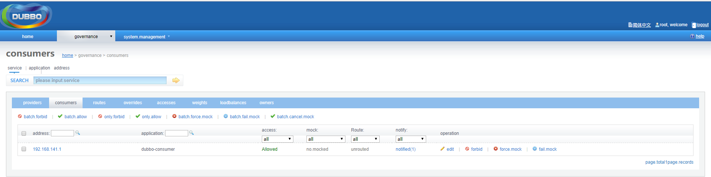

### Dubbo服务框架搭建

本文用两种方式去搭建dubbo架构：注册多播地址和注册zookeeper。

* 注册多播地址：通过多播地址可以注册和发现dubbo服务，但值得注意的是，**如果安装了vmware则需要禁用Vmware相关的网络适配器(VMnet1和VMnet8)**
* 注册zookeeper：先启动好zookeeper，发布dubbo-admin，后面方便通过控制台查看服务情况

整个架构工程用maven构建父子工程，共有五个maven子模块

* dubbo-api：dubbo的api接口，下面的四个模块都用到
* dubbo-consumer: 注册zookeeper时的消费者模块
* dubbo-provider: 注册zookeeper时的提供者模块
* dubbo-rpc-consumer: 注册多播地址时的消费者模块
* dubbo-rpt-provider: 注册多播地址时的提供者模块

假设主机地址是192.168.141.129。

0. 搭建maven父子工程

    新建一个名为dubbo的maven项目，，删除其他文件只保留pom.xml

    pom.xml

    ```xml
    <?xml version="1.0" encoding="UTF-8"?>
    <project xmlns="http://maven.apache.org/POM/4.0.0" xmlns:xsi="http://www.w3.org/2001/XMLSchema-instance"
            xsi:schemaLocation="http://maven.apache.org/POM/4.0.0 http://maven.apache.org/xsd/maven-4.0.0.xsd">
        <modelVersion>4.0.0</modelVersion>
        <groupId>com.sangbill</groupId>
        <artifactId>dubbo</artifactId>
        <version>0.0.1-SNAPSHOT</version>
        <packaging>pom</packaging>

        <!-- modules提前显示出来，实际上在下面添加dubbo-api时，才会新增dubbo-api这个module，依此会自动添加其他模块-->
        <modules>
            <module>dubbo-api</module>
            <module>dubbo-provider</module>
            <module>dubbo-consumer</module>
            <module>dubbo-rpc-provider</module>
            <module>dubbo-rpc-consumer</module>
        </modules>

        <parent>
            <groupId>org.springframework.boot</groupId>
            <artifactId>spring-boot-starter-parent</artifactId>
            <version>1.5.1.RELEASE</version>
        </parent>
        <properties>
            <dubbo-spring-boot>1.0.0</dubbo-spring-boot>
        </properties>
    </project>
    ```

1. dubbo-api

    在父工程上添加名为dubbo-api的maven子模块

    * java目录

        DubboService：定义接口类
        
        ```java
        package com.sangbill.dubbo;

        /**
        * 定义dubbo接口
        * @author LQB
        *
        */
        public interface DubboService {
            public String sayHello(String name);
        }
        ```
2. dubbo-rpc-provider

    在父工程上添加名为dubbo-rpc-provider的maven子模块

    * java目录

        Application：定义启动类

        ```java
        package com.sangbill.dubbo;

        import org.springframework.context.support.ClassPathXmlApplicationContext;

        public class Application {

            public static void main(String[] args) throws Exception {
                System.setProperty("java.net.preferIPv4Stack", "true");
                ClassPathXmlApplicationContext context = new ClassPathXmlApplicationContext(new String[]{"dubbo-provider.xml"});
                context.start();
                System.out.println("Application started.");
                System.in.read(); // press any key to exit
            }
        }
        ```

        DubboServiceImpl：实现了接口DubboService

        ```java
        package com.sangbill.dubbo.service;

        import com.sangbill.dubbo.DubboService;

        public class DubboServiceImpl implements DubboService {
            public String sayHello(String name) {
                return "Hello " + name;
            }
        }
        ```


    * resources目录

        dubbo-provider.xml

        ```xml
        <beans xmlns:xsi="http://www.w3.org/2001/XMLSchema-instance"
            xmlns:dubbo="http://dubbo.apache.org/schema/dubbo"
            xmlns="http://www.springframework.org/schema/beans"
            xsi:schemaLocation="http://www.springframework.org/schema/beans http://www.springframework.org/schema/beans/spring-beans-4.3.xsd
            http://dubbo.apache.org/schema/dubbo http://dubbo.apache.org/schema/dubbo/dubbo.xsd">

            <!-- provider's application name, used for tracing dependency relationship -->
            <dubbo:application name="demo-rpc-provider"/>
            <!-- use multicast registry center to export service -->
            <dubbo:registry address="multicast://224.5.6.7:1234"/>
            <!-- use dubbo protocol to export service on port 20880 -->
            <dubbo:protocol name="dubbo" port="20880"/>
            <!-- service implementation, as same as regular local bean -->
            <bean id="dubboService" class="com.sangbill.dubbo.service.DubboServiceImpl"/>
            <!-- declare the service interface to be exported -->
            <dubbo:service interface="com.sangbill.dubbo.DubboService" ref="dubboService"/>
        </beans>
        ```

        log4j.properties跟dubbo-rpc-consumer的log4j.properties一样

         
    * pom.xml

        添加依赖跟dubbo-rpc-consumer一样
3. dubbo-rpc-consumer

    在父工程上添加名为dubbo-rpc-consumer的maven子模块

    * java目录

        Application：定义启动类

        ```java
        import org.springframework.context.support.ClassPathXmlApplicationContext;

        public class Application {
            public static void main(String[] args) throws Exception {
                ClassPathXmlApplicationContext context = new ClassPathXmlApplicationContext(new String[]{"dubbo-consumer.xml"});
                context.start();
                // Obtaining a remote service proxy
                DubboService demoService = (DubboService) context.getBean("dubboService");
                // Executing remote methods
                String hello = demoService.sayHello("world");
                // Display the call result
                System.out.println(hello);
            }
        }
        ```
    * resources目录

        dubbo-consumer.xml

        ```xml
        <?xml version="1.0" encoding="UTF-8"?>
        <beans xmlns:xsi="http://www.w3.org/2001/XMLSchema-instance"
            xmlns:dubbo="http://dubbo.apache.org/schema/dubbo"
            xmlns="http://www.springframework.org/schema/beans"
            xsi:schemaLocation="http://www.springframework.org/schema/beans http://www.springframework.org/schema/beans/spring-beans-4.3.xsd
            http://dubbo.apache.org/schema/dubbo http://dubbo.apache.org/schema/dubbo/dubbo.xsd">

            <!-- consumer's application name, used for tracing dependency relationship (not a matching criterion),
            don't set it same as provider -->
            <dubbo:application name="demo-rpc-consumer"/>
            <!-- use multicast registry center to discover service -->
            <dubbo:registry address="multicast://224.5.6.7:1234"/>
            <!-- generate proxy for the remote service, then demoService can be used in the same way as the
            local regular interface -->
            <dubbo:reference id="dubboService" check="false" interface="com.sangbill.dubbo.DubboService"/>
        </beans>
        ```

        log4j.properties

        ```
        ###set log levels###
        log4j.rootLogger=info, stdout
        ###output to the console###
        log4j.appender.stdout=org.apache.log4j.ConsoleAppender
        log4j.appender.stdout.Target=System.out
        log4j.appender.stdout.layout=org.apache.log4j.PatternLayout
        log4j.appender.stdout.layout.ConversionPattern=[%d{dd/MM/yy hh:mm:ss:sss z}] %t %5p %c{2}: %m%n
        ```
    
    * pom.xml

        添加依赖

        ```xml
        <dependencies>
            <dependency>
                <groupId>com.sangbill</groupId>
                <artifactId>dubbo-api</artifactId>
                <version>${parent.version}</version>
            </dependency>
            <dependency>
                <groupId>org.springframework</groupId>
                <artifactId>spring-context</artifactId>
            </dependency>
            <dependency>
                <groupId>com.alibaba</groupId>
                <artifactId>dubbo</artifactId>
                <version>2.6.5</version>
            </dependency>
            <dependency>
                <groupId>io.netty</groupId>
                <artifactId>netty-all</artifactId>
                <version>4.1.34.Final</version>
            </dependency>
            <dependency>
                <groupId>commons-logging</groupId>
                <artifactId>commons-logging</artifactId>
                <version>1.1.1</version>
            </dependency>
            <dependency>
                <groupId>org.slf4j</groupId>
                <artifactId>slf4j-log4j12</artifactId>
                <version>1.7.2</version>
            </dependency>
        </dependencies>
        ```

4. 多播方式注册dubbo验证

    依次启动dubbo-rpc-provider、dubbo-rpc-consumer，在dubbo-rpc-consumer的控制台可以看到输出：

    ```
    Hello world
    ```


5. dubbo-provider

    在父工程上添加名为dubbo-provider的maven子模块

    * java目录

        DubboServiceImpl：实现了接口DubboService

        ```java
        @Service
        public class DubboServiceImpl implements DubboService {

            public String sayHello(String name) {
                return name;
            }
        }
        ```

        Application：启用类
        ```java
        @SpringBootApplication
        public class Application {

            public static void main(String[] args) {
                SpringApplication.run(Application.class, args);
            }
        }
        ```

    * resources目录
     
        application.properties

        ```
        server.port=8080
        spring.dubbo.application.name=dubbo-provider
        spring.dubbo.registry.address=zookeeper://192.168.141.129:2181
        spring.dubbo.protocol.name=dubbo
        spring.dubbo.protocol.port=20880
        spring.dubbo.scan=com.sangbill.dubbo
        ```


    * pom.xml
    
        添加依赖

        ```xml
        <dependencies>
            <dependency>
                <groupId>com.sangbill</groupId>
                <artifactId>dubbo-api</artifactId>
                <version>${parent.version}</version>
            </dependency>
            
            <!-- Spring Boot Dubbo 依赖 -->
            <dependency>
                <groupId>io.dubbo.springboot</groupId>
                <artifactId>spring-boot-starter-dubbo</artifactId>
                <version>${dubbo-spring-boot}</version>
            </dependency>

            <!-- Spring Boot Web 依赖 -->
            <dependency>
                <groupId>org.springframework.boot</groupId>
                <artifactId>spring-boot-starter-web</artifactId>
            </dependency>

            <!-- Spring Boot Test 依赖 -->
            <dependency>
                <groupId>org.springframework.boot</groupId>
                <artifactId>spring-boot-starter-test</artifactId>
                <scope>test</scope>
            </dependency>

            <!-- Junit -->
            <dependency>
                <groupId>junit</groupId>
                <artifactId>junit</artifactId>
            </dependency>
        </dependencies>
        ```


6. dubbo-consumer

    * java目录

        DubboConsumerService：dubbo消费类

        ```java
        @Component
        public class DubboConsumerService {

            @Reference
            DubboService dubboService;

            public void printMsg() {
                System.out.println(dubboService.sayHello("abd"));
            }
        }
        ```

        Application：启用类
        
        ```java
        @SpringBootApplication
        public class Application {
            public static void main(String[] args) {
                ConfigurableApplicationContext run = SpringApplication.run(Application.class, args);
                DubboConsumerService consumerService = run.getBean(DubboConsumerService.class);
                consumerService.printMsg();
            }
        }
        ```
        
    * resources目录


        application.properties
        ```
        server.port=8081
        spring.dubbo.application.name=dubbo-consumer
        spring.dubbo.registry.address=zookeeper://192.168.141.129:2181
        spring.dubbo.scan=com.sangbill.dubbo
        ```
        
    * pom.xml
        
        添加依赖跟dubbo-provider一样


7. zookeeper方式注册dubbo验证

    1. 启动好zookeeper，可以查看端口2181已经启动

    2. 发布dubbo-admin，访问地址为http://192.168.141.129:8080访问，如图

        

        **添加对dubbo-admin查看分组的配置**

        假如dubbo-admin的项目发布在tomcat下的/webapps/ROOT

        1. dubbo.properties

            路径为/ROOT/WEB-INF/dubbo.properties，追加内容：

            ```
            dubbo.registry.group=dubbo
            ```

        2. dubbo-admin.xml

            路径为/ROOT/WEB-INF/classes/META-INF/spring/dubbo-admin.xml，修改节点 <dubbo:registry />如下：

            ```
            <!-- <dubbo:registry address="${dubbo.registry.address}" check="false" file="false"/> -->
            <dubbo:registry group="${dubbo.registry.group}" address="${dubbo.registry.address}" check="false" file="false" />
            ```

        3. 重新启动dubbo-admin

   4. 依次启动dubbo-provider、dubbo-consumer

        查看控制台的提供者，地址：http://192.168.141.129:8080/governance/providers，如图

        

        可以看到已经注册了，并开始提供服务。


        查看控制台消费者，地址：http://192.168.141.129:8080/governance/consumers，如图

        

        可以看到已经消费了一次。