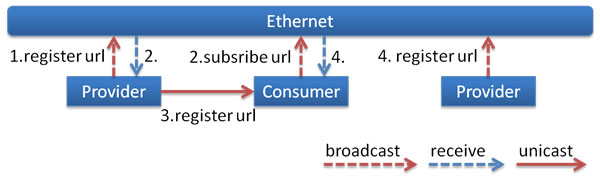

##　注册中心配置

dubbo注册服务的方式是多样的，虽然官方推荐使用zookeeper，但仍然有必要了解下其他的注册服务的方式。

1. 多播注册

    多播注册不要求安装任何的中心节点，就像IP地址广播，dubbo的服务提供方和消费者通过这个途径发现彼此。

    1. 注册流程

        


        0. 服务提供方在启动时广播他的地址
        1. 服务消费方在启动时广播它的订阅请求
        2. 一旦服务提供方接收到订阅请求，它将自己的地址单播给相应的消费者，如果设置了单播=false，则使用broadcast。
        3. 当服务消费方接收了提供方地址，就可以在接收的地址上开始远程调用

        组播受网络拓扑结构的限制，仅适用于开发或小型部署。有效的多播地址范围是:224.0.0.0 - 239.255.255.255。

    2. 配置

        ```xml
        <dubbo:registry address="multicast://224.5.6.7:1234" />
        ```

        或

        ```
        <dubbo:registry protocol="multicast" address="224.5.6.7:1234" />
        ```

2. zookeeper注册

    zookeeper是apache hadoop的子工程，由于提供了类似树的目录服务并支持变更通知，因此适用于dubbo注册服务。

    1. 注册流程
        
        

        注册流程描述

        * 服务提供者启动：在目录/dubbo/com.foo.BarService/providers下写入URL地址

        * 服务消费者启动：订阅/dubbo/com.foo.BarService/providers以获取提供者URL地址，同时在/dubbo/com.foo.BarService/consumers下写入消费者URL地址

        * 监控中心启动：订阅/dubbo/com.foo.BarService/以获取所有提供者和消费者的URL地址

        支持下面的能力

        * 当提供方意外停止了，注册服务能自动移除它的信息。
        * 当注册服务重启时，所有注册数据和订阅请求都能自动恢复。
        * 当回话超时，所有注册数据和订阅请求都能自动恢复。
        * 当\<dubbo:registry check="false" />被配置了，订阅和注册的失败请求会被记录下来，然后后台一直尝试。
        * 配置\<dubbo:registry username="admin" password="1234" />用于zookeeper登录。
        * 配置\<dubbo:registry group="dubbo" />当做在zookeeper上dubbo的根节点。如果没有声明则用默认的根节点
        * 支持在\<dubbo:reference group="*" version="*" />中使用通配符*，以便订阅要引用的服务的所有组和所有版本。

    2. 配置

        * 单点配置

            ```xml
            <dubbo:registry address="zookeeper://10.20.153.10:2181" />
            ```

            或

            ```xml
            <dubbo:registry protocol="zookeeper" address="10.20.153.10:2181" />
            ```

        * 集群配置

            ```xml
            <dubbo:registry address="zookeeper://10.20.153.10:2181?backup=10.20.153.11:2181,10.20.153.12:2181" />
            ```

            或

            ```xml
            <dubbo:registry protocol="zookeeper" address="10.20.153.10:2181,10.20.153.11:2181,10.20.153.12:2181" />
            ```


3. redis注册

    1. 注册流程

        下面是基于redis的注册服务实现

        

        0. 当服务提供者启动，在*Key:/dubbo/com.foo.BarService/providers*下添加自己的地址
        1. 服务提供者向*Channel:/dubbo/com.foo.BarService/providers*发送注册事件
        2. 当服务消费者启动时，它订阅事件注册并从*Channel:/dubbo/com.foo.BarService/provider*注销注册
        3. 服务消费者在*Key:/dubbo/com.foo.BarService/consumers*添加自己的地址
        4. 当服务消费者接收到事件注册和注销时，它将从*Key:/dubbo/com.foo.BarService/providers*获取提供者的地址
        5. 当监控中心启动时，会订阅注册，注销，订阅，取消订阅 的事件
        6. 在监控中心接收到注册和注销后，它从*Key:/dubbo/com.foo.BarService/providers*获取提供者的地址
        7. 在监控中心接收到订阅和取消订阅后，它从*Key:/dubbo/com.foo.BarService/consumers*获取提供者的地址

    2. 配置

        ```xml
        <dubbo:registry address="redis://10.20.153.10:6379" />
        ```

        或

        ```xml
        <dubbo:registry address="redis://10.20.153.10:6379?backup=10.20.153.11:6379,10.20.153.12:6379" />
        ````

        或

        ```xml
        <dubbo:registry protocol="redis" address="10.20.153.10:6379,10.20.153.11:6379,10.20.153.12:6379" />
        ```


4. simple注册

    简单注册服务器是一个常规的dubbo服务。这样，第三方依赖就没有必要了，同时通信也保持一致。


    1. 配置

        将简单注册服务器注册为dubbo服务

        ```xml
        <?xml version="1.0" encoding="UTF-8"?>
        <beans xmlns="http://www.springframework.org/schema/beans"
            xmlns:xsi="http://www.w3.org/2001/XMLSchema-instance"
            xmlns:dubbo="http://dubbo.apache.org/schema/dubbo"
            xsi:schemaLocation="http://www.springframework.org/schema/beans http://www.springframework.org/schema/beans/spring-beans-4.3.xsd http://dubbo.apache.org/schema/dubbo http://dubbo.apache.org/schema/dubbo/dubbo.xsd">
            <!-- application info configuration -->
            <dubbo:application name="simple-registry" />
            <!-- service protocol configuration -->
            <dubbo:protocol port="9090" />
            <!-- service configuration -->
            <dubbo:service interface="org.apache.dubbo.registry.RegistryService" ref="registryService" registry="N/A" ondisconnect="disconnect" callbacks="1000">
                <dubbo:method name="subscribe"><dubbo:argument index="1" callback="true" /></dubbo:method>
                <dubbo:method name="unsubscribe"><dubbo:argument index="1" callback="false" /></dubbo:method>
            </dubbo:service>
            <!-- simple registry server implementation, register other implementation if cluster ability is a requirement-->
            <bean id="registryService" class="org.apache.dubbo.registry.simple.SimpleRegistryService" />
        </beans>
        ```

        参考简单注册服务器服务:

        ```xml
        <dubbo:registry address="127.0.0.1:9090" />
        ```

        或

        ```xml
        <dubbo:service interface="org.apache.dubbo.registry.RegistryService" group="simple" version="1.0.0" ... >
        ```

        或

        ```xml
        <dubbo:registry address="127.0.0.1:9090" group="simple" version="1.0.0" />
        ```

原文：http://dubbo.apache.org/en-us/docs/user/references/registry/multicast.html
http://dubbo.apache.org/en-us/docs/user/references/registry/zookeeper.html
http://dubbo.apache.org/en-us/docs/user/references/registry/redis.html
http://dubbo.apache.org/en-us/docs/user/references/registry/simple.html