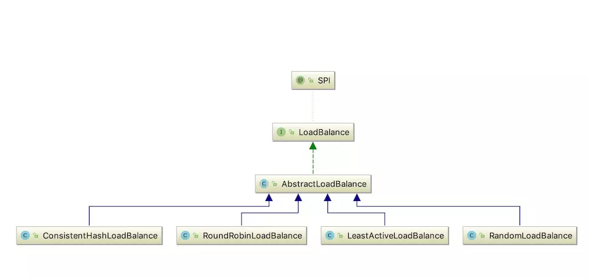

## 负载均衡机制
在分布式系统中有多台的服务器作为提供者负责处理各种网络请求，当同时有多个请求同时过来时，需要将其均摊在各台服务器上，避免了某台服务器压力过大而某台服务器则闲置的问题。
Dubbo提供了四种实现负载均衡的机制：

1. 基于权重随机算法的 RandomLoadBalance

    这种方式的思想是为每一台服务器设置一个权值，当有请求到来时就按照大体的权重比例为该请求分配服务器。

    * RandomLoadBalance的实现逻辑分为权重相同和权重不同的情况。
    * 权重相同的情况下通过random.nextInt(provider的个数)随机选取一个。
    * 权重不同的情况下通过累加权重得到totalWeight，然后random.nextInt(totalWeight)获取随机数offset，基于offset开始遍历所有provider的权重找到第一个让offset的值为0的provider。
    * 这种策略大概率能够让权重大的provider获取更多机会同时兼顾了权重小的接口。

    算法解析：
    假定有w1,w2,w3,...wn，权重和为sw
    如果w1,w2,w3,...wn全都相等，则随机取一个服务器。
    否则，从sw随机得到一个数A，然后A不断的减去w1,w2,..，直到A小于0，那么取此刻的服务器。

2. 基于最少活跃调用数算法的 LeastActiveLoadBalance

    这种思想会让每一个服务提供者对应一个Active活跃数，刚开始时每台服务器的Active数均为0，每收到一个请求时，Active就加一，当下一次再有请求过来，就会将该请求分配给Active数较小的服务提供者。而在实现上还会为每台服务器设置一个权重，当两台服务提供者的Active相同时且是最小时，就按照权重的大小为请求分配服务器。当然如果服务器的处理效率越高，Active数就会越少。

    * LeastActiveLoadBalance就是选择活跃数最少的provider，活跃数指代的就是调用次数-响应次数，活跃数越少说明响应越快。
    * LeastActiveLoadBalance的配置某种意义上来说选择性能最优的机器来提供更快的服务。
    * LeastActiveLoadBalance的选择leastActive的逻辑很简单，每次重启或者遇到更小的Active数的时候重新开始计数，然后基于重新计数的基础之上统计相同的leastActive进行选择。
    * 如果leastActive只有一个就直接返回，如果有多个那么按照权重方式进行返回，权重的方式就是计算总权重然后基于总权重生成随机数，通过遍历leastActive的provider找除第一个让随机数为0的provider。

    算法解析：
    假定有{a1,w1},{a2,w2},{a3,w3},...{an,wn}，权重和为sw
    从中找出**a相同且值最小**的数据,得到下标数组al和数组的总和sa
    如果数组只有一个元素，则直接返回
    如果有多个，则参考上面的随机算法，从数组中得到一个
        从sa随机得到一个数A，然后A不断的减去al[0],al[1],..，直到A小于0，那么取此刻的服务器。

3. 基于 hash 一致性的 ConsistentHashLoadBalance

    一致性hash算法核心的关键点有两个：**一致性hashMap的构建，一致性hashMap的select操作。**
    * 构建过程：一致性hash的虚拟节点采用了TreeMap对象，针对每个provider**根据url的address字段加虚拟节点个数/4的偏移量**生成128的digest字段，针对128位的digest字段（16个字节）按照每4个字节进行进行计算生成4个虚拟节点放到TreeMap当中。**假设有160个虚拟节点，160/4=40个待处理虚拟节点，针对40个待处理虚拟节点中的每个节点生成16个字节的digest，16个字节中digest分为4份进行保存，最终依然是160个虚拟节点。**
    * 查询过程：查询过程根据指定参数进行md5+hash()计算hash值，找到比hash值小的treeMap然后选择treeMap的根节点选择provider，如果找不到比hash小的treeMap就选择treeMap的最小根节点。

    直接上图解释吧

    

    当orderService发送一个带id参数的方法请求时，会根据这个id分配给对应的服务器；当id=1时会将请求分配给服务提供者1，当id=2时，会将请求分配给服务提供者2，以此类推…

4. 基于加权轮询算法的 RoundRobinLoadBalance

    这种算法的思想首先要说到轮询，比如说有三台服务器，第一个请求将会分配给1号服务器，第二个请求分给2号服务器，第三个请求将会分配给3号服务器，第四个请求又重新分配给了1号服务器，以此轮询。而基于加权的轮询算法则是会根据每台服务器的性能为服务器设置一个权值，加权后，每台服务器能够得到的请求数比例，接近或等于他们的权重比。比如服务器 A、B、C 权重比为 5:2:1。那么在8次请求中，服务器 A 将收到其中的5次请求，服务器 B 会收到其中的2次请求，服务器 C 则收到其中的1次请求。

    * RoundRobinLoadBalance基于权重的轮询
    * 如果所有provider的权重都是一致的，那么就变成轮询的状态，invokers.get(currentSequence % length)。
    * 如果所有provider的权重并不完全一致，那么就计算权重和并通过currentSequence % weightSum生成随机数。通过双层for循环直至mod值为0后返回。内层for负责每次都把所有的provider的权重减一，通过外层for循环控制，直到mod为0返回对应的provider。
    * 假设有服务器集合（服务器名：其权重值）：A(S0:1, S1:5, S2:5, S3:1, S4:3)，权重值不同，使用基于权重值的轮询算法。计算权重值总和（15），初始化一个原子性整数的序列并构建服务器与其权重值的映射集合，只要遍历一次映射集合。若当前所在的序列值为20，与15取模得5，开始遍历映射集合， mod = 5。
    第一轮过后，服务器集合改变为A(S0:0, S1:4, S2:4, S3:0, S4:2)，mod=0，第二轮过后，S1符合mod=0且S1的value=4>0的条件，所以会选择 S1 服务器。

原文：https://yq.aliyun.com/articles/701727