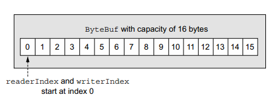
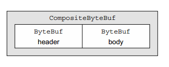
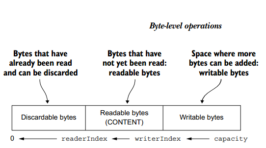

## ByteBuf

1. ByteBuf API

    netty数据处理API两大组件：抽象类ByteBuf和接口ByteBufHolder。

    ByteBuf API的优势：
    
    * 它可扩展到用户定义的缓冲区类型。
    * 透明的零拷贝是通过内置的复合缓冲区类型实现的。
    * 容量根据需要进行扩展(与JDK StringBuilder一样)。
    * 在读写模式之间切换不需要调用ByteBuffer的flip()方法。
    * 读和写采用不同的指标。
    * 支持方法链接。
    * 支持引用计数。
    * 池的支持。

2. 类ByteBuf-Netty数据容器

    1. 工作原理

        ByteBuf维护两个不同的索引:一个用于读取，另一个用于写入。当您从ByteBuf读取数据时，它的readerIndex会随着读取的字节数而增加。
        类似地，当您写入ByteBuf时，它的writerIndex会递增。ByteBuf的布局和状态

        

    2. ByteBuf使用模式

        * 堆缓冲区

            最常用的ByteBuf模式将数据存储在JVM。这种模式称为支持数组，在不使用池的情况下提供快速分配和释放位置。下面显示的这种方法非常适合处理遗留数据的情况。

            ```java
            ByteBuf heapBuf = ...;
            if (heapBuf.hasArray()) {      //检查是否支持数组     
                byte[] array = heapBuf.array();     //获取数组引用                    
                int offset = heapBuf.arrayOffset() + heapBuf.readerIndex();
                int length = heapBuf.readableBytes();    
                handleArray(array, offset, length);
            }
            ```

        * 直接缓冲区

            JDK 1.4中使用NIO引入的ByteBuffer类允许JVM实现通过本机调用分配内存。这样做的目的是避免在每次调用本机I/O操作之前(或之后)将缓冲区的内容复制到(或从)中间缓冲区。

            直接缓冲区的主要缺点是，与基于堆的缓冲区相比，它们在分配和释放方面花费更多。如果使用遗留代码，可能还会遇到另一个缺点:由于数据不在堆上，可能需要复制，如下所示。

            ```java
            ByteBuf directBuf = ...;
            if (!directBuf.hasArray()) {              
                int length = directBuf.readableBytes();             
                byte[] array = new byte[length];                    
                directBuf.getBytes(directBuf.readerIndex(), array); 
                handleArray(array, 0, length);        
            }
            ```

            显然，这比使用支持数组要多做一点工作，所以如果您事先知道容器中的数据将作为数组访问，您可能更愿意使用堆内存。

        * 复合缓冲

            第三种模式(也是最后一种模式)使用复合缓冲区，它显示了多个ByteBuf的聚合视图。在这里，您可以根据需要添加和删除ByteBuf实例，这在JDK的ByteBuffer实现中是完全没有的。

            Netty使用ByteBuf的子类CompositeByteBuf实现了这种模式，它提供了一个多个缓冲区作为单个合并缓冲区的虚拟表示。

            

            * 使用ByteBuffer的复合缓冲区模式

                ```java
                // Use an array to hold the message parts
                ByteBuffer[] message = new ByteBuffer[] { header, body };
                // Create a new ByteBuffer and use  copy to merge the header and body
                ByteBuffer message2 = ByteBuffer.allocate(header.remaining() + body.remaining());
                message2.put(header);
                message2.put(body);
                message2.flip();
                ```

            * 使用CompositeByteBuf的复合缓冲模式

                ```java
                CompositeByteBuf messageBuf = Unpooled.compositeBuffer();
                ByteBuf headerBuf = ...; // can be backing or direct
                ByteBuf bodyBuf = ...;   // can be backing or direct
                messageBuf.addComponents(headerBuf, bodyBuf);              
                .....
                messageBuf.removeComponent(0); // remove the header     
                for (ByteBuf buf : messageBuf) {                   
                    System.out.println(buf.toString());
                }
                ```

            * 访问CompositeByteBuf中的数据

                ```java
                CompositeByteBuf compBuf = Unpooled.compositeBuffer();
                int length = compBuf.readableBytes();                 
                byte[] array = new byte[length];                       
                compBuf.getBytes(compBuf.readerIndex(), array);       
                handleArray(array, 0, array.length);
                ```
        
3. Byte级别操作

    1. 随机存储索引

        与普通Java字节数组一样，ByteBuf索引也是从零开始的:第一个字节的索引是0，最后一个字节的索引总是capacity() - 1。

        ```java
        ByteBuf buffer = ...;
        for (int i = 0; i < buffer.capacity(); i++) {
            byte b = buffer.getByte(i);
            System.out.println((char) b);
        }
        ```

    2. 序列存储索引

        ByteBuf同时具有reader和writer索引，但是JDK的ByteBuffer只有一个索引，这就是为什么必须调用flip()才能在读写模式之间切换。图5.3显示了ByteBuf是如何被它的两个索引划分成三个区域的。

        

    3. 可废弃字节

        虽然您可能会经常调用discardReadBytes()来最大化可写段，但请注意，这很可能导致内存复制，因为必须将可读字节(图中标记的内容)移动到缓冲区的开头。我们建议只有在真正需要的时候才这样做;

    4. 可读字节

        ByteBuf的可读字节段存储实际数据。新分配、包装或复制的缓冲区的readerIndex的默认值为0。

        如果调用的方法以ByteBuf参数作为写目标，而没有目标索引参数，则目标缓冲区的writerIndex也会增加;例如,

        ```java
        readBytes(ByteBuf dest);
        ```

        如果在可读字节耗尽时尝试从缓冲区读取，则会引发IndexOutOfBoundsException。这个清单显示了如何读取所有可读字节。

        ```java
        ByteBuf buffer = ...;
        while (buffer.isReadable()) {
            System.out.println(buffer.readByte());
        }
        ```

    5. 可写字节

        可写字节段是一个具有未定义内容的内存区域，可以进行写入。新分配的缓冲区的writerIndex的默认值为0。

        如果写操作的目标也是ByteBuf，并且没有指定源索引，则源缓冲区的readerIndex将增加相同的数量。这个调用将显示如下:

        ```java
        writeBytes(ByteBuf dest);
        ```

        下面的清单是一个示例，它使用随机整数值填充缓冲区，直到缓冲区耗尽空间。这里使用writableBytes()方法来确定缓冲区中是否有足够的空间。

        ```java
        // Fills the writable bytes of a buffer with random integers.
        ByteBuf buffer = ...;
        while (buffer.writableBytes() >= 4) {
            buffer.writeInt(random.nextInt());
        }
        ```

    6. 索引管理

        方法|说明
        --|--
        markReaderIndex()|标记读索引
        markWriterIndex()|标记写索引
        resetReaderIndex()|重置读索引
        resetWriterIndex|重置写索引
        readerIndex(int)或writerIndex(int)|移动索引到特定的位置
        clear()|设置读索引和写索引为0

    7. 搜索操作

        有几种方法可以确定ByteBuf中指定值的索引。其中最简单的方法使用indexOf()方法。使用带有ByteBufProcessor参数的方法可以执行更复杂的搜索。这个接口定义了一个方法，

        ```java
        boolean process(byte value)
        ```

        ByteBufProcessor定义了许多针对常见价值的方便方法。

        这个清单显示了一个针对回车字符(\r)的查询示例。

        ```java
        ByteBuf buffer = ...;
        int index = buffer.forEachByte(ByteBufProcessor.FIND_CR);
        ```

    8. 衍生缓冲区

        派生缓冲区提供ByteBuf的视图，该视图以专门的方式表示ByteBuf的内容。这些视图是通过以下方法创建的:

        * duplicate()
        * slice()
        * slice(int,  int)
        * Unpooled.unmodifiableBuffer(…)
        * order(ByteOrder)
        * readSlice(int)

        每个函数返回一个新的ByteBuf实例，其中包含自己的reader、writer和标记索引。内部存储是共享的，就像在JDK ByteBuffer中一样。

        这使得创建派生缓冲区的成本很低，但这也意味着，如果修改它的内容，您也在修改源实例，所以要小心。

        下一个清单显示了如何使用slice(int, int)处理ByteBuf段。

        ```java
        Charset utf8 = Charset.forName("UTF-8");
        ByteBuf buf = Unpooled.copiedBuffer("Netty in Action rocks!", utf8); //创建一个ByteBuf，并持有给定的字符串
        ByteBuf sliced = buf.slice(0, 14);         //创建一个ByteBuf的分片，起始索引为0，终止索引为14                           
        System.out.println(sliced.toString(utf8));  //打印“ByteBuf”     
        buf.setByte(0, (byte)'J');        //更新索引为0的字节         
        assert buf.getByte(0) == sliced.getByte(0); //成功是因为数据是共享的——对其中一个的修改将在另一个中可见
        ```

        复制一个ByteBuf

        ```java
        Charset utf8 = Charset.forName("UTF-8");
        ByteBuf buf = Unpooled.copiedBuffer("Netty  in Action rocks!", utf8);   /创建一个ByteBuf，并持有给定的字符串
        ByteBuf copy = buf.copy(0, 14);   //复制ByteBuf的一个段，起始索引为0，终止索引为14                              
        System.out.println(copy.toString(utf8));      //打印“ByteBuf”                        
        buf.setByte(0, (byte)'J');          //更新索引为0的字节              
        assert buf.getByte(0) != copy.getByte(0); //成功是因为数据没有共享
        ```

    9. 读/写操作

        正如我们所提到的，有两类读/写操作:

        * get()和set()操作，它们从指定索引开始，并保持索引不变
        * read() and write() 从给定索引开始并根据访问的字节数调整索引的操作

        1. get和set

            1. get操作方法

                方法名|描述
                --|--
                getBoolean(int)	|返回给定索引处的布尔值
                getByte(int)	|返回给定索引处的字节
                getUnsignedByte(int)	|返回给定索引处的无符号字节值
                getMedium(int)	|返回给定索引处的24位int值
                getUnsignedMedium(int)	|返回给定索引处的无符号24位int值
                getInt(int)	|返回给定索引处的int值
                getUnsignedInt(int)	|将给定索引处的无符号int值作为long返回
                getLong(int)	|返回给定索引处的Long值
                getShort(int)	|返回给定索引处的short值
                getUnsignedShort(int)	|以整型形式返回给定索引处的无符号短值
                getBytes(int, ...)	|将此缓冲区的数据传输到指定的目的地

            2. set操作方法

                大多数这些get操作都有一个对应的set()方法。

            get和set方法例子

            ```java
            Charset utf8 = Charset.forName("UTF-8");
            ByteBuf buf = Unpooled.copiedBuffer("Netty in Action rocks!", utf8); 
            System.out.println((char)buf.getByte(0));                         
            int readerIndex = buf.readerIndex();            
            int writerIndex = buf.writerIndex();
            buf.setByte(0, (byte)'B');                           
            System.out.println((char)buf.getByte(0));             
            assert readerIndex == buf.readerIndex();   
            assert writerIndex == buf.writerIndex();
            ```

        2. read和write

            1. read操作方法

                方法名|说明
                --|--
                readBoolean()|返回当前读索引的布尔值，并让读索引+1
                readByte()|返回当前读索引的字节，并让读索引+1
                readUnsignedByte()|返回当前读索引的无符字节，并让读索引+1
                readMedium()|返回当前读索引的24位medium，并让读索引+3
                readUnsignedMedium|返回当前读索引的无符24位medium，并让读索引+3
                readInt()|返回当前读索引的整型，并让读索引+4
                readUnsignedInt()|返回当前读索引的无符整型，并让读索引+4
                readLong()|返回当前读索引的Long型，并让读索引+8
                readShort()|返回当前读索引的short型，并让读索引+2
                readUnsignedShort()|返回当前读索引的无符short型，并让读索引+2
                readBytes(ByteBuf | byte[] destination,int dstIndex [,int length])|

            2. write操作方法

                几乎每个read()方法都有一个对应的write()方法，用于附加到ByteBuf。

            read和write方法例子

            ```java
            Charset utf8 = Charset.forName("UTF-8");
            ByteBuf buf = Unpooled.copiedBuffer("Netty  in Action rocks!", utf8);  
            System.out.println((char)buf.readByte());                 
            int readerIndex = buf.readerIndex();                        
            int writerIndex = buf.writerIndex();                     
            buf.writeByte((byte)'?');                   
            assert readerIndex == buf.readerIndex();
            assert writerIndex != buf.writerIndex();
            ```

    10. 更多操作

        方法名|说明
        --|--
        isReadable()|如果至少有一个字节可读则返回true
        isWritable()|如果至少有一个字节可写则返回true
        readableBytes()|返回可读字节数
        writableBytes()|返回可写字节数
        capacity()|返回ByteBuf可以容纳的字节数。在此之后，它将再次尝试展开，直到达到maxCapacity()为止
        maxCapacity()|返回ByteBuf可以容纳的最大字节数。
        hasArray()|如果ByteBuf由字节数组支持，则返回true。
        array()|如果字节buf由字节数组支持，则返回字节数组;否则它将抛出一个UnsupportedOperationException。

4. 接口ByteBufHolder

    Netty提供ByteBufHolder来处理这个常见的用例。ByteBufHolder还提供了对Netty高级特性的支持，比如缓冲池ByteBuf可以从池中借用，也可以在需要时自动释放。

    ByteBufHolder只有少数几个方法用于访问底层数据和引用计数。

    方法名|说明
    --|--
    content()|返回由该ByteBufHolder持有的ByteBuf
    copy()|返回此ByteBufHolder的深层副本，包括包含的ByteBuf数据的非共享副本
    duplicate()|返回此ByteBufHolder的浅副本，包括包含的ByteBuf数据的共享副本

5. ByteBuf分配

    1. 请求式：接口ByteBufAllocator

        主要分以下几种：
        * buffer():返回具有基于堆或直接数据存储的ByteBuf
        * heapBuffer():返回具有基于堆的存储的ByteBuf
        * directBuffer():返回直接数据存储的ByteBuf
        * compositeBuffer():返回一个CompositeByteBuf，它可以通过添加基于堆或直接缓冲区来扩展，最多添加指定数量的组件
        * ioBuffer():返回将用于套接字上的I/O操作的ByteBuf

        获取ByteBufAllocator引用

        ```java
        Channel channel = ...;
        ByteBufAllocator allocator = channel.alloc();  //从Channel获取ByteBufAllocator
        ....
        ChannelHandlerContext ctx = ...;
        ByteBufAllocator allocator2 = ctx.alloc();  //从ChannelHandlerContext获取ByteBufAllocator
        ....
        ```

        Netty提供了ByteBufAllocator的两种实现:PooledByteBufAllocator和UnpooledByteBufAllocator。

    2. 非池化缓冲区

        在某些情况下，您可能没有对ByteBufAllocator的引用。对于这种情况，Netty提供了一个名为Unpooled的实用程序类，它提供了静态方法来创建unpooled ByteBuf实例。

        * buffer():返回基于堆数据存储的unpooled ByteBuf
        * directBuffer():返回直接数据存储的unpooled ByteBuf
        * wrappedBuffer():返回一个ByteBuf，它封装给定的数据
        * copiedBuffer():返回一个ByteBuf，它复制给定的数据

    3. 类ByteBufUtil

        ByteBufUtil提供了用于操作ByteBuf的静态助手方法。因为这API是通用的，与池无关，这些方法都是在分配类之外实现的。