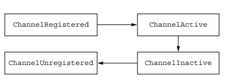
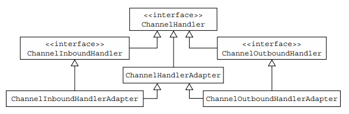

## ChannelHandler及ChannelPipeline

1. ChannelHandler家族

    1. Channel生命周期

        Channel生命周期的四个状态

        状态|描述
        --|--
        ChannelUnregistered|Channel已被创建但未注册到EventLoop
        ChannelRegistered|Channel注册到EventLoop
        ChannelActive|Channel是活跃的
        ChannelInactive|Channel没有连接到远程的端

        

    2. ChannelHandler生命周期

        ChannelHandler生命周期的方法

        类型|描述
        --|--
        handlerAdded|当将ChannelHandler添加到ChannelPipeline时调用
        handlerRemoved|当从ChannelPipeline中删除ChannelHandler时调用
        exceptionCaught|如果在处理过程中ChannelPipeline中发生错误，则调用

        ChannelHandler的两个重要子接口
        * ChannelInboundHandler-处理入站数据和各种状态更改
        * ChannelOutboundHandler—处理出站数据并允许截取所有操作

    3. 接口ChannelInboundHandler

        ChannelInboundHandler生命周期方法

        类型|描述
        --|--
        channelRegistered|当通道注册到其EventLoop并能够处理I/O时调用。
        channelUnregistered|当通道从其EventLoop注销且无法处理任何I/O时调用。
        channelActive|当通道处于活动状态时调用;通道已连接/绑定好。
        channelInactive|当通道离开活动状态并不再连接到其远程对等端时调用。
        channelReadComplete|当通道上的读取操作完成时调用。
        channelRead|从通道读取数据时调用。
        channelWritabilityChanged|当通道的可写性状态发生更改时调用。
        userEventTriggered|ChannelnboundHandler.fireUserEventTriggered()被调用时触发

        ```java
        @Sharable
        public class DiscardHandler ex tends ChannelInboundHandlerAdapter {  
            @Override
            public void channelRead(ChannelHandlerContext ctx, Object msg) {
                ReferenceCountUtil.release(msg);   
            }
        }
        ```

    4. 接口ChannelOutboundHandler

        类型|描述
        --|--
        bind(ChannelHandlerContext, SocketAddress,ChannelPromise)|在请求时调用，以绑定通道到本地地址
        connect(ChannelHandlerContext, SocketAddress,SocketAddress,ChannelPromise)|在请求连接时调用通道到远程对等点
        disconnect(ChannelHandlerContext, ChannelPromise)|在请求时调用，以断开来自远程对等点的通道
        close(ChannelHandlerConte xt,ChannelPromise)|在请求时调用，以关闭通道
        deregister(ChannelHandlerContext,ChannelPromise)|在请求时调用，以注销通道从它的EventLoop
        read(ChannelHandlerContext)|根据请求调用，以便从通道读取更多数据
        flush(ChannelHandlerContext)|在请求时调用，以将排队的数据通过通道
        write(ChannelHandlerContext,Object,ChannelPromise)|在请求时调用，以便通过通道将数据写入远程对等点

    5. ChannelHandler适配器

        


    6. Resource管理

        Netty的四个泄露检出级别

        级别|描述
        --|--
        DISABLED|禁用泄漏检测。只有在广泛的测试之后才能使用。
        SIMPLE|报告使用1%的默认采样率发现的任何泄漏。这是默认级别，非常适合大多数情况。
        ADVANCED|报告发现的泄漏和消息的访问位置。使用默认采样率。
        PARANOID|就像ADVANCED一样，只是每个访问都是抽样的。这对性能有很大的影响，应该只在调试阶段使用。

        诊断泄露工具的使用

        * 消费和释放入站消息

            ```java
            @Sharable
            public class DiscardInboundHandler extends ChannelInboundHandlerAdapter {  
                @Override
                public void ch annelRead(ChannelHandlerContext ctx, Object msg) {
                    ReferenceCountUtil.release(msg);  //通过使用ReferenceCountUtil.release()释放资源
                }
            }
            ```

        * 废弃和释放出站数据

            ```java
            @Sharable
            public class DiscardOutboundHandler
                extends ChannelOutboundHandlerAdapter {        
                @Override
                public void write(ChannelHandlerContext ctx,Object msg, ChannelPromise promise) {
                    ReferenceCountUtil.release(msg);  //通过使用ReferenceCountUtil.release()释放资源        
                    promise.setSuccess();   //通知ChannelPromise：数据已经被处理
                }
            }
            ```
        
2. 接口ChannelPipeline

    1. 修改ChannelPipeline
    2. 触发事件

3. 接口ChannelHandlerContext

    1. 使用ChannelHandlerContext
    2. ChannelHandler和ChannelHandlerContext的优先使用

4. 异常处理

    1. 处理入站异常
    2. 处理出站异常