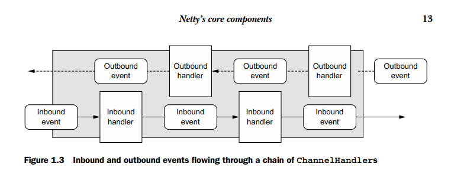

## netty overview

1. 核心组件

    核心组件包括：
    * Channels
    * Callbacks
    * Futures
    * Events and handlers

    1. Channels

        Channel是Java NIO的基本构成

    2. Callbacks

        回调只是一个方法，它的引用已经提供给另一个方法。这使得后者能够在适当的时候调用前者。

        Netty在处理事件时在内部使用回调;当回调被触发时，事件可以由接口ChannelHandler的实现来处理。

        下一个清单显示了一个示例:当建立了一个新连接时调用ChannelHandler回调channelActive()并打印一条消息。

        ```java
        public class ConnectHandler extends ChannelInboundHandlerAdapter {
            @Override
            public void channelActive(ChannelHandlerContext ctx)
                throws Exception {                                      
                System.out.println(
                    "Client " + ctx.channel().remoteAddress() + " connected");
            }
        }
        ```

    3. Futures

        Future提供了在操作完成时通知应用程序的另一种方法。此对象充当异步操作结果的占位符;它将在将来的某个时候完成，并提供对结果的访问。

        JDK附带java.util.concu rrent.Future接口，但所提供的实现只允许手动检查操作是否已完成或阻塞，直到完成为止。这非常麻烦，因此Netty提供了自己的实现ChannelFuture，以便在执行异步us操作时使用。

        ChannelFuture提供了额外的方法，允许我们注册一个或多个ChannelFutureListener实例。侦听器的回调方法operationComplete()在操作完成时调用。然后，侦听器可以确定操作是否成功完成或是否有错误。如果是后者，则可以检索发生的Throwable。简而言之，ChannelFutureListener提供的通知机制消除了手动检查操作完成情况的需要

    4. Events and handlers

        Netty使用不同的事件来通知我们操作的状态或状态的变化。这允许我们根据已发生的事件触发适当的操作。这些操作可能包括

        * 记录日志
        * 数据转换
        * 流控制
        * 应用逻辑

        Netty是一个网络框架，因此事件按照它们与入站或出站数据流的相关性进行分类。可能由入站数据或关联的状态更改触发的事件包括

        * 活动连接或非活动连接
        * 数据读取
        * 用户事件
        * 错误事件

        出站事件是将来可能触发某个动作的操作的结果

        * 打开或关闭到远程对等点的连接
        * 将数据写入或刷新到套接字

        

2. 应用

    * EchoServerHandler
    ```java
    @Sharable
    public class EchoServerHandler extends ChannelInboundHandlerAdapter {

        @Override
        public void channelRead(ChannelHandlerContext ctx, Object msg) {
            ByteBuf in = (ByteBuf) msg;
            System.out.println("Server received: " + in.toString(CharsetUtil.UTF_8));
            ctx.write(in);
        }

        @Override
        public void channelReadComplete(ChannelHandlerContext ctx) {
            ctx.writeAndFlush(Unpooled.EMPTY_BUFFER).addListener(ChannelFutureListener.CLOSE);
        }

        @Override
        public void exceptionCaught(ChannelHandlerContext ctx, Throwable cause) {
            cause.printStackTrace();
            ctx.close();
        }
    }
    ```

    * EchoServer
    ```java
    public class EchoServer {
        private final int port;

        public EchoServer(int port) {
            this.port = port;
        }

        public static void main(String[] args) throws Exception {
            if (args.length != 1) {
                System.err.println("Usage: " + EchoServer.class.getSimpleName() + " <port>");
            }
            int port = Integer.parseInt(args[0]);
            new EchoServer(port).start();
        }

        public void start() throws Exception {
            final EchoServerHandler serverHandler = new EchoServerHandler();
            EventLoopGroup group = new NioEventLoopGroup();
            try {
                ServerBootstrap b = new ServerBootstrap();
                b.group(group)
                .channel(NioServerSocketChannel.class)
                .localAddress(new InetSocketAddress(port))
                .childHandler(new ChannelInitializer<SocketChannel>() {
                    @Override
                    public void initChannel(SocketChannel ch) throws Exception {
                        ch.pipeline().addLast(serverHandler);
                    }
                });
                ChannelFuture f = b.bind().sync();//调用sync让当前线程阻塞
                f.channel().closeFuture().sync();//应用一直等待直到server Channel关闭，一旦关闭，EventLoopGroup，所有资源，相关线程都停止
            } finally {
                group.shutdownGracefully().sync();
            }
        }
    }
    ```