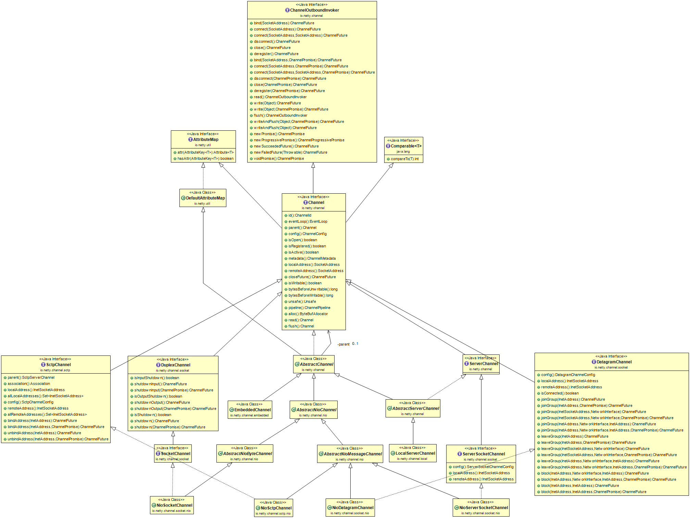
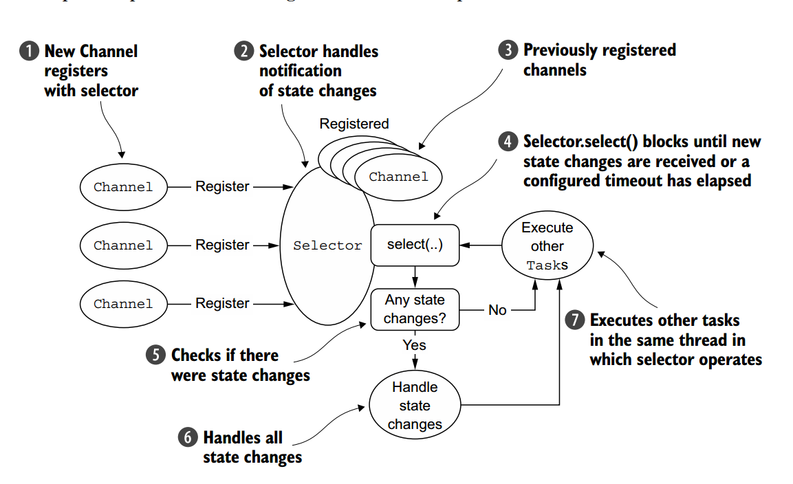
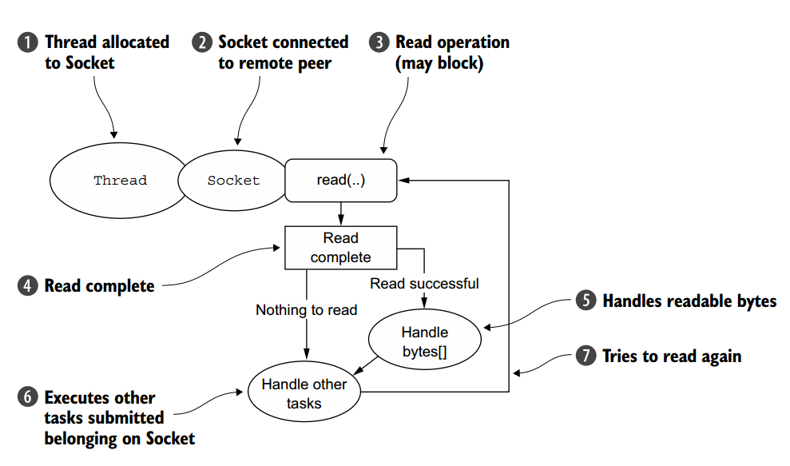

## netty传输

1. 案例分析

    1. 不使用netty的OIO和NIO

        ```java
        public class PlainOioServer {
            public void serve(int port) throws IOException {
                final ServerSocket socket = new ServerSocket(port);//server到指定的端口
                try {
                    for (;;) {
                        final Socket clientSocket = socket.accept();//接入一个连接
                        System.out.println("Accepted connection from " + clientSocket);
                        new Thread(new Runnable() {  //创建一个新线程处理连接
                            @Override
                            public void run() {
                                OutputStream out;
                                try {
                                    out = clientSocket.getOutputStream();
                                    out.write("Hi!\r\n".getBytes(Charset.forName("UTF-8"))); //往已连接的客户端写消息
                                    out.flush();
                                    clientSocket.close(); //关闭客户端
                                } catch (IOException e) {
                                    e.printStackTrace();
                                } finally {
                                    try {
                                        clientSocket.close();
                                    } catch (IOException ex) {
                                        // ignore on close
                                    }
                                }
                            }
                        }).start(); //启动线程
                    }
                } catch (IOException e) {
                    e.printStackTrace();
                }
            }
        }
        ```

        ```java
        public class PlainNioServer {
            public void serve(int port) throws IOException {
                ServerSocketChannel serverChannel = ServerSocketChannel.open();
                serverChannel.configureBlocking(false);
                ServerSocket ssocket = serverChannel.socket();
                InetSocketAddress address = new InetSocketAddress(port);
                ssocket.bind(address); //绑定server到已选择的端口
                Selector selector = Selector.open();//为要处理的通道打开selector
                serverChannel.register(selector, SelectionKey.OP_ACCEPT); //注册ServerSocket到Selectro上以便介入连接
                final ByteBuffer msg = ByteBuffer.wrap("Hi!\r\n".getBytes());
                for (;;) {
                    try {
                        selector.select(); //等待新事件
                    } catch (IOException ex) {
                        ex.printStackTrace();
                        // handle exception
                        break;
                    }
                    Set<SelectionKey> readyKeys = selector.selectedKeys(); //获取所有到来的事件的SelectionKey
                    Iterator<SelectionKey> iterator = readyKeys.iterator();
                    while (iterator.hasNext()) {
                        SelectionKey key = iterator.next();
                        iterator.remove();
                        try {
                            if (key.isAcceptable()) {  //检查新连接是否准备好接入
                                ServerSocketChannel server = (ServerSocketChannel) key.channel();
                                SocketChannel client = server.accept();
                                client.configureBlocking(false);
                                client.register(selector, SelectionKey.OP_WRITE | SelectionKey.OP_READ, msg.duplicate());
                                System.out.println("Accepted connection from " + client);
                            }
                            if (key.isWritable()) {  //检查新连接是否准备写
                                SocketChannel client = (SocketChannel) key.channel();
                                ByteBuffer buffer = (ByteBuffer) key.attachment();
                                while (buffer.hasRemaining()) {
                                    if (client.write(buffer) == 0) { //往已连接的客户端写入数据
                                        break;
                                    }
                                }
                                client.close(); //关闭连接
                            }
                        } catch (IOException ex) {
                            key.cancel();
                            try {
                                key.channel().close();
                            } catch (IOException cex) {
                                // ignore on close
                            }
                        }
                    }
                }
            }
        }
        ```

    2. 使用netty的OIO和NIO

        ```java
        public class NettyOioServer {
            public void server(int port) throws Exception {
                final ByteBuf buf = Unpooled.unreleasableBuffer(Unpooled.copiedBuffer("Hi!\r\n", Charset.forName("UTF-8")));
                EventLoopGroup group = new OioEventLoopGroup();
                try {
                    ServerBootstrap b = new ServerBootstrap(); //创建一个ServerBootstrap
                    b.group(group)
                    .channel(OioServerSocketChannel.class)  //使用OioServerSocketChannel允许阻塞模式(old I/O)
                    .localAddress(new InetSocketAddress(port))
                    .childHandler(new ChannelInitializer<SocketChannel>() {  //每一个接入的连接时调用声明ChannelInitializer
                        @Override
                        public void initChannel(SocketChannel ch) throws Exception {
                            ch.pipeline().addLast(new ChannelInboundHandlerAdapter() { //添加一个ChannelInboundHandlerAdapter来拦截并处理事件
                                @Override
                                public void channelActive(ChannelHandlerContext ctx) throws Exception {
                                    ctx.writeAndFlush(buf.duplicate()).addListener(ChannelFutureListener.CLOSE); //往客户端写入消息并添加ChannelFutureListener来关闭连接（当写入事件完毕）
                                }
                            });
                        }
                    });
                    ChannelFuture f = b.bind().sync();//绑定server接入连接
                    f.channel().closeFuture().sync();
                } finally {
                    group.shutdownGracefully().sync();//释放所有资源
                }
            }
        }
        ```

        注：OioServerSocketChannel在后来的版本已被弃用

        ```java
        public class NettyNioServer {
            public void server(int port) throws Exception {
                final ByteBuf buf = Unpooled.copiedBuffer("Hi!\r\n", Charset.forName("UTF-8"));
                EventLoopGroup group = new NioEventLoopGroup();//使用NioEventLoopGroup作为非阻塞模式
                try {
                    ServerBootstrap b = new ServerBootstrap(); //创建ServerBootstrap
                    b.group(group)
                    .channel(NioServerSocketChannel.class)
                    .localAddress(new InetSocketAddress(port))
                    .childHandler(new ChannelInitializer<SocketChannel>() { //每一个接入的连接时调用声明ChannelInitializer
                        @Override
                        public void initChannel(SocketChannel ch) throws Exception {
                            ch.pipeline().addLast(new ChannelInboundHandlerAdapter() { //添加一个ChannelInboundHandlerAdapter来拦截并处理事件
                                @Override
                                public void channelActive(ChannelHandlerContext ctx) throws Exception {
                                    ctx.writeAndFlush(buf.duplicate()).addListener(ChannelFutureListener.CLOSE); //往客户端写入消息并添加ChannelFutureListener来关闭连接（当写入事件完毕）
                                }
                            });
                        }
                    });
                    ChannelFuture f = b.bind().sync(); //绑定server接入连接
                    f.channel().closeFuture().sync(); //释放所有资源
                } finally {
                    group.shutdownGracefully().sync();
                }
            }
        }
        ```

2. Transport API

    传输API的核心是Channel接口,用于所有I/O操作。Channel类层次结构如图所示。

    

    图中接口显示了Channel有一个ChannelPipeline和ChannelConfig，ChannelConfig保存通道的所有配置设置，并支持热更改。因为特定的传输可能有惟一的设置，所以它可能实现ChannelConfig的子类型。(有关ChannelConfig实现，请参考Javadocs)。

    由于通道是惟一的，所以将通道声明为java.lang.Comparable的子接口，以便保证有序性。因此，如果两个不同的通道实例返回相同的散列代码，AbstractChannel中的compareTo()实现将抛出错误。

    ChannelPipeline包含将应用于入站和出站数据和事件的所有ChannelHandler实例。这些通道处理程序实现了应用程序的逻辑，用于处理状态更改和数据处理。通道处理程序的典型用途包括

    * 将数据从一种格式转换为另一种格式
    * 提供异常通知
    * 提供通道激活或非激活的通知
    * 当一个通道在EventLoop中注册或注销时，提供通知
    * 提供用户定义事件的通知

    Channel的方法

    方法|说明
    --|--
    eventLoop|返回分配到Channel的EventLoop
    pipeline|返回分配到Channel的ChannelPipeline
    isActive|如果通道是活动的，则返回true。活动的含义可能取决于底层传输。例如，套接字传输在连接到远程对等点时是活动的，而数据报传输在打开后是活动的。
    localAddress|返回本地的SocketAddress
    remoteAddress|返回远程的SocketAddress
    write|将数据写入远程对等点。此数据被传递到ChannelPipeline并排队，直到它被刷新。
    flush|将以前写入的数据刷新到底层传输，如套接字。
    writeAndFlush|调用write()和flush()的方便方法。

3. 包含的传输

    Netty附带了一些可以使用的传输。因为它们并不都支持每个协议，所以必须选择与应用程序使用的协议兼容的传输。在本节中，我们将讨论这些关系。表4.2列出了Netty提供的所有传输。

    Netty提供的协议

    名称|包|描述
    --|--|--
    NIO|io.netty.channel.socket.nio|使用io.netty.channel作为一个基础——一个基于选择器的方法
    Epoll|io.netty.channel.epoll|将JNI用于epoll()和非阻塞IO。这种传输支持仅在Linux上可用的特性，比如SO_REUSEPORT，并且比NIO传输更快，而且完全是非阻塞的。
    OIO|io.netty.channel.socket.oio|使用java.net包作为基础使用阻塞流。
    Local|io.netty.channel.local|一种本地传输，可用于通过管道在VM中通信。
    Embedded|io.netty.channel.embedded|一种嵌入式传输，它允许在没有真正基于网络的传输的情况下使用通道处理程序。这对于测试ChannelHandler实现非常有用。

    1. NIO-非阻塞I/O

        NIO提供了所有I/O操作的完全异步实现。它利用了自JDK 1.4引入NIO子系统以来一直可用的基于选择器的API。

        选择器背后的基本概念是作为注册表，当通道状态发生变化时，您可以在其中请求得到通知。可能的状态变化是

        * 一个新的Channel被接受并准备好了。
        * Channel连接完成。
        * Channel具有可读取的数据。
        * Channel可以写入数据。

        NIO的这些内部细节被所有Netty传输实现的通用用户级API所隐藏

        

        ```
        Zero-copy是目前仅在NIO和Epoll传输中可用的功能。它允许您快速有效地将数据从文件系统移动到网络，而不需要将数据从内核空间复制到用户空间，这可以显著提高FTP或HTTP等协议中的性能。并非所有操作系统都支持此功能。具体来说，它不适用于实现数据加密或压缩的文件系统——只能传输文件的原始内容。相反，传输已经加密的文件不是问题。进入翻译页面
        ```

    2. Epoll-用于Linux的本机非阻塞传输

        如前所述，Netty的NIO传输基于Java提供的异步/非阻塞网络的公共抽象。尽管这确保了Netty的非阻塞API在任何平台上都是可用的，但它也带来了一些限制，因为JDK必须做出妥协才能在所有系统上提供相同的功能。

        Linux作为高性能网络平台的重要性日益增加，这导致了许多高级功能的开发，包括epoll，一个高度可伸缩的I/O事件通知功能。这个API从Linux内核的2.5.44(2002)版开始可用，它提供了比旧的POSIX select和poll系统调用更好的性能，现在是Linux上非阻塞网络的实际标准。Linux JDK NIO API使用这些epoll调用。

        Netty为Linux提供了一个NIO API，它使用epoll的方式更符合它自己的设计，使用中断的方式成本更低。如果你的应用程序是针对Linux的，考虑使用这个版本;您将发现，在重载下的性能优于JDK s NIO实现。
        
        这个传输的语义与图4.2中所示的相同，并且它的使用非常简单。要用epoll替换清单中的NIO，可以用EpollEventLoopGroup替换NioEventLoopGroup，EpollServerSocketChannel.class替换NioServerSocketChannel.class。

    3. OIO-旧的阻塞I/O

        Netty的OIO传输实现代表了一种折衷:它是通过公共传输API访问的，但是因为它构建在java.net的阻塞实现之上，所以它不是异步的。但它非常适合某些用途。

        例如，您可能需要移植使用进行阻塞调用的库的遗留代码(如JDBC4)，并且将逻辑转换为非阻塞可能不实用。相反，您可以在短期内使用Netty的OIO传输，然后将代码移植到纯异步传输之一。让我们看看它是如何工作的。

        在java.net API中，通常有一个线程接受到达正在侦听的ServerSocket的新连接。创建一个新的套接字用于与对等方交互，并分配一个新的线程来处理通信。这是必需的，因为特定套接字上的任何I/O操作都可能随时阻塞。用一个线程处理多个套接字很容易导致一个套接字上的阻塞操作，并将其他所有套接字捆绑在一起。

        

    4. 用于JVM内部通信的本地传输

        Netty为运行在相同JVM中的客户机和服务器之间的异步通信提供了一个本地传输。同样，这个传输支持所有Netty传输实现的公共API。

        在此传输中，与服务器通道关联的套接字地址不绑定到物理网络地址;相反，只要服务器在运行，它就存储在注册表中，并且在通道关闭时注销。因为传输不接受真实的网络流量，所以它不能与其他传输实现互操作。因此，希望连接到使用此传输的服务器(在同一JVM中)的客户机也必须使用它。除了这个限制之外，它的使用与其他传输相同。


    5. 嵌入式传输

        Netty提供了一个额外的传输，允许您将ChannelHandlers作为helper类嵌入到其他ChannelHandlers中。通过这种方式，您可以在不修改内部代码的情况下扩展ChannelHandler的功能。这种嵌入式传输的关键是一个具体的通道实现，称为EmbeddedChannel，这并不奇怪。在第9章中，我们将详细讨论如何使用这个类来为ChannelHandler实现创建单元测试用例。

4. Transport用例

    Transports支持的网络协议

    Transport|TCP|UDP|SCTP*|UDT
    --|--|--|--|--
    NIO|X|X|X|X
    Epoll(Linux only)|X|X|——|——
    OIO|X|X|X|X