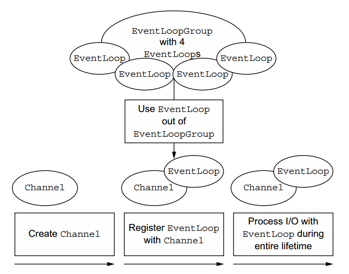
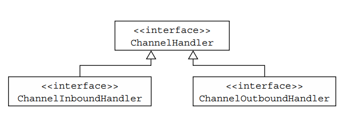
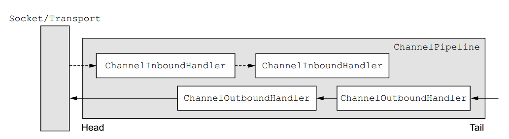
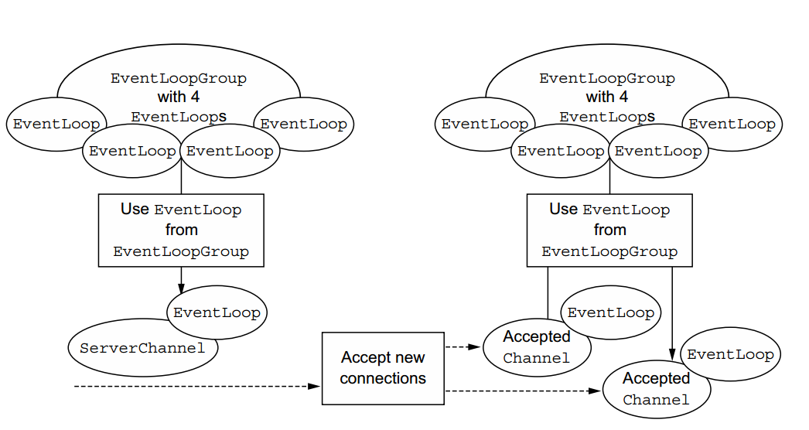

## netty组件及设计

1. Channel,EventLoop和ChannelFuture

    下面对Channel,EventLoop和ChannelFuture的讨论，它们都是Netty网络的抽象。

    * Channel—Sockets
    * EventLoop—控制流，多线程，高并发
    * ChannelFuture—异步通知

    1. 接口Channel

        基本的I/O操作(bind()、connect()、read()和write()依赖于由底层网络传输提供的基本类型。在基于java的网络中，基本结构是类Socket。Netty的通道接口提供了一个非常好的API
        减少直接使用套接字的复杂性。此外，Channel是具有许多预定义的专门实现的广泛类层次结构的根，其中的一个简短列表如下:

        * EmbeddedChannel
        * LocalServerChannel
        * NioDatagramChannel
        * NioSctpChannel
        * NioSocketChannel

    2. 接口EventLoop

        EventLoop定义了Netty的核心抽象，用于处理一个connection生命周期中发生的事件。图从高层次说明了Channels, EventLoops, Threads和EventLoopGroups之间的关系。

        它们的关系如下：

        * 一个EventLoopGroup包含一个或多个EventLoop
        * EventLoop的生命周期被绑定到单个线程
        * EventLoop处理的所有I/O事件都在其专用线程上处理
        * Channel使用一个EventLoop注册其生命周期
        * 一个EventLoop可以分配给一个或多个Channel

        

        请注意，在这种设计中，给定通道的I/O由相同的I/O执行线程，实际上消除了同步的需要。

    3. 接口ChannelFuture

        正如我们所解释的，Netty中的所有I/O操作都是异步的。因为一个操作可能不会立即返回，所以我们需要一种方法在稍后的时间确定它的结果。

        为此，Netty提供了ChannelFuture，它的addListener()方法注册了一个ChannelFutureListener，以便在操作完成时得到通知(无论成功与否)

2. ChannelHandler和ChannelPipeline

    现在，我们将更详细地了解管理数据流和执行应用程序处理逻辑的组件。

    1. 接口ChannelHandler

        从应用程序开发人员的角度来看，Netty的主要组件是ChannelHandler，它充当所有应用程序逻辑的容器，用于处理入站和出站数据。这是可能的，因为ChannelHandler方法是由网络事件触发的(其中术语“事件”使用得非常广泛)。事实上，ChannelHandler几乎可以用于任何类型的操作，比如将数据从一种格式转换为另一种格式，或者处理处理过程中抛出的异常。

        例如，ChannelInboundHandler是您将经常实现的子接口。此类型接收应用程序的业务逻辑要处理的入站事件和数据。在向连接的客户机发送响应时，还可以刷新ChannelInboundHandler中的数据。应用程序的业务逻辑通常驻留在一个或多个ChannelInboundHandlers中。

    2. 接口ChannelPipline

        ChannelPipeline为ChannelHandlers链提供了一个容器，并定义了一个API，用于沿着该链传播入站和出站事件流。当创建Channel时，它会自动分配自己的ChannelPipeline。

        ChannelPipeline中安装的ChannelHandlers如下:
        * ChannelInitializer实现通过ServerBootstrap注册。
        * 当调用ChannelInitializer.initchannel()时，ChannelInitializer在管道中安装一组自定义的ChannelHandlers。
        * ChannelInitializer将自己从ChannelPipeline中移除。

        让我们更深入地了解ChannelPipeline和ChannelHandler之间的共生关系，以检查在发送或接收数据时数据发生了什么变化。ChannelHandler是专门为支持广泛的用途而设计的，
        您可以将它看作任何处理传入和通过ChannelPipeline的事件(包括数据)的代码的通用容器。

        

        事件在管道中的移动是在应用程序初始化或引导阶段安装的ChannelHandlers的工作。这些对象接收事件，执行它们所具有的处理逻辑，并将数据传递给链中的下一个处理程序。它们执行的顺序由它们被添加的顺序决定。对于所有实际用途，我们将ChannelHandlers的这种有序排列称为ChannelPipeline。

        

    3. 更近距离地查看ChannelHandler

        如前所述，有许多不同类型的ChannelHandlers，每种处理程序的功能在很大程度上由其超类决定。Netty以适配器类的形式提供了许多缺省处理程序实现，这些实现旨在简化应用程序处理逻辑的开发。您已经看到，管道中的每个ChannelHandler负责将事件转发到链中的下一个处理程序。这些适配器类(及其子类)自动执行此操作，因此您只能覆盖希望专门化的方法和事件。

        为什么是适配器?
        有几个适配器类可以将编写自定义通道处理程序的工作量降到最低，因为它们提供了在相应接口中定义的所有方法的默认实现。

        这些是您在创建自定义处理程序时最常调用的适配器:

        * ChannelHandlerAdapter
        * ChannelInboundHandlerAdapter
        * ChannelOutboundHandlerAdapter
        * ChannelDuplexHandlerAdapter

        接下来，我们将研究三种ChannelHandler子类型:encoders、decoders和SimpleChannelInboundHandler<T>， ChannelInboundHandlerAdapter的子类。

    4. Encoders和decoders

        当您使用Netty发送或接收消息时，将进行数据转换。**入站消息将被解码**;也就是说，从字节转换成另一种格式，通常是Java对象。**如果消息是出站的，则会发生相反的情况:它将从当前格式编码为字节**。这两种转换的原因很简单:网络数据总是由一系列字节组成。

        为编码器和解码器提供各种类型的抽象类，以满足特定的需求。例如，您的应用程序可能使用不需要立即将消息转换为字节的中间格式。您仍然需要一个编码器，但它将派生自另一个超类。要确定合适的名称，可以应用一个简单的命名约定。

        通常，基类的名称类似于ByteToMessageDecoder或MessageToByteEncoder。在特殊类型的情况下，您可能会发现一些类似于ProtobufEncoder和ProtobufDecoder的东西，它们支持谷歌的协议缓冲区。

        严格地说，其他处理程序可以做编码器和解码器所做的事情。但是，正如有一些适配器类可以简化通道处理程序的创建一样，Netty提供的所有编码器/解码器适配器类都可以实现ChannelInboundHandler或ChannelOutboundHandler。

        您将发现，对于入站数据，channelRead方法/事件被覆盖。对于从入站通道读取的每个消息，都将调用此方法。然后，它将调用所提供解码器的decode()方法，并将解码后的字节转发到管道中的下一个ChannelInboundHandler。

        出站消息的模式正好相反:编码器将消息转换为字节并将其转发到下一个ChannelOutboundHandler。

    5. 抽象类SimpleChannelInboundHandler

        最常见的情况是，您的应用程序将使用一个handler接收已解码消息并将业务逻辑应用于数据。要创建这样一个ChannelHandler，只需要扩展基本类SimpleChannelInboundHandler<T>，其中T是要处理的消息的Java类型。在这个处理程序中，您将覆盖基类的一个或多个方法，并获得对ChannelHandlerContext的引用，该引用作为输入参数传递给所有处理程序方法。

        这种类型的处理程序中最重要的方法是channelRead0(ChannelHandlerContext,T)。除了不阻塞当前I/O线程的要求外，实现完全取决于您。

3. Bootstrapping

    Netty的引导类为应用程序的网络层配置提供了容器，其中包括将一个进程绑定到给定端口，或者将一个进程连接到在指定端口的指定主机上运行的另一个进程。

    通常，我们将前一个用例称为引导服务器，后一个用例称为引导客户机。这个术语简单方便，但它稍微掩盖了一个重要的事实:**术语“服务器”和“客户端”表示不同的网络行为**;也就是说，侦听传入的连接，而不是与一个或多个进程建立连接。

    ```
    请记住，严格地说，“连接”这个术语只适用于面向连接的协议，比如TCP，它保证在连接的端点之间有序地传递消息。
    ```

    因此，有两种引导类型:**一种是为客户机设计的(简称bootstrap)，另一个用于服务器(ServerBootstrap)**。无论您的应用程序使用哪种协议或执行哪种类型的数据处理，决定它使用哪个引导类的惟一因素是它作为客户机或服务器的功能。

    两者区别：

    1. ServerBootstrap绑定到本地端口，因为服务器必须侦听连接，而客户机应用程序使用Bootstrap连接到远程对等端。
    2. 引导一个客户端只需要一个EventLoopGroup，但是一个ServerBootstrap需要两个(可以是同一个实例)。

    服务器需要两组不同的通道
    * 第一个集合将包含一个表示服务器自己的监听套接字的ServerChannel，绑定到本地端口。
    * 第二个集合将包含为处理传入客户机连接而创建的所有通道——每个通道对应一个服务器已接受的连接。

    与ServerChannel关联的EventLoopGroup分配一个EventLoop，该EventLoop负责为传入的连接请求创建通道。一旦连接被接入，第二个EventLoopGroup将EventLoop分配给它的通道。

    