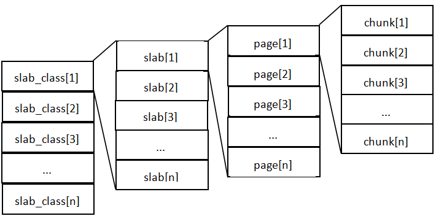
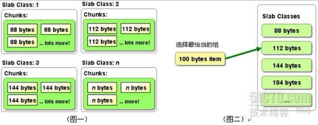

1. Memcached内存管理
    * 内存结构
        
        1. slab_class里，存放的是一组组chunk大小相同的slab
        2. 每个slab里面包含若干个page，page的默认大小是1M，如果slab大小100M，就包含100个page
        3. 每个page里面包含若干个chunk，chunk是数据的实际存放单位，每个slab里面的chunk大小相同
    *  内存分配方式
        1. Memcached利用slab allocation机制来分配和管理内存，它按照预先规定的大小，将分配的内存分割成特定长度的内存块，再把尺寸相同的内存块分成组，数据在存放时，根据键值大小去匹配slab大小，找就近的slab存放，所以存在空间浪费现象。而传统的内存管理方式是，使用完通过malloc分配的内存后通过free来回收内存，这种方式容易产生内存碎片并降低操作系统对内存的管理效率。
        2. 存放数据时，首先slab要申请内存，申请内存是以page为单位的。所以在放入第一个数据的时候，无论大小为多少，都会有1M大小的page被分配给该slab。申请到page后，slab会将这个page的内存按chunk的大小进行切分，这样就变成了一个chunk数组，最后从这个chunk数组中选择一个用于存储数据。

        **示例：**

        

        MemCache中的value存放位置是由value的大小决定，value会被存放到与chunk大小最接近的一个slab中，比如slab[1]的chunk大小为88字节、slab[2]的chunk大小为112字节、slab[3]的chunk大小为144字节（默认相邻slab内的chunk基本以1.25为比例进行增长，MemCache启动时可以用-f指定这个比例），那么一个100字节的value，将被放到2号slab中。

    * 内存回收方式
        1. 当数据容量用完MemCached分配的内存后，就会基于LRU(Least Recently
        Used)算法清理失效的缓存数据（放入数据时可设置失效时间），或者清理最近最少使用的缓存数据，然后放入新的数据。
        2. 在LRU中，MemCached使用的是一种Lazy
        Expiration策略，自己不会监控存入的key/vlue对是否过期，而是在获取key值时查看记录的时间戳，检查key/value对空间是否过期，这样可减轻服务器的负载。
        3. 需要注意的是，如果MemCache启动没有追加-M，则表示禁止LRU，这种情况下内存不够会报Out Of Memory错误。

    * MemCache的内存分配及回收算法总结
        1. MemCache的内存分配chunk里面会有内存浪费，88字节的value分配在128字节（紧接着大的用）的chunk中，就损失了30字节，但是这也避免了管理内存碎片的问题
        2. MemCache的LRU算法不是针对全局的，是针对slab的
        3. 应该可以理解为什么MemCache存放的value大小是限制的，因为一个新数据过来，slab会先以page为单位申请一块内存，申请的内存最多就只有1M，所以value大小自然不能大于1M了

2. MemCached线程管理

    MemCached网络模型是典型的单进程多线程模型，采用libevent处理网络请求，主进程负责将新来的连接分配给work线程，work线程负责处理连接，有点类似与负载均衡，通过主进程分发到对应的工作线程。

    MemCached默认有7个线程，4个主要的工作线程，3个辅助线程，线程可划分为以下4种：

    1. 主线程，负责MemCached服务器初始化，监听TCP、Unix Domain连接请求；
    2. 工作线程池，MemCached默认4个工作线程，可通过启动参数修改，负责处理TCP、UDP，Unix域套接口链路上的请求；
    3. assoc维护线程，MemCached内存中维护一张巨大的hash表，该线程负责hash表动态增长；
    4. slab维护线程，即内存管理模块维护线程，负责class中slab的平衡，MemCached启动选项中可关闭该线程。
    更多见：MemCache-网络线程模型-原码分析

3. MemCached特性与限制

    1. MemCache中可以保存的item数据量是没有限制的，只要内存足够
    2. MemCache单进程在32位机中最大使用内存为2G，这个之前的文章提了多次了，64位机则没有限制
    3. Key最大为250个字节，超过该长度无法存储
    4. 单个item最大数据是1MB，超过1MB的数据不予存储
    5. MemCache服务端是不安全的，比如已知某个MemCache节点，可以直接telnet过去，并通过flush_all让已经存在的键值对立即失效，所以MemCache服务器最好配置到内网环境，通过防火墙制定可访问客户端
    6. 不能够遍历MemCache中所有的item，因为这个操作的速度相对缓慢且会阻塞其他的操作
    7. MemCached的高性能源自于两阶段哈希结构：第一阶段在客户端，通过Hash算法根据Key值算出一个节点；第二阶段在服务端，通过一个内部的Hash算法，查找真正的item并返回给客户端。从实现的角度看，MemCache是一个非阻塞的、基于事件的服务器程序
    8. MemCache设置添加某一个Key值的时候，传入expiry为0表示这个Key值永久有效，这个Key值也会在30天之后失效，见memcache.c的源代码：