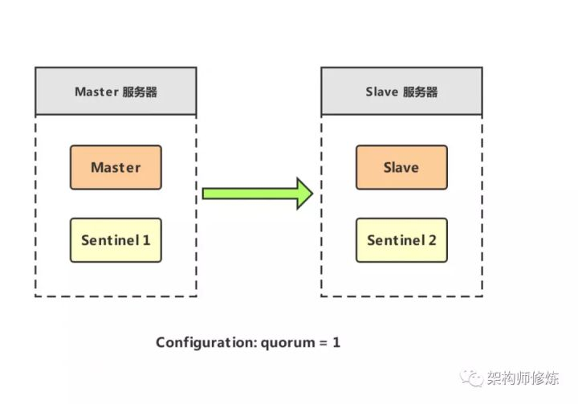
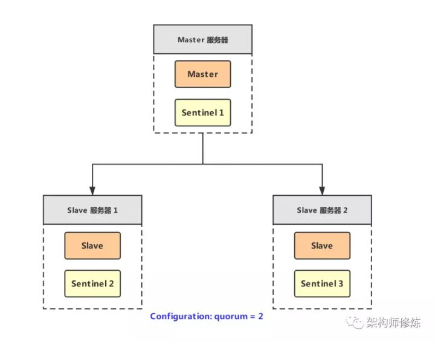
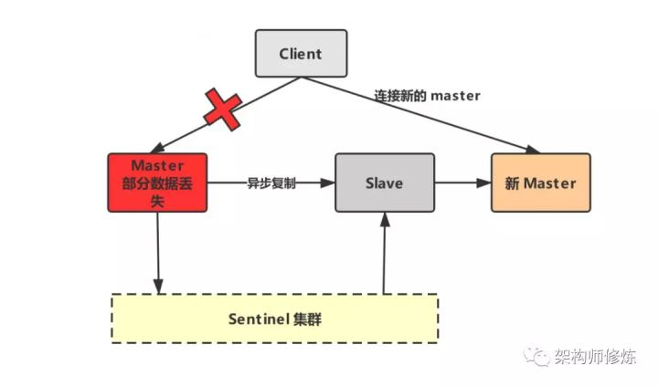
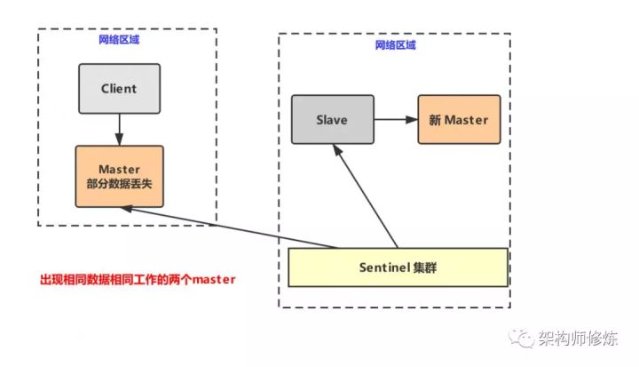
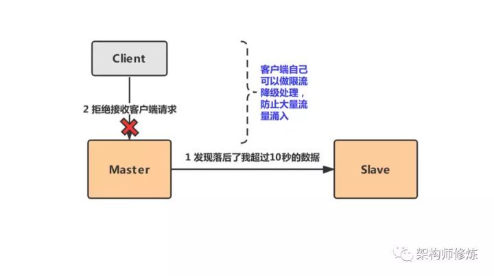

## redis哨兵核心机制

1. redis sentinel

    哨兵在redis集群架构中是**一个非常重要的组件**，其主要功能有下面这些：

    * 集群监控，即时刻监控着redis的master和slave进程是否是在正常工作。
    * 消息通知，就是说当它发现有redis实例有故障的话，就会发送消息给管理员
    * 故障自动转移，如果redis master 节点宕机了的话，它就会将请求转到slave 节点上，slave升为master。
    * 充当配置中心，如果发生了故障转移，它会通知将master的新地址写在配置中心告诉客户端。

    sentinel 本身也是分布式部署的，是一个集群去运行的并且节点间相互协调工作，那它是怎么来监控redis的呢？

    1. 当发生故障转移的时候，只有大部分哨兵节点同意才会判断你这个master是真的宕机了，这里会涉及到前面讲到的分布式选主，如果忘记了自行看下（面试是不是经常被问到分布式系统核心问题，这一次没人难倒你）
    2. 如果哨兵部分节点挂了的话，整个哨兵集群依然能工作，这也是确保自身能高可用。

2. 哨兵核心点

    1. 哨兵集群至少要 3 个节点，来确保自己的健壮性。
    2. redis主从 + sentinel的架构，是不会保证数据的零丢失的，它是为了保证redis集群的高可用。
    3. 在部署redis主从 + sentinel 架构之前，我们要在测试环境多测试，尽量模拟线上环境。

    你可能会问，哨兵集群 2 个节点难道就不行吗？好，如果咱们的哨兵集群只部署了两个节点，那么 quorum=1,

    

    如上图，如果master宕机，sentinel 1 和 sentinel 2 只要有一个认为master宕机就会进行切换，同时sentinel 1 和sentinel 2 就会选出一个sentinel来进行故障转移，这个时候就需要用到majority，即大多数哨兵都是运行的，2个哨兵的majority是2（3个的majority=2，4个的majority=2，5个的majority=3），也就是说现在这两个哨兵节点都是正常运行的就可以进行故障转移。

    但是，现在master和sentinel1运行的整个机器如果宕机了的话，那么哨兵就只有一个了，此时就无法来通过majority来进行故障转移了，所以，我们至少需要三台哨兵实例。

3. 节点sentinel架构

    如上图所示，

    

    假设master所在的机器不可用的话，那么哨兵还剩2个，sentinel 2 和sentinel3 就会认为master宕机，然后选举一个来处理故障转移
    三个哨兵节点的majority为2，现在还有2个哨兵在工作着，就可以允许执行故障转移。
    上面我们已经知道了哨兵的核心机制以及它和redis主从架构是如何配合使用来达到redis的高可用的，下面我们就来看看redis哨兵主备切换的数据丢失问题。

    1. 主从异步复制导致的数据丢失

        redis master 和slave 数据复制是异步的，像前面说的MySQL差不多（数据库读写分离方案，实现高性能数据库集群），这样就有可能会出现部分数据还没有复制到slave中，master就挂掉了，那么这部分的数据就会丢失了。

        

    2. 脑裂导致的数据丢失

        **脑裂其实就是网络分区导致的现象**，比如，我们的master机器网络突然不正常了发生了网络分区，和其他的slave机器不能正常通信了，其实master并没有挂还活着好好的呢，但是哨兵可不是吃闲饭的啊，它会认为master挂掉了啊，那么问题来了，client可能还在继续写master的呀，还没来得及更新到新的master呢，那这部分数据就会丢失。

        

        上面的两个数据丢失的问题，那我们该怎么去解决呢？其实也很简单，只需要在配置中加两个配置就行了，如下:

        ```
        min-slaves-to-write 1 # 要求至少一个slave
        min-slaves-max-lag 10 # 数据复制和同步的延迟不能超过10s
        ```

        我们不能只是去解决问题，我们要知道为什么这么做就可以解决问题，下面我们就来分析下，加上了这两个配置是怎么解决我们数据丢失问题的。

        核心思想就是，**一旦所有的slave节点，在数据复制和同步时延迟了超过10秒的话，那么master它就不会再接客户端的请求了，这样就会有效减少大量数据丢失的发生。**

    * 如何减少异步复制数据的丢失

        现在当我们的slave在数据复制的时候，发现返回的ACK时延太长达到了 min-slaves-max-lag 配置，这个时候就会认为如果master宕机就会导致大量数据丢失，所以就提前进行了预测，就不再去接收客户端的任何请求了，来将丢失的数据降低在可控范围内。

        

    * 减少脑裂数据的丢失

        1. 如果master出现了脑裂，和其他的slave失去了通信，不能继续给指定数量的slave发送数据。
        2. slave超过10秒没有给自己返回ack消息。
        3. master就会拒绝客户端的写请求

4. redis 哨兵底层核心原理深度解析

    上面我们了解到了redis 哨兵的基本知识也解决了数据丢失的问题，那接下来我们来看看哨兵的几个核心底层原理，帮助大家在探讨这类问题的时候，也有话可说，也更不怕面试官问到哨兵机制。

    1. sdown和odown转换机制

        * sdown，即主观宕机，如果一个哨兵它自己觉得master宕机了，就是主观宕机
        * odown，即客观宕机，如果quorum数量的哨兵都认为一个master宕机了，则为客观宕机

        哨兵在ping一个master的时候，如果超过了is-master-down-after-milliseconds指定的毫秒数之后，就是达到了sdown，就主观认为master宕机了。

        如果一个哨兵在指定时间内，收到了quorum指定数量的其他哨兵也认为那个master是sdown了，那么就认为是odown了，客观认为master宕机，就完成了sdown到odown的转换。

    2. 哨兵集群如何实现自动发现

        通过redis的pub/sub系统实现的，每个哨兵都会往__sentinel__:hello这个channel里发送一个消息。其他哨兵可以消费到这个消息，且可以感知到其他哨兵的存在。

        每隔两秒钟，每个哨兵都会向自己监控的某个master+slaves对应的__sentinel__:hello channel里发送一个消息（包括自己的host、ip和runid还有对这个master的监控配置）。

        每个哨兵也会去监听自己监控的每个master+slaves对应的__sentinel__:hello channel，然后去感知到同样在监听这个master+slaves的其他哨兵的存在。

        每个哨兵还会跟其他哨兵交换对master的监控配置，互相进行监控配置的同步。

    3. slave配置如何自动纠正

        slave配置的自动纠正，是由哨兵来负责的。

        例如，slave如果要成为潜在的master候选人，哨兵会确保slave复制现有的master数据；如果slave连接的是一个有问题的master，在故障转移之后，哨兵会确保slave能连上新的没问题的master上。

    4. slave 到master 选举算法

        如果一个master被认为odown了，而且majority（过半以上）哨兵都允许了主备切换，那么某个哨兵就会执行主备切换操作，此时首先要选举一个slave来，主要通过下面几个步骤：需要考虑slave的下面一些信息

        * 跟master断开连接的时长
        * slave优先级
        * 复制offset
        * run id

        如果一个slave跟master断开连接已经超过了down-after-milliseconds的10倍，再加上加master宕机的时长，那么slave就被认为不适合选举为master。

        (down-after-milliseconds * 10) + milliseconds_since_master_is_in_SDOWN_state
        接下来会对slave进行排序

        按照slave优先级进行排序，slave priority越低，优先级就越高。
        如果slave priority相同，那么看replica offset，哪个slave复制了越多的数据，offset越靠后，优先级就越高。
        如果上面两个条件都相同，那么选择一个run id比较小的那个slave

    5. quorum和majority 关系

        每次一个哨兵要做主备切换的时候，首先需要quorum数量的哨兵认为odown，然后选举出一个哨兵来做切换，这个哨兵还得得到majority哨兵的授权，才能正式执行切换。

        如果quorum < majority，比如5个哨兵，majority就是3，quorum设置为2，那么就3个哨兵授权就可以执行切换

        如果quorum >= majority，那么必须quorum数量的哨兵都授权，比如5个哨兵，quorum是5，那么必须5个哨兵都同意授权，才能执行切换。

    6. configuration epoch

        哨兵会对一套redis master+slave进行监控，有相应的监控的配置

        执行切换的那个哨兵，会从要切换到的新master（salve->master）那里得到一个configuration epoch，这就是一个version号，每次切换的version号都必须是唯一的。

        如果第一个选举出的哨兵切换失败了，那么其他哨兵，会等待failover-timeout时间，然后接替继续执行切换，此时会重新获取一个新的configuration epoch，作为新的version号

    7. configuraiton传播

        哨兵完成切换之后，会在自己本地更新生成最新的master配置，然后同步给其他的哨兵，就是通过之前说的pub/sub消息机制

        这里之前的version号就很重要了，因为各种消息都是通过一个channel去发布和监听的，所以一个哨兵完成一次新的切换之后，新的master配置是跟着新的version号的，其他的哨兵都是根据版本号的大小来更新自己的master配置的。

        总结，今天我们学习了redis sentinel 机制的基本使用，同时在使用过程中对于可能出现的数据丢失进行相关避坑方案讲解，最后将哨兵的几个重要的底层知识进行了详细的讲解，希望帮助大家能更好的掌握redis的哨兵机制。

原文：https://zhuanlan.zhihu.com/p/95678924
