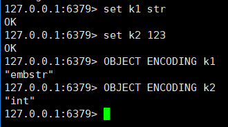

## 数据结构分析

0. 目录
    1. 演示数据类型的实现
    2. 简单动态字符串
    3. 链表
    4. 字典
    5. 跳跃表
    6. 整数集合
    7. 压缩列表
    8. 总结


1. 演示数据类型的实现

    上篇博客我们在介绍 key 相关命令的时候，介绍了如下命令：

    ```
    OBJECT ENCODING    key 
    ```

    该命令是用来显示那五大数据类型的底层数据结构。

    比如对于 string 数据类型：

    

    我们可以看到实现string数据类型的数据结构有 embstr 以及 int。

    再比如 list 数据类型：

    

    这里我们就不做过多的演示了，那么上次出现的 embstr 以及 int 还有 quicklist 是什么数据结构呢？下面我们就来介绍Redis中几种主要的数据结构。


2. 简单动态字符串


    第一篇文章我们就说过 Redis 是用 C 语言写的，但是对于Redis的字符串，却不是 C 语言中的字符串（即以空字符’\0’结尾的字符数组），它是自己构建了一种名为 简单动态字符串（simple dynamic string,SDS）的抽象类型，并将 SDS 作为 Redis的默认字符串表示。

    SDS 定义：

    ```C++
    struct sdshdr{
        //记录buf数组中已使用字节的数量
        //等于 SDS 保存字符串的长度
        int len;
        //记录 buf 数组中未使用字节的数量
        int free;
        //字节数组，用于保存字符串
        char buf[];
    }
    ```

    用SDS保存字符串 “Redis”具体图示如下：

    

    图片来源：《Redis设计与实现》

    我们看上面对于 SDS 数据类型的定义：
 
    1. len 保存了SDS保存字符串的长度

    2. buf[] 数组用来保存字符串的每个元素

    3. free j记录了 buf 数组中未使用的字节数量

    上面的定义相对于 C 语言对于字符串的定义，多出了 len 属性以及 free 属性。为什么不使用C语言字符串实现，而是使用 SDS呢？这样实现有什么好处？

    1. 常数复杂度获取字符串长度

        由于 len 属性的存在，我们获取 SDS 字符串的长度只需要读取 len 属性，时间复杂度为 O(1)。而对于 C 语言，获取字符串的长度通常是经过遍历计数来实现的，时间复杂度为 O(n)。通过 strlen key 命令可以获取 key 的字符串长度。

    2. 杜绝缓冲区溢出

        我们知道在 C 语言中使用 strcat  函数来进行两个字符串的拼接，一旦没有分配足够长度的内存空间，就会造成缓冲区溢出。而对于 SDS 数据类型，在进行字符修改的时候，会首先根据记录的 len 属性检查内存空间是否满足需求，如果不满足，会进行相应的空间扩展，然后在进行修改操作，所以不会出现缓冲区溢出。

    3. 减少修改字符串的内存重新分配次数

        C语言由于不记录字符串的长度，所以如果要修改字符串，必须要重新分配内存（先释放再申请），因为如果没有重新分配，字符串长度增大时会造成内存缓冲区溢出，字符串长度减小时会造成内存泄露。

        而对于SDS，由于len属性和free属性的存在，对于修改字符串SDS实现了空间预分配和惰性空间释放两种策略：

        1. 空间预分配：对字符串进行空间扩展的时候，扩展的内存比实际需要的多，这样可以减少连续执行字符串增长操作所需的内存重分配次数。

        2. 惰性空间释放：对字符串进行缩短操作时，程序不立即使用内存重新分配来回收缩短后多余的字节，而是使用 free 属性将这些字节的数量记录下来，等待后续使用。（当然SDS也提供了相应的API，当我们有需要时，也可以手动释放这些未使用的空间。）

    4. 二进制安全

        因为C字符串以空字符作为字符串结束的标识，而对于一些二进制文件（如图片等），内容可能包括空字符串，因此C字符串无法正确存取；而所有 SDS 的API 都是以处理二进制的方式来处理 buf 里面的元素，并且 SDS 不是以空字符串来判断是否结束，而是以 len 属性表示的长度来判断字符串是否结束。

    5. 兼容部分 C 字符串函数

        虽然 SDS 是二进制安全的，但是一样遵从每个字符串都是以空字符串结尾的惯例，这样可以重用 C 语言库<string.h> 中的一部分函数。

    6. 总结

    

        一般来说，SDS 除了保存数据库中的字符串值以外，SDS 还可以作为缓冲区（buffer）：包括 AOF 模块中的AOF缓冲区以及客户端状态中的输入缓冲区。后面在介绍Redis的持久化时会进行介绍。


3. 链表

    链表是一种常用的数据结构，C 语言内部是没有内置这种数据结构的实现，所以Redis自己构建了链表的实现。关于链表的详细介绍可以参考我的这篇博客。

    链表定义：

    ```C++
    typedef  struct listNode{
        //前置节点
        struct listNode *prev;
        //后置节点
        struct listNode *next;
        //节点的值
        void *value;  
    }listNode
    ```

    通过多个 listNode 结构就可以组成链表，这是一个双端链表，Redis还提供了操作链表的数据结构：

    ```C++
    typedef struct list{
        //表头节点
        listNode *head;
        //表尾节点
        listNode *tail;
        //链表所包含的节点数量
        unsigned long len;
        //节点值复制函数
        void (*free) (void *ptr);
        //节点值释放函数
        void (*free) (void *ptr);
        //节点值对比函数
        int (*match) (void *ptr,void *key);
    }list;
    ```

    Redis链表特性：

    1. 双端：链表具有前置节点和后置节点的引用，获取这两个节点时间复杂度都为O(1)。

    2. 无环：表头节点的 prev 指针和表尾节点的 next 指针都指向 NULL,对链表的访问都是以 NULL 结束。    
    3. 带链表长度计数器：通过 len 属性获取链表长度的时间复杂度为 O(1)。

    4. 多态：链表节点使用 void* 指针来保存节点值，可以保存各种不同类型的值。

4. 字典
    
    字典又称为符号表或者关联数组、或映射（map），是一种用于保存键值对的抽象数据结构。字典中的每一个键 key 都是唯一的，通过 key 可以对值来进行查找或修改。C 语言中没有内置这种数据结构的实现，所以字典依然是 Redis自己构建的。

    Redis 的字典使用哈希表作为底层实现，关于哈希表的详细讲解可以参考我这篇博客。

    哈希表结构定义：

    ```C++
    typedef struct dictht{
        //哈希表数组
        dictEntry **table;
        //哈希表大小
        unsigned long size;
        //哈希表大小掩码，用于计算索引值
        //总是等于 size-1
        unsigned long sizemask;
        //该哈希表已有节点的数量
        unsigned long used;
    }dictht
    ```

    哈希表是由数组 table 组成，table 中每个元素都是指向 dict.h/dictEntry 结构，dictEntry 结构定义如下：

    ```C++
    typedef struct dictEntry{
        //键
        void *key;
        //值
        union{
            void *val;
            uint64_tu64;
            int64_ts64;
        }v;
 
        //指向下一个哈希表节点，形成链表
        struct dictEntry *next;
    }dictEntry
    ```

    key 用来保存键，val 属性用来保存值，值可以是一个指针，也可以是uint64_t整数，也可以是int64_t整数。

    注意这里还有一个指向下一个哈希表节点的指针，我们知道哈希表最大的问题是存在哈希冲突，如何解决哈希冲突，有开放地址法和链地址法。这里采用的便是链地址法，通过next这个指针可以将多个哈希值相同的键值对连接在一起，用来解决哈希冲突。

    

    1. 哈希算法：Redis计算哈希值和索引值方法如下：

        1. 使用字典设置的哈希函数，计算键 key 的哈希值
        
            ```C++
            hash = dict->type->hashFunction(key);
            ```

        2. 使用哈希表的sizemask属性和第一步得到的哈希值，计算索引值
            
            ```C++
            index = hash & dict->ht[x].sizemask;
            ```

    2. 解决哈希冲突：这个问题上面我们介绍了，方法是链地址法。通过字典里面的 *next 指针指向下一个具有相同索引值的哈希表节点。

    3. 扩容和收缩：当哈希表保存的键值对太多或者太少时，就要通过 rerehash(重新散列）来对哈希表进行相应的扩展或者收缩。具体步骤：

        1. 如果执行扩展操作，会基于原哈希表创建一个大小等于 ht[0].used*2n 的哈希表（也就是每次扩展都是根据原哈希表已使用的空间扩大一倍创建另一个哈希表）。相反如果执行的是收缩操作，每次收缩是根据已使用空间缩小一倍创建一个新的哈希表。

        2. 重新利用上面的哈希算法，计算索引值，然后将键值对放到新的哈希表位置上。

        3. 所有键值对都迁徙完毕后，释放原哈希表的内存空间。

    4. 触发扩容的条件：

        1. 服务器目前没有执行 BGSAVE 命令或者 BGREWRITEAOF 命令，并且负载因子大于等于1。

        2. 服务器目前正在执行 BGSAVE 命令或者 BGREWRITEAOF 命令，并且负载因子大于等于5。

        ps：负载因子 = 哈希表已保存节点数量 / 哈希表大小。

    5. 渐近式 rehash

        什么叫渐进式 rehash？也就是说扩容和收缩操作不是一次性、集中式完成的，而是分多次、渐进式完成的。如果保存在Redis中的键值对只有几个几十个，那么 rehash 操作可以瞬间完成，但是如果键值对有几百万，几千万甚至几亿，那么要一次性的进行 rehash，势必会造成Redis一段时间内不能进行别的操作。所以Redis采用渐进式 rehash,这样在进行渐进式rehash期间，字典的删除查找更新等操作可能会在两个哈希表上进行，第一个哈希表没有找到，就会去第二个哈希表上进行查找。但是进行 增加操作，一定是在新的哈希表上进行的。

5. 跳跃表

    关于跳跃表的趣味介绍：http://blog.jobbole.com/111731/

    跳跃表（skiplist）是一种有序数据结构，它通过在每个节点中维持多个指向其它节点的指针，从而达到快速访问节点的目的。具有如下性质：

    1. 由很多层结构组成；

    2. 每一层都是一个有序的链表，排列顺序为由高层到底层，都至少包含两个链表节点，分别是前面的head节点和后面的nil节点；

    3. 最底层的链表包含了所有的元素；

    4. 如果一个元素出现在某一层的链表中，那么在该层之下的链表也全都会出现（上一层的元素是当前层的元素的子集）；

    5. 链表中的每个节点都包含两个指针，一个指向同一层的下一个链表节点，另一个指向下一层的同一个链表节点；

    Redis中跳跃表节点定义如下：

    ```C++
    typedef struct zskiplistNode {
        //层
        struct zskiplistLevel{
            //前进指针
            struct zskiplistNode *forward;
            //跨度
            unsigned int span;
        }level[];
    
        //后退指针
        struct zskiplistNode *backward;
        //分值
        double score;
        //成员对象
        robj *obj;
    } zskiplistNode
    ```

    多个跳跃表节点构成一个跳跃表：

    ```C++
    typedef struct zskiplist{
        //表头节点和表尾节点
        structz skiplistNode *header, *tail;
        //表中节点的数量
        unsigned long length;
        //表中层数最大的节点的层数
        int level;
    
    }zskiplist;
    ```
    
    1. 搜索：从最高层的链表节点开始，如果比当前节点要大和比当前层的下一个节点要小，那么则往下找，也就是和当前层的下一层的节点的下一个节点进行比较，以此类推，一直找到最底层的最后一个节点，如果找到则返回，反之则返回空。

    2. 插入：首先确定插入的层数，有一种方法是假设抛一枚硬币，如果是正面就累加，直到遇见反面为止，最后记录正面的次数作为插入的层数。当确定插入的层数k后，则需要将新元素插入到从底层到k层。

    3. 删除：在各个层中找到包含指定值的节点，然后将节点从链表中删除即可，如果删除以后只剩下头尾两个节点，则删除这一层。


6. 整数集合

    整数集合（intset）是Redis用于保存整数值的集合抽象数据类型，它可以保存类型为int16_t、int32_t 或者int64_t 的整数值，并且保证集合中不会出现重复元素。

    定义如下：

    ```C++
    typedef struct intset{
        //编码方式
        uint32_t encoding;
        //集合包含的元素数量
        uint32_t length;
        //保存元素的数组
        int8_t contents[];
    }intset;
    ```

    整数集合的每个元素都是 contents 数组的一个数据项，它们按照从小到大的顺序排列，并且不包含任何重复项。

    length 属性记录了 contents 数组的大小。

    需要注意的是虽然 contents 数组声明为 int8_t 类型，但是实际上contents 数组并不保存任何 int8_t 类型的值，其真正类型有 encoding 来决定。

    1. 升级

        当我们新增的元素类型比原集合元素类型的长度要大时，需要对整数集合进行升级，才能将新元素放入整数集合中。具体步骤：

        1. 根据新元素类型，扩展整数集合底层数组的大小，并为新元素分配空间。

        2. 将底层数组现有的所有元素都转成与新元素相同类型的元素，并将转换后的元素放到正确的位置，放置过程中，维持整个元素顺序都是有序的。

        3. 将新元素添加到整数集合中（保证有序）。

        升级能极大地节省内存。

    2. 降级

        整数集合不支持降级操作，一旦对数组进行了升级，编码就会一直保持升级后的状态。


7. 压缩列表

    压缩列表（ziplist）是Redis为了节省内存而开发的，是由一系列特殊编码的连续内存块组成的顺序型数据结构，一个压缩列表可以包含任意多个节点（entry），每个节点可以保存一个字节数组或者一个整数值。

    压缩列表的原理：压缩列表并不是对数据利用某种算法进行压缩，而是将数据按照一定规则编码在一块连续的内存区域，目的是节省内存。

    

    压缩列表的每个节点构成如下：

    

    1. previous_entry_length：记录压缩列表前一个字节的长度。previous_entry_ength的长度可能是1个字节或者是5个字节，如果上一个节点的长度小于254，则该节点只需要一个字节就可以表示前一个节点的长度了，如果前一个节点的长度大于等于254，则previous length的第一个字节为254，后面用四个字节表示当前节点前一个节点的长度。利用此原理即当前节点位置减去上一个节点的长度即得到上一个节点的起始位置，压缩列表可以从尾部向头部遍历。这么做很有效地减少了内存的浪费。

    2. encoding：节点的encoding保存的是节点的content的内容类型以及长度，encoding类型一共有两种，一种字节数组一种是整数，encoding区域长度为1字节、2字节或者5字节长。

    3. content：content区域用于保存节点的内容，节点内容类型和长度由encoding决定。

8. 总结

    大多数情况下，Redis使用简单字符串SDS作为字符串的表示，相对于C语言字符串，SDS具有常数复杂度获取字符串长度，杜绝了缓存区的溢出，减少了修改字符串长度时所需的内存重分配次数，以及二进制安全能存储各种类型的文件，并且还兼容部分C函数。

    通过为链表设置不同类型的特定函数，Redis链表可以保存各种不同类型的值，除了用作列表键，还在发布与订阅、慢查询、监视器等方面发挥作用（后面会介绍）。

    Redis的字典底层使用哈希表实现，每个字典通常有两个哈希表，一个平时使用，另一个用于rehash时使用，使用链地址法解决哈希冲突。

    跳跃表通常是有序集合的底层实现之一，表中的节点按照分值大小进行排序。

    整数集合是集合键的底层实现之一，底层由数组构成，升级特性能尽可能的节省内存。

    压缩列表是Redis为节省内存而开发的顺序型数据结构，通常作为列表键和哈希键的底层实现之一。

    以上介绍的简单字符串、链表、字典、跳跃表、整数集合、压缩列表等数据结构就是Redis底层的一些数据结构，用来实现上一篇博客介绍的Redis五大数据类型，那么每种数据类型是由哪些数据结构实现的呢？下一篇博客进行介绍。

参考文档：《Redis设计与实现》

原文：https://www.cnblogs.com/ysocean/p/9080942.html