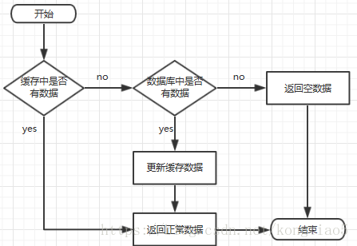

## 缓存穿透、缓存击穿、缓存雪崩区别和解决方案


1. 缓存处理流程

    前台请求，后台先从缓存中取数据，取到直接返回结果，取不到时从数据库中取，数据库取到更新缓存，并返回结果，数据库也没取到，那直接返回空结果。

    

2. 缓存穿透

    * 描述：

        **缓存穿透是指缓存和数据库中都没有的数据**，而用户不断发起请求，如发起为id为“-1”的数据或id为特别大不存在的数据。这时的用户很可能是攻击者，攻击会导致数据库压力过大。

    * 解决方案：

        1. 接口层增加校验，如用户鉴权校验，id做基础校验，id<=0的直接拦截；
        2. 从缓存取不到的数据，在数据库中也没有取到，这时也可以将key-value对写为key-null，缓存有效时间可以设置短点，如30秒（设置太长会导致正常情况也没法使用）。这样可以防止攻击用户反复用同一个id暴力攻击。
 

3. 缓存击穿

    * 描述：

        **缓存击穿是指缓存中没有但数据库中有的数据**（一般是缓存时间到期），这时由于并发用户特别多，同时读缓存没读到数据，又同时去数据库去取数据，引起数据库压力瞬间增大，造成过大压力

    * 解决方案：

        1. 设置热点数据永远不过期。

        2. 加互斥锁，互斥锁参考代码如下：       
            
            ```java
            public static String getData(String key) throws InterruptedException{	
                //从缓存读取数据	
                String result = getDataFromRedis(key);
                
                //缓存中不存在数据
                if (result == null)	{	
                    //去获取锁，获取成功，去数据库取数据		
                    if (reenLock.tryLock()){			
                        //从数据获取数据	
                        result = getDataFromMysql(key);			
                        //更新缓存数据		
                        if (result != null){
                            setDataToCache(key, result);				
                            //释放锁		
                            reenLock. unlock();
                        }
                    }else{  //获取锁失败
                        //暂停100ms再重新去获取数据
                        Thread.sleep(100);
                        result = getData(key);
                        return result;
                    }
                }
                return result;
            }
            ```

            说明：

            1. 缓存中有数据，直接走上述代码13行后就返回结果了

            2. 缓存中没有数据，第1个进入的线程，获取锁并从数据库去取数据，没释放锁之前，其他并行进入的线程会等待100ms，再重新去缓存取数据。这样就防止都去数据库重复取数据，重复往缓存中更新数据情况出现。

            3. 当然这是简化处理，理论上如果能根据key值加锁就更好了，就是线程A从数据库取key1的数据并不妨碍线程B取key2的数据，上面代码明显做不到这点。

4. 缓存雪崩

    * 描述：

        **缓存雪崩是指缓存中数据大批量到过期时间，而查询数据量巨大，引起数据库压力过大甚至down机。** 和缓存击穿不同的是，缓存击穿指并发查同一条数据，缓存雪崩是不同数据都过期了，很多数据都查不到从而查数据库。

    * 解决方案：

        1. 缓存数据的过期时间设置随机，防止同一时间大量数据过期现象发生。
        2. 如果缓存数据库是分布式部署，将热点数据均匀分布在不同搞得缓存数据库中。
        设置热点数据永远不过期。

原文：https://blog.csdn.net/kongtiao5/article/details/82771694