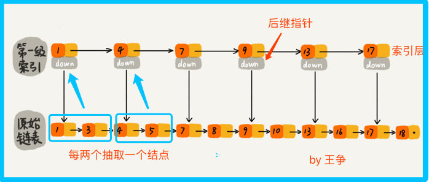
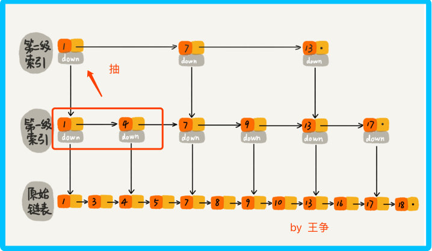
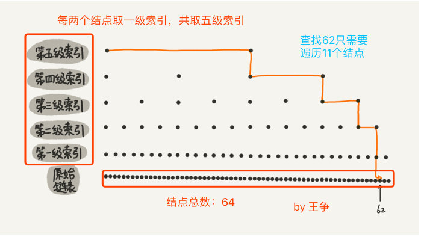
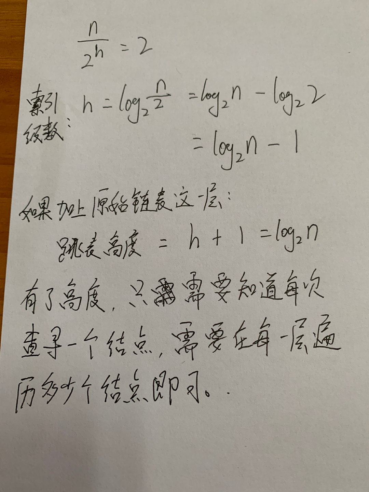
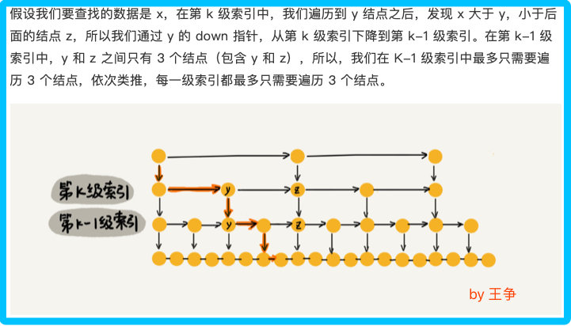
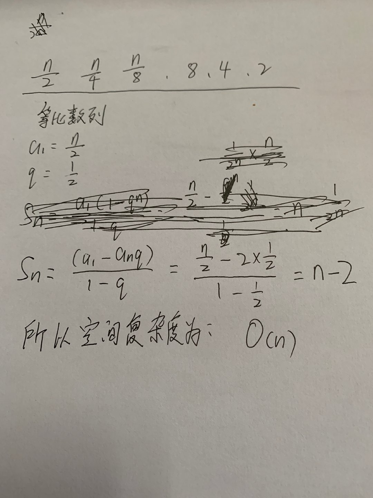
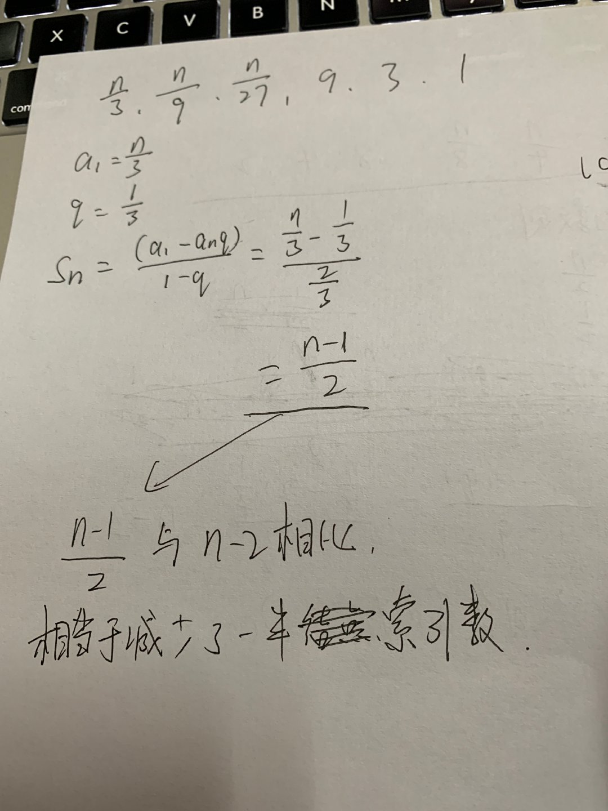
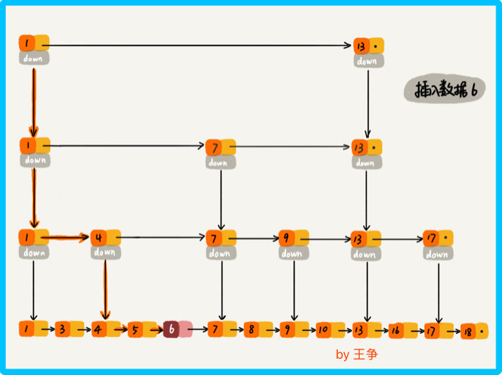
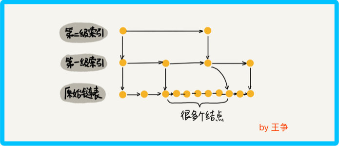
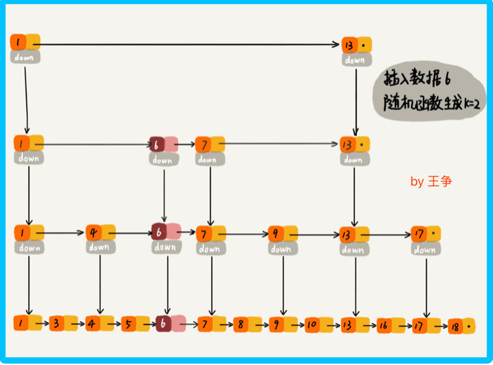

## redis跳表

此时跳表出现了，跳表（Skip list） 实际上就是在链表的基础上改造生成的。 

跳表是一种各方面性能都比较优秀的动态数据结构，可以支持快速的插入、删除、查找操作，写起来也不复杂，甚至可以替代 红黑树？？。 

Redis 一共有5种数据结构，包括：

 
1. 字符串(String)

    redis对于KV的操作效率很高，可以直接用作计数器。例如，统计在线人数等等，另外string类型是二进制存储安全的，所以也可以使用它来存储图片，甚至是视频等。

2. 哈希(hash)

    存放键值对，一般可以用来存某个对象的基本属性信息，例如，用户信息，商品信息等，另外，由于hash的大小在小于配置的大小的时候使用的是ziplist结构，比较节约内存，所以针对大量的数据存储可以考虑使用hash来分段存储来达到压缩数据量，节约内存的目的，例如，对于大批量的商品对应的图片地址名称。比如：商品编码固定是10位，可以选取前7位做为hash的key,后三位作为field，图片地址作为value。这样每个hash表都不超过999个，只要把redis.conf中的hash-max-ziplist-entries改为1024，即可。

3. 列表(List)

    列表类型，可以用于实现消息队列，也可以使用它提供的range命令，做分页查询功能。

4. 集合(Set)

    集合，整数的有序列表可以直接使用set。可以用作某些去重功能，例如用户名不能重复等，另外，还可以对集合进行交集，并集操作，来查找某些元素的共同点

5. 有序集合(zset)

    有序集合，可以使用范围查找，排行榜功能或者topN功能。

    其中第五个zset 有序集合 就是用跳表来实现的。那 Redis 为什么会选择用跳表来实现有序集合呢？  

### 一、如何理解跳表？ 

对于单链表来说，我们查找某个数据，只能从头到尾遍历链表，此时时间复杂度是 ○(n)。 

单链表 
那么怎么提高单链表的查找效率呢？看下图，对链表建立一级 索引，每两个节点提取一个结点到上一级，被抽出来的这级叫做 索引 或 索引层。 

第一级索引 
开发中经常会用到一种处理方式，hashmap 中存储的值类型是一个 list，这里就可以把索引当做 hashmap 中的键，将每 2 个结点看成每个键对应的值 list。 

所以要找到13，就不需要将16前的结点全遍历一遍，只需要遍历索引，找到13，然后发现下一个结点是17，那么16一定是在 [13,17] 之间的，此时在13位置下降到原始链表层，找到16，加上一层索引后，查找一个结点需要遍历的结点个数减少了，也就是说查找效率提高了 

那么我们再加一级索引呢？
跟前面建立一级索引的方式相似，我们在第一级索引的基础上，每两个结点就抽出一个结点到第二级索引。此时再查找16，只需要遍历 6 个结点了，需要遍历的结点数量又减少了。 

第二级索引 
当结点数量多的时候，这种添加索引的方式，会使查询效率提高的非常明显、

这种链表加多级索引的结构，就是跳表。 

### 二、用跳表查询到底有多快

在一个单链表中，查询某个数据的时间复杂度是 ○(n)，那在一个具有多级索引的跳表中，查询某个数据的时间复杂度是多少呢？ 

按照上面的示例，每两个节点就抽出一个一级索引，每两个一级索引又抽出一个二级索引，所以第一级索引的结点个数大约就是 n/2，第二级索引的结点个数就是 n/4，第 k 级索引的结点个数就是 n/2^k。 

假设一共建立了 h 级索引，最高级的索引有两个节点（如果最高级索引只有一个结点，那么这一级索引起不到判断区间的作用，那么是没什么意义的），所以有： 

时间复杂度的分析 

每级遍历多少个结点 
根据上图得知，每级遍历 3 个结点即可，而跳表的高度为 h ，所以每次查找一个结点时，需要遍历的结点数为 3*跳表高度 ，所以忽略低阶项和系数后的时间复杂度就是 ○(㏒n) 

其实此时就相当于基于单链表实现了二分查找。但是这种查询效率的提升，由于建立了很多级索引，会不会很浪费内存呢？ 

### 三、跳表是不是很浪费内存？ 

来分析一下跳表的空间复杂度。 为O(n)

每层索引结点数 
 

空间复杂度 
所以如果将包含 n 个结点的单链表构造成跳表，我们需要额外再用接近 n 个结点的存储空间，那怎么才能降低索引占用的内存空间呢？ 

前面是每两个结点抽一个结点到上级索引，如果我们每三个，或每五个结点，抽一个结点到上级索引，是不是就不用那么多索引结点了呢？ 

每三个结点抽取一个上级索引 
计算空间复杂度的过程与前面的一致，尽管最后空间复杂度依然是 ○(n)，但我们知道，使用大○表示法忽略的低阶项或系数，实际上同样会产生影响，只不过我们为了关注高阶项而将它们忽略。 

空间复杂度 
实际上，在实际开发中，我们不需要太在意索引占据的额外空间，在学习数据结构与算法时，我们习惯的将待处理数据看成整数，但是实际开发中，原始链表中存储的很可能是很大的对象，而索引结点只需要存储关键值（用来比较的值）和几个指针（找到下级索引的指针），并不需要存储原始链表中完整的对象，所以当对象比索引结点大很多时，那索引占用的额外空间就可以忽略了。 

#### 四、高效的动态插入和删除

跳表这个动态数据结构，不仅支持查找操作，还支持动态的插入、删除操作，而且插入、删除操作的时间复杂度也是 ○(㏒n)。 

对于单纯的单链表，需要遍历每个结点来找到插入的位置。但是对于跳表来说，因为其查找某个结点的时间复杂度是 ○(㏒n)，所以这里查找某个数据应该插入的位置，时间复杂度也是 ○(㏒n)。 

插入操作 
那么删除操作呢？ 

删除操作

### 五、跳表索引动态更新

当我们不停的往跳表中插入数据时，如果我们不更新索引，就可能出现某 2 个索引结点之间数据非常多的情况。极端情况下，跳表会退化成单链表。 

作为一种动态数据结构，我们需要某种手段来维护索引与原始链表大小之间的平滑，也就是说如果链表中结点多了，索引结点就相应地增加一些，避免复杂度退化，以及查找、插入、删除操作性能下降。
跳表是通过随机函数来维护前面提到的 平衡性。 

我们往跳表中插入数据的时候，可以选择同时将这个数据插入到第几级索引中，比如随机函数生成了值 K，那我们就将这个结点添加到第一级到第 K 级这 K 级索引中。 

随机函数可以保证跳表的索引大小和数据大小的平衡性，不至于性能过度退化。
跳表的实现有点复杂，并且跳表的实现并不是这篇的重点。主要是学习思路。 

### 六、解答开篇 

Redis 中的有序集合是通过跳表来实现的，严格点讲，还用到了散列表（关于散列表），如果查看 Redis 开发手册，会发现 Redis 中的有序集合支持的核心操作主要有下面这几个： 

插入一个数据
删除一个数据
查找一个数据
按照区间查找数据（比如查找在[100,356]之间的数据）
迭代输出有序序列 
其中，插入、查找、删除以及迭代输出有序序列这几个操作，红黑树也能完成，时间复杂度和跳表是一样的，但是，按照区间来查找数据这个操作，红黑树的效率没有跳表高。 

对于按照区间查找数据这个操作，跳表可以做到 ○(㏒n) 的时间复杂度定位区间的起点，然后在原始链表中顺序往后遍历就可以了。这样做非常高效。 

当然，还有其他原因，比如，跳表代码更容易实现，可读性好不易出错。跳表更加灵活，可以通过改变索引构建策略，有效平衡执行效率和内存消耗。 

不过跳表也不能完全替代红黑树。因为红黑树出现的更早一些。很多编程语言中的 Map 类型都是用红黑树来实现的。写业务的时候直接用就行，但是跳表没有现成的实现，开发中想用跳表，得自己实现。 

原文：https://www.cnblogs.com/aspirant/p/11475295.html