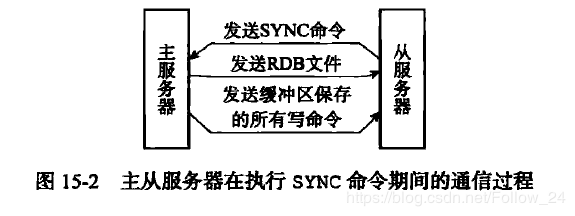
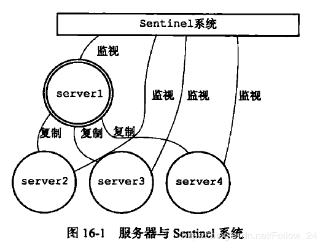
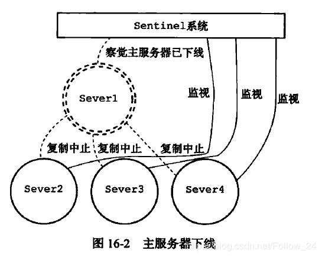
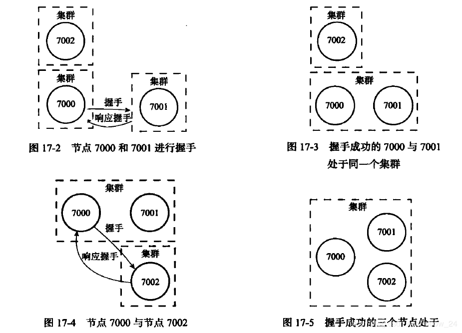
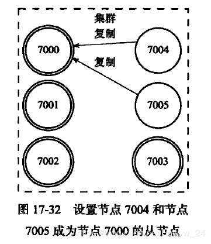

## redis集群模式

redis的多机数据库实现，主要分为以下三种：

* Redis复制（主从）
* Redis哨兵（Sentinel）
* Redis集群

1. Redis的主从复制

    通过执行slaveof命令或设置slaveof选项，让一个服务器去复制另一个服务器的数据。
    被复制的服务器称为：Master主服务；对主服务器进行复制的服务器称为：Slave从服务器。主数据库可以进行读写操作，当写操作导致数据变化时会自动将数据同步给从数据库。而从数据库一般是只读的，并接受主数据库同步过来的数据。一个主数据库可以拥有多个从数据库，而一个从数据库只能拥有一个主数据库。

    主从复制问题：当master down，需要手动将一台slave使用slaveof no one提升为master要实现自动，就需要redis哨兵。

    实现原理步骤：

    1. 从服务器向主服务器发送SYNC命令
    2. 主服务器收到SYNC命令后，执行BGSAVE命令，在后台生成RDB文件，使用缓冲区记录从现在开始执行的所有的写命令。
    3. 当主服务器的BGSAVE命令执行完毕后，主服务器后将BGSAVE命令生成的RDB文件发送给从服务器，从服务器接收并载入这个RDB文件，将自己的数据库状态更新至主服务器执行BGSAVE命令时的数据库状态。
    4. 主服务器将记录在缓冲区里面的所有写命令发送给从服务器，从服务器执行这些写命令，将自己的数据库状态更新至主服务器数据库当前所处的状态。

    

2. Redis的哨兵（Sentinel）

    为了解决Redis的主从复制的不支持高可用性能，Redis实现了Sentinel哨兵机制解决方案。由一个或多个Sentinel去监听任意多个主服务以及主服务器下的所有从服务器，并在被监视的主服务器进入下线状态时，自动将下线的主服务器属下的某个从服务器升级为新的主服务器，然后由新的主服务器代替已经下线的从服务器，并且Sentinel可以互相监视。

    

    监视状态下的主从集群

    
    主服务器下线
    当有多个Sentinel，在进行监视和转移主从服务器时，Sentinel之间会自己首先进行选举，选出Sentinel的leader来进行执行任务。

3. Redis集群

    集群是Redis提供的分布式数据库方案，集群通过分片来进行数据共享，并提供复制和故障转移功能。一个Redis集群通常由多个节点组成；最初，每个节点都是独立的，需要将独立的节点连接起来才能形成可工作的集群。

    Cluster Nodes命令和Cluster Meet命令，添加和连接节点形成集群。

    

    节点握手连接成集群

    

    Redis中的集群分为主节点和从节点。其中主节点用于处理槽；而从节点用于复制某个主节点，并在被复制的主节点下线时，代替下线的主节点继续处理命令请求。

原文：https://www.pianshen.com/article/1023276171/