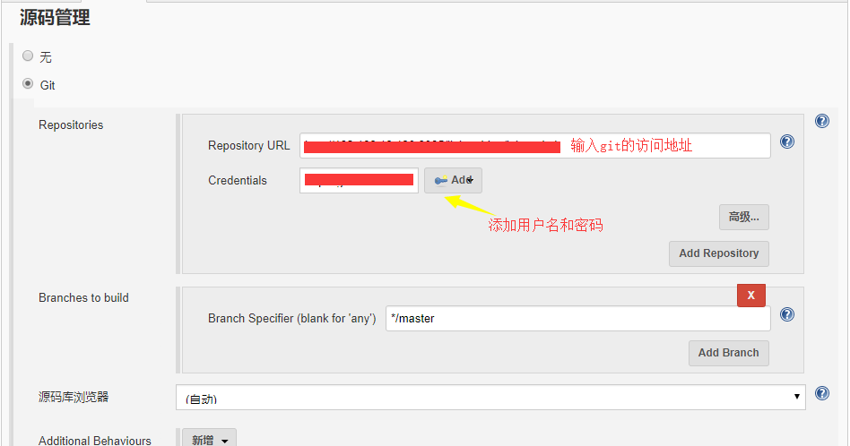
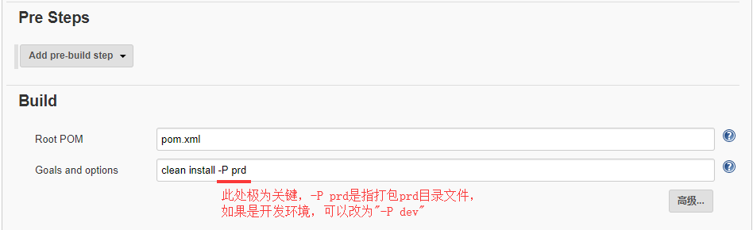

## jenkins多套环境系统自动化发布到远程主机
    本例以springboot为例，介绍下jenkins多套环境系统自动化发布到远程主机

1. 环境准备

    根据前面gitlab,jenkins介绍，搭建好环境后，按照格式整理配置信息
   
    * jenkins
        配置项|值|说明
        --|--|--
        url|${jenkins.url}|jenkins地址

    * git
        配置项|值|说明
        --|--|--
        url|${git.url}|要发布的git地址
        username|${git.username}|git的账号
        passwd|${git.passwd}|git的密码

    * 发布远程主机服务器
        配置项|值|说明
        --|--|--
        ip|${server.ip}|远程服务器ip
        username|${server.username}|远程服务器的登录账号
        passwd|${server.passwd}|远程服务器的登录密码
        port|22|用ssh方式登录，默认端口用22
        remote dir|/home/bill/jenkins|jenkin编译打包好发布的文件后，会上传到这个目录，要提前创建好
        deploy dir|/home/bill/lqb-sprj|将要部署到服务器的这个目录，要提前创建好

2. 配置

    访问Jenkins主页
    1. SSH Servers配置

        Jenkins->配置
        

    2. 配置maven项目
        
        1. Jenkins->所有
        

        2. general
        

        3. 源码管理
        

        4. 触发器
        

        5. 构建环境
        

        6. Build
        

        7. 构建后操作
        
        
        内容文字如下
        ```
        Source files        target/*.tar.gz
        Remove prefix       target
        Remote directory    lqb-sprj
        Exec command        project_dir="/home/bill/lqb-sprj"
                            jenkins_dir="/home/bill/jenkins/lqb-sprj"
                            cd $jenkins_dir
                            tar -zxf *.tar.gz
                            rm -r $project_dir/conf
                            rm -r $project_dir/*.jar
                            rm -r $project_dir/lib
                            cp -rf */* $project_dir
                            rm -r $jenkins_dir/*
                            cd $project_dir
                            chmod +x startup.sh
                            ./startup.sh
        ```
       至此，配置完毕，点击【保存】

    3. 启动
        回到主界面，可以看到任务列表，点击右边的【构建】图标，即可以构建
        