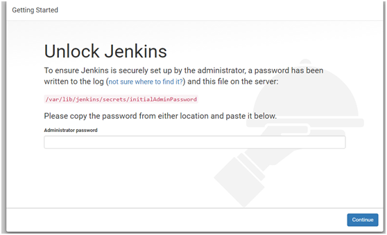
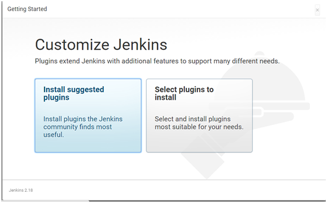
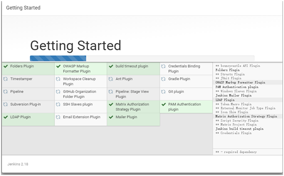
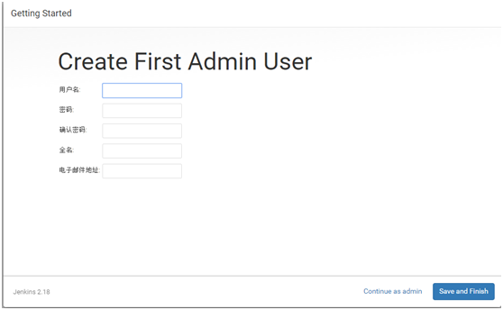
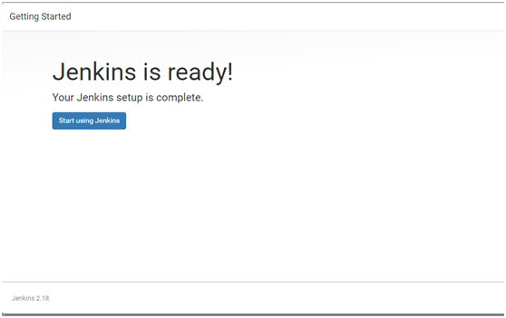

## centos下搭建Jenkins持续集成环境(安装jenkins)

1. 安装JDK

    参考文档：linux常见软件安装.md

2. 安装jenkins

    添加Jenkins库到yum库，Jenkins将从这里下载安装。
    ```bash
    wget -O /etc/yum.repos.d/jenkins.repo http://pkg.jenkins-ci.org/redhat/jenkins.repo
    rpm --import https://jenkins-ci.org/redhat/jenkins-ci.org.key
    yum install -y jenkins
    ```
    如果不能安装就到官网下载jenkis的rmp包，官网地址（http://pkg.jenkins-ci.org/redhat-stable/）
    ```bash
    wget http://pkg.jenkins-ci.org/redhat-stable/jenkins-2.7.3-1.1.noarch.rpm
    rpm -ivh jenkins-2.7.3-1.1.noarch.rpm
    ```
    配置jenkis的端口
    ```bash
    vi /etc/sysconfig/jenkins
    ```
    找到修改端口号：

    JENKINS_PORT="8080"  此端口不冲突可以不修改，我改为了8086

3. 启动jenkins
    ```bash
    service jenkins start/stop/restart
    ```
    * 安装成功后Jenkins将作为一个守护进程随系统启动
    * 系统会创建一个“jenkins”用户来允许这个服务，如果改变服务所有者，同时需要修改/var/log/jenkins, /var/lib/jenkins, 和/var/cache/jenkins的所有者
    * 启动的时候将从/etc/sysconfig/jenkins获取配置参数
    * 默认情况下，Jenkins运行在8080端口，在浏览器中直接访问该端进行服务配置
    * Jenkins的RPM仓库配置被加到/etc/yum.repos.d/jenkins.repo
4. 打开jenkins 

    在浏览器中访问 http://127.0.0.1:8086
    首次进入会要求输入初始密码如下图， 
    初始密码在：/var/lib/jenkins/secrets/initialAdminPassword 
    

    选择“Install suggested plugins”安装默认的插件，下面Jenkins就会自己去下载相关的插件进行安装。 
    
    
    创建超级管理员账号 
    
    


参考：https://www.cnblogs.com/loveyouyou616/p/8714544.html