## jenkins自动发布到远程主机

一、依赖其他工程的若干个web工程

  比如有工程如下：A，B，C，D，E工程，它们之间构建时，没有maven约束的父子工程那样严格
  * A是基础工程
  * B依赖于A
  * C，D，E都依赖于A，B工程，并且C，D，E最后都以tomcat的方式部署应用，因此A，B两个工程会被编译成jar

  jenkins的部署配置分成两步：
  1. 自动编译部署A，B工程，这样能够生成最新的jar
  2. 在分别部署C，D，E的工程

  #### 自动编译部署A，B工程
  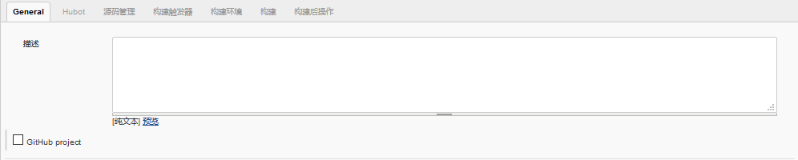
  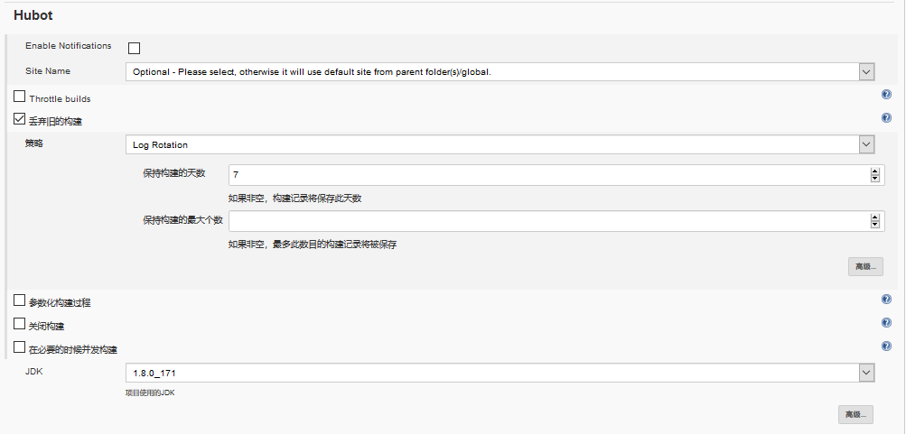
  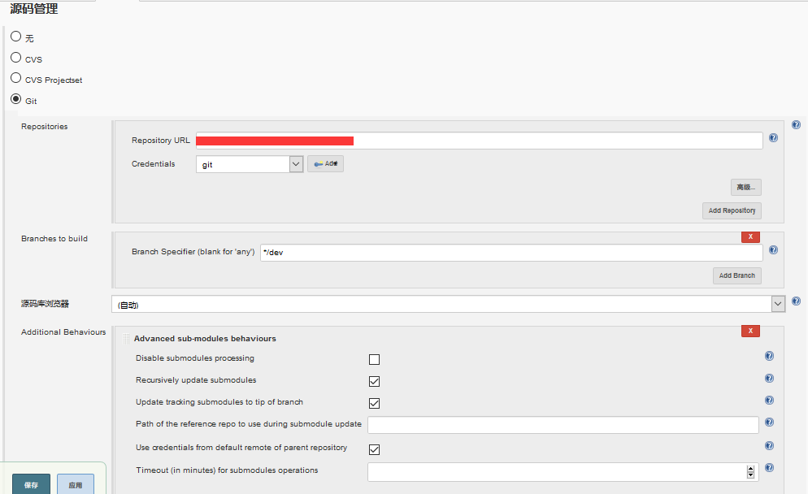
  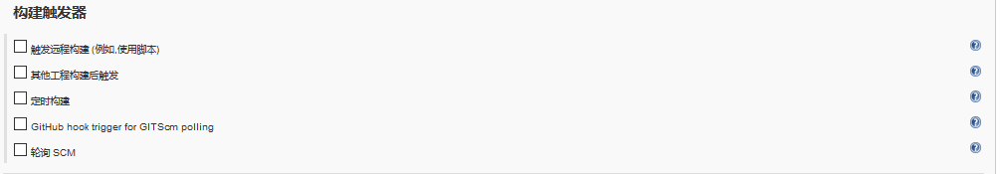
  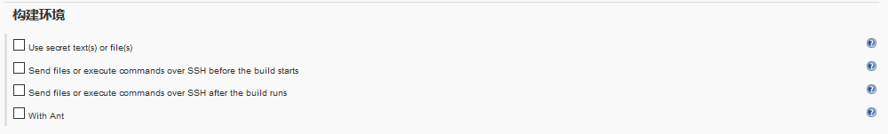
  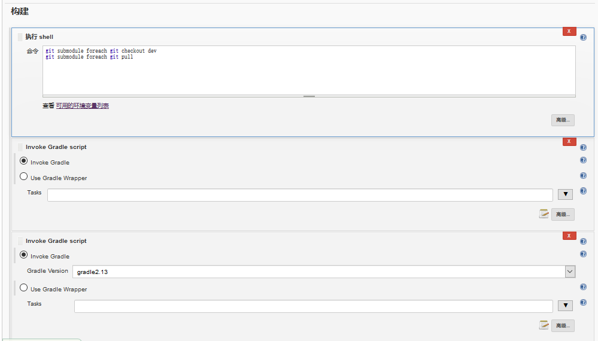

  #### 自动编译部署C工程
  
  
  
  
  
  
  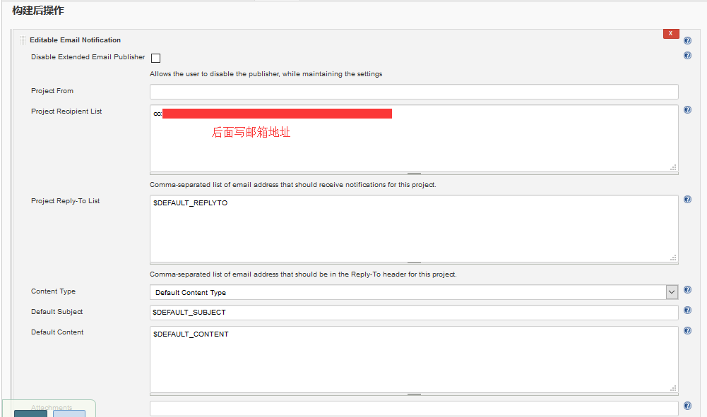
  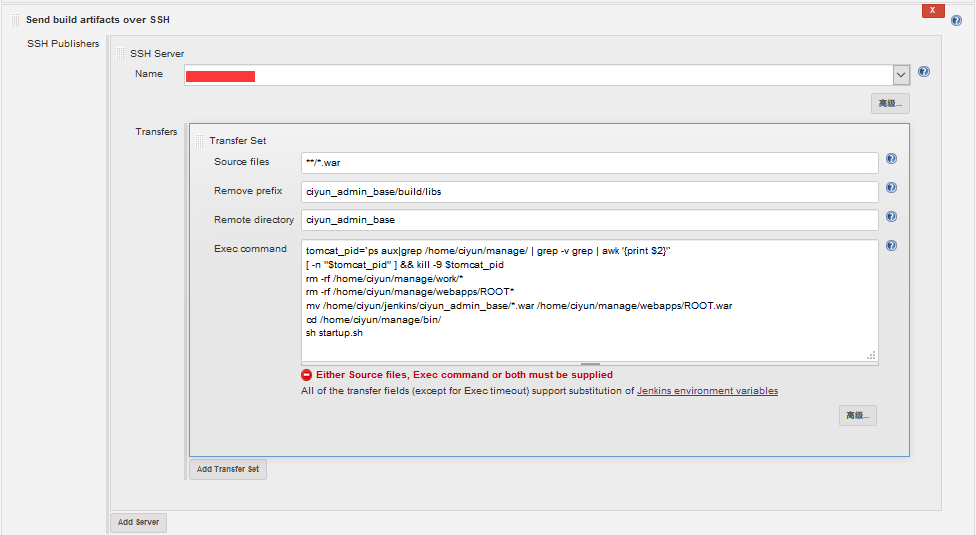

  这两个工程都用gradle脚本编译，两者编译的目标不一样，一个是生成jar，一个是生成war
  a工程的gradle脚本
  ```
  apply plugin: 'java'

  def artifactId = "a"
  version = '0.0.1-SNAPSHOT'
  description = """a"""


  processResources {
      exclude '**/*.properties'
  }

  uploadArchives {
    repositories {
      mavenDeployer {
        mavenLocal()
      }
    }
  }

  install {
    repositories.mavenInstaller {
      pom.version = "$project.version"
      pom.artifactId = "$artifactId"
      pom.groupId = "$project.group"
    }
  }

  dependencies {
    compile(group: 'org.hibernate', name: 'hibernate-core', version:'4.1.2.Final'){
      exclude(module: 'javassist')
    }
    
    compile group: 'com.swetake', name: 'Qrcode', version:'1.0'
    compile group: 'com.swetake', name: 'Qrcode-sources', version:'1.0'
    ...
  }
  ```
  b脚本同理，但脚本里要包含对a工程的依赖
  ```
  dependencies {
      compile project(':a')	//依赖的a工程
  }
  ```

  c工程的gradle脚本
  ```
  apply plugin: 'war'  					 //指定web项目，项目编译时生成项目的war包 test
  apply plugin: 'eclipse-wtp'  			 //插件将构建web项目的开发环境，生成所需要的.project,.classpath等文件
  apply plugin: 'jetty'						//加入jetty的支持，代码修改后直接执行命令gradle jettyRun即可运行web项目
  webAppDirName = 'WebRoot'
  description = """ciyun_admin_base"""

  configurations {
    all*.exclude group: 'com.itextpdf'	//c工程下的lib目录的jar，因为没找到maven的依赖
  }
  dependencies {
    //工程libs目录下的离线jar包
    compile fileTree(dir: 'libs', include: '*.jar')  
    compile group: 'org.springframework.session', name: 'spring-session-data-redis', version:'1.3.0.RELEASE'
      compile group: 'javax.faces', name: 'jsf-api', version:'1.2_04'
    ...
    compile(group: 'org.hibernate', name: 'hibernate-core', version:'4.0.1.Final'){
      exclude(module: 'javassist')
    }
      compile group: 'com.github.sgroschupf', name: 'zkclient', version:'0.1'
    compile project(':a')	//依赖的a工程
    compile project(':b')
    compile group: 'org.quartz-scheduler', name: 'quartz', version:'2.2.1'
    compile group:'com.itextpdf',name:'itextpdf',version:'5.1.2'
    ...
  }

  jettyRun{
    webAppSourceDirectory file("$projectDir/WebRoot")
    httpPort 8888
    contextPath "/"
    scanIntervalSeconds 0
    reload "automatic"
  }


  //执行gradle uatWar打测试环境war包
  task uatWar(type: War){
    from("$projectDir/uatRes") {
      include "**/*"
      into("WEB-INF/classes")
    }
    from("$rootDir/configs/allRes") {
      include "**/*"
      into("WEB-INF/classes")
    }
    from("$rootDir/configs/uatRes") {
      include "**/*"
      into("WEB-INF/classes")
    }
  }

  //执行gradle devWar打开发环境war包
  task devWar(type: War){
    from("$projectDir/devRes") {
      include "**/*"
      into("WEB-INF/classes")
    }
    from("$rootDir/configs/allRes") {
      include "**/*"
      into("WEB-INF/classes")
    }
    from("$rootDir/configs/devRes") {
      include "**/*"
      into("WEB-INF/classes")
    }
  }

  //执行gradle prdWar打现网环境war包
  task prdWar(type: War){
    from("$projectDir/prdRes") {
      include "**/*"
      into("WEB-INF/classes")
    }
    from("$rootDir/configs/allRes") {
      include "**/*"
      into("WEB-INF/classes")
    }
    from("$rootDir/configs/prdRes") {
      include "**/*"
      into("WEB-INF/classes")
    }
  }
  ```

二、单个springboot项目

  只有一个工程，并且是用springboot工程构建而成，最终以jar的方式启动应用
  
  
  
  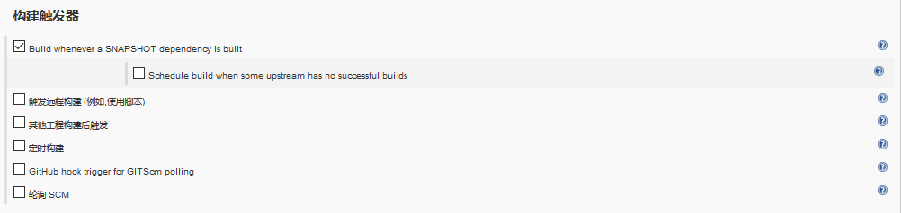
  
  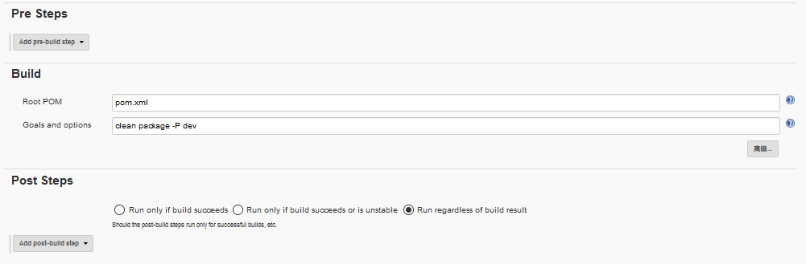
  

三、maven父子工程
  
  构建了一个maven父子工程，分成几个子模块：A，B，C，D
  A是基础工程
  B和C依赖于A
  D依赖于A，B，C，且是一个springboot项目
  
  
  
  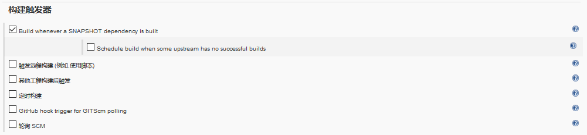
  
  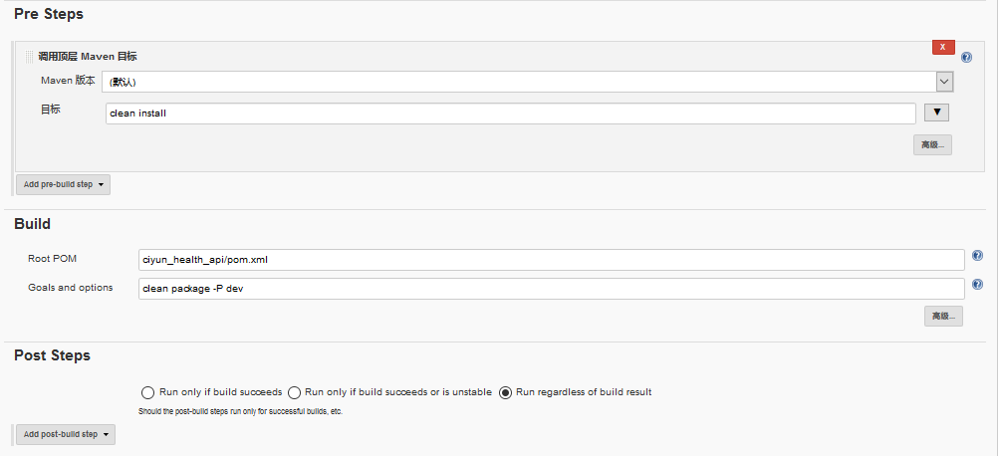
  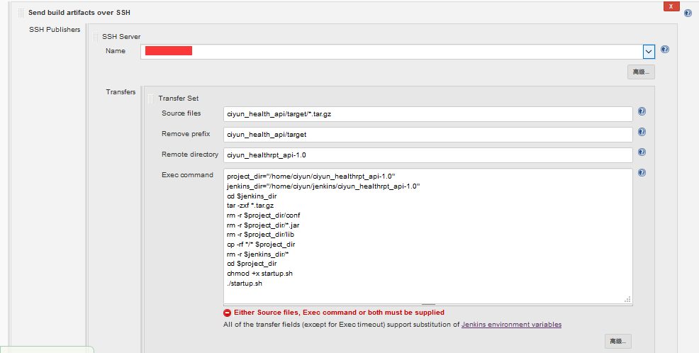
