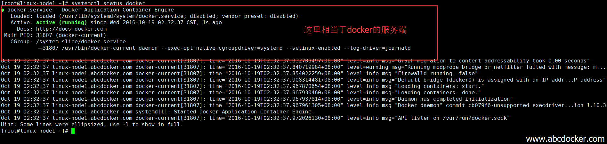
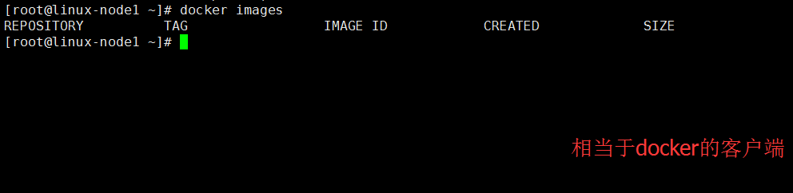
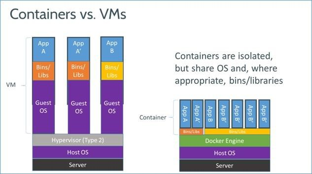
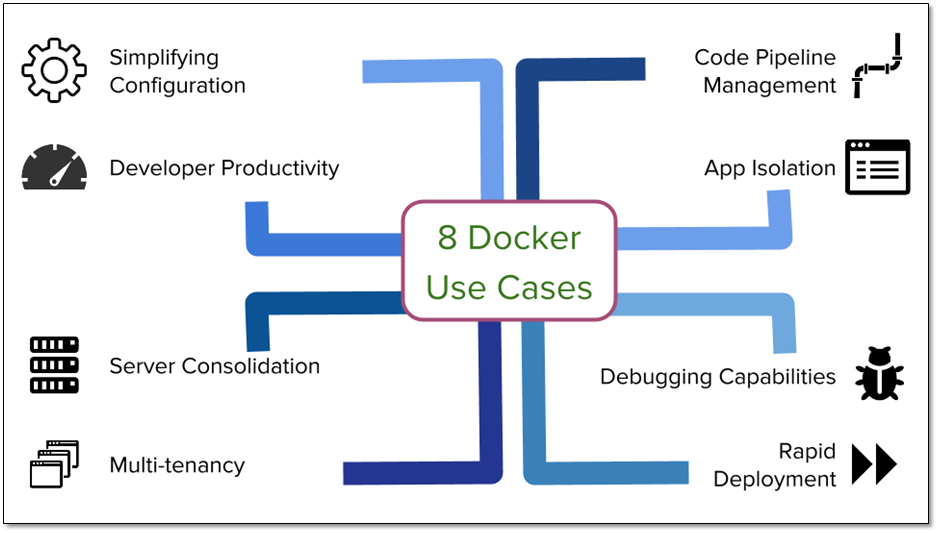

### **Docker基础介绍及配置安装**

一、 Docker介绍

    Docker是Docker.lnc公司开源的一个基于LXC技术之上构建的Container容器引擎，源代码托管在Github上，基于Go语言并遵从Apache2.0协议开源。

    Docker是通过内核虚拟化技术（namespaces及cgroups等）来提供容器的资源隔离与安全保障等。由于Docker通过操作系统层的虚拟化实现隔离，所以Docker容器在运行时，不需要类似虚拟机（VM）额外的操作系统开销，提高资源利用率

1. Docker的三大理念

    构建 　运输 　运行
2. Docker组成

    Docker的组成部分docker类似于cs结构 
    * Docker Client
    * Docker Server

    我们可以将docker启动比喻成Docker server，我们执行命令的时候相当于Docker client 
    

    
    提示：目前的版本是如果docker的服务端挂了，运行在docker上的所有容器都会挂掉

3. Docker组件
    * 镜像（Image） 
        
        类似于虚拟机，作用和虚拟机是一样的，唯独是组成部分会有些区别。简单的说如果我们想启动一个容器就必须要有镜像
    * 容器（Container） 

        docker是通过容器来运行业务的，就像运行一个kvm虚拟机是一样的。容器其实就是从镜像创建的一个实例。 
　　我们可以对容器进行增删改查，容器之间也是相互隔离的。和虚拟机最大的区别就是一个是虚拟的一个是隔离的。 

        缺点：不会像虚拟机那样隔离的那么彻底，我们可以将容器理解为简化版的linux，有进程运行在里面。

    * 仓库（Repository） 

        我们将镜像创建完成就需要存放到仓库里面，进行集中式的管理。仓库这点类似于github，docker也有一个dockerhub，他也是一个公共对外的仓库。

4. 虚拟机和docker的区别

    

    简单解释，VMware运行在操作系统上，而docker是直接运行在应用上。所以docker无法提供一个像VMware那样完全的隔离，甚至到很多地方都没有进行隔离，比如说用户空间。 

    这里可以解释一下 如果你用的是centos5版本那你就别想安装docker了，如果是centos6的你可以看一眼。因为内核版本比较低，但是如果使用乌班图就可以，因为乌班图的内核更新的比较快。 

    如果公司服务器是centos5和centos6 用docker就需要升级内核，相对比较麻烦.

5. Docker与OpenStack区别

    类别|Docker|openstack/KVM
    --|--|--|
    部署男刀|非常简单|组件多，部署复杂
    启动速度|秒级|分钟级
    执行性能|和物理系统几乎一致|VM会占用一些资源
    镜像体积|镜像是MB级别|虚拟机镜像GB级别
    管理效率|管理简单|组件相互依赖，管理复杂
    隔离性|隔离性高|彻底隔离
    可管理性|单进程、不建议启动SSH|完整的系统管理
    网络连接|比较弱|借助Neutron可以灵活组件各类网络架构

    提示：在这里可以简单的说一下，有些场景是不适合用到docker。例如我前端web使用docker，此时docker挂掉了，里面不会像数据库那样有数据写入。这时候我从新起一个docker就可以了。所以有的场景是不适合使用docker的

6. Docker能干什么？

    

    * **简化配置**
    
    　　这是Docker公司宣传的Docker的主要使用场景。虚拟机的最大好处是能在你的硬件设施上运行各种配置不一样的平 台（软件、系统），Docker在降低额外开销的情况下提供了同样的功能。它能让你将运行环境和配置放在代码中然后部署，同一个Docker的配置可以在 不同的环境中使用，这样就降低了硬件要求和应用环境之间耦合度。 

    * **代码流水线（Code Pipeline）管理**

        前一个场景对于管理代码的流水线起到了很大的帮助。代码从开发者的机器到最终在生产环境上的部署，需要经过很多的中间环境。而每一个中间环境都有自己微小的差别，Docker给应用提供了一个从开发到上线均一致的环境，让代码的流水线变得简单不少。

    * **提高开发效率**
    
        这就带来了一些额外的好处：Docker能提升开发者的开发效率。如果你想看一个详细一点的例子，可以参考Aater在DevOpsDays Austin 2014 大会或者是DockerCon上的演讲。

        不同的开发环境中，我们都想把两件事做好。一是我们想让开发环境尽量贴近生产环境，二是我们想快速搭建开发环境。

        理想状态中，要达到第一个目标，我们需要将每一个服务都跑在独立的虚拟机中以便监控生产环境中服务的运行状态。然而，我们却不想每次都需要网络连 接，每次重新编译的时候远程连接上去特别麻烦。这就是Docker做的特别好的地方，开发环境的机器通常内存比较小，之前使用虚拟的时候，我们经常需要为 开发环境的机器加内存，而现在Docker可以轻易的让几十个服务在Docker中跑起来。

    * **隔离应用**
        
        有很多种原因会让你选择在一个机器上运行不同的应用，比如之前提到的提高开发效率的场景等

    * **整合服务器**
        
        正如通过虚拟机来整合多个应用，Docker隔离应用的能力使得Docker可以整合多个服务器以降低成本。由于没有多个操作系统的内存占用，以及能在多个实例之间共享没有使用的内存，Docker可以比虚拟机提供更好的服务器整合解决方案
　　 
    * **调试能力**
        
        Docker提供了很多的工具，这些工具不一定只是针对容器，但是却适用于容器。它们提供了很多的功能，包括可以为容器设置检查点、设置版本和查看两个容器之间的差别，这些特性可以帮助调试Bug。你可以在《Docker拯救世界》的文章中找到这一点的例证。

    * **多租户环境**
    
        另外一个Docker有意思的使用场景是在多租户的应用中，它可以避免关键应用的重写。我们一个特别的关于这个场景的 例子是为IoT（译者注：物联网）的应用开发一个快速、易用的多租户环境。这种多租户的基本代码非常复杂，很难处理，重新规划这样一个应用不但消耗时间， 也浪费金钱。

        使用Docker，可以为每一个租户的应用层的多个实例创建隔离的环境，这不仅简单而且成本低廉，当然这一切得益于Docker环境的启动速度和其高效的diff命令。

    * **快速部署**
        
        在虚拟机之前，引入新的硬件资源需要消耗几天的时间。Docker的虚拟化技术将这个时间降到了几分钟，Docker只是创建一个容器进程而无需启动操作系统，这个过程只需要秒级的时间。这正是Google和Facebook都看重的特性。

        你可以在数据中心创建销毁资源而无需担心重新启动带来的开销。通常数据中心的资源利用率只有30%，通过使用Docker并进行有效的资源分配可以提高资源的利用率。

小结： 一句话说明docker的本质就是 低开销（系统文件、内存 共用）的虚拟机


### **Docker入门安装**
一、环境
```bash
[root@linux-node1 ~]# cat /etc/redhat-release 
CentOS Linux release 7.2.1511 (Core) 
[root@linux-node1 ~]# uname -r
3.10.0-327.36.2.el7.x86_64
```
二、安装
```bash
[root@linux-node1 ~]# yum install docker
```
三、启动
```bash
[root@linux-node1 ~]# systemctl start docker
```
启动之后我们可以查看一下docker的状态
```bash
[root@linux-node1 ~]# systemctl status docker
```
我们可以使用ifconfig查看网卡
```bash
[root@linux-node1 ~]# ifconfig
docker0: flags=4099<UP,BROADCAST,MULTICAST>  mtu 1500
```
提示： 我们启动docker的时候，docker会帮我们创建一个docker 0的网桥

四、Docker基础命令

* 查看当前镜像 

    docker images
    ```bash
    [root@linux-node1 ~]# docker images
    REPOSITORY          TAG                 IMAGE ID            CREATED             SIZE
    ```

* 搜索镜像 
    
    docker search [镜像名字]

    执行docker search centos 会从dockerhub上搜索镜像
    ```bash
    [root@linux-node1 ~]# docker search centos
    INDEX       NAME                                DESCRIPTION                     STARS     OFFICIAL   AUTOMATED
    docker.io   docker.io/centos                    The official build of CentOS.   2757      [OK]  
    docker.io   docker.io/ansible/centos7-ansible   Ansible on Centos7              90                   [OK]
    ```
    

参考：https://blog.csdn.net/abcdocker/article/details/53158210