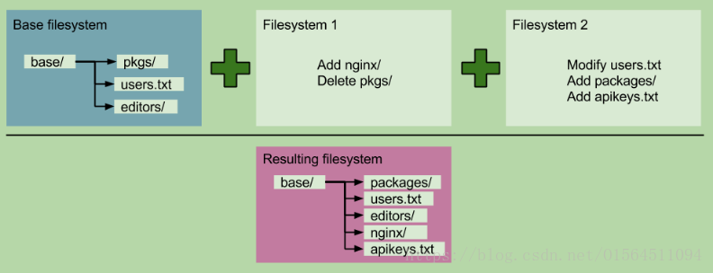

## **Docker原理分析**

1. **容器概念**

    容器是一种轻量级、可移植、自包含的软件打包技术，使应用程序可以在几乎任何地方以相同的方式运行。开发人员在自己笔记本上创建并测试好的容器，无需任何修改就能够在生产系统的虚拟机、物理服务器或公有云主机上运行。

2. **容器与虚拟机**

    谈到容器，就不得不将它与虚拟机进行对比，因为两者都是为应用提供封装和隔离。

    容器由两部分组成：
    * 应用程序本身
    * 依赖：比如应用程序需要的库或其他软件
    
    容器在 Host 操作系统的用户空间中运行，与操作系统的其他进程隔离。这一点显著区别于的虚拟机。

    传统的虚拟化技术，比如 VMWare, KVM, Xen，目标是创建完整的虚拟机。为了运行应用，除了部署应用本身及其依赖（通常几十 MB），还得安装整个操作系统（几十 GB）。

    下图展示了二者的区别。

     

    如图所示，由于所有的容器共享同一个 Host OS，这使得容器在体积上要比虚拟机小很多。另外，启动容器不需要启动整个操作系统，所以容器部署和启动速度更快，开销更小，也更容易迁移。

3. **容器解决的问题**

    **今天软件开发面临的挑战**

    如今的系统在架构上较十年前已经变得非常复杂了。以前几乎所有的应用都采用三层架构（Presentation/Application/Data），系统部署到有限的几台物理服务器上（Web Server/Application Server/Database Server）。

    而今天，开发人员通常使用多种服务（比如 MQ，Cache，DB）构建和组装应用，而且应用很可能会部署到不同的环境，比如虚拟服务器，私有云和公有云。
    

    一方面应用包含多种服务，这些服务有自己所依赖的库和软件包；另一方面存在多种部署环境，服务在运行时可能需要动态迁移到不同的环境中。这就产生了一个问题：如何让每种服务能够在所有的部署环境中顺利运行？

    于是我们得到了下面这个矩阵：
    

    各种服务和环境通过排列组合产生了一个大矩阵。开发人员在编写代码时需要考虑不同的运行环境，运维人员则需要为不同的服务和平台配置环境。对他们双方来说，这都是一项困难而艰巨的任务。

    如何解决这个问题呢？聪明的技术人员从传统的运输行业找到了答案。

    几十年前，运输业面临着类似的问题。
    

    每一次运输，货主与承运方都会担心因货物类型的不同而导致损失，比如几个铁桶错误地压在了一堆香蕉上。另一方面，运输过程中需要使用不同的交通工具也让整个过程痛苦不堪：货物先装上车运到码头，卸货，然后装上船，到岸后又卸下船，再装上火车，到达目的地，最后卸货。一半以上的时间花费在装、卸货上，而且搬上搬下还容易损坏货物。这同样也是一个 NxM 的矩阵。
    

    幸运的是，集装箱的发明解决这个难题。
    

    任何货物，无论钢琴还是保时捷，都被放到各自的集装箱中。集装箱在整个运输过程中都是密封的，只有到达最终目的地才被打开。标准集装箱可以被高效地装卸、重叠和长途运输。现代化的起重机可以自动在卡车、轮船和火车之间移动集装箱。集装箱被誉为运输业与世界贸易最重要的发明。

    Docker 将集装箱思想运用到软件打包上，为代码提供了一个基于容器的标准化运输系统。Docker 可以将任何应用及其依赖打包成一个轻量级、可移植、自包含的容器。容器可以运行在几乎所有的操作系统上。
    

    其实，“集装箱” 和 “容器” 对应的英文单词都是 “Container”。

    “容器” 是国内约定俗成的叫法，可能是因为容器比集装箱更抽象，更适合软件领域的原故吧。

4. **Docker 的特性**

    我们可以看看集装箱思想是如何与 Docker 各种特性相对应的。
    
    特性|集装箱|Docker
    --|--|--
    打包对象|几乎任何货物|任何软件及其依赖
    硬件依赖|标准形状和接口允许集装箱被装卸到各种交通工具，整个运输过程无需打开|容器无需修改便可运行在几乎所有的平台上 -- 虚拟机、物理机、公有云、私有云             
    隔离性|集装箱可以重叠起来一起运输，香蕉再也不会被铁桶压烂了|资源、网络、库都是隔离的，不会出现依赖问题
    自动化|标准接口使集装箱很容易自动装卸和移动|提供 run, start, stop 等标准化操作，非常适合自动化
    高效性|无需开箱，可在各种交通工具间快速搬运|轻量级，能够快速启动和迁移
    职责分工|货主只需考虑把什么放到集装箱里；承运方只需关心怎样运输集装箱|开发人员只需考虑怎么写代码；运维人员只需关心如何配置基础环境

5. **容器的优势**
    * 对于开发人员 - Build Once, Run Anywhere

        容器意味着环境隔离和可重复性。开发人员只需为应用创建一次运行环境，然后打包成容器便可在其他机器上运行。另外，容器环境与所在的 Host 环境是隔离的，就像虚拟机一样，但更快更简单。

    * 对于运维人员 - Configure Once, Run Anything

        只需要配置好标准的 runtime 环境，服务器就可以运行任何容器。这使得运维人员的工作变得更高效，一致和可重复。容器消除了开发、测试、生产环境的不一致性。

6. **容器的生态**
    
    一谈到容器，大家都会想到 Docker。Docker 现在几乎是容器的代名词。确实是 Docker 将容器技术发扬光大。同时，大家也需要知道围绕 Docker 还有一个生态系统。Docker 是这个生态系统的基石，但完善的生态系统才是保障 Docker 以及容器技术能容器核心技术.

    大致来看，容器生态系统包含核心技术、平台技术和支持技术

    * **容器核心技术**

        容器核心技术是指能够让 container 在 host 上运行起来的那些技术。够真正健康发展的决定因素。

        这些技术包括容器规范、容器 runtime、容器管理工具、容器定义工具、Registry 以及 容器 OS，下面分别介绍。

        * 容器规范

            容器不光是 Docker，还有其他容器，比如 CoreOS 的 rkt。为了保证容器生态的健康发展，保证不同容器之间能够兼容，包含 Docker、CoreOS、Google在内的若干公司共同成立了一个叫 Open Container Initiative（OCI） 的组织，其目是制定开放的容目前 OCI 发布了两个规范：runtime spec 和 image format spec。

            有了这两个规范，不同组织和厂商开发的容器能够在不同的 runtime 上运行。这样就保证了容器的可移植性和互操作性。

        * 容器 runtime

            runtime 是容器真正运行的地方。runtime 需要跟操作系统 kernel 紧密协作，为容器提供运行环境。

            如果大家用过 Java，可以这样来理解 runtime 与容器的关系：Java 程序就好比是容器，JVM 则好比是 runtime。JVM 为 Java 程序提供运行环境。同样的道理，容器只有在 runtime 中才能运行。

            

            lxc、runc 和 rkt 是目前主流的三种容器 runtime。
            * lxc 是 Linux 上老牌的容器 runtime。Docker 最初也是用 lxc 作为 runtime。
            * runc 是 Docker 自己开发的容器 runtime，符合 oci 规范，也是现在 Docker 的默认 runtime。
            * rkt 是 CoreOS 开发的容器 runtime，符合 oci 规范，因而能够运行 Docker 的容器。器规范。

        * 容器管理工具
            光有 runtime 还不够，用户得有工具来管理容器啊。容器管理工具对内与 runtime 交互，对外为用户提供 interface，比如 CLI。这就好比除了 JVM，还得提供 java 命令让用户能够启停应用不是。

            

            对应这三种容器lxc、runc 和 rkt的管理工具。
            * xd 是 lxc 对应的管理工具。
            * docker engine是runc 的管理工具。docker engine 包含后台 deamon 和 cli 两个部分。我们通常提到 Docker，一般就是指的 docker engine。
            * rkt cli是rkt 的管理工具。

        * 容器定义工具
            容器定义工具允许用户定义容器的内容和属性，这样容器就能够被保存，共享和重建。

            

            * docker image 是 docker 容器的模板，runtime 依据 docker image 创建容器。
            * dockerfile 是包含若干命令的文本文件，可以通过这些命令创建出 docker image。
            * ACI (App Container Image) 与 docker image 类似，只不过它是由 CoreOS 开发的 rkt 容器的 image 格式。

 
        * Registry
            容器是通过 image 创建的，需要有一个仓库来统一存放 image，这个仓库就叫做 Registry。

            

            企业可以用 Docker Registry 构建私有的 Registry。

            Docker Hub（https://hub.docker.com） 是 Docker 为公众提供的托管 Registry，上面有很多现成的 image，为 Docker 用户提供了极大的便利。

            Quay.io（https://quay.io/）是另一个公共托管 Registry，提供与 Docker Hub 类似的服务。
        * 容器 OS
            
            于有容器 runtime，几乎所有的 Linux、MAC OS 和 Windows 都可以运行容器。但这不并没有妨碍容器 OS 的问世。

            

            容器 OS 是专门运行容器的操作系统。与常规 OS 相比，容器 OS 通常体积更小，启动更快。因为是为容器定制的 OS，通常它们运行容器的效率会更高。

            目前已经存在不少容器 OS，CoreOS、atomic 和 ubuntu core 是其中的杰出代表。

    * **容器平台技术**

        * 容器编排引擎

            基于容器的应用一般会采用微服务架构。在这种架构下，应用被划分为不同的组件，并以服务的形式运行在各自的容器中，通过 API 对外提供服务。为了保证应用的高可用，每个组件都可能会运行多个相同的容器。这些容器会组成集群，集群中的容器会根据业务需要被动态地创建、迁移和销毁。

            大家可以看到，这样一个基于微服务架构的应用系统实际上是一个动态的可伸缩的系统。这对我们的部署环境提出了新的要求，我们需要有一种高效的方法来管理容器集群。而这，就是容器编排引擎要干的工作。

            所谓编排（orchestration），通常包括容器管理、调度、集群定义和服务发现等。通过容器编排引擎，容器被有机的组合成微服务应用，实现业务需求。

            

            以上三者是当前主流的容器编排引擎:
            * docker swarm 是 Docker 开发的容器编排引擎。
            * kubernetes 是 Google 领导开发的开源容器编排引擎，同时支持 Docker 和 CoreOS 容器。
            * mesos 是一个通用的集群资源调度平台，mesos 与 marathon 一起提供容器编排引擎功能。
        * 容器管理平台

            容器管理平台是架构在容器编排引擎之上的一个更为通用的平台。通常容器管理平台能够支持多种编排引擎，抽象了编排引擎的底层实现细节，为用户提供更方便的功能，比如 application catalog 和一键应用部署等。

            Rancher 和 ContainerShip 是容器管理平台的典型代表。

        * 基于容器的 PaaS

            基于容器的 PaaS 为微服务应用开发人员和公司提供了开发、部署和管理应用的平台，使用户不必关心底层基础设施而专注于应用的开发。

            Deis、Flynn 和 Dokku 都是开源容器 PaaS 的代表

    * **容器支持技术**

        下面这些技术被用于支持基于容器的基础设施。

        

        * 容器网络

            容器的出现使网络拓扑变得更加动态和复杂。用户需要专门的解决方案来管理容器与容器，容器与其他实体之间的连通性和隔离性.

            docker network 是 Docker 原生的网络解决方案。除此之外，我们还可以采用第三方开源解决方案，例如 flannel、weave 和 calico。不同的方案设计和实现方式不同，各有优势和特定，我们可以根据实际需要来选型。

        * 服务发现

            动态变化是微服务应用的一大特点。当负载增加时，集群会自动创建新的容器；负载减小，多余的容器会被销毁。容器也会根据 host 的资源使用情况在不同 host 中迁移，容器的 IP 和端口也会随之发生变化。在这种动态的环境下，必须要有一种机制让 client 能够知道如何访问容器提供的服务。这就是服务发现技术要完成的工作。服务发现会保存容器集群中所有微服务最新的信息，比如 IP 和端口，并对外提供 API，提供服务查询功能。

            etcd、consul 和 zookeeper 是服务发现的典型解决方案。

        * 监控

            监控对于基础架构非常重要，而容器的动态特征对监控提出更多挑战。

            针对容器环境，已经涌现出很多监控工具和方案。

            docker ps/top/stats 是 Docker 原生的命令行监控工具。除了命令行，Docker 也提供了 stats API，用户可以通过 HTTP 请求获取容器的状态信息。

            sysdig、cAdvisor/Heapster 和 Weave Scope 是其他开源的容器监控方案。
        * 数据管理

            容器经常会在不同的 host 之间迁移，如何保证持久化数据也能够动态迁移，是 Flocker 这类数据管理工具提供的能力。

        * 日志管理

            日志为问题排查和事件管理提供了重要依据。

            docker logs 是 Docker 原生的日志工具。而 logspout 对日志提供了路由功能，它可以收集不同容器的日志并转发给其他工具进行后处理。

        * 安全性

            对于年轻的容器，安全性一直是业界争论的焦点。OpenSCAP 能够对容器镜像进行扫描，发现潜在的漏洞。

7. **Docker 架构**

    **架构图**

    Docker采用Client/Server模式的架构设计，Docker的后端采用非常松耦合的架构，模块之间相互独立、各司其职。用户通过Docker Client与Docker Daemon建立通信，并发送请求给Docker Daemon。Docker Daemon提供Server功能接受Docker Client的请求；随后通过Engine执行Docker内部的一系列工作，每项工作都是以一个Job的形式的存在。Client和Server可以运行在一个机器上，也可以通过socket或者RESTful API来进行通信。

    
 
    Job是Docker内部执行每项工作的载体，当启动Docker需要容器镜像时，Job则从Docker Registry仓库中下载镜像，并通过镜像管理驱动graphdriver将下载镜像到的镜像以Graph的形式存储和管理；当需要为Docker创建和配置网络环境时，Job通过网络管理驱动networkdriver创建并配置Docker容器网络环境；当需要限制Docker容器运行资源或执行用户指令等操作时，则通过execdriver来完成。

    libcontainer它是一项独立的容器管理包，通过标准接口来管理Namespaces、Cgroups以及文件系统来进行容器控制。Networkdriver和execdriver都需要依靠libcontainer来实现对容器进行网络、命名空间隔离等操作。当执行完运行容器的命令后，一个实际的Docker容器就处于运行状态，该容器拥有独立的文件系统，独立并且安全的运行环境等。

    * Docker Client模块

        Docker目前还没有像VMs那样的GUI管理界面，所以Docker的操作主要基于Linux原生的CLI和标准输入输出终端。Docker Client是Docker架构中用户用来和Docker Daemon建立通信的客户端。用户使用的可执行文件为docker，通过docker命令行工具可以发起对众多container的请求管理。

        Docker Client与Docker Daemon建立连接时，Docker Client可以通过设置命令行flag参数设置安全传输层协议(TLS)关参数保证传输的安全性。当Docker Client接收到处理结果并加以处理后，Docker Client的一次完整的生命周期就结束了。当需再次发送容器管理请求时，用户必须再次通过docker可执行文件创建Docker Client。
        
    * Docker Daemon模块

        

        Docker Daemon是Docker架构中一个常驻在后台的系统进程，该守护进程在后台启动了一个Server，该Server负责接受Docker Client发送的请求；并通过路由与分发调度找到相应的Handler来执行请求。

        在Linux系统中，Docker Daemon启动使用的可执行文件也是docker，与Docker Client启动所使用的可执行文件docker相同。在docker命令执行时，通过传入的参数来判别Docker Daemon与Docker Client。

        Docker Daemon主要由Docker Server、Engine和Job三部分组成，下面我们先分析下这三个子模块。

        * Docker Server子模块

            Docker Server在Docker架构中是专门服务于Docker Client的server。该server的功能是：接受并调度分发Docker Client发送的请求。

            

            Docker采用Go语言开发，所以里面有到很多Go语言相关工具套件，如Web开发套件gorilla。在Docker的启动过程中，通过包gorilla/mux创建了一个mux.Router，提供请求的路由功能。在Golang(Go语言)中，gorilla /mux是一个强大的URL路由器以及调度分发器。在该mux.Router中添加了众多的路由项，每一个路由项由HTTP请求方法(Put、Post、Get和Delete等)、URL、Handler三部分组成。

            若Docker Client通过HTTP的形式访问Docker Daemon，创建完mux.Router之后，Docker将Server的监听地址以及mux.Router作为参数，创建一个Server为请求服务。

            在Server的服务过程中，Server监听并接受Docker Client的访问请求，并创建一个全新的goroutine来服务该请求。接着找到相应的路由项并调用相应的Handler来处理该请求。

        * Engine子模块
            
            Engine是Docker架构中的运行引擎，也Docker任务Job的触发器。它负责Docker container存储仓库的管理、Job和Handler映射(把Job映射到daemon对应的具体Handler上)，并且通过执行job的方式来操纵管理这些容器。

        * Job任务子模块

            Job是Docker架构中Engine内部最基本的工作执行单元。Job与Unix进程类似，具有名称、参数、环境变量、标准的输入输出，返回状态等。Docker所做的每一项工作都可以抽象为一个job如，在容器内部运行一个进程、创建一个新的容器、从Internet上下载一个文档，创建Server服务于Client请求等都是一个个job。

    * Docker Registry模块

        Docker Registry是一个存储容器镜像的仓库。而容器镜像是在容器创建时，被加载用来初始化容器的文件架构与目录。在Docker的运行过程中，Docker Daemon(Engine)会通过Job与Docker Registry通信，通过名称为Search、Pull与 Push的Job任务实现搜索镜像、下载镜像、上传镜像。

        Docker提供了共有和私有的容器镜像仓库，公有Docker Registry是大家熟知的Docker Hub，Docker通过公有仓库获取容器镜像文件时，必须通过互联网访问Docker Hub才行。但用户也可以创建私有的仓库Docker Registry，这样可以保证容器镜像的获取在内网完成。

    * Graph模块

        Graph对已下载Docker容器镜像进行保管，并对已下载容器镜像之间关系进行记录。Graph不但要存储本地具有版本信息的文件系统镜像，而且还要通过GraphDB记录着所有文件系统镜像彼此之间的关系。

        

        GraphDB是一个构建在SQLite(嵌入式数据库)之上的小型图数据库，实现了节点的命名以及节点之间关联关系的记录。在Graph的本地目录中，具体存储的容器镜像信息包含，该容器镜像的元数据，容器镜像的大小信息，以及该容器镜像所代表的具体Rootfs信息。

    * Driver模块

        Driver是Docker架构中的驱动模块。Driver驱动主要作用是实现对Docker容器进行环境的定制。在Docker运行的生命周期中，用户的操作除了针对Docker容器的管理外，还有关于Docker运行信息的获取、Graph的存储与记录等操作。因此，为了将Docker容器的管理从Docker Daemon内部业务逻辑中区分开来，设计了Driver层驱动来接管容器的管理。

        Docker Driver模块实现了以下三类驱动graphdriver、networkdriver和execdriver，分别完成不同功能。

        * Graphdriver
            Graphdriver主要用于完成容器镜像的管理，包括存储与获取。即当用户需要下载指定的容器镜像时，graphdriver将容器镜像存储在本地的指定目录；同时当用户需要使用指定的容器镜像来创建容器的rootfs时，graphdriver从本地镜像存储目录中获取指定的容器镜像。

            

            在Docker中有4种文件系统或类文件系统在其内部注册，它们分别是aufs、btrfs、vfs和devmapper。而Docker在初始化之时，通过获取系统环境变量提取所使用driver的指定类型。而之后所有的graph操作，都由该driver来执行。

        * Networkdriver

            Networkdriver的用途是完成Docker容器网络环境的配置，其中包括Docker启动时为Docker环境创建网桥；Docker容器创建时为其创建专属虚拟网卡设备；以及为Docker容器分配IP、端口并与宿主机做端口映射，设置容器防火墙策略等。

            

        * Execdriver

            Execdriver作为Docker容器的执行驱动，负责创建容器运行命名空间，负责容器资源使用的统计与限制，负责容器内部进程的真正运行等。在execdriver的实现过程中，可以使用LXC驱动调用LXC的接口来操纵容器的配置以及生命周期，但现在execdriver默认使用native驱动不依赖于LXC。具体体现在Daemon启动过程中加载的ExecDriverflag参数，该参数在配置文件已经被设为Native。目前Docker支持的容器管理方式有两种，一种就是最初支持的LXC方式，另一种称为Native的Libcontainer进行容器管理。

            

    * Libcontainer模块

        关于libcontainer原理之前有所讨论，它是Docker架构中一个使用Go语言设计实现容器相关的API的库，无论使用Namespace、Cgroups技术或是使用Systemd等其他方案，只要实现了Libcontainer定义的一组接口，Docker都可以运行。

        

        正是由于libcontainer的存在，Docker可以直接调用libcontainer，而最终操纵容器的namespace、cgroups、apparmor、网络设备以及防火墙规则等。这一系列操作的完成都不需要依赖LXC或者其他包。

        libcontainer提供了一整套标准的接口来满足上层对容器管理的需求，屏蔽了Docker上层对容器的直接管理。也正是由于此特性，Microsoft在其著名云计算平台Azure中也添加了对Docker的支持。

    * Docker container模块

        Docker容器是Docker架构中服务交付的最终体现形式，Docker按照业务的需求、依赖关系和配置文件打包相应的Docker容器。容器是通过使用主机上的孤立进程，建立虚拟环境的一种方法。

        

        用户根据需通过加载容器镜像，使得Docker容器可以自定义Rootfs等文件系统，用户通过指定计算资源的配额，使得Docker容器使用指定的计算资源，用户通过配置网络及其安全策略，使得Docker容器拥有独立且安全的网络环境，用户通过指定运行的命令，使得Docker容器得以孤立运行并执行指定的工作。这种孤立的容器通过进程或Job实现，它有自己的一套文件系统资源和从属进程。

8. Docker运行流程

    

    Docker 的核心组件包括：

    * Docker 客户端 - Client
    * Docker 服务器 - Docker daemon
    * Docker 镜像 - Image
    * Registry
    * Docker 容器 – Container

    正如上图所示，当我们想运行一个容器的时候，docker会：

    1. 拉取镜像，若本地已经存在该镜像，则不用到网上去拉取
    2. 创建新的容器
    3. 分配union文件系统并且挂着一个可读写的层，任何修改容器的操作都会被记录在这个读写层上，你可以保存这些修改成新的镜像，也可以选择不保存，那么下次运行改镜像的时候所有修改操作都会被消除
    4. 分配网络\桥接接口，创建一个允许容器与本地主机通信的网络接口
    5. 设置ip地址，从池中寻找一个可用的ip地址附加到容器上，换句话说，localhost并不能访问到容器
    6. 运行你指定的程序
    7. 捕获并且提供应用输出，包括输入、输出、报错信息
 
9. 底层技术

    Docker使用Go语言编写，并且使用了一系列Linux内核提供的性能来实现我们已经看到的这些功能。

    Docker 的基础是Linux容器（LXC）等技术。

    在LXC的基础上Docker进行了进一步的封装，让用户不需要去关心容器的管理，使得操作更为简便。

    Docker使用Cgroups来提供容器隔离，而union文件系统用于保存镜像并使容器变得短暂。

    * 命名空间(Namespaces)

        Docker充分利用了一项称为namespaces的技术来提供隔离的工作空间，我们称之为 container(容器)。当你运行一个容器的时候，Docker为该容器创建了一个命名空间集合。

        这样提供了一个隔离层，每一个应用在它们自己的命名空间中运行而且不会访问到命名空间之外。

        一些Docker使用到的命名空间有：

        pid命名空间: 使用在进程隔离(PID: Process ID)。

        net命名空间: 使用在管理网络接口(NET: Networking)。

        ipc命名空间: 使用在管理进程间通信资源 (IPC: InterProcess Communication)。

        mnt命名空间: 使用在管理挂载点 (MNT: Mount)。

        uts命名空间: 使用在隔离内核和版本标识 (UTS: Unix Timesharing System)。

    * 群组控制(Cgroups)

        Docker还使用到了cgroups技术来管理群组。使应用隔离运行的关键是让它们只使用你想要的资源。这样可以确保在机器上运行的容器都是良民(good multi-tenant citizens)。群组控制允许Docker分享或者限制容器使用硬件资源。Cgroups是Linux内核功能，它让两件事情变成可能：限制Linux进程组的资源占用（内存、CPU）；为进程组制作 PID、UTS、IPC、网络、用户及装载命名空间。

 

    * 联合文件系统

        联合文件系统(UnionFS)是用来操作创建层的，使它们轻巧快速。Docker使用UnionFS提供容器的构造块。Docker可以使用很多种类的UnionFS包括AUFS, btrfs, vfs, and DeviceMapper。Union文件系统允许独立文件系统中的文件和文件夹(称之为分支)被透明覆盖，形成一个单独连贯的文件系统。如下图：

        

   * Docker image工作原理

        Docker mage是Docker容器运行时的只读模板。每一个镜像由一系列的层(layers)组成。Docker使用UnionFS来将这些层联合到一个镜像中。Union文件系统允许独立文件系统中的文件和文件夹(称之为分支)被透明覆盖，形成一个单独连贯的文件系统。正因为有了这些层的存在，Docker是如此的轻量。当你改变了一个Docker镜像，比如升级到某个程序到新的版本，一个新的层会被创建。因此，不用替换整个原先的镜像或者重新建立(在使用虚拟机的时候你可能会这么做)，只是一个新的层被添加或升级了。现在你不用重新发布整个镜像，只需要升级。层使得分发Docker镜像变得简单和快速。

        每个镜像都是从一个基础的镜像开始的，比如一个基础的Ubuntu镜像，或者是一个基础的Fedora镜像。你可以使用你自己的镜像作为新镜像的基础，例如你有一个基础的安装了Apache的镜像，你可以使用该镜像来建立你的Web应用程序镜像。Docker镜像从这些基础的镜像创建，通过一种简单、具有描述性的步骤，我们称之为 指令(instructions)。 每一个指令会在镜像中创建一个新的层，指令可以包含这些动作，比如：运行一个命令\加文件或者文件夹\创建一个环境变量\当运行容器的时候哪些程序会运行

        这些指令存储在Dockerfile文件中。当你需要建立镜像的时候，Docker可以从Dockerfile中读取这些指令并且运行，然后返回一个最终的镜像。

    * 容器格式

        Docker连接这些组建到一个包装中，称为一个 container format(容器格式)。默认的容器格式是libcontainer。Docker同样支持传统的Linux容器使用LXC。在未来，Docker也许会支持其它的容器格式，例如与BSD Jails 或 Solaris Zone集成。

参考：https://blog.csdn.net/o1564511094/article/details/81836810

