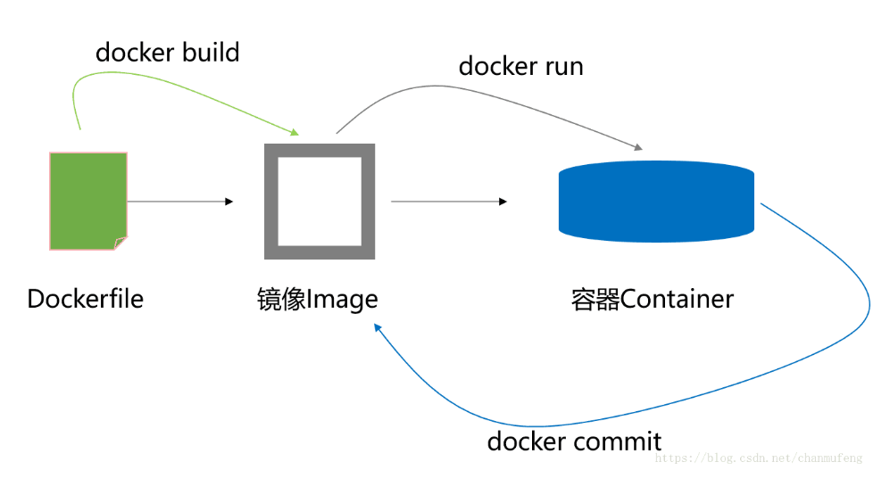

## Docker镜像构建


Nginx是一个高性能的Web和反向代理服务器，它具有很多非常优越的特性：

    * 作为Web服务器。
    * 作为负载均衡服务器。
    * 作为邮件代理服务器。
    * 安装及配置简单。

接下来我们介绍在docker构建nginx镜像

Docker镜像构建分为两种方式：

    * 手动构建
    * Dockerfile（自动构建）


1. Docker镜像手动构建实例

    基于centos镜像进行构建nginx镜像

    构建步骤如下：
    1. 下载镜像： centos，nginx
    2. 用centos镜像启动容器，并重命名为nginxdocker
    3. 在容器了，安装wget,ngix
    4. 退出
    5. 此时查看启动的容器，可以看到nginxdocker
    6. 把nginxdocker构建成镜像"nginxdocker/nginxdocker"
    7. 此时查看镜像列表，可以看到新构建出来的镜像
    8. 启动新构建的镜像
    9. 此时查看启动的容器，可以看到nginxdocker/nginxdocker:v1
    10. 测试端口是否启动
    ```bash
    #下载镜像
    [root@compute ~]# docker pull daocloud.io/library/centos:latest
    [root@compute ~]# docker pull daocloud.io/library/nginx:latest
    [root@compute ~]# docker images
    REPOSITORY                   TAG                 IMAGE ID            CREATED             SIZE
    daocloud.io/library/centos   latest              5182e96772bf        7 weeks ago         200 MB
    daocloud.io/library/nginx    latest              c82521676580        2 months ago        109 MB
    #先创建centos镜像
    [root@compute ~]# docker run --name nginxdocker -ti centos
    [root@10859f0ffd78 /]# yum install -y wget
    [root@10859f0ffd78 /]# wget -O /etc/yum.repos.d/epel.repo http://mirrors.aliyun.com/repo/epel-7.repo
    #安装nginx
    [root@10859f0ffd78 /]# yum install -y nginx
    [root@10859f0ffd78 /]# sed -i '3a daemon off;' /etc/nginx/nginx.conf
    [root@10859f0ffd78 /]# exit
    [root@compute ~]# docker ps -a
    CONTAINER ID        IMAGE                COMMAND                  CREATED             STATUS                      PORTS                NAMES
    10859f0ffd78        centos               "/bin/bash"              7 minutes ago       Exited (0) 19 seconds ago                        nginxdocker
    #构建镜像
    [root@compute ~]# docker commit -m "test Nginx" 10859f0ffd78 nginxdocker/nginxdocker:v1
    sha256:616e9d624b9a1db8e23491db331228ca56dd60c04356da14ab6d7e4cf821d415
    You have new mail in /var/spool/mail/root
    [root@compute ~]# docker images
    REPOSITORY                TAG                 IMAGE ID            CREATED             SIZE
    nginxdocker/nginxdocker   v1                  616e9d624b9a        10 seconds ago      383.9 MB
    #启动容器
    [root@compute ~]# docker run --name nginxserver -d -p 82:80 nginxdocker/nginxdocker:v1 nginx
    c2ded9ce8af76c3b4862ca54478d39429879c856a2751957c9287df077dfcf17
    [root@compute ~]# docker ps
    CONTAINER ID        IMAGE                        COMMAND             CREATED             STATUS              PORTS                NAMES
    c2ded9ce8af7        nginxdocker/nginxdocker:v1   "nginx"             21 seconds ago      Up 19 seconds       0.0.0.0:82->80/tcp   nginxserver
    #测试
    [root@compute ~]# curl -I 192.168.141.129:82
    HTTP/1.1 200 OK
    Server: nginx/1.12.2
    Date: Mon, 01 Oct 2018 15:18:50 GMT
    Content-Type: text/html
    Content-Length: 3700
    Last-Modified: Tue, 06 Mar 2018 09:26:21 GMT
    Connection: keep-alive
    ETag: "5a9e5ebd-e74"
    Accept-Ranges: bytes
    ```

2. Docker镜像自动构建实例

    Dockerfile是一个文本格式的配置文件，用户可以使用Dockerfile快速创建自定义的镜像。
    Dockerfile由一行行命令语句组成，#号注释。分为：
    * 基础镜像信息
    * 维护者信息
    * 镜像操作指令
    * 容器启动时执行指令

    ```bash
    #创建目录
    [root@compute ~]# mkdir /dokerfile
    [root@compute ~]# cd /dokerfile/
    [root@compute dokerfile]# mkdir nginx
    [root@compute dokerfile]# cd nginx/
    [root@compute nginx]# echo "hello docker" >index.html
    #添加Dockerfile文件注意D大写
    [root@compute nginx]# vim Dockerfile
    ```

    内容如下
    ```bash
    #This dockerfile uses the centos image
    #VERSION 2 - EDITION 1
    #Author:lqb
    #Command format:
    # 指定基于的基础镜像
    FROM centos
    
    #维护者信息
    MAINTAINER lqb lqb@qq.com
    
    #镜像的操作指令
    RUN yum install -y wget
    RUN wget -O /etc/yum.repos.d/epel.repo http://mirrors.aliyun.com/repo/epel-7.repo
    RUN yum install -y nginx
    RUN echo "daemon off;" >>/etc/nginx/nginx.conf
    #添加文件需存在当前目录下
    ADD index.html /usr/share/nginx/html/index.html
    EXPOSE 80
    #容器启动时执行命令
    CMD /usr/sbin/nginx
    ```
    开始执行构建，启动
    ```bash
    #docker build命令构建镜像名为nginx版本v2
    [root@compute nginx]# docker build -t nginx:v2 ./
    Complete!
    ---> 5e37422db8b2
    Removing intermediate container 87fa82c1173a
    Step 6 : RUN echo "daemon off;" >>/etc/nginx/nginx.conf
    ---> Running in a03da9a96436
    ---> 236590c11b39
    Removing intermediate container a03da9a96436
    Step 7 : ADD index.html /usr/share/nginx/html/index.html
    ---> ac28fc354cad
    Removing intermediate container 5c2d9944e6f3
    Step 8 : EXPOSE 80
    ---> Running in 0b598a0680b8
    ---> d4addb2c20ba
    Removing intermediate container 0b598a0680b8
    Step 9 : CMD /usr/sbin/nginx
    ---> Running in d1feaede849f
    ---> 4905d9869aa7
    Removing intermediate container d1feaede849f
    Successfully built 4905d9869aa7
    [root@compute nginx]# docker images
    REPOSITORY                TAG                 IMAGE ID            CREATED             SIZE
    nginx                     v2                  4905d9869aa7        53 seconds ago      404.1 MB
    #启动容器
    [root@compute nginx]# docker run --name testnginx -d -p 83:80 nginx:v2
    b2cd72936465464bb8a88e9b3c5df0015241c7d17cb74062433ef79582c58908
    #测试
    [root@compute nginx]# curl -I 192.168.141.129:83
    hello docker
    ```