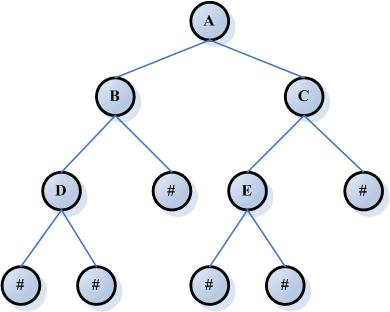
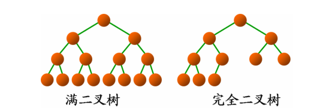
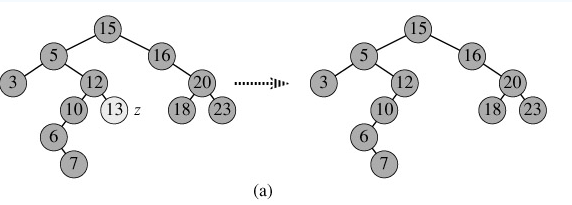
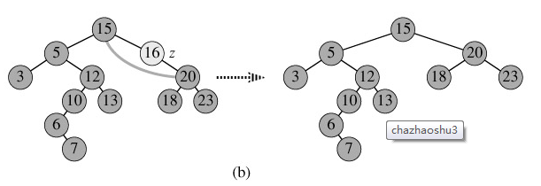
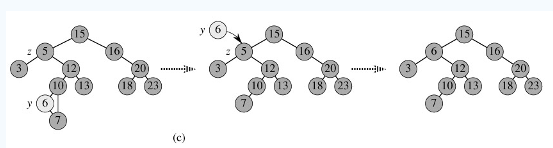
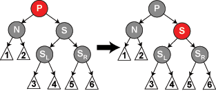

## 数据结构中各种树

阅读目录

1. 二叉树
2. 二叉查找树
3. 平衡二叉树
    1. 平衡查找树之AVL树
    2. 平衡二叉树之红黑树
4. B树
5. B+树
6. B*树
7. Trie树

数据结构中有很多树的结构，其中包括二叉树、二叉搜索树、2-3树、红黑树等等。本文中对数据结构中常见的几种树的概念和用途进行了汇总，不求严格精准，但求简单易懂。

1. 二叉树

    二叉树是数据结构中一种重要的数据结构，也是树表家族最为基础的结构。

    **二叉树的定义：**

    * 二叉树的每个结点至多只有二棵子树(不存在度大于2的结点)，二叉树的子树有左右之分，次序不能颠倒。
    * 二叉树的第i层至多有 2<sup>i-1</sup>个结点；
    * 深度为k的二叉树至多有2<sup>k</sup>-1个结点；
    * 对任何一棵二叉树T，如果其终端结点数为n0，度为2的结点数为n2，则n0=n2+1。

    二叉树的示例：

    

    说明：
    * 深度：对于任意节点n,n的深度为从根到n的唯一路径长，根的深度为0；
    * 高度：对于任意节点n,n的高度为从n到一片树叶的最长路径长，所有树叶的高度为0；
    * 结点的层次：规定根结点在1层，其它任一结点的层数是其父结点的层数加1
    * 树的深度：树中所有结点中的最大层次是这棵树的深度

    **满二叉树和完全二叉树：**

    满二叉树：除最后一层无任何子节点外，每一层上的所有结点都有两个子结点。也可以这样理解，除叶子结点外的所有结点均有两个子结点。节点数达到最大值，所有叶子结点必须在同一层上。

    满二叉树的性质：
    1. 一颗树深度为h，最大层数为k，深度与最大层数相同，k=h;
    2. 叶子数为2<sup>h</sup>;
    3. 第k层的结点数是：2<sup>k-1</sup>;
    4. 总结点数是：2<sup>k</sup>-1，且总节点数一定是奇数。

    完全二叉树：若设二叉树的深度为h，除第 h 层外，其它各层 (1～(h-1)层. 的结点数都达到最大个数，第h层所有的结点都连续集中在最左边，这就是完全二叉树。

    注：完全二叉树是效率很高的数据结构，堆是一种完全二叉树或者近似完全二叉树，所以效率极高，像十分常用的排序算法、Dijkstra算法、Prim算法等都要用堆才能优化，二叉排序树的效率也要借助平衡性来提高，而平衡性基于完全二叉树。

    

    二叉树的性质：

    1. 在非空二叉树中，第i层的结点总数不超过2<sup>i-1</sup>, i>=1;
    2. 深度为h的二叉树最多有2<sup>h</sup>-1个结点(h>=1)，最少有h个结点;
    3. 对于任意一棵二叉树，如果其叶结点数为N0，而度数为2的结点总数为N2，则N0=N2+1;
    4. 具有n个结点的完全二叉树的深度为log2(n+1);
    5. 有N个结点的完全二叉树各结点如果用顺序方式存储，则结点之间有如下关系：

        若I为结点编号则 如果I>1，则其父结点的编号为I/2；

        如果2I<=N，则其左儿子（即左子树的根结点）的编号为2I；若2I>N，则无左儿子；

        如果2I+1<=N，则其右儿子的结点编号为2I+1；若2I+1>N，则无右儿子。
    6. 给定N个节点，能构成h(N)种不同的二叉树，其中h(N)为卡特兰数的第N项，h(n)=C(2*n, n)/(n+1)。
    7. 设有i个枝点，I为所有枝点的道路长度总和，J为叶的道路长度总和J=I+2i。

2. 二叉查找树

    **二叉查找树定义**：又称为是二叉排序树（Binary Sort Tree）或二叉搜索树。二叉排序树或者是一棵空树，或者是具有下列性质的二叉树：
    1. 若左子树不空，则左子树上所有结点的值均小于它的根结点的值；
    2. 若右子树不空，则右子树上所有结点的值均大于或等于它的根结点的值；
    3. 左、右子树也分别为二叉排序树；
    4. 没有键值相等的节点。

    **二叉查找树的性质**：对二叉查找树进行中序遍历，即可得到有序的数列。

    **二叉查找树的时间复杂度**：它和二分查找一样，插入和查找的时间复杂度均为O(logn)，但是在最坏的情况下仍然会有O(n)的时间复杂度。原因在于插入和删除元素的时候，树没有保持平衡（比如，我们查找上图（b）中的“93”，我们需要进行n次查找操作）。我们追求的是在最坏的情况下仍然有较好的时间复杂度，这就是平衡查找树设计的初衷。

    二叉查找树的高度决定了二叉查找树的查找效率。

    **二叉查找树的插入过程如下**：

    1. 若当前的二叉查找树为空，则插入的元素为根节点;
    2. 若插入的元素值小于根节点值，则将元素插入到左子树中;
    3. 若插入的元素值不小于根节点值，则将元素插入到右子树中。

    **二叉查找树的删除，分三种情况进行处理**：

    1. p为叶子节点，直接删除该节点，再修改其父节点的指针（注意分是根节点和不是根节点），如图a;
    2. p为单支节点（即只有左子树或右子树）。让p的子树与p的父亲节点相连，删除p即可（注意分是根节点和不是根节点），如图b;
    3. p的左子树和右子树均不空。

        找到p的后继y，因为y一定没有左子树，所以可以删除y，并让y的父亲节点成为y的右子树的父亲节点，并用y的值代替p的值；
        (比如删除5，5向右找到12,然后一直向左找到6，用6替换5，并且6的右子树称为6父节点的左子树)

        或者方法二是找到p的前驱x，x一定没有右子树，所以可以删除x，并让x的父亲节点成为y的左子树的父亲节点。如图c。

        
        
        

        二叉树相关实现源码：省略

3. 平衡二叉树

    我们知道，对于一般的二叉搜索树（Binary Search Tree），其期望高度（即为一棵平衡树时）为log<sub>2</sub>n，其各操作的时间复杂度O(log<sub>2</sub>n)同时也由此而决定。但是，在某些极端的情况下（如在插入的序列是有序的时），二叉搜索树将退化成近似链或链，此时，其操作的时间复杂度将退化成线性的，即O(n)。我们可以通过随机化建立二叉搜索树来尽量的避免这种情况，但是在进行了多次的操作之后，由于在删除时，我们总是选择将待删除节点的后继代替它本身，这样就会造成总是右边的节点数目减少，以至于树向左偏沉。这同时也会造成树的平衡性受到破坏，提高它的操作的时间复杂度。于是就有了我们下边介绍的平衡二叉树。

    **平衡二叉树定义**：平衡二叉树（Balanced Binary Tree）又被称为AVL树（有别于AVL算法），且具有以下性质：

    它是一棵空树或它的左右两个子树的高度差的绝对值不超过1，并且左右两个子树都是一棵平衡二叉树。

    平衡二叉树的常用算法有红黑树、AVL树等。在平衡二叉搜索树中，我们可以看到，其高度一般都良好地维持在O(log2n)，大大降低了操作的时间复杂度。

    最小二叉平衡树的节点的公式如下：

    ```
    F(n)=F(n-1)+F(n-2)+1
    ```

    这个类似于一个递归的数列，可以参考Fibonacci数列，1是根节点，F(n-1)是左子树的节点数量，F(n-2)是右子树的节点数量。

    1. 平衡查找树之AVL树

        有关AVL树的具体实现，可以参考C小加的博客《一步一步写平衡二叉树（AVL）》。

        **AVL树定义**：AVL树是最先发明的自平衡二叉查找树。AVL树得名于它的发明者 G.M. Adelson-Velsky 和 E.M. Landis，他们在 1962 年的论文 "An algorithm for the organization of information" 中发表了它。在AVL中任何节点的两个儿子子树的高度最大差别为1，所以它也被称为高度平衡树，n个结点的AVL树最大深度约1.44log2n。查找、插入和删除在平均和最坏情况下都是O(logn)。增加和删除可能需要通过一次或多次树旋转来重新平衡这个树。**这个方案很好的解决了二叉查找树退化成链表的问题，把插入，查找，删除的时间复杂度最好情况和最坏情况都维持在O(logN)。但是频繁旋转会使插入和删除牺牲掉O(logN)左右的时间，不过相对二叉查找树来说，时间上稳定了很多。**

        **AVL树的自平衡操作——旋转：**

        AVL树最关键的也是最难的一步操作就是旋转。旋转主要是为了实现AVL树在实施了插入和删除操作以后，树重新回到平衡的方法。下面我们重点研究一下AVL树的旋转。

        对于一个平衡的节点，由于任意节点最多有两个儿子，因此高度不平衡时，此节点的两颗子树的高度差2.容易看出，这种不平衡出现在下面四种情况：

        

        1. 6节点的左子树3节点高度比右子树7节点大2，左子树3节点的左子树1节点高度大于右子树4节点，这种情况成为左左。

        2. 6节点的左子树2节点高度比右子树7节点大2，左子树2节点的左子树1节点高度小于右子树4节点，这种情况成为左右。

        3. 2节点的左子树1节点高度比右子树5节点小2，右子树5节点的左子树3节点高度大于右子树6节点，这种情况成为右左。

        4. 2节点的左子树1节点高度比右子树4节点小2，右子树4节点的左子树3节点高度小于右子树6节点，这种情况成为右右。

        从图2中可以可以看出，1和4两种情况是对称的，这两种情况的旋转算法是一致的，只需要经过一次旋转就可以达到目标，我们称之为单旋转。2和3两种情况也是对称的，这两种情况的旋转算法也是一致的，需要进行两次旋转，我们称之为双旋转。

        **单旋转**

        单旋转是针对于左左和右右这两种情况的解决方案，这两种情况是对称的，只要解决了左左这种情况，右右就很好办了。图3是左左情况的解决方案，节点k2不满足平衡特性，因为它的左子树k1比右子树Z深2层，而且k1子树中，更深的一层的是k1的左子树X子树，所以属于左左情况。

        


        为使树恢复平衡，我们把k1变成这棵树的根节点，因为k2大于k1，把k2置于k1的右子树上，而原本在k1右子树的Y大于k1，小于k2，就把Y置于k2的左子树上，这样既满足了二叉查找树的性质，又满足了平衡二叉树的性质。

        这样的操作只需要一部分指针改变，结果我们得到另外一颗二叉查找树，它是一棵AVL树，因为X向上一移动了一层，Y还停留在原来的层面上，Z向下移动了一层。整棵树的新高度和之前没有在左子树上插入的高度相同，插入操作使得X高度长高了。因此，由于这颗子树高度没有变化，所以通往根节点的路径就不需要继续旋转了。

        **双旋转**

        对于左右和右左这两种情况，单旋转不能使它达到一个平衡状态，要经过两次旋转。双旋转是针对于这两种情况的解决方案，同样的，这样两种情况也是对称的，只要解决了左右这种情况，右左就很好办了。图4是左右情况的解决方案，节点k3不满足平衡特性，因为它的左子树k1比右子树Z深2层，而且k1子树中，更深的一层的是k1的右子树k2子树，所以属于左右情况。

        

        为使树恢复平衡，我们需要进行两步，第一步，把k1作为根，进行一次右右旋转，旋转之后就变成了左左情况，所以第二步再进行一次左左旋转，最后得到了一棵以k2为根的平衡二叉树。

        AVL树实现源码:省略

    2. 平衡二叉树之红黑树

        **红黑树的定义**：红黑树是一种自平衡二叉查找树，是在计算机科学中用到的一种数据结构，典型的用途是实现关联数组。它是在1972年由鲁道夫·贝尔发明的，称之为"对称二叉B树"，它现代的名字是在 Leo J. Guibas 和 Robert Sedgewick 于1978年写的一篇论文中获得的。**它是复杂的，但它的操作有着良好的最坏情况运行时间，并且在实践中是高效的: 它可以在O(logn)时间内做查找，插入和删除，这里的n是树中元素的数目。**

        红黑树和AVL树一样都对插入时间、删除时间和查找时间提供了最好可能的最坏情况担保。这不只是使它们在时间敏感的应用如实时应用（real time application）中有价值，而且使它们有在提供最坏情况担保的其他数据结构中作为建造板块的价值；例如，在计算几何中使用的很多数据结构都可以基于红黑树。此外，红黑树还是2-3-4树的一种等同，它们的思想是一样的，只不过红黑树是2-3-4树用二叉树的形式表示的。

        **红黑树的性质**：

        红黑树是每个节点都带有颜色属性的二叉查找树，颜色为红色或黑色。在二叉查找树强制的一般要求以外，对于任何有效的红黑树我们增加了如下的额外要求:

        * 性质1 节点是红色或黑色。
        * 性质2 根是黑色。
        * 性质3 所有叶子都是黑色（叶子是NIL节点）。
        * 性质4 每个红色节点必须有两个黑色的子节点。(从每个叶子到根的所有路径上不能有两个连续的红色节点。)
        * 性质5 从任一节点到其每个叶子的所有简单路径都包含相同数目的黑色节点。

        下面是一个具体的红黑树的图例：

        

        这些约束确保了红黑树的关键特性: 从根到叶子的最长的可能路径不多于最短的可能路径的两倍长。结果是这个树大致上是平衡的。因为操作比如插入、删除和查找某个值的最坏情况时间都要求与树的高度成比例，这个在高度上的理论上限允许红黑树在最坏情况下都是高效的，而不同于普通的二叉查找树。

        要知道为什么这些性质确保了这个结果，注意到性质4导致了路径不能有两个毗连的红色节点就足够了。最短的可能路径都是黑色节点，最长的可能路径有交替的红色和黑色节点。因为根据性质5所有最长的路径都有相同数目的黑色节点，这就表明了没有路径能多于任何其他路径的两倍长。

        以下内容整理自wiki百科之红黑树。

        **红黑树的自平衡操作**：

        因为每一个红黑树也是一个特化的二叉查找树，因此红黑树上的只读操作与普通二叉查找树上的只读操作相同。然而，在红黑树上进行插入操作和删除操作会导致不再符合红黑树的性质。恢复红黑树的性质需要少量(O(logn))的颜色变更(实际是非常快速的)和不超过三次树旋转(对于插入操作是两次)。虽然插入和删除很复杂，但操作时间仍可以保持为O(logn. 次。

        我们首先以二叉查找树的方法增加节点并标记它为红色。如果设为黑色，就会导致根到叶子的路径上有一条路上，多一个额外的黑节点，这个是很难调整的（违背性质5）。但是设为红色节点后，可能会导致出现两个连续红色节点的冲突，那么可以通过颜色调换（color flips）和树旋转来调整。下面要进行什么操作取决于其他临近节点的颜色。同人类的家族树中一样，我们将使用术语叔父节点来指一个节点的父节点的兄弟节点。注意:

        * 性质1和性质3总是保持着。
        * 性质4只在增加红色节点、重绘黑色节点为红色，或做旋转时受到威胁。
        * 性质5只在增加黑色节点、重绘红色节点为黑色，或做旋转时受到威胁。

        **插入操作**：

        假设，将要插入的节点标为N，N的父节点标为P，N的祖父节点标为G，N的叔父节点标为U。在图中展示的任何颜色要么是由它所处情形这些所作的假定，要么是假定所暗含的。

        **情形1**: 该树为空树，直接插入根结点的位置，违反性质1，把节点颜色有红改为黑即可。

        **情形2**: 插入节点N的父节点P为黑色，不违反任何性质，无需做任何修改。在这种情形下，树仍是有效的。性质5也未受到威胁，尽管新节点N有两个黑色叶子子节点；但由于新节点N是红色，通过它的每个子节点的路径就都有同通过它所取代的黑色的叶子的路径同样数目的黑色节点，所以依然满足这个性质。

        注： 情形1很简单，情形2中P为黑色，一切安然无事，但P为红就不一样了，下边是P为红的各种情况，也是真正难懂的地方。

        **情形3**: 如果父节点P和叔父节点U二者都是红色，(此时新插入节点N做为P的左子节点或右子节点都属于情形3,这里右图仅显示N做为P左子树的情形)则我们可以将它们两个重绘为黑色并重绘祖父节点G为红色(用来保持性质4)。现在我们的新节点N有了一个黑色的父节点P。因为通过父节点P或叔父节点U的任何路径都必定通过祖父节点G，在这些路径上的黑节点数目没有改变。但是，红色的祖父节点G的父节点也有可能是红色的，这就违反了性质4。**为了解决这个问题，我们在祖父节点G上递归地进行上述情形的整个过程（把G当成是新加入的节点进行各种情形的检查）。比如，G为根节点，那我们就直接将G变为黑色（情形1）；如果G不是根节点，而它的父节点为黑色，那符合所有的性质，直接插入即可（情形2）；如果G不是根节点，而它的父节点为红色，则递归上述过程（情形3）。**（不够明白）

        

        **情形4**: 父节点P是红色而叔父节点U是黑色或缺少，新节点N是其父节点的左子节点，而父节点P又是其父节点G的左子节点。在这种情形下，我们进行针对祖父节点G的一次右旋转; 在旋转产生的树中，以前的父节点P现在是新节点N和以前的祖父节点G的父节点。我们知道以前的祖父节点G是黑色，否则父节点P就不可能是红色(如果P和G都是红色就违反了性质4，所以G必须是黑色)。我们切换以前的父节点P和祖父节点G的颜色，结果的树满足性质4。性质5也仍然保持满足，因为通过这三个节点中任何一个的所有路径以前都通过祖父节点G，现在它们都通过以前的父节点P。在各自的情形下，这都是三个节点中唯一的黑色节点。

        


        **情形5**: 父节点P是红色而叔父节点U是黑色或缺少，并且新节点N是其父节点P的右子节点而父节点P又是其父节点的左子节点。在这种情形下，我们进行一次左旋转调换新节点和其父节点的角色; 接着，我们按情形4处理以前的父节点P以解决仍然失效的性质4。注意这个改变会导致某些路径通过它们以前不通过的新节点N（比如图中1号叶子节点）或不通过节点P（比如图中3号叶子节点），但由于这两个节点都是红色的，所以性质5仍有效。

        **注: 插入实际上是原地算法，因为上述所有调用都使用了尾部递归。**

        **删除操作：**

        **如果需要删除的节点有两个儿子，那么问题可以被转化成删除另一个只有一个儿子的节点的问题。**对于二叉查找树，在删除带有两个非叶子儿子的节点的时候，我们找到要么在它的左子树中的最大元素、要么在它的右子树中的最小元素，并把它的值转移到要删除的节点中。我们接着删除我们从中复制出值的那个节点，它必定有少于两个非叶子的儿子。因为只是复制了一个值，不违反任何性质，这就把问题简化为如何删除最多有一个儿子的节点的问题。它不关心这个节点是最初要删除的节点还是我们从中复制出值的那个节点。

        **我们只需要讨论删除只有一个儿子的节点**(如果它两个儿子都为空，即均为叶子，我们任意将其中一个看作它的儿子)。如果我们删除一个红色节点（此时该节点的儿子将都为叶子节点），它的父亲和儿子一定是黑色的。所以我们可以简单的用它的黑色儿子替换它，并不会破坏性质3和性质4。通过被删除节点的所有路径只是少了一个红色节点，这样可以继续保证性质5。另一种简单情况是在被删除节点是黑色而它的儿子是红色的时候。如果只是去除这个黑色节点，用它的红色儿子顶替上来的话，会破坏性质5，但是如果我们重绘它的儿子为黑色，则曾经通过它的所有路径将通过它的黑色儿子，这样可以继续保持性质5。

        **需要进一步讨论的是在要删除的节点和它的儿子二者都是黑色的时候**，这是一种复杂的情况。我们首先把要删除的节点替换为它的儿子。出于方便，称呼这个儿子为N(在新的位置上)，称呼它的兄弟(它父亲的另一个儿子)为S。在下面的示意图中，我们还是使用P称呼N的父亲，SL称呼S的左儿子，SR称呼S的右儿子。

        如果N和它初始的父亲是黑色，则删除它的父亲导致通过N的路径都比不通过它的路径少了一个黑色节点。因为这违反了性质5，树需要被重新平衡。有几种情形需要考虑:

        **情形1**: N是新的根。在这种情形下，我们就做完了。我们从所有路径去除了一个黑色节点，而新根是黑色的，所以性质都保持着。

        注意: 在情形2、5和6下，我们假定N是它父亲的左儿子。如果它是右儿子，则在这些情形下的左和右应当对调。

        **情形2**: S是红色。在这种情形下我们在N的父亲上做左旋转，把红色兄弟转换成N的祖父，我们接着对调N的父亲和祖父的颜色。完成这两个操作后，尽管所有路径上黑色节点的数目没有改变，但现在N有了一个黑色的兄弟和一个红色的父亲（它的新兄弟是黑色因为它是红色S的一个儿子），所以我们可以接下去按情形4、情形5或情形6来处理。
        
        

        **情形3**: N的父亲、S和S的儿子都是黑色的。在这种情形下，我们简单的重绘S为红色。结果是通过S的所有路径，它们就是以前不通过N的那些路径，都少了一个黑色节点。因为删除N的初始的父亲使通过N的所有路径少了一个黑色节点，这使事情都平衡了起来。但是，通过P的所有路径现在比不通过P的路径少了一个黑色节点，所以仍然违反性质5。要修正这个问题，我们要从情形1开始，在P上做重新平衡处理。

        

        **情形4**: S和S的儿子都是黑色，但是N的父亲是红色。在这种情形下，我们简单的交换N的兄弟和父亲的颜色。这不影响不通过N的路径的黑色节点的数目，但是它在通过N的路径上对黑色节点数目增加了一，添补了在这些路径上删除的黑色节点。

        

        **情形5**: S是黑色，S的左儿子是红色，S的右儿子是黑色，而N是它父亲的左儿子。在这种情形下我们在S上做右旋转，这样S的左儿子成为S的父亲和N的新兄弟。我们接着交换S和它的新父亲的颜色。所有路径仍有同样数目的黑色节点，但是现在N有了一个黑色兄弟，他的右儿子是红色的，所以我们进入了情形6。N和它的父亲都不受这个变换的影响。

        

        **情形6**: S是黑色，S的右儿子是红色，而N是它父亲的左儿子。在这种情形下我们在N的父亲上做左旋转，这样S成为N的父亲（P）和S的右儿子的父亲。我们接着交换N的父亲和S的颜色，并使S的右儿子为黑色。子树在它的根上的仍是同样的颜色，所以性质3没有被违反。但是，N现在增加了一个黑色祖先: 要么N的父亲变成黑色，要么它是黑色而S被增加为一个黑色祖父。所以，通过N的路径都增加了一个黑色节点。

        此时，如果一个路径不通过N，则有两种可能性:

        它通过N的新兄弟。那么它以前和现在都必定通过S和N的父亲，而它们只是交换了颜色。所以路径保持了同样数目的黑色节点。
        它通过N的新叔父，S的右儿子。那么它以前通过S、S的父亲和S的右儿子，但是现在只通过S，它被假定为它以前的父亲的颜色，和S的右儿子，它被从红色改变为黑色。合成效果是这个路径通过了同样数目的黑色节点。

        在任何情况下，在这些路径上的黑色节点数目都没有改变。所以我们恢复了性质4。在示意图中的白色节点可以是红色或黑色，但是在变换前后都必须指定相同的颜色。

        


        红黑树实现源码：省略
4. B树

    B树也是一种用于查找的平衡树，但是它不是二叉树。

    **B树的定义**：B树（B-tree）是一种树状数据结构，能够用来存储排序后的数据。这种数据结构能够让查找数据、循序存取、插入数据及删除的动作，都在对数时间内完成。B树，概括来说是一个一般化的二叉查找树，可以拥有多于2个子节点。与自平衡二叉查找树不同，B-树为系统最优化大块数据的读和写操作。B-tree算法减少定位记录时所经历的中间过程，从而加快存取速度。这种数据结构常被应用在数据库和文件系统的实作上。

    在B树中查找给定关键字的方法是，首先把根结点取来，在根结点所包含的关键字K1,…,Kn查找给定的关键字（可用顺序查找或二分查找法），若找到等于给定值的关键字，则查找成功；否则，一定可以确定要查找的关键字在Ki与Ki+1之间，Pi为指向子树根节点的指针，此时取指针Pi所指的结点继续查找，直至找到，或指针Pi为空时查找失败。

    B树作为一种多路搜索树（并不是二叉的）：

    1. 定义任意非叶子结点最多只有M个儿子；且M>2；
    2. 根结点的儿子数为[2, M]；
    3. 除根结点以外的非叶子结点的儿子数为[M/2, M]；
    4. 每个结点存放至少M/2-1（取上整）和至多M-1个关键字；（至少2个关键字）
    5. 非叶子结点的关键字个数=指向儿子的指针个数-1；
    6. 非叶子结点的关键字：K[1], K[2], …, K[M-1]；且K[i] < K[i+1]；
    7. 非叶子结点的指针：P[1], P[2], …, P[M]；其中P[1]指向关键字小于K[1]的子树，P[M]指向关键字大于K[M-1]的子树，其它P[i]指向关键字属于(K[i-1], K[i])的子树；
    8. 所有叶子结点位于同一层；

    下图为M=3的B-树的示意图：
    

    如下图为一个M=3的B树示例：
    

5. B+树

    B+树是B树的变体，也是一种多路搜索树：

    1. 其定义基本与B-树相同，除了：
    2. 非叶子结点的子树指针与关键字个数相同；
    3. 非叶子结点的子树指针P[i]，指向关键字值属于[K[i], K[i+1])的子树（B-树是开区间）；
    4. 为所有叶子结点增加一个链指针；
    5. 所有关键字都在叶子结点出现；

    下图为M=3的B+树的示意图：
    

    B+树的搜索与B树也基本相同，区别是B+树只有达到叶子结点才命中（B树可以在非叶子结点命中），其性能也等价于在关键字全集做一次二分查找；

    **B+的性质：**

    1. 所有关键字都出现在叶子结点的链表中（稠密索引），且链表中的关键字恰好是有序的；
    2. 不可能在非叶子结点命中；
    3. 非叶子结点相当于是叶子结点的索引（稀疏索引），叶子结点相当于是存储（关键字）数据的数据层；
    4. 更适合文件索引系统。

    B+树的分裂：当一个结点满时，分配一个新的结点，并将原结点中1/2的数据复制到新结点，最后在父结点中增加新结点的指针；B+树的分裂只影响原结点和父结点，而不会影响兄弟结点，所以它不需要指向兄弟的指针；

    下面为一个B+树创建的示意图：
    

6. B*树

    B*树是B+树的变体，在B+树的非根和非叶子结点再增加指向兄弟的指针，将结点的最低利用率从1/2提高到2/3。

    B*树如下图所示：

    

    B*树定义了非叶子结点关键字个数至少为(2/3)*M，即块的最低使用率为2/3（代替B+树的1/2）；

    B*树的分裂：当一个结点满时，如果它的下一个兄弟结点未满，那么将一部分数据移到兄弟结点中，再在原结点插入关键字，最后修改父结点中兄弟结点的关键字（因为兄弟结点的关键字范围改变了）；如果兄弟也满了，则在原结点与兄弟结点之间增加新结点，并各复制1/3的数据到新结点，最后在父结点增加新结点的指针；

    所以，B*树分配新结点的概率比B+树要低，空间使用率更高。

7. Trie树

    Tire树称为字典树，又称单词查找树，Trie树，是一种树形结构，是一种哈希树的变种。典型应用是用于统计，排序和保存大量的字符串（但不仅限于字符串），所以经常被搜索引擎系统用于文本词频统计。它的优点是：利用字符串的公共前缀来减少查询时间，最大限度地减少无谓的字符串比较，查询效率比哈希树高。

    **Tire树的三个基本性质：**
    1. 根节点不包含字符，除根节点外每一个节点都只包含一个字符；
    2. 从根节点到某一节点，路径上经过的字符连接起来，为该节点对应的字符串；
    3. 每个节点的所有子节点包含的字符都不相同。

    **Tire树的应用：**

    1. 串的快速检索

    给出N个单词组成的熟词表，以及一篇全用小写英文书写的文章，请你按最早出现的顺序写出所有不在熟词表中的生词。

    在这道题中，我们可以用数组枚举，用哈希，用字典树，先把熟词建一棵树，然后读入文章进行比较，这种方法效率是比较高的。

    2. “串”排序

    给定N个互不相同的仅由一个单词构成的英文名，让你将他们按字典序从小到大输出。用字典树进行排序，采用数组的方式创建字典树，这棵树的每个结点的所有儿子很显然地按照其字母大小排序。对这棵树进行先序遍历即可。

    3. 最长公共前缀

    对所有串建立字典树，对于两个串的最长公共前缀的长度即他们所在的结点的公共祖先个数，于是，问题就转化为求公共祖先的问题。

原文：http://www.cnblogs.com/maybe2030/p/4732377.html
