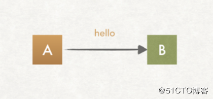
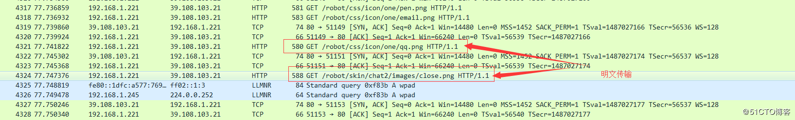
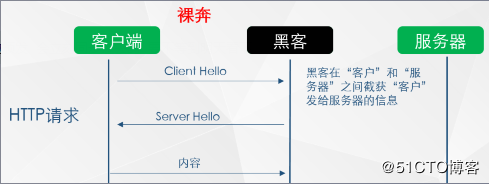
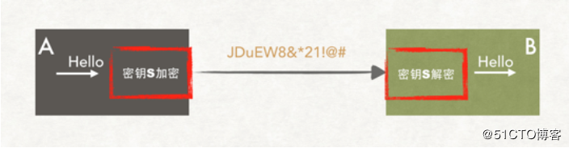
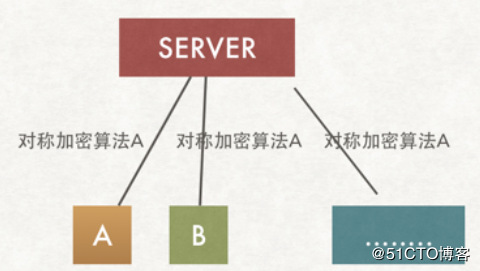
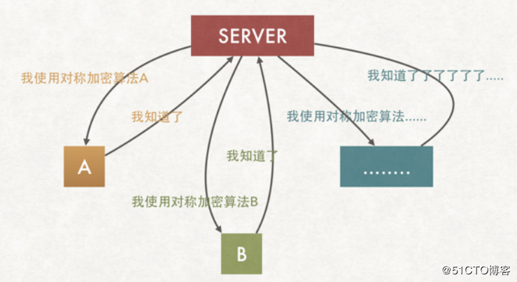
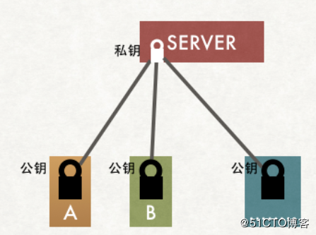
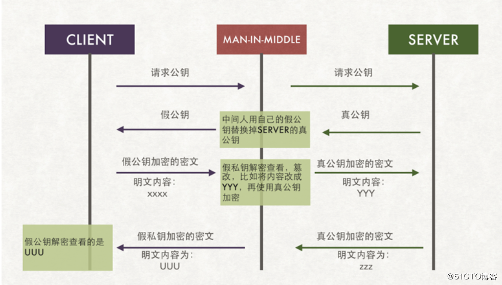
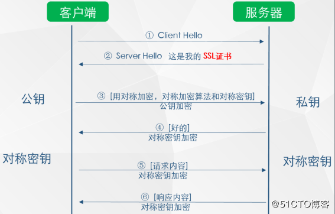
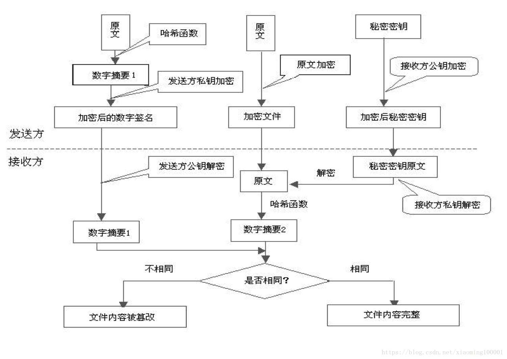

## https介绍

#### 什么是HTTPS?
```
《图解HTTP》这本书中曾提过HTTPS是身披SSL外壳的HTTP。HTTPS是一种通过计算机网络进行安全通信的传输协议，经由HTTP进行通信，利用SSL/TLS建立全信道，加密数据包。HTTPS使用的主要目的是提供对网站服务器的身份认证，同时保护交换数据的隐私与完整性。
PS:TLS是传输层加密协议，前身是SSL协议，由网景公司1995年发布，有时候两者不区分。
```

#### https原理通俗讲解

https=http+ssl，顾名思义，https是在http的基础上加上了SSL保护壳，信息的加密过程就是在SSL中完成的

首先我们先不谈https，先从一个简单的通讯原理图讲起：



http通信原理

客户端发送一句client hello给服务器端，服务器端返回一句serverhello给客户端，鉴于本文讨论是https的加密主题，我们只讨论信息传输的加密问题

**实现客户端和服务端发送的信息client hello 和server hello，即使中间的包被窃取了，也无法解密传输的内容**

http：client hello和server hello在通讯的过程中，以明文的形式进行传输，采用wireshark抓包的效果如下图：




有没有感觉这个的信息传输是完全暴露在互联网上面，你请求的所有信息都可以被窥测到，是不是感觉心一凉，不过不用担心，我们的安全信息现在都是采用https的传输，后面讲到https的时候大家心里会顿时轻松。但这不是最关键的，http的传输最大的隐患是信息劫持和篡改，如下图：



可以看到，http的信息传输中，信息很容易被×××给劫持，更有甚者，×××可以伪装服务器将篡改后的信息返回给用户，试想一下，如果×××劫持的是你的银行信息，是不是很可怕。所以对于http传出存在的问题可以总结如下：

（1）信息篡改：修改通信的内容

（2）信息劫持：拦截到信息通信的内容

这些是http不安全的体现，说完http，我们回到本文的主题https，看下人家是怎么保护信息的，所有的请求信息都采用了TLS加密，如果没有秘钥是无法解析传输的是什么信息


对于加密传输存在对称加密和非对称加密

**对称加密**



对称加密传输

当客户端发送Hello字符串的时候，在进行信息传输前，采用加密算法（上图中的秘钥S）将hello加密程JDuEW8&*21!@#进行传输，即使中间被×××劫持了，如果没有对应的秘钥S也无法知道传出的信息为何物，在上图中信息的加密和解密都是通过同一个秘钥进行的，对于这种加密我们称之为对称加密，只要A和B之间知道加解密的秘钥，任何第三方都无法获取秘钥S，则在一定条件下，基本上解决了信息通信的安全问题。但在现实的情况下（www），实际的通讯模型远比上图复杂，下图为实际的通信模型



server和所有的client都采用同一个秘钥S进行加解密，但大家思考下，如果这样的话，无异于没有加密，请做下思考

由于server和所有的client都采用同一个秘钥S，则×××们作为一个client也可以获取到秘钥S，此地无银三百两。所以在实际的通讯中，**一般不会采用同一个秘钥，而是采用不同的秘钥加解密**，如下图



通过协商的方式获取不同的秘钥

如上图，A和server通信采用对称加密A算法，B和server通信采用对称秘钥B算法，因此可以很好的解决了不同的客户端采用相同的秘钥进行通讯的问题

那现在又存在问题了，A通过明文传输和server协商采用了加密算法A，但这条信息本身是没有加密的，因此×××们还是可以窃取到秘钥的，整个的通讯仍然存在风险。那该如何处理呢？有人说，把这条信息（协调秘钥的过程）再次加密，那是不是还要协商加密秘钥，如此反复，永无止境。从根本上无法解决信息通讯的安全问题

**如何对协商过程进行加密**



**非对称加密原理图**

在密码学跟对称加密一起出现的，应用最广的加密机制“非对称加密”，如上图，**特点是私钥加密后的密文，只要是公钥，都可以解密，但是反过来公钥加密后的密文，只有私钥可以解密。私钥只有一个人有，而公钥可以发给所有的人**。

基于上述的特点，我们可以得出如下结论：

（1）公钥是开放给所有人的，但私钥是需要保密的，存在于服务端

（2）服务器端server向client端（A、B.....）的信息传输是不安全的：因为所有人都可以获取公钥

（3）但client端（A、B.....）向server端的信息传输确实安全的：因为私钥只有server端存在

因此，如何协商加密算法的问题，我们解决了，**非对称加密算法进行对称加密算法协商过程**。


在这里我们做个小结：
信息通信采用http是不安全的，存在信息劫持、篡改的风险，https是加密传输，是安全的通信，对于https加密的过程，我们首先介绍的对称加密，采用对称加密进行通信存在秘钥协商过程的不安全性，因此我们采用了非对称加密算法解决了对协商过程的加密，因此https是集对称加密和非对称加密为一体的加密过程


**安全的获取公钥**


细心的人可能已经注意到了如果使用非对称加密算法，我们的客户端A，B需要一开始就持有公钥，要不没法开展加密行为啊。

这下，我们又遇到新问题了，**如何让A、B客户端安全地得到公钥？**



client获取公钥最最直接的方法是服务器端server将公钥发送给每一个client用户，但这个时候就出现了公钥被劫持的问题，如上图，client请求公钥，在请求返回的过程中被×××劫持，那么我们将采用劫持后的假秘钥进行通信，则后续的通讯过程都是采用假秘钥进行，数据库的风险仍然存在。在获取公钥的过程中，我们又引出了一个新的话题：**如何安全的获取公钥，并确保公钥的获取是安全的**， 那就需要用到终极武器了：SSL 证书（需要购买）和CA机构



如上图所示，在第 ② 步时服务器发送了一个SSL证书给客户端，SSL 证书中包含的具体内容有证书的颁发机构、有效期、公钥、证书持有者、签名，通过第三方的校验保证了身份的合法，解决了公钥获取的安全性

以浏览器为例说明如下整个的校验过程：

（1）首先浏览器读取证书中的证书所有者、有效期等信息进行一一校验

（2）浏览器开始查找操作系统中已内置的受信任的证书发布机构CA，与服务器发来的证书中的颁发者CA比对，用于校验证书是否为合法机构颁发 

（3）如果找不到，浏览器就会报错，说明服务器发来的证书是不可信任的。

（4）如果找到，那么浏览器就会从操作系统中取出  颁发者CA  的公钥，然后对服务器发来的证书里面的签名进行解密

（5）浏览器使用相同的hash算法计算出服务器发来的证书的hash值，将这个计算的hash值与证书中签名做对比

（6）对比结果一致，则证明服务器发来的证书合法，没有被冒充

（7）此时浏览器就可以读取证书中的公钥，用于后续加密了


**HTTPS有如下特点**
1. 内容加密：采用混合加密技术，中间者无法直接查看明文内容
2. 验证身份：通过证书认证客户端访问的是自己的服务器
3. 保护数据完整性：防止传输的内容被中间人冒充或者篡改
```
混合加密：结合非对称加密和对称加密技术。客户端使用对称加密生成密钥对传输数据进行加密，然后使用非对称加密的公钥再对秘钥进行加密，所以网络上传输的数据是被秘钥加密的密文和用公钥加密后的秘密密钥，因此即使被黑客截取，由于没有私钥，无法获取到加密明文的秘钥，便无法获取到明文数据。 

数字摘要：通过单向hash函数对原文进行哈希，将需加密的明文“摘要”成一串固定长度(如128bit)的密文，不同的明文摘要成的密文其结果总是不相同，同样的明文其摘要必定一致，并且即使知道了摘要也不能反推出明文。 

数字签名技术：数字签名建立在公钥加密体制基础上，是公钥加密技术的另一类应用。它把公钥加密技术和数字摘要结合起来，形成了实用的数字签名技术。

1. 收方能够证实发送方的真实身份；
2. 发送方事后不能否认所发送过的报文；
3. 收方或非法者不能伪造、篡改报文。
```

**获取公钥成功后，通讯过程**


至此第一部分关于HTTPS的原理介绍已经结束了，总结一下：

HTTPS要使客户端与服务器端的通信过程得到安全保证，必须使用的对称加密算法，但是协商对称加密算法的过程，需要使用非对称加密算法来保证安全，然而直接使用非对称加密的过程本身也不安全，会有中间人篡改公钥的可能性，所以客户端与服务器不直接使用公钥，而是使用数字证书签发机构颁发的证书来保证非对称加密过程本身的安全。这样通过这些机制协商出一个对称加密算法，就此双方使用该算法进行加密解密。从而解决了客户端与服务器端之间的通信安全问题。

**安全性考虑**
1. HTTPS协议的加密范围也比较有限，在黑客攻击、拒绝服务攻击、服务器劫持等方面几乎起不到什么作用
2. SSL证书的信用链体系并不安全，特别是在某些国家可以控制CA根证书的情况下，中间人攻击一样可行
```
中间人攻击（MITM攻击）是指，黑客拦截并篡改网络中的通信数据。又分为被动MITM和主动MITM，被动MITM只窃取通信数据而不修改，而主动MITM不但能窃取数据，还会篡改通信数据。最常见的中间人攻击常常发生在公共wifi或者公共路由上。
```

**成本考虑**
1. SSL证书需要购买申请，功能越强大的证书费用越高
2. SSL证书通常需要绑定IP，不能在同一IP上绑定多个域名，IPv4资源不可能支撑这个消耗（SSL有扩展可以部分解决这个问题，但是比较麻烦，而且要求浏览器、操作系统支持，Windows XP就不支持这个扩展，考虑到XP的装机量，这个特性几乎没用）。
3. 根据ACM CoNEXT数据显示，使用HTTPS协议会使页面的加载时间延长近50%，增加10%到20%的耗电。
4. HTTPS连接缓存不如HTTP高效，流量成本高。
5. HTTPS连接服务器端资源占用高很多，支持访客多的网站需要投入更大的成本。
6. HTTPS协议握手阶段比较费时，对网站的响应速度有影响，影响用户体验。比较好的方式是采用分而治之，类似12306网站的主页使用HTTP协议，有关于用户信息等方面使用HTTPS。

原文：https://blog.51cto.com/11883699/2160032
    https://blog.csdn.net/xiaoming100001/article/details/81109617 