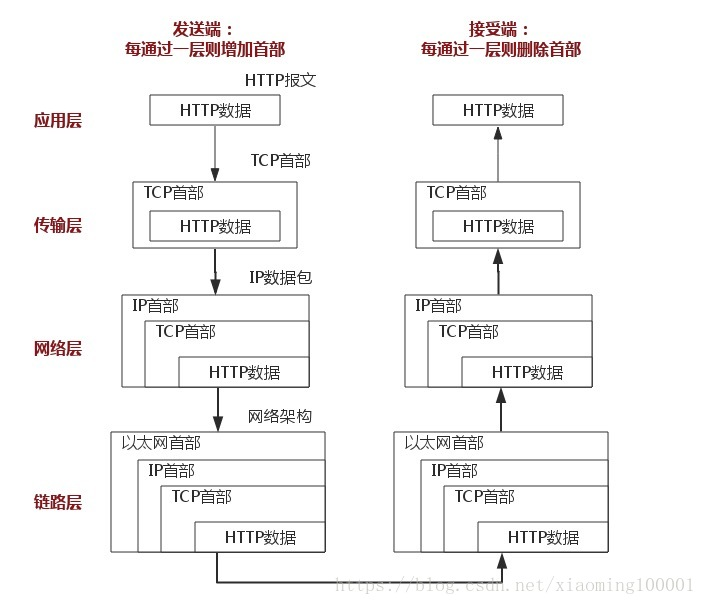
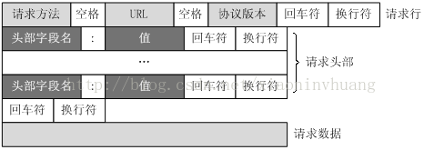

## http介绍

#### 什么是HTTP?

超文本传输协议，是一个基于请求与响应，无状态的，应用层的协议，常基于TCP/IP协议传输数据，互联网上应用最为广泛的一种网络协议,所有的WWW文件都必须遵守这个标准。设计HTTP的初衷是为了提供一种发布和接收HTML页面的方法。

#### http的发展历史

版本	|产生时间	|内容	|发展现状
--|--|--|--|--
HTTP/0.9	|1991年	|不涉及数据包传输，规定客户端和服务器之间通信格式，只能GET请求	|没有作为正式的标准
HTTP/1.0	|1996年	|传输内容格式不限制，增加PUT、PATCH、HEAD、 OPTIONS、DELETE命令	|正式作为标准
HTTP/1.1	|1997年	|持久连接(长连接)、节约带宽、HOST域、管道机制、分块传输编码	|2015年前使用最广泛
HTTP/2	|2015年	|多路复用、服务器推送、头信息压缩、二进制协议等	|逐渐覆盖市场

1. http的特点

    * 无状态：协议对客户端没有状态存储，对事物处理没有“记忆”能力，比如访问一个网站需要反复进行登录操作
    * 无连接：HTTP/1.1之前，由于无状态特点，每次请求需要通过TCP三次握手四次挥手，和服务器重新建立连接。比如某个客户机在短时间多次请求同一个资源，服务器并不能区别是否已经响应过用户的请求，所以每次需要重新响应请求，需要耗费不必要的时间和流量。
    * 基于请求和响应：基本的特性，由客户端发起请求，服务端响应
    * 简单快速、灵活
    * 通信使用明文、请求和响应不会对通信方进行确认、无法保护数据的完整性

    Http的无状态，无连接这两个特性的优缺点：
    * 优点在于解放了服务器，每一次请求“点到为止”不会造成不必要连接占用。
    * 缺点在于每次请求会传输大量重复的内容信息。

    针对无状态的一些解决策略：
    * 通过Cookie/Session技术
    * HTTP/1.1持久连接（HTTP keep-alive）方法，只要任意一端没有明确提出断开连接，则保持TCP连接状态，在请求首部字段中的Connection: keep-alive即为表明使用了持久连接

2. 完整的HTTP请求所经历的7个步骤

    
    
    HTTP通信机制是在一次完整的HTTP通信过程中，Web浏览器与Web服务器之间将完成下列7个步骤： 

    1. 建立TCP连接

        在HTTP工作开始之前，Web浏览器首先要通过网络与Web服务器建立连接，该连接是通过TCP来完成的，该协议与IP协议共同构建 Internet，即著名的TCP/IP协议族，因此Internet又被称作是TCP/IP网络。HTTP是比TCP更高层次的应用层协议，根据规则， 只有低层协议建立之后才能进行高层协议的连接，因此，首先要建立TCP连接，一般TCP连接的端口号是80。

    2. Web浏览器向Web服务器发送请求行

        一旦建立了TCP连接，Web浏览器就会向Web服务器发送请求命令。例如：GET /sample/hello.jsp HTTP/1.1。

    3. Web浏览器发送请求头

        浏览器发送其请求命令之后，还要以头信息的形式向Web服务器发送一些别的信息，之后浏览器发送了一空白行来通知服务器，它已经结束了该头信息的发送。 

    4. Web服务器应答 

        客户机向服务器发出请求后，服务器会客户机回送应答， HTTP/1.1 200 OK ，应答的第一部分是协议的版本号和应答状态码。

    5.  Web服务器发送应答头

        正如客户端会随同请求发送关于自身的信息一样，服务器也会随同应答向用户发送关于它自己的数据及被请求的文档。 

    6.  Web服务器向浏览器发送数据 

        Web服务器向浏览器发送头信息后，它会发送一个空白行来表示头信息的发送到此为结束，接着，它就以Content-Type应答头信息所描述的格式发送用户所请求的实际数据。

    7.  Web服务器关闭TCP连接 

        一般情况下，一旦Web服务器向浏览器发送了请求数据，它就要关闭TCP连接，然后如果浏览器或者服务器在其头信息加入了这行代码：

        Connection:keep-alive 

        TCP连接在发送后将仍然保持打开状态，于是，浏览器可以继续通过相同的连接发送请求。保持连接节省了为每个请求建立新连接所需的时间，还节约了网络带宽。

    **建立TCP连接->发送请求行->发送请求头->（到达服务器）发送状态行->发送响应头->发送响应数据->断TCP连接**


    http整个网络层的过程：客户端输入URL回车，DNS解析域名得到服务器的IP地址，服务器在80端口监听客户端请求，端口通过TCP/IP协议（可以通过Socket实现）建立连接。HTTP属于TCP/IP模型中的运用层协议，所以通信的过程其实是对应数据的入栈和出栈

    

3. http报文

    HTTP报文是面向文本的，报文中的每一个字段都是一些ASCII码串，各个字段的长度是不确定的。HTTP有两类报文：请求报文和响应报文。

    * HTTP请求报文

        一个HTTP请求报文由4个部分组成
        * request line：请求行
        * header：请求头部
        * blank line：空行
        * request-body：请求数据
        
        下图给出了请求报文的一般格式。

        

        1. 请求行

            请求行由请求方法字段、URL字段和HTTP协议版本字段3个字段组成，它们用空格分隔。例如，GET /index.html HTTP/1.1。

            HTTP协议的请求方法有GET、POST、HEAD、PUT、DELETE、OPTIONS、TRACE、CONNECT。

            方法|描述
            --|--
            GET|向Web服务器请求一个文件
            POST|向Web服务器发送数据让Web服务器进行处理
            PUT|向Web服务器发送数据并存储在Web服务器内部
            HEAD|检查一个对象是否存在
            DELETE|从Web服务器上删除一个文件
            CONNECT|对通道提供支持
            TRACE|跟踪到服务器的路径

            而常见的有如下几种：

            1. GET

                最常见的一种请求方式，当客户端要从服务器中读取文档时，当点击网页上的链接或者通过在浏览器的地址栏输入网址来浏览网页的，使用的都是GET方式。GET方法要求服务器将URL定位的资源放在响应报文的数据部分，回送给客户端。使用GET方法时，请求参数和对应的值附加在URL后面，利用一个问号（“?”）代表URL的结尾与请求参数的开始，传递参数长度受限制。例如，/index.jsp?id=100&op=bind,这样通过GET方式传递的数据直接表示在地址中，所以我们可以把请求结果以链接的形式发送给好友。以用google搜索domety为例，Request格式如下：

                ```
                GET /search?hl=zh-CN&source=hp&q=domety&aq=f&oq= HTTP/1.1  
                Accept: image/gif, image/x-xbitmap, image/jpeg, image/pjpeg, application/vnd.ms-excel, application/vnd.ms-powerpoint, 
                application/msword, application/x-silverlight, application/x-shockwave-flash, */*  
                Referer: <a href="http://www.google.cn/">http://www.google.cn/</a>  
                Accept-Language: zh-cn  
                Accept-Encoding: gzip, deflate  
                User-Agent: Mozilla/4.0 (compatible; MSIE 6.0; Windows NT 5.1; SV1; .NET CLR 2.0.50727; TheWorld)  
                Host: <a href="http://www.google.cn">www.google.cn</a>  
                Connection: Keep-Alive  
                Cookie: PREF=ID=80a06da87be9ae3c:U=f7167333e2c3b714:NW=1:TM=1261551909:LM=1261551917:S=ybYcq2wpfefs4V9g; 
                NID=31=ojj8d-IygaEtSxLgaJmqSjVhCspkviJrB6omjamNrSm8lZhKy_yMfO2M4QMRKcH1g0iQv9u-2hfBW7bUFwVh7pGaRUb0RnHcJU37y-
                FxlRugatx63JLv7CWMD6UB_O_r  
                ```

                可以看到，GET方式的请求一般不包含”请求数据”部分，请求数据以地址的形式表现在请求行。地址链接如下：
                ```html
                <a href="http://www.google.cn/search?hl=zh-CN&source=hp&q=domety&aq=f&oq=">http://www.google.cn/search?hl=zh-CN&source=hp
                &q=domety&aq=f&oq=</a> 
                ```

                地址中”?”之后的部分就是通过GET发送的请求数据，我们可以在地址栏中清楚的看到，各个数据之间用”&”符号隔开。显然，这种方式不适合传送私密数据。另外，由于不同的浏览器对地址的字符限制也有所不同，一般最多只能识别1024个字符，所以如果需要传送大量数据的时候，也不适合使用GET方式。

             

            2. POST

                对于上面提到的不适合使用GET方式的情况，可以考虑使用POST方式，因为使用POST方法可以允许客户端给服务器提供信息较多。POST方法将请求参数封装在HTTP请求数据中，以名称/值的形式出现，可以传输大量数据，这样POST方式对传送的数据大小没有限制，而且也不会显示在URL中。还以上面的搜索domety为例，如果使用POST方式的话，格式如下：

                ```
                POST /search HTTP/1.1  
                Accept: image/gif, image/x-xbitmap, image/jpeg, image/pjpeg, application/vnd.ms-excel, application/vnd.ms-powerpoint, 
                application/msword, application/x-silverlight, application/x-shockwave-flash, */*  
                Referer: <a href="http://www.google.cn/">http://www.google.cn/</a>  
                Accept-Language: zh-cn  
                Accept-Encoding: gzip, deflate  
                User-Agent: Mozilla/4.0 (compatible; MSIE 6.0; Windows NT 5.1; SV1; .NET CLR 2.0.50727; TheWorld)  
                Host: <a href="http://www.google.cn">www.google.cn</a>  
                Connection: Keep-Alive  
                Cookie: PREF=ID=80a06da87be9ae3c:U=f7167333e2c3b714:NW=1:TM=1261551909:LM=1261551917:S=ybYcq2wpfefs4V9g; 
                NID=31=ojj8d-IygaEtSxLgaJmqSjVhCspkviJrB6omjamNrSm8lZhKy_yMfO2M4QMRKcH1g0iQv9u-2hfBW7bUFwVh7pGaRUb0RnHcJU37y-
                FxlRugatx63JLv7CWMD6UB_O_r  

                hl=zh-CN&source=hp&q=domety                       //数据
                ```

                可以看到，POST方式请求行中不包含数据字符串，这些数据保存在”请求内容”部分，各数据之间也是使用”&”符号隔开。

                参照上面get：

                GET /search?hl=zh-CN&source=hp&q=domety&aq=f&oq= HTTP/1.1  
                POST方式大多用于页面的表单中。因为POST也能完成GET的功能，因此多数人在设计表单的时候一律都使用POST方式，其实这是一个误区。GET方式也有自己的特点和优势，我们应该根据不同的情况来选择是使用GET还是使用POST。
             

            3. HEAD

                HEAD就像GET，只不过服务端接受到HEAD请求后只返回响应头，而不会发送响应内容。当我们只需要查看某个页面的状态的时候，使用HEAD是非常高效的，因为在传输的过程中省去了页面内容。

        2. 请求头部

            请求头部由关键字/值对组成，每行一对，关键字和值用英文冒号“:”分隔。请求头部通知服务器有关于客户端请求的信息，典型的请求头有：
           
            * User-Agent：产生请求的浏览器类型。
            * Accept：客户端可识别的内容类型列表。
            * Host：请求的主机名，允许多个域名同处一个IP地址，即虚拟主机。
             
        3. 空行

            最后一个请求头之后是一个空行，发送回车符和换行符，通知服务器以下不再有请求头。
           
        4. 请求数据

            请求数据不在GET方法中使用，而是在POST方法中使用。POST方法适用于需要客户填写表单的场合。与请求数据相关的最常使用的请求头是Content-Type和Content-Length。

    * HTTP响应报文

        HTTP响应也由四个部分组成
        * status-line：状态行
        * headers：消息报头
        * blank line：空行
        * response-body：响应正文

        如下所示，HTTP响应的格式与请求的格式十分类似，正如你所见，在响应中唯一真正的区别在于第一行中用状态信息代替了请求信息。状态行（status line）通过提供一个状态码来说明所请求的资源情况。

        状态行格式如下：

        HTTP-Version|Status-Code|Reason-Phrase CRLF
        --|--|--
        协议版本|响应状态码|状态码描述

        下面给出一个HTTP响应报文例子
        ```
        HTTP/1.1 200 OK
        Date: Sat, 31 Dec 2005 23:59:59 GMT
        Content-Type: text/html;charset=ISO-8859-1
        Content-Length: 122

        ＜html＞
        ＜head＞
        ＜title＞Wrox Homepage＜/title＞
        ＜/head＞
        ＜body＞
        ＜!-- body goes here --＞
        ＜/body＞
        ＜/html＞
        ```

        其中，HTTP-Version表示服务器HTTP协议的版本；Status-Code表示服务器发回的响应状态代码；Reason-Phrase表示状态代码的文本描述。状态代码由三位数字组成，第一个数字定义了响应的类别，且有五种可能取值。

        * 1xx：指示信息--表示请求已接收，继续处理。
        * 2xx：成功--表示请求已被成功接收、理解、接受。
        * 3xx：重定向--要完成请求必须进行更进一步的操作。
        * 4xx：客户端错误--请求有语法错误或请求无法实现。
        * 5xx：服务器端错误--服务器未能实现合法的请求。

        常见状态代码、状态描述的说明如下。
        * 200 OK：客户端请求成功。
        * 301 Moved Permanently： 请求永久重定向
        * 302 Moved Temporarily： 请求临时重定向
        * 304 Not Modified： 文件未修改，可以直接使用缓存的文件。
        * 400 Bad Request：客户端请求有语法错误，不能被服务器所理解。
        * 401 Unauthorized：请求未经授权，这个状态代码必须和WWW-Authenticate报头域一起使用。
        * 403 Forbidden：服务器收到请求，但是拒绝提供服务。
        * 404 Not Found：请求资源不存在，举个例子：输入了错误的URL。
        * 500 Internal Server Error：服务器发生不可预期的错误。
        * 503 Server Unavailable：服务器当前不能处理客户端的请求，一段时间后可能恢复正常，举个例子：HTTP/1.1 200 OK（CRLF）。

4. http详细状态码参考
    * 1xx（临时响应）

        表示临时响应并需要请求者继续执行操作的状态代码。

        代码|说明
        --|--
        100 （继续） |请求者应当继续提出请求。服务器返回此代码表示已收到请求的第一部分，正在等待其余部分。 
        101 （切换协议） |请求者已要求服务器切换协议，服务器已确认并准备切换。

    * 2xx （成功）

        表示成功处理了请求的状态代码。

        代码|说明
        --|--
        200 （成功） |服务器已成功处理了请求。通常，这表示服务器提供了请求的网页。
        201 （已创建） |请求成功并且服务器创建了新的资源。
        202 （已接受） |服务器已接受请求，但尚未处理。
        203 （非授权信息） |服务器已成功处理了请求，但返回的信息可能来自另一来源。
        204 （无内容） |服务器成功处理了请求，但没有返回任何内容。
        205 （重置内容） |服务器成功处理了请求，但没有返回任何内容。
        206 （部分内容） |服务器成功处理了部分 GET 请求。
    * 3xx （重定向）

        表示要完成请求，需要进一步操作。 通常，这些状态代码用来重定向。

        代码|说明
        --|--
        300 （多种选择） |针对请求，服务器可执行多种操作。服务器可根据请求者 (user agent) 选择一项操作，或提供操作列表供请求者选择。
        301 （永久移动） |请求的网页已永久移动到新位置。服务器返回此响应（对 GET 或 HEAD 请求的响应）时，会自动将请求者转到新位置。
        302 （临时移动） |服务器目前从不同位置的网页响应请求，但请求者应继续使用原有位置来进行以后的请求。
        303 （查看其他位置） |请求者应当对不同的位置使用单独的 GET 请求来检索响应时，服务器返回此代码。
        304 （未修改） |自从上次请求后，请求的网页未修改过。服务器返回此响应时，不会返回网页内容。
        305 （使用代理） |请求者只能使用代理访问请求的网页。如果服务器返回此响应，还表示请求者应使用代理。
        307 （临时重定向） |服务器目前从不同位置的网页响应请求，但请求者应继续使用原有位置来进行以后的请求。

    * 4xx（请求错误）
        这些状态代码表示请求可能出错，妨碍了服务器的处理。

        代码|说明
        --|--
        400 （错误请求） |服务器不理解请求的语法。
        401 （未授权） |请求要求身份验证。 对于需要登录的网页，服务器可能返回此响应。
        403 （禁止） |服务器拒绝请求。
        404 （未找到） |服务器找不到请求的网页。
        405 （方法禁用） |禁用请求中指定的方法。
        406 （不接受） |无法使用请求的内容特性响应请求的网页。
        407 （需要代理授权） |此状态代码与 401（未授权）类似，但指定请求者应当授权使用代理。
        408 （请求超时） |服务器等候请求时发生超时。
        409 （冲突） |服务器在完成请求时发生冲突。服务器必须在响应中包含有关冲突的信息。
        410 （已删除） |如果请求的资源已永久删除，服务器就会返回此响应。
        411 （需要有效长度） |服务器不接受不含有效内容长度标头字段的请求。
        412 （未满足前提条件） |服务器未满足请求者在请求中设置的其中一个前提条件。
        413 （请求实体过大） |服务器无法处理请求，因为请求实体过大，超出服务器的处理能力。
        414 （请求的 URI 过长） |请求的 URI（通常为网址）过长，服务器无法处理。
        415 （不支持的媒体类型） |请求的格式不受请求页面的支持。
        416 （请求范围不符合要求） |如果页面无法提供请求的范围，则服务器会返回此状态代码。
        417 （未满足期望值） |服务器未满足"期望"请求标头字段的要求.

    * 5xx（服务器错误）

        这些状态代码表示服务器在尝试处理请求时发生内部错误。 这些错误可能是服务器本身的错误，而不是请求出错。

        代码|说明
        --|--
        500 （服务器内部错误） |服务器遇到错误，无法完成请求。
        501 （尚未实施） |服务器不具备完成请求的功能。例如，服务器无法识别请求方法时可能会返回此代码。
        502 （错误网关） |服务器作为网关或代理，从上游服务器收到无效响应。
        503 （服务不可用） |服务器目前无法使用（由于超载或停机维护）。通常，这只是暂时状态。
        504 （网关超时） |服务器作为网关或代理，但是没有及时从上游服务器收到请求。
        505 （HTTP 版本不受支持） |服务器不支持请求中所用的 HTTP 协议版本。
        
5. 常见HTTP首部字段
    * 通用首部字段（请求报文与响应报文都会使用的首部字段）
        * Date：创建报文时间
        * Connection：连接的管理
        * Cache-Control：缓存的控制
        * Transfer-Encoding：报文主体的传输编码方式
    * 请求首部字段（请求报文会使用的首部字段）
        * Host：请求资源所在服务器
        * Accept：可处理的媒体类型
        * Accept-Charset：可接收的字符集
        * Accept-Encoding：可接受的内容编码
        * Accept-Language：可接受的自然语言
    * 响应首部字段（响应报文会使用的首部字段）
        * Accept-Ranges：可接受的字节范围
        * Location：令客户端重新定向到的URI
        * Server：HTTP服务器的安装信息
    * 实体首部字段（请求报文与响应报文的的实体部分使用的首部字段）
        * Allow：资源可支持的HTTP方法
        * Content-Type：实体主类的类型
        * Content-Encoding：实体主体适用的编码方式
        * Content-Language：实体主体的自然语言
        * Content-Length：实体主体的的字节数
        * Content-Range：实体主体的位置范围，一般用于发出部分请求时使用

6. Http1.0和Http1.1区别

    Http1.1比Http1.0升级了如下地方
    * 引入了持久连接，意思就是在一个TCP连接中可以传送多个Http的请求和响应。在请求头中添加Connection: Keep-Alive开启
    * 多个请求和响应可以同时进行
    * 引入更加多的请求头和响应头

7. Http和Https的区别
    * Http处在应用层，Https处在传输层
    * Http明文传输，Https通过ssl加密和身份认证
    * Http默认80端口，Https默认443端口
    
8. 关于HTTP请求GET和POST的区别

    1. 请求重点    
        * get重点在从服务器上获取资源
        * post重点在向服务器发送数据；
    
    2. 提交数据显示
        * get传输数据是通过URL请求，以field（字段）= value的形式，置于URL后，并用"?"连接，多个请求数据间用"&"连接，如http://127.0.0.1/Test/login.action?name=admin&password=admin，这个过程用户是可见的；
        * post传输数据通过Http的post机制，将字段与对应值封存在请求实体中发送给服务器，这个过程对用户是不可见的；

    3. 请求数据大小
        
        首先声明,HTTP协议没有对传输的数据大小进行限制，HTTP协议规范也没有对URL长度进行限制。 而在实际开发中存在的限制主要有：

        * Get传输的数据量小，因为受URL长度限制，但效率较高；但特定浏览器和服务器对URL长度有限制
        * Post可以传输大量数据，所以上传文件时只能用Post方式；各个WEB服务器会规定对post提交数据大小进行限制      Apache、IIS6都有各自的配置
    
    4. 安全性
        * get是不安全的，因为URL是可见的，可能会泄露私密信息，如密码等；
        * post较get安全性较高；
    
    5. 提交数据编码
        * get方式只能支持ASCII字符，向服务器传的中文字符可能会乱码。
        * post支持标准字符集，可以正确传递中文字符。

原文：https://blog.csdn.net/suncold123/article/details/83338267 
    https://blog.csdn.net/xiaoninvhuang/article/details/70257189 
    https://blog.csdn.net/xiaoming100001/article/details/81109617
