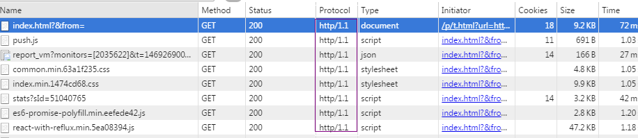
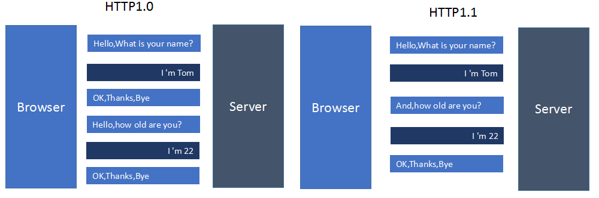
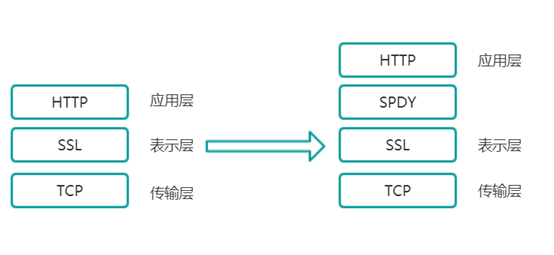
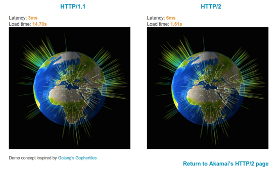
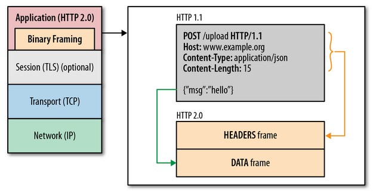
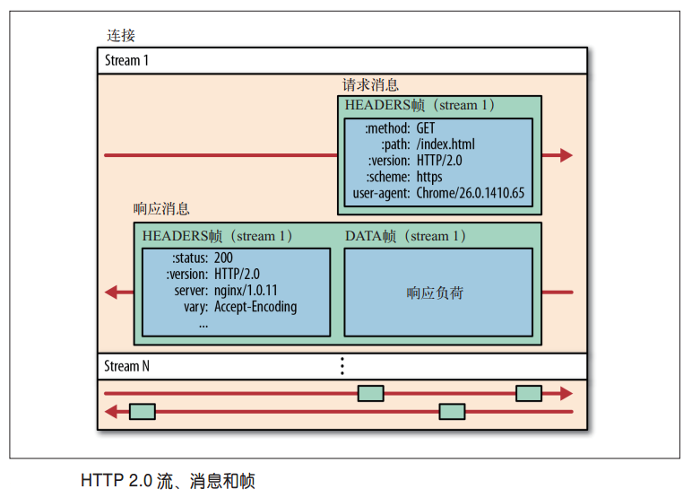
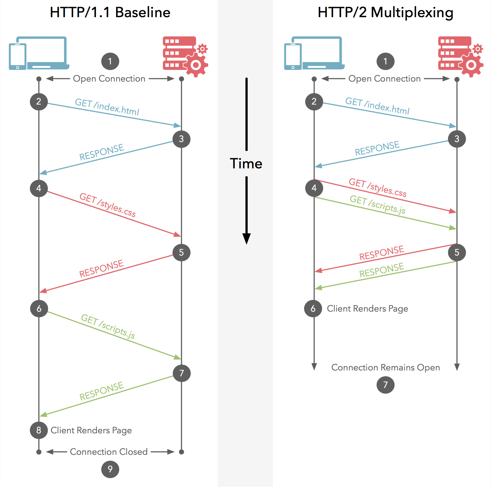
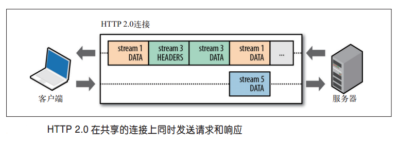
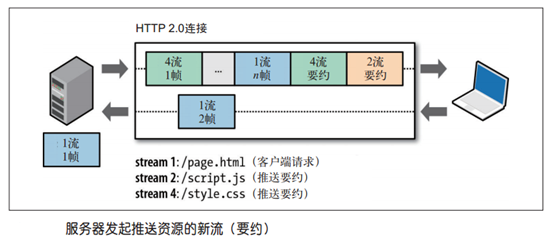

#### 浏览器与服务器通信过程
* TCP 连接： 浏览器与服务器三次握手，建立 TCP 连接
* 客户端请求： 建立 TCP 连接后，客户端就会向服务器发送一个 HTTP 请求信息（比如请求 HTML 资源，我们暂且就把这个称为“ HTML 请求”）
* 服务器响应： 服务器接收到请求后进行处理并发回一个 HTTP 响应信息

#### 影响HTTP访问速度的的因素
影响一个HTTP网络请求的因素主要有两个：带宽和延迟。

* 带宽

    如果说我们还停留在拨号上网的阶段，带宽可能会成为一个比较严重影响请求的问题，但是现在网络基础建设已经使得带宽得到极大的提升，我们不再会担心由带宽而影响网速，那么就只剩下延迟了。

* 延迟：
    1. 浏览器阻塞（HOL blocking）：浏览器会因为一些原因阻塞请求。浏览器对于同一个域名，同时只能有 4 个连接（这个根据浏览器内核不同可能会有所差异），超过浏览器最大连接数限制，后续请求就会被阻塞。

    2. DNS 查询（DNS Lookup）：浏览器需要知道目标服务器的 IP 才能建立连接。将域名解析为IP的这个系统就是 DNS。这个通常可以利用DNS缓存结果来达到减少这个时间的目的。

    3. 建立连接（Initial connection）：HTTP 是基于 TCP 协议的，浏览器最快也要在第三次握手时才能捎带HTTP请求报文，达到真正的建立连接，但是这些连接无法复用会导致每次请求都经历三次握手和慢启动。三次握手在高延迟的场景下影响较明显，慢启动则对文件类大请求影响较大。


#### HTTP1.0
1996年5月，HTTP/1.0 版本发布，内容大大增加。

首先，任何格式的内容都可以发送。这使得互联网不仅可以传输文字，还能传输图像、视频、二进制文件。这为互联网的大发展奠定了基础。

其次，除了GET命令，还引入了POST命令和HEAD命令，丰富了浏览器与服务器的互动手段。

再次，HTTP请求和回应的格式也变了。除了数据部分，每次通信都必须包括头信息（HTTP header），用来描述一些元数据。

其他的新增功能还包括状态码（status code）、多字符集支持、多部分发送（multi-part type）、权限（authorization）、缓存（cache）、内容编码（content encoding）等。

##### HTTP1.0的问题
HTTP/1.0 版的主要缺点是，每个TCP连接只能发送一个请求。发送数据完毕，连接就关闭，如果还要请求其他资源，就必须再新建一个连接。

TCP连接的新建成本很高，因为需要客户端和服务器三次握手，并且开始时发送速率较慢（slow start）。所以，HTTP 1.0版本的性能比较差。随着网页加载的外部资源越来越多，这个问题就愈发突出了。

#### HTTP1.1
1997年1月，HTTP/1.1 版本发布，只比 1.0 版本晚了半年。它进一步完善了 HTTP 协议，一直用到了20年后的今天，直到现在还是最流行的版本。

##### 持久连接
1.1 版的最大变化，就是引入了持久连接（persistent connection），即TCP连接默认不关闭，可以被多个请求复用，不用声明Connection: keep-alive。

客户端和服务器发现对方一段时间没有活动，就可以主动关闭连接。不过，规范的做法是，客户端在最后一个请求时，发送Connection: close，明确要求服务器关闭TCP连接。
```
Connection: close
```
目前，对于同一个域名，大多数浏览器允许同时建立6个持久连接。

##### 管道机制
1.1 版还引入了管道机制（pipelining），即在同一个TCP连接里面，客户端可以同时发送多个请求。这样就进一步改进了HTTP协议的效率。

举例来说，客户端需要请求两个资源。以前的做法是，在同一个TCP连接里面，先发送A请求，然后等待服务器做出回应，收到后再发出B请求。管道机制则是允许浏览器同时发出A请求和B请求，但是服务器还是按照顺序，先回应A请求，完成后再回应B请求。

##### Content-Length 字段
一个TCP连接现在可以传送多个回应，势必就要有一种机制，区分数据包是属于哪一个回应的。这就是Content-length字段的作用，声明本次回应的数据长度。
```
Content-Length: 3495
```
上面代码告诉浏览器，本次回应的长度是3495个字节，后面的字节就属于下一个回应了。

在1.0版中，Content-Length字段不是必需的，因为浏览器发现服务器关闭了TCP连接，就表明收到的数据包已经全了。

##### 分块传输编码
使用Content-Length字段的前提条件是，服务器发送回应之前，必须知道回应的数据长度。

对于一些很耗时的动态操作来说，这意味着，服务器要等到所有操作完成，才能发送数据，显然这样的效率不高。更好的处理方法是，产生一块数据，就发送一块，采用"流模式"（stream）取代"缓存模式"（buffer）。

因此，1.1版规定可以不使用Content-Length字段，而使用"分块传输编码"（chunked transfer encoding）。只要请求或回应的头信息有Transfer-Encoding字段，就表明回应将由数量未定的数据块组成。
```
Transfer-Encoding: chunked
```
每个非空的数据块之前，会有一个16进制的数值，表示这个块的长度。最后是一个大小为0的块，就表示本次回应的数据发送完了。下面是一个例子。
```
HTTP/1.1 200 OK
Content-Type: text/plain
Transfer-Encoding: chunked
 
25
This is the data in the first chunk
 
1C
and this is the second one
 
3
con
 
8
sequence
 
0
```
##### 其他功能
1.1版还新增了许多动词方法：PUT、PATCH、HEAD、 OPTIONS、DELETE。

另外，客户端请求的头信息新增了Host字段，用来指定服务器的域名。
```
Host: www.example.com
```
有了Host字段，就可以将请求发往同一台服务器上的不同网站，为虚拟主机的兴起打下了基础。

##### HTTP1.1的问题
虽然1.1版允许复用TCP连接，但是同一个TCP连接里面，所有的数据通信是按次序进行的。服务器只有处理完一个回应，才会进行下一个回应。要是前面的回应特别慢，后面就会有许多请求排队等着。这称为"队头堵塞"（Head-of-line blocking）。

为了避免这个问题，只有两种方法：一是减少请求数，二是同时多开持久连接。这导致了很多的网页优化技巧，比如合并脚本和样式表、将图片嵌入CSS代码、域名分片（domain sharding）等等。如果HTTP协议设计得更好一些，这些额外的工作是可以避免的。

#### HTTP1.0和HTTP1.1的一些区别
HTTP1.0最早在网页中使用是在1996年，那个时候只是使用一些较为简单的网页上和网络请求上，而HTTP1.1则在1999年才开始广泛应用于现在的各大浏览器网络请求中，同时HTTP1.1也是当前使用最为广泛的HTTP协议。 主要区别主要体现在：

1. **缓存处理**，在HTTP1.0中主要使用header里的If-Modified-Since,Expires来做为缓存判断的标准，HTTP1.1则引入了更多的缓存控制策略例如Entity tag，If-Unmodified-Since, If-Match, If-None-Match等更多可供选择的缓存头来控制缓存策略。
2. **带宽优化及网络连接的使用**，HTTP1.0中，存在一些浪费带宽的现象，例如客户端只是需要某个对象的一部分，而服务器却将整个对象送过来了，并且不支持断点续传功能，HTTP1.1则在请求头引入了range头域，它允许只请求资源的某个部分，即返回码是206（Partial Content），这样就方便了开发者自由的选择以便于充分利用带宽和连接。
3. **错误通知的管理**，在HTTP1.1中新增了24个错误状态响应码，如409（Conflict）表示请求的资源与资源的当前状态发生冲突；410（Gone）表示服务器上的某个资源被永久性的删除。
4. **Host头处理**，在HTTP1.0中认为每台服务器都绑定一个唯一的IP地址，因此，请求消息中的URL并没有传递主机名（hostname）。但随着虚拟主机技术的发展，在一台物理服务器上可以存在多个虚拟主机（Multi-homed Web Servers），并且它们共享一个IP地址。HTTP1.1的请求消息和响应消息都应支持Host头域，且请求消息中如果没有Host头域会报告一个错误（400 Bad Request）。
5. **长连接**，HTTP 1.1支持长连接（PersistentConnection）和请求的流水线（Pipelining）处理，在一个TCP连接上可以传送多个HTTP请求和响应，减少了建立和关闭连接的消耗和延迟，在HTTP1.1中默认开启Connection： keep-alive，一定程度上弥补了HTTP1.0每次请求都要创建连接的缺点。以下是常见的HTTP1.0：

```
GET / HTTP/1.1
Host:www/blahblahblahblah.com
```


区别用一张图来体现：


#### SPDY
2009年，谷歌公开了自行研发的 SPDY 协议，主要解决 HTTP/1.1 效率不高的问题。

这个协议在Chrome浏览器上证明可行以后，就被当作 HTTP/2 的基础，主要特性都在 HTTP/2 之中得到继承。

#### SPDY针对HTTP1.1的优化
2012年google如一声惊雷提出了SPDY的方案，优化了HTTP1.X的请求延迟，解决了HTTP1.X的安全性，具体如下：

1. **降低延迟**，针对HTTP高延迟的问题，SPDY优雅的采取了多路复用（multiplexing）。多路复用通过多个请求stream共享一个tcp连接的方式，解决了HOL blocking的问题，降低了延迟同时提高了带宽的利用率。
2. **请求优先级（request prioritization）**。多路复用带来一个新的问题是，在连接共享的基础之上有可能会导致关键请求被阻塞。SPDY允许给每个request设置优先级，这样重要的请求就会优先得到响应。比如浏览器加载首页，首页的html内容应该优先展示，之后才是各种静态资源文件，脚本文件等加载，这样可以保证用户能第一时间看到网页内容。
3. **header压缩**。前面提到HTTP1.x的header很多时候都是重复多余的。选择合适的压缩算法可以减小包的大小和数量。
4. **基于HTTPS的加密协议传输**，大大提高了传输数据的可靠性。
5. **服务端推送（server push）**，采用了SPDY的网页，例如我的网页有一个sytle.css的请求，在客户端收到sytle.css数据的同时，服务端会将sytle.js的文件推送给客户端，当客户端再次尝试获取sytle.js时就可以直接从缓存中获取到，不用再发请求了。SPDY构成图：


SPDY位于HTTP之下，TCP和SSL之上，这样可以轻松兼容老版本的HTTP协议(将HTTP1.x的内容封装成一种新的frame格式)，同时可以使用已有的SSL功能。

####　SPDY与HTTP2.0区别
HTTP2.0：SPDY的升级版

HTTP2.0可以说是SPDY的升级版（其实原本也是基于SPDY设计的），但是，HTTP2.0 跟 SPDY 仍有不同的地方，如下：
#####　HTTP2.0和SPDY的区别：

1. HTTP2.0 支持明文 HTTP 传输，而 SPDY 强制使用 HTTPS
2. HTTP2.0 消息头的压缩算法采用 HPACK，而非 SPDY 采用的 DEFLATE
####　HTTP2.0
这是 Akamai 公司建立的一个官方的演示，用以说明 HTTP/2 相比于之前的 HTTP/1.1 在性能上的大幅度提升。 同时请求 379 张图片，从Load time 的对比可以看出 HTTP/2 在速度上的优势。

https://http2.akamai.com/demo



####　HTTP2.0与HTTP1.1的区别
1. HTTP/2采用二进制格式而非文本格式
2. HTTP/2是完全多路复用的，而非有序并阻塞的——只需一个连接即可实现并行
3. 使用报头压缩，HTTP/2降低了开销
4. HTTP/2让服务器可以将响应主动“推送”到客户端缓存中
#####　二进制分帧层


在应用层与传输层之间增加一个二进制分帧层，以此达到“在不改动 HTTP 的语义，HTTP 方法、状态码、URI 及首部字段的情况下，突破 HTTP1.1 的性能限制，改进传输性能，实现低延迟和高吞吐量。”

在二进制分帧层上，HTTP2.0 会将所有传输的信息分割为更小的消息和帧，并对它们采用二进制格式的编码，其中 HTTP1.x 的首部信息会被封装到 Headers 帧，而我们的 request body 则封装到 Data 帧里面。

插播一些基础概念：

* 流：已建立的连接上的双向字节流。
* 消息：与逻辑消息对应的完整的一系列数据帧。
* 帧：HTTP2.0 通信的最小单位，每个帧包含首部，至少也会标识出当前帧所属的流。



多路复用（Multiplexing）


对于 HTTP1.1，浏览器通常最多有链接的限制，即使开启多个链接，也需要付出不小的代价。而多路复用允许同时通过单一的 HTTP2.0 连接发起多重的“请求-响应”消息。



客户端和服务器可以把 HTTP 消息分解为互不依赖的帧，然后乱序发送，最后再在另一端把它们重新组合起来。注意，同一链接上有多个不同方向的数据流在传输。客户端可以一边乱序发送 stream，也可以一边接收者服务器的响应，而服务器那端同理。

也就是说， HTTP2.0 通信都在一个连接上完成，这个连接可以承载任意数量的双向数据流。就好比，我请求一个页面 http://www.qq.com 。页面上所有的资源请求都是客户端与服务器上的一条 TCP 上请求和响应的！

##### 优先级（Priority）
可以请求的时候告知服务器端，资源分配权重，优先加载重要资源；

既然所有资源都是并行交错发送，会不会出现这样的情况 浏览器明明在等关键的 CSS 和 JS，你 TMD 的服务器还在发送图片？

每个 HTTP2.0 流里面有个优先值，这个优先值确定着客户端和服务器处理不同的流采取不同的优先级策略，高优先级的流都应该优先发送，但又不会绝对的。绝对地准守，可能又会引入首队阻塞的问题：高优先级的请求慢导致阻塞其他资源交付。分配处理资源和客户端与服务器间的带宽，不同优先级的混合也是必须的。

所以就不会出现如上描述的这种情况了。

##### 数据流
因为 HTTP/2 的数据包是不按顺序发送的，同一个连接里面连续的数据包，可能属于不同的回应。因此，必须要对数据包做标记，指出它属于哪个回应。

HTTP/2 将每个请求或回应的所有数据包，称为一个数据流（stream）。每个数据流都有一个独一无二的编号。数据包发送的时候，都必须标记数据流ID，用来区分它属于哪个数据流。另外还规定，客户端发出的数据流，ID一律为奇数，服务器发出的，ID为偶数。

数据流发送到一半的时候，客户端和服务器都可以发送信号（RST_STREAM帧），取消这个数据流。1.1版取消数据流的唯一方法，就是关闭TCP连接。这就是说，HTTP/2 可以取消某一次请求，同时保证TCP连接还打开着，可以被其他请求使用。

客户端还可以指定数据流的优先级。优先级越高，服务器就会越早回应。

##### header压缩 
HTTP 协议不带有状态，每次请求都必须附上所有信息。所以，请求的很多字段都是重复的，比如Cookie和User Agent，一模一样的内容，每次请求都必须附带，这会浪费很多带宽，也影响速度。

HTTP/2 对这一点做了优化，引入了头信息压缩机制（header compression）。一方面，头信息使用gzip或compress压缩后再发送；另一方面，客户端和服务器同时维护一张头信息表，所有字段都会存入这个表，生成一个索引号，以后就不发送同样字段了，只发送索引号，这样就提高速度了。

##### 服务器推送（Server Push）：



HTTP/2 允许服务器未经请求，主动向客户端发送资源，这叫做服务器推送（server push）。

常见场景是客户端请求一个网页，这个网页里面包含很多静态资源。正常情况下，客户端必须收到网页后，解析HTML源码，发现有静态资源，再发出静态资源请求。其实，服务器可以预期到客户端请求网页后，很可能会再请求静态资源，所以就主动把这些静态资源随着网页一起发给客户端了。

原文：https://blog.csdn.net/CrankZ/article/details/81239654 