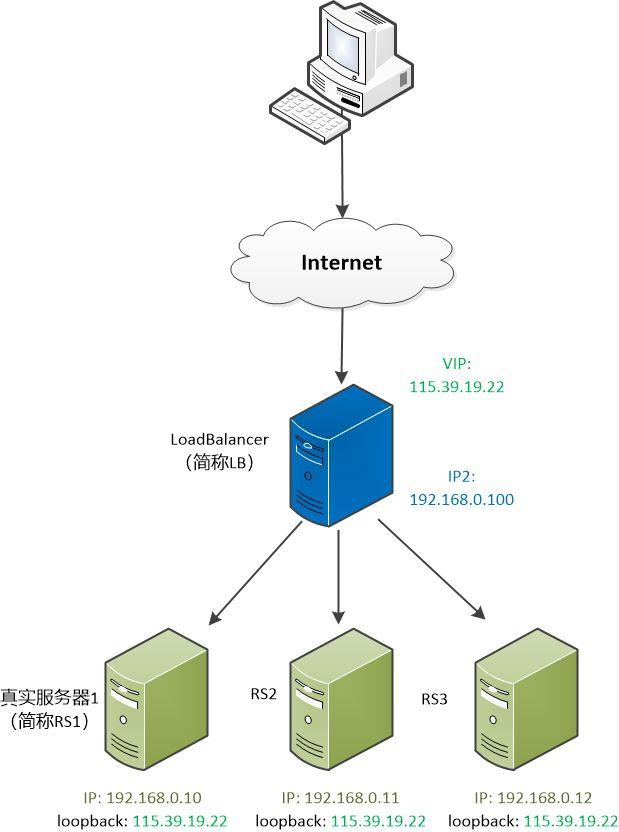

## 负载均衡

1. 模型构成要素

    

    * 客户端C
        * IP : 218.29.50.48
    * 负载均衡服务器BL
        * VIP : 115.39.19.22
        * IP2 ：192.168.0.100
        * MAC : 11:27:F5:8AL79:54
        * arp映射
            IP|MAC
            --|--
            192.168.0.10|23:39:8D:9C:0A:33
            192.168.0.11|23:39:8D:9C:0A:34
            192.168.0.12|23:39:8D:9C:0A:33

    * 真实服务器三台：
        服务器|IP|MAC|lookback
        --|--|--|--
        RS1|192.168.0.10|23:39:8D:9C:0A:33|115.39.19.22
        RS2|192.168.0.11|23:39:8D:9C:0A:34|115.39.19.22
        RS3|192.168.0.12|23:39:8D:9C:0A:33|115.39.19.22

    
2. 负载均衡原理

    
    

    1. 客户端C发出GET请求
    2. BL收到请求IP数据包，从arp映射中选取一个，封装IP数据包为链路数据包，并发送到对应的MAC地址。
    3. 对应的真实服务器解析出IP数据包，处理请求并响应。

参考：https://baijiahao.baidu.com/s?id=1634386941492502616&wfr=spider&for=pc