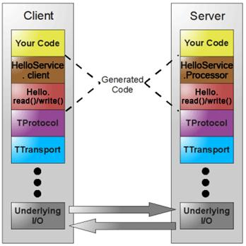
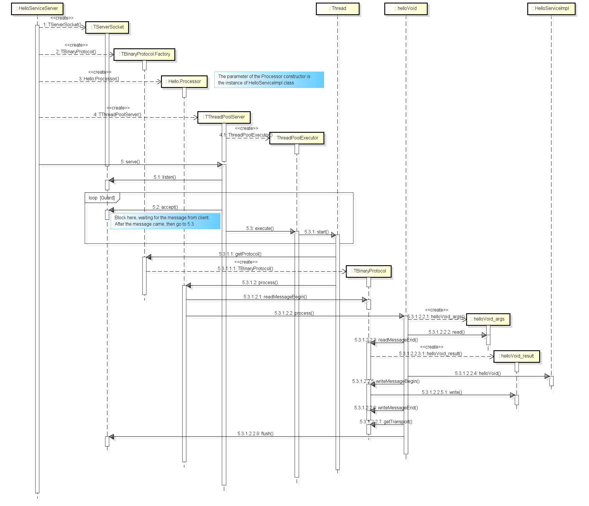
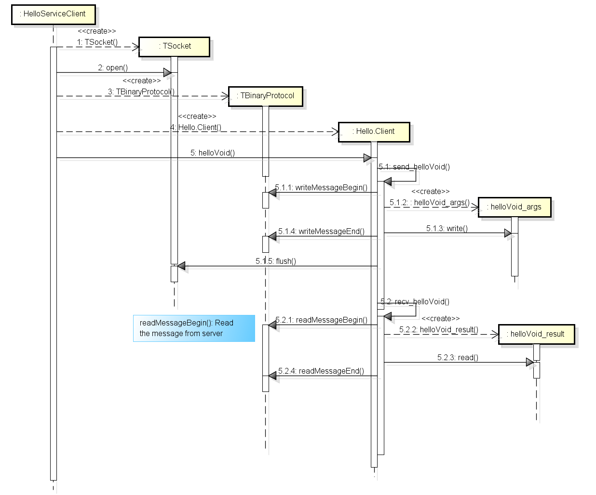
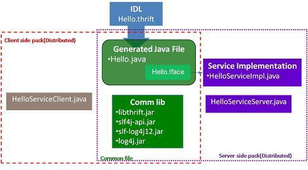
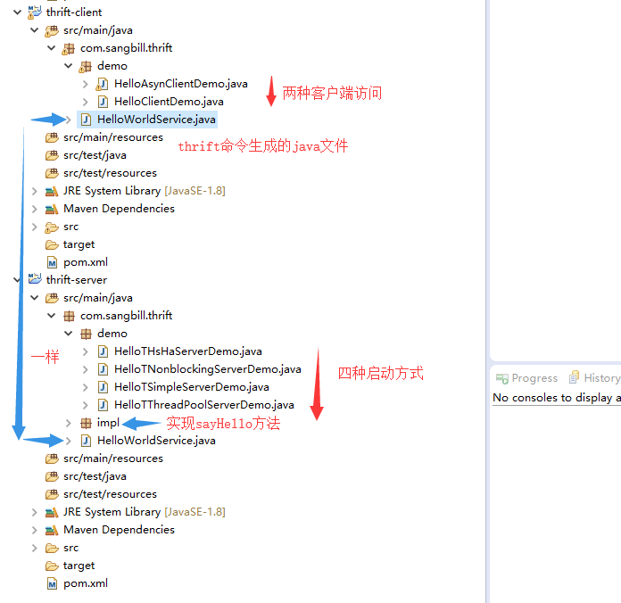

## Thrift入门及Java实例
### 一、概述

Thrift是一个软件框架，用来进行可扩展且跨语言的服务的开发。它结合了功能强大的软件堆栈和代码生成引擎，以构建在 C++, Java, Python, PHP, Ruby, Erlang, Perl, Haskell, C#, Cocoa, JavaScript, Node.js, Smalltalk, and OCaml 等等编程语言间无缝结合的、高效的服务。

Thrift最初由facebook开发，07年四月开放源码，08年5月进入apache孵化器。thrift允许你定义一个简单的定义文件中的数据类型和服务接口。以作为输入文件，编译器生成代码用来方便地生成RPC客户端和服务器通信的无缝跨编程语言。【来自百度百科】

官网地址：thrift.apache.org


### 二、下载依赖（Maven）

1、在pom.xml 中添加如下内容：

```xml
<dependency>  
    <groupId>org.apache.thrift</groupId>  
    <artifactId>libthrift</artifactId>  
    <version>0.11.0</version>  
</dependency>  
<dependency>  
    <groupId>org.slf4j</groupId>  
    <artifactId>slf4j-log4j12</artifactId>  
    <version>1.7.12</version>  
</dependency>  
```
### 三、基本概念以及实现步骤

几张图片说明thrift整个流程：

架构图：




服务端



客户端



部署图



注意：图片来源互联网

1、数据传输协议

* TBinaryProtocol : 二进制格式
* TCompactProtocol : 压缩格式
* TJSONProtocol : JSON格式
* TSimpleJSONProtocol : 提供JSON只写协议, 生成的文件很容易通过脚本语言解析

注意：客户端和服务端的协议要一致。

2、服务端
1. 实现服务处理接口impl
2. 创建TProcessor
3. 创建TServerTransport
4. 创建TProtocol
5. 创建TServer
6. 启动Server

3、客户端
1. 创建Transport
2. 创建TProtocol
3. 基于TTransport和TProtocol创建 Client
4. 调用Client的相应方法

### 四、实例（java）

1、thrift文件创建HelloWorldService.thrift，并在文件中定义需要的接口方法
```java
namespace java com.sangbill.thrift
  
service  HelloWorldService {  
  string sayHello(1:string username)  
}  
```
2、执行thrift生成代码
```bash
thrift --gen java HelloWorldService.thrift
```
当前路径为/home/bill/,执行上面的命令后，生成了gen-java目录，列出文件HelloWorldService.java详细路径:
```
/home/bill/gen-java/com/sangbill/thrift/HelloWorldService.java
```
3、创建一个服务maven项目（thrift-service），将生成的HelloWorldService.java文件复制到自己的项目中，利用maven打包成为bundle作为一个服务包，里面代码具体是什么样子的，我们不需要关心，到时候需要用到的地方，只需要把这个服务包引进去即可使用，下面看看我的pom.xml文件（把该开放出去的package开放出去，该引进来的package引进来）
```xml
<project xmlns="http://maven.apache.org/POM/4.0.0" xmlns:xsi="http://www.w3.org/2001/XMLSchema-instance"  
    xsi:schemaLocation="http://maven.apache.org/POM/4.0.0 http://maven.apache.org/xsd/maven-4.0.0.xsd">  
    <modelVersion>4.0.0</modelVersion>  
  
    <groupId>com.sangbill.thrift</groupId>  
    <artifactId>thrift-service</artifactId>  
    <version>1.0.0</version>  
    <packaging>jar</packaging>  
  
    <name>thrift-service</name>  
    <url>http://maven.apache.org</url>  
  
    <properties>  
        <project.build.sourceEncoding>UTF-8</project.build.sourceEncoding>  
    </properties>  
  
    <dependencies>  
        <dependency>  
            <groupId>junit</groupId>  
            <artifactId>junit</artifactId>  
            <version>3.8.1</version>  
            <scope>test</scope>  
        </dependency>  
        <dependency>  
            <groupId>org.apache.thrift</groupId>  
            <artifactId>libthrift</artifactId>  
            <version>0.11.0</version>  
        </dependency>  
        <dependency>  
            <groupId>org.slf4j</groupId>  
            <artifactId>slf4j-log4j12</artifactId>  
            <version>1.7.12</version>  
        </dependency>  
    </dependencies>  
      
    <build>  
        <plugins>  
            <plugin>  
                <groupId>org.apache.maven.plugins</groupId>  
                <artifactId>maven-compiler-plugin</artifactId>  
                <version>2.3.2</version>  
                <configuration>  
                    <source>1.8</source>  
                    <target>1.8</target>  
                    <encoding>${project.build.sourceEncoding}</encoding>  
                </configuration>  
            </plugin>  
            <plugin>  
                <groupId>org.apache.maven.plugins</groupId>  
                <artifactId>maven-resources-plugin</artifactId>  
                <version>2.4.3</version>  
                <executions>  
                    <execution>  
                        <phase>compile</phase>  
                    </execution>  
                </executions>  
                <configuration>  
                    <encoding>${project.build.sourceEncoding}</encoding>  
                </configuration>  
            </plugin>  
            <plugin>  
                <groupId>org.apache.maven.plugins</groupId>  
                <artifactId>maven-source-plugin</artifactId>  
                <version>2.4</version>  
                <executions>  
                    <execution>  
                        <phase>deploy</phase>  
                        <goals>  
                            <goal>jar</goal>  
                        </goals>  
                    </execution>  
                </executions>  
            </plugin>  
            <plugin>  
                <groupId>org.apache.maven.plugins</groupId>  
                <artifactId>maven-deploy-plugin</artifactId>  
                <version>2.8.2</version>  
                <configuration>  
                    <skip>false</skip>  
                </configuration>  
            </plugin>  
            <plugin>  
                <groupId>org.apache.maven.plugins</groupId>  
                <artifactId>maven-javadoc-plugin</artifactId>  
                <version>2.10.3</version>  
                <configuration>  
                    <aggregate>true</aggregate>  
                </configuration>  
            </plugin>  
            <plugin>  
                <groupId>org.apache.maven.plugins</groupId>  
                <artifactId>maven-surefire-plugin</artifactId>  
                <version>2.7.2</version>  
                <configuration>  
                    <skip>false</skip>  
                </configuration>  
            </plugin>  
            <plugin>  
                <groupId>org.codehaus.mojo</groupId>  
                <artifactId>cobertura-maven-plugin</artifactId>  
                <version>2.7</version>  
            </plugin>  
            <plugin>  
                <groupId>org.apache.maven.plugins</groupId>  
                <artifactId>maven-jar-plugin</artifactId>  
                <version>2.3.1</version>  
                <configuration>  
                    <archive>  
                        <manifest>  
                            <addClasspath>true</addClasspath>  
                            <classpathPrefix>lib/</classpathPrefix>  
                        </manifest>  
                        <manifestEntries>  
                            <Class-Path>.</Class-Path>  
                            <Built-By>JMUST</Built-By>  
                            <Bundle-ManifestVersion>2</Bundle-ManifestVersion>  
                            <Bundle-Name>${project.groupId}.${project.ArtifactId}</Bundle-Name>  
                            <Bundle-SymbolicName>${project.groupId}.${project.ArtifactId}</Bundle-SymbolicName>  
                            <Bundle-Version>${project.version}</Bundle-Version>  
                            <Bundle-Vendor>${project.groupId}</Bundle-Vendor>  
                            <Export-Package>com.sangbill.thrift.service;version=${project.version}  
                            </Export-Package>  
                            <Import-Package>
                                javax.annotation,org.slf4j,org.apache.thrift,org.apache.thrift.async,org.apache.thrift.scheme,org.apache.thrift.protocol,org.apache.thrift.server.AbstractNonblockingServer  
                            </Import-Package>  
                        </manifestEntries>  
                    </archive>  
                </configuration>  
            </plugin>  
        </plugins>  
    </build>  
</project>  
```

client4、再创建一个实现以上服务maven项目(thrift-client),pom.xml文件只需要引入
```xml
<dependency>  
    <groupId>org.apache.thrift</groupId>  
    <artifactId>libthrift</artifactId>  
    <version>0.11.0</version>
</dependency>
<dependency>  
    <groupId>org.slf4j</groupId>  
    <artifactId>slf4j-log4j12</artifactId>  
    <version>1.7.12</version>  
</dependency>  
<dependency>  
    <groupId>com.sangbill.thrift</groupId>  
    <artifactId>thrift-service</artifactId>  
    <version>1.0.0</version>  
</dependency>  
```
4.1、实现接口Iface
```java
package com.sangbill.thrift.impl;  
  
import org.apache.thrift.TException;  
  
import com.sangbill.thrift.service.HelloWorldService.Iface;  
  
/** 
 *  
 * @author LK 
 * 
 */  
public class HelloWorldImpl implements Iface  
{  
  
    public HelloWorldImpl(){  
          
    }  
      
    public String sayHello(String username) throws TException {  
        return "Hi," + username + " welcome to my blog www.jmust.com";  
    }  
     
}  
```

5、根据协议去实现服务端

5.1、TSimpleServer服务端-----简单的单线程服务模型，一般用于测试
```java
package com.sangbill.thrift.demo;  
  
  
import org.apache.thrift.TProcessor;  
import org.apache.thrift.protocol.TBinaryProtocol;  
import org.apache.thrift.server.TServer;  
import org.apache.thrift.server.TServer.Args;  
import org.apache.thrift.server.TSimpleServer;  
import org.apache.thrift.transport.TServerSocket;  
  
import com.sangbill.thrift.impl.HelloWorldImpl;  
import com.sangbill.thrift.service.HelloWorldService.Iface;  
import com.sangbill.thrift.service.HelloWorldService.Processor;  
  
/** 
 * 单线程服务模型，一般用于测试  TSimpleServer服务端 
 * @author LK 
 * 
 */  
public class HelloTSimpleServerDemo {  
  
    public static final int SERVER_PORT = 8090;  
  
    public void startServer() {  
        try {  
            System.out.println("HelloWorld TSimpleServer start ....");  
   
            TProcessor tprocessor = new Processor<Iface>(  
                    new HelloWorldImpl());  
            // 简单的单线程服务模型，一般用于测试    
            TServerSocket serverTransport = new TServerSocket(SERVER_PORT);  
            Args tArgs = new Args(serverTransport);  
            tArgs.processor(tprocessor);  
            tArgs.protocolFactory(new TBinaryProtocol.Factory());  
            TServer server = new TSimpleServer(tArgs);  
            server.serve();  
   
        } catch (Exception e) {  
            System.out.println("Server start error!!!");  
            e.printStackTrace();  
        }  
    }  
   
    /** 
     * @param args 
     */  
    public static void main(String[] args) {  
        HelloTSimpleServerDemo server = new HelloTSimpleServerDemo();  
        server.startServer();  
    }  
}  
```

5.2、TThreadPoolServer 服务模型 ------线程池服务模型，使用标准的阻塞式IO，预先创建一组线程处理请求
```java
package com.sangbill.thrift.demo;  
  
  
import org.apache.thrift.TProcessor;  
import org.apache.thrift.protocol.TBinaryProtocol;  
import org.apache.thrift.server.TServer;  
import org.apache.thrift.server.TThreadPoolServer;  
import org.apache.thrift.server.TThreadPoolServer.Args;  
import org.apache.thrift.transport.TServerSocket;  
  
import com.sangbill.thrift.impl.HelloWorldImpl;  
import com.sangbill.thrift.service.HelloWorldService.Iface;  
import com.sangbill.thrift.service.HelloWorldService.Processor;  
  
/** 
 * 线程池服务模型，使用标准的阻塞式IO，预先创建一组线程处理请求    TThreadPoolServer 服务模型 
 * @author LK 
 * 
 */  
public class HelloTThreadPoolServerDemo {  
  
    public static final int SERVER_PORT = 8090;  
      
    public void startServer() {  
        try {  
            System.out.println("HelloWorld TThreadPoolServer start ....");  
   
            TProcessor tprocessor = new Processor<Iface>(  
                    new HelloWorldImpl());  
            TServerSocket serverTransport = new TServerSocket(SERVER_PORT);  
            //TThreadPoolServer 线程池服务模型  
            Args ttpsArgs = new Args(  
                     serverTransport);  
            ttpsArgs.processor(tprocessor);  
            ttpsArgs.protocolFactory(new TBinaryProtocol.Factory());  
            //线程池服务模型，使用标准的阻塞式IO，预先创建一组线程处理请求。  
            TServer server = new TThreadPoolServer(ttpsArgs);  
            server.serve();  
        } catch (Exception e) {  
            System.out.println("Server start error!!!");  
            e.printStackTrace();  
        }  
    }  
   
    /** 
     * @param args 
     */  
    public static void main(String[] args) {  
        HelloTThreadPoolServerDemo server = new HelloTThreadPoolServerDemo();  
        server.startServer();  
    }  
}  

```
5.3、TNonblockingServer 服务模型  -------使用非阻塞式IO，服务端和客户端需要指定 TFramedTransport 数据传输的方式
```java
package com.sangbill.thrift.demo;  
  
  
import org.apache.thrift.TProcessor;  
import org.apache.thrift.protocol.TCompactProtocol;  
import org.apache.thrift.server.TNonblockingServer;  
import org.apache.thrift.server.TNonblockingServer.Args;  
import org.apache.thrift.server.TServer;  
import org.apache.thrift.transport.TFramedTransport;  
import org.apache.thrift.transport.TNonblockingServerSocket;  
  
import com.sangbill.thrift.impl.HelloWorldImpl;  
import com.sangbill.thrift.service.HelloWorldService.Iface;  
import com.sangbill.thrift.service.HelloWorldService.Processor;  
  
/** 
 * 使用非阻塞式IO，服务端和客户端需要指定 TFramedTransport 数据传输的方式    TNonblockingServer 服务模型 
 * @author LK 
 * 
 */  
public class HelloTNonblockingServerDemo {  
  
    public static final int SERVER_PORT = 8090;  
    public void startServer() {  
        try {  
            System.out.println("HelloWorld TNonblockingServer start ....");  
   
            TProcessor tprocessor = new Processor<Iface>(  
                    new HelloWorldImpl());  
            TNonblockingServerSocket tnbSocketTransport = new TNonblockingServerSocket(SERVER_PORT);  
            Args tnbArgs = new Args(tnbSocketTransport);  
            tnbArgs.processor(tprocessor);  
            tnbArgs.transportFactory(new TFramedTransport.Factory());  
            tnbArgs.protocolFactory(new TCompactProtocol.Factory());  
            TServer server = new TNonblockingServer(tnbArgs);  
            server.serve();  
              
        } catch (Exception e) {  
            System.out.println("Server start error!!!");  
            e.printStackTrace();  
        }  
    }  
   
    /** 
     * @param args 
     */  
    public static void main(String[] args) {  
        HelloTNonblockingServerDemo server = new HelloTNonblockingServerDemo();  
        server.startServer();  
    }  
}  
```

5.4、THsHaServer服务模型  -------半同步半异步的服务端模型，需要指定为： TFramedTransport 数据传输的方式
```java
package com.sangbill.thrift.demo;  
  
  
import org.apache.thrift.TProcessor;  
import org.apache.thrift.protocol.TBinaryProtocol;  
import org.apache.thrift.server.THsHaServer;  
import org.apache.thrift.server.THsHaServer.Args;  
import org.apache.thrift.server.TServer;  
import org.apache.thrift.transport.TFramedTransport;  
import org.apache.thrift.transport.TNonblockingServerSocket;  
  
import com.sangbill.thrift.impl.HelloWorldImpl;  
import com.sangbill.thrift.service.HelloWorldService.Iface;  
import com.sangbill.thrift.service.HelloWorldService.Processor;  
  
/** 
 * 半同步半异步的服务端模型，需要指定为： TFramedTransport 数据传输的方式  THsHaServer服务模型 
 * @author LK 
 * 
 */  
public class HelloTHsHaServerDemo {  
  
    public static final int SERVER_PORT = 8090;  
    public void startServer() {  
        try {  
            System.out.println("HelloWorld THsHaServer start ....");  
   
            TProcessor tprocessor = new Processor<Iface>(  
                    new HelloWorldImpl());  
            TNonblockingServerSocket tnbSocketTransport = new TNonblockingServerSocket(SERVER_PORT);  
            Args args = new Args(tnbSocketTransport);  
            args.processor(tprocessor);  
            args.transportFactory(new TFramedTransport.Factory());  
            args.protocolFactory(new TBinaryProtocol.Factory());  
            TServer server = new THsHaServer(args);  
            server.serve();  
              
        } catch (Exception e) {  
            System.out.println("Server start error!!!");  
            e.printStackTrace();  
        }  
    }  
   
    /** 
     * @param args 
     */  
    public static void main(String[] args) {  
        HelloTHsHaServerDemo server = new HelloTHsHaServerDemo();  
        server.startServer();  
    }  
}  
```

6、客户端实现

6.1、同步

```java
package com.sangbill.thrift.demo;  
  
import org.apache.thrift.TException;
import org.apache.thrift.protocol.TBinaryProtocol;
import org.apache.thrift.protocol.TProtocol;
import org.apache.thrift.transport.TSocket;
import org.apache.thrift.transport.TTransport;
import org.apache.thrift.transport.TTransportException;

import com.sangbill.thrift.HelloWorldService.Client;  
  
/** 
 *  
 * @author LK 
 * 
 */  
public class HelloClientDemo {  
    public static final String SERVER_IP = "localhost";  
    public static final int SERVER_PORT = 8090;  
    public static final int TIMEOUT = 30000;  
  
    /** 
     * 
     * @param userName 
     */  
    public void startClient(String userName) {  
        TTransport transport = null;  
        try {  
            transport = new TSocket(SERVER_IP, SERVER_PORT, TIMEOUT);
            // 协议要和服务端一致  
            TProtocol protocol = new TBinaryProtocol(transport);  
            //TProtocol protocol = new TCompactProtocol(transport);  
            // TProtocol protocol = new TJSONProtocol(transport);  
            Client client = new Client(protocol);  
            transport.open();  
            String result = client.sayHello(userName);  
            System.out.println("Thrify client result =: " + result);  
        } catch (TTransportException e) {  
            e.printStackTrace();  
        } catch (TException e) {  
            e.printStackTrace();  
        } finally {  
            if (null != transport) {  
                transport.close();  
            }  
        }  
    }  
  
    /** 
     * @param args 
     */  
    public static void main(String[] args) {  
        HelloClientDemo client = new HelloClientDemo();  
        client.startClient("lvk");  
  
    }  
}   
```

6.2、异步
```java
package com.sangbill.thrift.demo;  
  
import java.util.concurrent.CountDownLatch;
import java.util.concurrent.TimeUnit;

import org.apache.thrift.TException;
import org.apache.thrift.async.AsyncMethodCallback;
import org.apache.thrift.async.TAsyncClientManager;
import org.apache.thrift.protocol.TCompactProtocol;
import org.apache.thrift.protocol.TProtocolFactory;
import org.apache.thrift.transport.TNonblockingSocket;
import org.apache.thrift.transport.TNonblockingTransport;

import com.sangbill.thrift.HelloWorldService.AsyncClient;
import com.sangbill.thrift.HelloWorldService.AsyncClient.sayHello_call;  
  
/**  
 * 异步客户端  
 * @author LK  
 *  
 */  
public class HelloAsynClientDemo {  
    public static final String SERVER_IP = "localhost";  
    public static final int SERVER_PORT = 8090;  
    public static final int TIMEOUT = 30000;  
  
    /**  
     *  
     * @param userName  
     */  
    public void startClient(String userName) {  
        try {  
            TAsyncClientManager clientManager = new TAsyncClientManager();  
            TNonblockingTransport transport = new TNonblockingSocket(SERVER_IP, SERVER_PORT, TIMEOUT);  
            TProtocolFactory tprotocol = new TCompactProtocol.Factory();  
            AsyncClient asyncClient = new AsyncClient(tprotocol, clientManager, transport);  
            System.out.println("Client start .....");  
          
            CountDownLatch latch = new CountDownLatch(1);  
            AsynCallback callBack = new AsynCallback(latch);  
            System.out.println("call method sayHello start ...");  
            asyncClient.sayHello(userName, callBack);
            System.out.println("call method sayHello .... end");  
            boolean wait = latch.await(30, TimeUnit.SECONDS);  
            System.out.println("latch.await =:" + wait);  
              
        } catch (Exception e) {  
            e.printStackTrace();  
        }  
        System.out.println("startClient end.");  
    }  
  
    public class AsynCallback<String> implements AsyncMethodCallback<sayHello_call>{  
        private CountDownLatch latch;  
  
        public AsynCallback(CountDownLatch latch) {  
            this.latch = latch;  
        }  
        public void onComplete(sayHello_call response) {  
            System.out.println("onComplete");  
            try {  
                // Thread.sleep(1000L * 1);  
                System.out.println("AsynCall result =:"  
                        + response.getResult().toString());  
            } catch (TException e) {  
                e.printStackTrace();  
            } catch (Exception e) {  
                e.printStackTrace();  
            } finally {  
                latch.countDown();  
            }  
        }  
        public void onError(Exception exception) {  
            System.out.println("onError :" + exception.getMessage());  
            latch.countDown();  
        }  
    }  
    /**  
     * @param args  
     */  
    public static void main(String[] args) {  
        HelloAsynClientDemo client = new HelloAsynClientDemo();  
        client.startClient("lvk");  
    }  
}  
```
7、文件和目录结构



8、测试步骤
先运行服务端，让后再运行客户端，看看是否输出预计结果。


### 五、实例（python）

沿用上面的HelloWorldService.thrift文件，执行命令
```bash
thrift --gen py HelloWorldService.thrift
```
当前路径为/home/bill/,执行上面的命令后，生成了gen-py目录，该目录下结构如图：
```bash
drwxr-xr-x 2 root root 189 5月  19 17:29 HelloWorldService
-rw-r--r-- 1 root root   0 5月  19 17:22 __init__.py
```
1、在gen-py目录下添加server.py
```py
# -*- coding:utf-8 -*-    
from thrift.transport import TSocket  
from thrift.transport import TTransport  
from thrift.protocol import TBinaryProtocol  
from thrift.server import TServer
#根据实际的包结构去引入  
from HelloWorldService import HelloWorldService
  
#HelloWorldService.thrift的具体实现  
class HelloWorldServiceHandler:  
    def __init__(self):  
        self.log = {}  
  
    def sayHello(self,name):  
        return "get name :" + name  
  
if __name__ == '__main__':  
    handler = HelloWorldServiceHandler()  
    processor = HelloWorldService.Processor(handler)  
    transport = TSocket.TServerSocket(host='127.0.0.1',port=8090)  
    tfactory = TTransport.TBufferedTransportFactory()  
    pfactory = TBinaryProtocol.TBinaryProtocolFactory()  
  
    server = TServer.TSimpleServer(processor, transport, tfactory, pfactory)  
    print 'python server:ready to start'  
    server.serve() 
```
2、在gen-py目录下添加server.py
```py
# -*- coding:utf-8 -*-    
from thrift.transport import TSocket  
from thrift.transport import TTransport  
from thrift.protocol import TBinaryProtocol  
from thrift.server import TServer
#根据实际的包结构去引入  
from HelloWorldService import HelloWorldService

# Make socket
transport = TSocket.TSocket('localhost', 8090)

# Buffering is critical. Raw sockets are very slow
transport = TTransport.TBufferedTransport(transport)

# Wrap in a protocol
protocol = TBinaryProtocol.TBinaryProtocol(transport)

# Create a client to use the protocol encoder
client = HelloWorldService.Client(protocol)

# Connect!
transport.open()

msg = client.sayHello('test')
print msg
```
3、执行server.py启动服务端
```bash
python server.py
```
4、执行client.py启动客户端
```bash
python client.py
```

### 六、java和python结合
1、启动java服务端，python客户端
 1. 启动对应的类HelloTSimpleServerDemo
 2. 编写python客户端，复制一份client.py，重命名为client4java.py，修改localhost的地址为服务端的ip，如下：
```py
# -*- coding:utf-8 -*-    
from thrift.transport import TSocket  
from thrift.transport import TTransport  
from thrift.protocol import TBinaryProtocol  
from thrift.server import TServer
#根据实际的包结构去引入  
from HelloWorldService import HelloWorldService

# Make socket
transport = TSocket.TSocket('192.168.199.214', 8090)

# Buffering is critical. Raw sockets are very slow
transport = TTransport.TBufferedTransport(transport)

# Wrap in a protocol
protocol = TBinaryProtocol.TBinaryProtocol(transport)

# Create a client to use the protocol encoder
client = HelloWorldService.Client(protocol)

# Connect!
transport.open()


msg = client.sayHello('test')
print msg
```
 3. 执行client4java.py启动客户端
```bash
python client4java.py
```

2、启动python服务端，java客户端

    同理，不再赘述