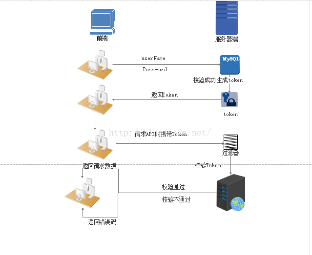

## token

基于Token的身份验证是无状态的，我们不将用户信息存在服务器或Session中。　　

NoSession意味着你的程序可以根据需要去增减机器，而不用去担心用户是否登录。

1. 基于Token的验证原理

    基于Token的身份验证的过程如下:

    1. 用户通过用户名和密码发送请求。

    2. 程序验证。

    3. 程序返回一个签名的token 给客户端。

    4. 客户端储存token,并且每次用于每次发送请求。

    5. 服务端验证token并返回数据。

    每一次请求都需要token。token应该在HTTP的头部发送从而保证了Http请求无状态。我们同样通过设置服务器属性Access-Control-Allow-Origin:* ，让服务器能接受到来自所有域的请求。需要主要的是，在ACAO头部标明(designating)*时，不得带有像HTTP认证，客户端SSL证书和cookies的证书。

    实现思路：

    

2. Token的优势

    1. 无状态、可扩展

        在客户端存储的Tokens是无状态的，并且能够被扩展。基于这种无状态和不存储Session信息，负载负载均衡器能够将用户信息从一个服务传到其他服务器上。

        如果我们将已验证的用户的信息保存在Session中，则每次请求都需要用户向已验证的服务器发送验证信息(称为Session亲和性)。用户量大时，可能会造成一些拥堵。

        但是不要着急。使用tokens之后这些问题都迎刃而解，因为tokens自己hold住了用户的验证信息。

    2. 安全性

        请求中发送token而不再是发送cookie能够防止CSRF(跨站请求伪造)。即使在客户端使用cookie存储token，cookie也仅仅是一个存储机制而不是用于认证。不将信息存储在Session中，让我们少了对session操作。

        token是有时效的，一段时间之后用户需要重新验证。我们也不一定需要等到token自动失效，token有撤回的操作，通过token revocataion可以使一个特定的token或是一组有相同认证的token无效。

    3. 可扩展性

        Tokens能够创建与其它程序共享权限的程序。例如，能将一个随便的社交帐号和自己的大号(Fackbook或是Twitter)联系起来。当通过服务登录Twitter(我们将这个过程Buffer)时，我们可以将这些Buffer附到Twitter的数据流上(we are allowing Buffer to post to our Twitter stream)。

        使用tokens时，可以提供可选的权限给第三方应用程序。当用户想让另一个应用程序访问它们的数据，我们可以通过建立自己的API，得出特殊权限的tokens。

    4. 多平台跨域

        我们提前先来谈论一下CORS(跨域资源共享)，对应用程序和服务进行扩展的时候，需要介入各种各种的设备和应用程序。

        只要用户有一个通过了验证的token，数据和资源就能够在任何域上被请求到。

        ```
        Access-Control-Allow-Origin: *
        ```

    5. 基于标准

        创建token的时候，你可以设定一些选项。我们在后续的文章中会进行更加详尽的描述，但是标准的用法会在JSON Web Tokens体现。

        最近的程序和文档是供给JSON Web Tokens的。它支持众多的语言。这意味在未来的使用中你可以真正的转换你的认证机制。

3. Token时效性

    1. 存储token到redis中，设置失效时间，比如失效时间为一天86400秒。

    2. 请求时，先检测token是否失效

        1. 已失效，响应token失效状态码，由用户重新登录或调用更新token接口来设置新的token，再重新发起请求。

        2. 有效，则解密token并校验

原文：https://www.cnblogs.com/moyand/p/9047978.html

